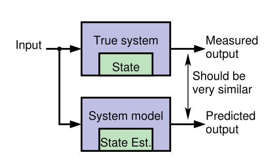
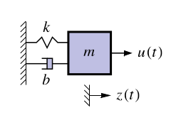

## Kalman Filter - (extra curricular) circa 1960 {#sec-kf-1.1.1-introduction}

The Kalman Filter arises in the filtering equations of the NDLM in the course on Bayesian time series.

One of the mysteries of the NDLM is how the Matrix $G$ takes it form. This is not explained very well in the course that carries on as if the Kalman filter does not exist. However most of what student find difficult to understand in the NDLM is explained by a quick introduction to the the Kalman filter.

This appendix is based on a crash course on the Kalman filter as well as the [@petris2009dynamic].

Note: KF requires a good understanding of linear algebra, matrix operations, and probability theory. If you are not familiar with these concepts, it is recommended to review them before diving into the Kalman filter.


- Linear algebra:
  - Vectors and matrices are used to represent the state of a dynamic system.
  - Eigenvalue decomposition is used to analyze the dynamics of the system.
  - The matrix exponential is used to solve the state space model.
  - Jordan form may be needed if the dynamics matrix is not diagonalizable.
- State space vector representation of dynamic systems.
- Laplace transforms are used for the state space model.
- Convolution operation 

## Model-based state estimation {#sec-kf-1.1.2-model-based-state-estimation}

### What are some key Kalman-filter concepts? 

- KFs use sensed measurements and a mathematical model of a dynamic system to estimate its internal hidden state
- A **model** of the system and its state dynamics is assumed to be known.
- A system's **state** is a vector of values that completely summarizes the effects of the past on the system
- The model's state should be a twin of the system's state


::: {#exp-system-state-vector .callout-tip}
### Aircraft state vector
A system state vector might include the 

$$
\vec{state} =[ x,y,z, \alpha,\beta,\gamma, x', y', z', \alpha',\beta',\gamma' ] 
$$ {#eq-aircraft-system-state-vector}

- where:
  - $x, y, z$ are the position coordinates, 
  - $\alpha, \beta, \gamma$ are the [Euler angles](https://en.wikipedia.org/wiki/Euler_angles) representing the orientation of the aircraft,  Or more accurately the Tait–Bryan angles
    - $\alpha$ is the roll angle,
    - $\beta$ is the pitch angle,
    - $\gamma$ is the yaw angle,
  - $x', y', z'$  are the velocities in the respective directions.
  - $\alpha', \beta', \gamma'$ are the angular velocities in the respective directions.

The number of elements in the state vector is called the **state dimension** or [degrees of freedom](https://en.wikipedia.org/wiki/Degrees_of_freedom_(mechanics)).
:::

### Why do we need a model?

{#fig-kf-001 .column-margin  group="slides" width="53mm"}


{#fig-kf-002 .column-margin  group="slides" width="53mm"}

- [Generally it is neither possible nor practical to measure the **state of a dynamic system** directly.]{.mark}
- According to Laplace's view of classical mechanics if we measure the system's inputs we can  propagate those measurements through a model, updating the model's prediction of the true state.
- We make measurements that are linear or nonlinear functions of members of the state.
- The measured and predicted outputs are compared.
- The KF is an algorithm that updates the model's state estimate using this prediction error as feedback regarding the quality of the present state estimate.

### What kind of model do we assume?

- Linear KFs use discrete-time state-space models of the form:
$$
\begin{aligned}
x_{t+1} &= Ax_t + Bu_t + w_t && \text{state eqn.}\\
z_t &= Cx_t + Du_t + v_t && \text{observation eqn.}
\end{aligned}
$$ {#eq-kalman-filter-equations}

- where:
    - $x_t$ is the state vector at time $t$,
    - $u_t$ is the input vector at time $t$,
    - $z_t$ is the output vector at time $t$,
    - $A \in \mathbb{R}^{n \times n}$ is the **system matrix**,
    - $B \in \mathbb{R}^{n \times r}$ is the **input matrix**,
    - $C \in \mathbb{R}^{m \times n}$ is the **output matrix**,
    - $D \in \mathbb{R}^{m \times r}$ is the **feedforward matrix**,
    - $w_t \sim \mathcal{N}(0,Q)$ is the process noise
    - $v_t \sim \mathcal{N}(0,R)$ is the sensor noise
    - the state  equation describes how the state evolves over time,
    - the observation equation describes how the state is observed through measurements.

That too many new definitions, I feel like my hair is on fire, so here is an annotated version of the Kalman Equations:
$$
\begin{array}{rccccccl}
\overbrace{x_{t+1}}^{\text{predicted state}} 
&= \underbrace{A}_{\text{system}} 
&\overbrace{\color{red} x_t}^{\text{current state}} 
&+ 
&\underbrace{B}_{\text{input}} 
&\overbrace{\color{green} u_t}^{\text{current input}} 
&+
& \underbrace{w_t}_{\text{process noise}} \\[2ex]
\underbrace{z_t}_{\text{predicted output}} 
&= \underbrace{C}_{\text{output}} 
&{\color{red} x_t} 
&+
& \underbrace{D}_{\text{feed forward}} 
&{\color{green} u_t} 
&+
& \underbrace{v_t}_{\text{sensor noise}} 
\end{array}
$$ {#eq-kalman-filter-equations-annotated}

::: {.callout-tip collapse="true"}
### Kalman Filter v.s. NDLM and interventions

In the NDLM we see simplified versions of these equations, where $B$ and $D$ are set to zero and we don't have a current input $u_t$. 

Another major difference explained in [@petris2009dynamic] is that in a statistics settings the modeler typically knows much less about the system dynamics than users of a Kalman filter who has access to some set of differential equations that describe the system dynamics. 

In [@west2013bayesian] the authors make a big point about their models being able to handle **interventions**.

My initial impression was that there seems to be a gap in their logic regarding this and as far as I can with the absence of the input term $u(t)$ which should embody an interventions, these are supposed to be reflected via a change in the matrix $\mathbf{F}_t,\mathbf{G}_t$. However if these matrices are change every time step $t$, we don't really have a model in any useful sense. (We need to somehow come up with a different model for each time step. This is not feasible even if we have access to the differential equations that describe the system dynamics.) 

Looking deeper into the literature, I found that this kind of intervention is considered  
in [@west2013bayesian ch. 11]. In fact there is a whole chapter dedicated to 
interventions and monitoring where the authors eventually discuss arbitrary interventions.

It appears that the interventions seem to lead to the same form being used but with either an additional term for the noise or an expansion of G to incorporate an expansion of the state vector to include new parameters that if such are required.

[@prado2023time p. 154] also discusses three types of interventions but not in the same depth as the above.

1. treating $y_t$ as an outlier
2. increasing uncertainty at the system level by adding a second error term to the state equation.
3. arbitrary intervention by setting the prior moments of the state vector to some specific values.

$$
\begin{array}{rccccl}
\overbrace{x_{t+1}}^{\text{predicted state}} 
&= \underbrace{G}_{\text{system}} 
&\overbrace{\color{red} x_t}^{\text{current state}} 
&+ 
& \underbrace{w_t}_{\text{process noise}} 
\\
\underbrace{y_t}_{\text{predicted output}} 
&= \underbrace{F}_{\text{output}} 
&{\color{red} x_t} 
&+
& \underbrace{v_t}_{\text{sensor noise}} 
\end{array}
$$ {#eq-NLDM-equations-annotated}

:::


### A simple example model

- Concrete example: Consider the 1-d motion of a rigid object.
  - The state comprises position $p_t$ and velocity (speed) $s_t$ :
$$
\underbrace{\begin{bmatrix} p_t \\ s_t \end{bmatrix}}_{x_t} =
\underbrace{\begin{bmatrix} 1 & \Delta t \\ 0 & 1 \end{bmatrix}}_{A}
\underbrace{\begin{bmatrix} p_{k-1} \\ s_{k-1} \end{bmatrix}}_{x_{k-1}} +
\underbrace{\begin{bmatrix} 0 \\ \Delta t \end{bmatrix} }_{B} u_{k-1} + w_{k-1}
$$ {#eq-kf-rigid-object-motion-1d-state}
  - where $\Delta t$ is the time interval between iterations $t-1$ and $t$ .
    - $u_t$ is equal to force divided by mass;
    - $w_t$ is a vector that perturbs both $p_t$ and $s_t$ .
- The measurement could be a noisy position estimate:
$$
z_t =
\underbrace{\begin{bmatrix} 1 & 0 \end{bmatrix}}_{C}
\underbrace{\begin{bmatrix} p_t \\ s_t \end{bmatrix}}_{x_t}  + v_t
$$ {#eq-kf-rigid-object-motion-1d-observations}

- Example illustrates how the state-space form can model a specific dynamic system.
- The form is extremely flexible: can be applied to any finite-dimensional linear system.

### Why do we need feedback?

- Our goal is to make an optimal estimate of $x_t$ in: @eq-kalman-filter-equations

- If we knew $x_0, w_t$, and $v_t$ perfectly, and if our model were exact, there would be no need for feedback to estimate $x_t$ at any point in time. We simply simulate the model! However, in practice:

  - [We rarely know the initial conditions]{.mark} $x_0$ exactly
  - [We never know the system or measurement noise]{.mark} $w_t, v_t$ (by definition).
  - Also, [no physical system is truly linear]{.mark} and even if one were, we would never know $A$, $B$, $C$, and $D$ exactly.

- So, simulating the model (specifically, simulating the state equation "open loop") is insufficient for robust estimation of $x_t$. 

[**open loop** - without feedback]{.column-margin}

- **Feedback** allows us to compare predicted $z_t$ with measured $z_t$ to adjust $x_t$.


### How does the feedback work?

- Discrete-time Kalman filters repeatedly execute two steps:
  1. [**Predict** the current state-vector values based on all past available data.]{.mark} E.g., a linear KF computes 
$$
\hat{x}_t^- = A \hat{x}_{t-1}^+ + B u_{t-1}
$$ {#eq-kalman-filter-prediction}
- where 
  - $\hat{x}_{t-1}^+$ is the *prediction* of $x_{t-1}$.
  - $\hat{x}_{t-1}^-$ is the *estimate* of $x_{t-1}$.
  2. [**Estimate** the current state value by updating the prediction based on all presently available data.]{.mark} E.g., a linear KF computes 
$$
\hat{x}_{t}^+ = \hat{x}_t^- + {\textcolor{blue} {L_t}}\, (z_t - (C \hat{x}_t^- + D u_t))
$$ {#eq-kalman-filter-feedback}

- A very straightforward idea. But ...
  - What should be the *feedback gain matrix* $L_t$?
    - That is, how do we make this feedback optimal in some meaningful sense?
- Can we generalize this feedback concept to nonlinear systems?
- What if we don't know $u_t$ (as in the tracking application)?

### Summary

- [KFs use *sensed measurements* and a mathematical model of a dynamic system to estimate its internal hidden state.]{.mark}

[**Discrete--time state--space format**]{.column-margin}

- For the kind of KFs we will study, the mathematical model must be formulated in a **discrete-time state-space format**. 

- This form is very general, and can apply to nearly any dynamic system of interest.

- [KFs operate by repeatedly predicting the present state, and then updating that prediction using a measured system output to make an estimate of the state.]{.mark}

[**Gain matrix**]{.column-margin}

- [This process is *optimized* by computing an **optimal feedback gain matrix** $L_t$ at every time step that blends the prediction and the new information in the measurement.]{.mark}

- There is a lot to learn, and the next topic will present our roadmap for doing so.


## Working through a KF example at high-level {#sec-kf-1.1.3-high-level-ex}

### A problem for which KF should be a good solution

- We will now walk through an example---without going into all the details---to illustrate how a KF works.
- [Consider a car traveling in a straight line. We would like to estimate its position.]{.mark}
- We use GPS as a position sensor---but GPS estimates have *measurement uncertainty* and [we wonder if blending our knowledge of the car's dynamics with GPS might let us infer a better position estimate.]{.mark} [**navigation problem**]{.column-margin}
- We might think, "Maybe we could use a Kalman filter to estimate the car's position better than simply using GPS."
  - We would be right!

### Designing the Kalman filter: The model

- To design the KF, we require a **discrete-time state-space model** of the dynamics of the car.
- We adopt the model of 1-d motion of a rigid object from the prior lesson.
  - The state comprises position pk and velocity (speed) $s_t$ :

$$
\begin{bmatrix} p_t \\ s_t \end{bmatrix} =
\begin{bmatrix} 1 & \Delta t \\ 0 & 1 \end{bmatrix}
\begin{bmatrix} p_{k-1} \\ s_{k-1} \end{bmatrix} +
\begin{bmatrix} 0 \\ \Delta t \end{bmatrix} u_{k-1} + w_{k-1}
$$

where $\Delta t$ is the time interval between iterations $t-1$ and $t$ .
- $u_t$ is equal to force divided by mass;
- $w_t$ is a vector that perturbs both $p_t$ and $s

The measurement is a noisy GPS position estimate:
$$
z_t =
\begin{bmatrix} 1 & 0 \end{bmatrix}
\begin{bmatrix} p_t \\ s_t \end{bmatrix}  + v_t
$$ 


### Designing the Kalman filter: The uncertainties

- We also need to describe what we know about the uncertainties of the scenario.
  - What do we know about the initial state of the car, $x_0$ ?
  - What do we know about process noise $w_t$ (wind) affecting the state's evolution?
  - What do we know about the measurement noise $v_t$ (GPS measurement error)?
- For most of the specialization, we will assume that these uncertainties are
described by Gaussian (normal) distributions, which can be specified if we know the
means and standard deviations of the probability density functions. We assume:
  - That GPS measurement error has zero mean and standard deviation of 1.5 m. The overall confidence is then about 4.5 m.
  - That $x_0$ is initialized via a GPS measurement, so has zero mean and standard deviation of 5 ft.
  - That $w_t$ has zero mean and a standard deviation of $3cm\; s^{-1}$ on the velocity state.

### Visualizing the Kalman-filter process: Prediction

- We first initialize the KF state estimate for iteration $t = 0$.
$x_0$ is uncertain since it is estimated from a GPS measurement.
- We draw this uncertainty as a shaded blue pdf.
- We don't know the car's position exactly; but we do know where we expect it to be (at the measurement location) and we know the range of likely true locations (about $\pm 4.5$ m).
- One time-step later, the car has moved.
- The KF uses the model plus knowledge of $u_t$ to predict where the car will be, drawn as the shaded yellow pdf.
- Since we do not know $w_t$, the uncertainty of the position estimate has increased.


### Visualizing the Kalman-filter process: Estimation

- At this point, we make a GPS measurement of the car's new position, remembering that the measurement has uncertainty.
- Again, we show this as a shaded blue pdf.
  - We now have an uncertain prediction of the position from the model (yellow) and an uncertain measurement (blue).
- We need to combine these.
- The KF takes into consideration the prediction and the measurement and their uncertainties to compute an estimate of the car's location.
- This estimate (green) will be optimal in some sense, and will have less uncertainty than either the prediction or the measurement.

### Properties of the Kalman-filter solution

- The KF repeatedly takes two steps: prediction and correction.

  - The prediction step uses the known dynamics of the state and known characteristics of the process noise $w_t$.
  - The correction step combines the prediction and the measurement and their uncertainties to make a state estimate valid for this time step.

- The output of the KF at every time step comprises two quantities: the state estimate and confidence bounds on this estimate.

- The [KF never "knows" the true system state exactly and does not converge to the true state]{.mark} (i.e., with vanishingly small confidence bounds) over time, since process noise $w_t$ continuously modifies the state in unknown ways.

- But, the confidence bounds allow us to interpret the output of the KF appropriately.

### Summary

- This lesson has illustrated KF operation for a specific example.
- We learned that we will need to specify a model of the system and the uncertainties of the signals in the model.
- We will need to initialize the KF with an estimate of $x_0$.
- Then, every measurement interval we perform a prediction and a correction step.
- [Prediction increases uncertainty and correction decreases uncertainty. The KF "fuses" the prediction with the measurement to make an optimal estimate.]{.mark}
- The *output of the KF* is the **state estimate** as well as its **confidence bounds**.
- The estimate will always contain some randomness due to $w_t$, so the confidence bounds will not decay to zero width.
- The confidence bounds are necessary so we know the estimate's accuracy level.

## What is a state-space model and why do I need to know about them? {#sec-kf-1.2.1-state-space-models}

### Example of a continuous-time state-space model

{#fig-kf-016 .column-margin  group="slides" width="53mm"}

- Representation of the dynamics of an nth-order system as a
first-order differential equation in an n-vector called the state

- Classic example: Second-order equation of motion

$$
\begin{aligned}
m\ddot{z}(t) &= u(t) - b \dot{z}(t) -k z(t) \\
\ddot{z}(t) &=   \frac{1}{m} u(t) - \frac{b}{m} \dot{z}(t) -\frac{k}{m} z(t) \\
\end{aligned}
$$ {#eq-damped-oscillator-mechanics}

- where:
  - $z(t)$ is the position of the mass at time $t$,
  - $\dot{z}(t)$ is the velocity of the mass at time $t$,
  - $k$ is the spring constant,
  - $m$ is the mass,
  - $b$ is the damping coefficient,

- We can define a (non-unique) state vector which embodies the system's state at time $t$ as:
$$
\begin{aligned}
x(t) &= \begin{bmatrix} z(t) \\ \dot{z}(t) \end{bmatrix} \\
\dot{x}(t) &= \begin{bmatrix} \dot{z}(t) \\ \ddot{z}(t) \end{bmatrix} 
&= \begin{bmatrix} \dot{z}(t) \\   \frac{1}{m} u(t) - \frac{b}{m} \dot{z}(t) -\frac{k}{m} z(t) \end{bmatrix}
\end{aligned}
$$ {#eq-damped-oscillator-state-vector}

### Example in continuous-time state-space form

- So far we have:
$$
\begin{aligned}
\dot{x}(t) &= \begin{bmatrix} \dot{z}(t) \\ \ddot{z}(t) \end{bmatrix} 
&= \begin{bmatrix} \dot{z}(t) \\   \frac{1}{m} u(t) - \frac{b}{m} \dot{z}(t) -\frac{k}{m} z(t) \end{bmatrix}
\end{aligned}
$$ 

We can write this as $\dot x(t) = Ax(t) C + Bu(t)$, where $A$ and $B$ are constant matrices

$$
\begin{aligned}
\dot{x}(t) &= 
\begin{bmatrix} \dot{z}(t) \\ \ddot{z}(t) \end{bmatrix} 
&= 
\underbrace{\begin{bmatrix} ? &? \\ ?& ? \end{bmatrix} }_{A}
\begin{bmatrix} \dot{z}(t) \\ \ddot{z}(t) \end{bmatrix} +
\underbrace{\begin{bmatrix} ? &? \\ ?& ? \end{bmatrix} }_{B}
u(t)
\end{aligned}
$$ 

- Complete the model by computing $z(t) = C x(t)+ C Du(t)$ , where C and D are
constant matrices

$$
C = \begin{bmatrix} ?, ?, ?, ? \end{bmatrix} \qquad D = \begin{bmatrix} ?, ? \end{bmatrix}
$$

### Standard state-space model form

- Standard form for continuous-time linear state-space model:
$$
\begin{aligned}
\dot{x}(t) &= A x(t) + B u(t) + w(t) \\
z(t) &= C x(t) + D u(t) + v(t)
\end{aligned}
$$ {#eq-state-space-model-standard-form}

  - where 
    - $u(t)$ is the known input, 
    - $x(t)$ is the state, \
    - $A, B, C , D$ are constant matrices.

- Convenient way to express dynamics (matrix format great for computers).
-  The first equation is called **the state equation** or **the process equation**.
   - Only this equation evolves over time (since it is a first-order vector ODE that integrates the right-hand side to find $x(t)$ ).
   - So, this equation summarizes the “dynamics” of the model.
- The second equation is called the **output equation** or **the measurement equation**.
   - It is a static linear combination of variables known at time $t$.

### What is the system state vector?

- Standard form for continuous-time linear state-space model:
$$
\begin{aligned}
\dot{x}(t) &= A x(t) + B u(t) + w(t) \\
z(t) &= C x(t) + D u(t) + v(t)
\end{aligned}
$$ 

- We think of the system state at time $t_0$ as a minimum set of information at $t_0$ that,
together with input $u(t)$, $t \geq t_0$, uniquely determines system behavior for all $t \geq t_0$.
   -  State variables provide access to what is going on inside the system.
   - The state has dimensions $x(t) \in \mathbb{R}^n$, so $A \in \mathbb{R}^{n \times n}$ and $w(t) \in \mathbb{R}^n$.
-  Note that in principle we can solve the state equation numerically, 
$$
x(t) = x(0) + \int_{0}^{t} A x(\tau) + B u(\tau) + w(\tau) d\tau
$$  {#eq-state-space-model-integral-form}

  However, it will usually be more convenient to keep the equation in differential form.

TODO cleanup

### What are the output and inputs?
$$
\begin{aligned}
\dot{x}(t) &= A x(t) + B u(t) + w(t) \\
z(t) &= C x(t) + D u(t) + v(t)
\end{aligned}
$$ 

- The model output is $z(t) \in \mathbb{R}^m$. This is the measurement we make.
- There are three input signals to the model: $u(t)$, $w(t)$, and $v(t)$.
- We consider $u(t) \in \mathbb{R}^r$ to be a (deterministic) input; that is, we assume that we
know its value exactly at all times.
   - Based on the size of $u(t)$; we infer that $B \in \mathbb{R}^{n \times r}$.
   - The deterministic input forces $x(t)$ to evolve over time in different ways,
depending on its values.
  n- It also influences the output via the $D$ term.

TODO complete the slide

### What are the random (stochastic) inputs?
$$
\begin{aligned}
\dot{x}(t) &= A x(t) + B u(t) + w(t) \\
z(t) &= C x(t) + D u(t) + v(t)
\end{aligned}
$$ {#eq-state-space-model-standard-form}

TODO complete the slide


### What are the matrices called?

- The standard form for linear continuous-time state-space models is
$$
\begin{aligned}
\dot{x}(t) &= A x(t) + B u(t) + w(t) \\
z(t) &= C x(t) + D u(t) + v(t)
\end{aligned}
$$ {#eq-state-space-model-standard-form}

- $A \in \mathbb{R}^{n \times n}$ is the system matrix. It models the evolution of the state in the absence
of input. 
- $B \in \mathbb{R}^{n \times r}$ is the input matrix. It defines how linear combinations of $u(t)$ impact the
evolution of the state. 
- $C \in \mathbb{R}^{m \times n}$ is the output matrix. It defines how the output depends on linear
combinations of states. 
- $D \in \mathbb{R}^{m \times r}$ is the feed--forward (or feed--through) matrix. It models how the output
depends on linear combinations of the input (instantaneously). 
- Time-varying systems have $A$, $B$, $C$, $D$ that change with time.

### Why do you need to know about them?

- It can be of vital interest to know the state of the system, but
we usually cannot measure it directly.
-  Instead, we can measure $u(t)$ and $z(t)$, and although we cannot measure the
random signals $w(t)$ and $v(t)$, we can model some of their critical attributes.
-  This enables us to make methods to estimate $x(t)$ based on what we measure and
what we model.
-  Kalman filters are (in some cases optimal) estimators of $x(t)$
  - The derivation and implementation of the KF depends on modeling the system in
state-space form and having knowledge of the model $A$, $B$, $C$, and $D$ matrices.
  - This is why we care!

### Summary

- [State-space models are a compact representation of an n^^th^^-order linear system in terms of a 1st-order vector ODE.]{.mark}
- The standard form for linear continuous-time state-space models is  @eq-state-space-model-standard-form

- We have learned the names of the equations, the names of the matrices, and the
names of the signals (and what they all mean).
- We have seen one example of a model in state-space form; 
- Next, we will look at three other important general models.

## The target Tracking application {#sec-kf-1.2.2-target-tracking}

::: {.callout-tip collapse="true"}
### Greek Notation

1. This section uses Greek letters to denote motion in the x and y direction.
2. The state vector is defined as $x(t) = [\xi(t), \eta(t), \dot{\xi}(t), \dot{\eta}(t)]^T$.
3. The reason is rather mundane - the instructor avoids circular definitions and any chance of confusion arising from reusing the same letter for different things. X is already taken for the state vector. So we use $\xi$ and $\eta$ for the x and y coordinates, respectively.
4. He also uses k for time index which I have replaced.


:::


- One application of KFs is for target tracking. [**target tracking problem**]{.column-margin}
- We wish to predict the future location of a dynamic system (the target) based on KF estimates and measurements.
- Ideally we know all the matrices and signals of its continuous-time linear state-space model 

$$
\begin{aligned}
\dot{x}_t &= A x(t) + B u(t) + w(t) \\
z_t &= C x(t) + D u(t) + v(t)
\end{aligned}
$$ {#eq-target-tracking-equations}

- in the target tracking application, we typically don't know u(t)$ nor the state space matrices very well.
- we may need to approximate target dynamics based on some assumed behaviors.
  - One idea is to come up with a hyper-prior that allows us to assign *intuitive* dynamics to the target. c.f. [@battagliaintuitive] work on intuitive physics
- If we roll our own we might use:
  - a nearly constant position (NCP) model, 
  - a near constant velocity (NCV) model, or 
  - a coordinated-turn (CT) model.

### The nearly constant position (NCP) model

In the NCP model, we assume that the target is stationary.

$$
x(t) = \begin{bmatrix} \xi(t) \\ \eta(t) \end{bmatrix}
$$ {#eq-ncp-model-state-vector}

- our models state equations is 
$$
\dot{x}(t) = 0 x(t) + w(t)
$$ {#eq-ncp-model-state-equation}
  - with $A= 0_{2\times 2}$ and $B=0_{2\times2}$

- our model's observation equation might be:
$$
z(t) = x(t) + v(t)
$$ {#eq-ncp-model-observation-equation}
  - with $C= I_{2\times 2}$ and $D=0_{2\times2}$

```{python}
#| label: ncp-model
#| lst-label: lst-ncp-model
#| lst-cap: "NCP model simulation code"

import numpy as np
import matplotlib.pyplot as plt

maxT = 1000; # <1>
dT = 0.1;    # <2>

# Define the NCP model
Ancp = np.eye(2)
Bwncp =  np.eye(2)
Cncp =  np.eye(2)
Dncp  =  np.zeros((2,2))

np.random.seed(42)                      # <3>
wncp = 0.1*np.random.randn(2,maxT)
vncp = 0.01*np.random.randn(2,maxT)

xncp = np.zeros(shape=(2,maxT))         # <4>
xncp[:,0] = [0,0]                       # <5>

for k in range(1,maxT):                 # <6>
  xncp[:,k] = Ancp @ xncp[:,k-1] + Bwncp @ wncp[:,k-1]

zncp = Cncp @ xncp + vncp
```
1. maximum simulation time, used for all models 
2. sample period used by all models (in seconds)
3. set seed for reproducibility, 
4. storage
5. initial position
6. simulate the model


```{python}
#| label: fig-plot-ncp
#| fig-cap: "Plot of the NCP model simulation trajectory"

plt.figure(figsize=(10, 6))

plt.plot(zncp[0, :], zncp[1, :], label='Trajectory of NCP model simulation')
plt.title('Nearly Constant Position Model Simulation')
plt.xlabel(r'$\text{x coordinate} - \xi$')
plt.ylabel(r'$\text{y coordinate} - \eta$')
plt.legend()
plt.grid()
plt.show()
```


```{python}
#| label: lst-ncp-model-final-coordinate

print(f"Final coordinate of the trajectory: {zncp[:, -1]}") # <1>
```
1.  Display the final coordinate of the trajectory

### The nearly constant velocity (NCV) model


- We now extend our target tracking model from static object to one having momentum: its velocity is nearly constant, but gets perturbed by external forces.

- The state vector is now:
$$
x(t) = \begin{bmatrix} 
  \xi(t) \\ 
  \dot{\xi}(t) \\ 
  \eta(t) \\ 
  \dot{\eta}(t) 
  \end{bmatrix}
$$ {#eq-ncv-model-state-vector}
- the state equations are:
$$
\dot{x}(t) = 
\underbrace{
  \begin{bmatrix} 
    0 & 1 & 0 & 0 \\ 
    0 & 0 & 0 & 0 \\ 
    0 & 0 & 0 & 1 \\ 
    0 & 0 & 0 & 0 
  \end{bmatrix} x(t) }_{A} + 
\underbrace{
  \begin{bmatrix}
  0 & 0\\ 1&0 \\ 0&0 \\ 0&1
  \end{bmatrix} x(t) + 
  \underbrace{\tilde{\omega}(t)}_{\in \mathbb{R}_{2\times 1}}
}_{\omega(t)}
$$ {#eq-ncv-model-state-equation}
- the observation equation might be:
$$
z(t) = 
\underbrace{
  \begin{bmatrix} 
    1 & 0 & 0 & 0 \\
    0 & 0 & 1 & 0 
  \end{bmatrix}}_{C} x(t) + \nu(t)
$$ {#eq-ncv-model-observation-equation}
```{python}
#| label: ncv-model
#| lst-label: lst-ncv-model
#| lst-cap: "NCV model simulation code"
# Define the NCV model
Ancv = np.array([[1, dT, 0, 0], 
                  [0, 1, 0, 0], 
                  [0, 0, 1, dT], 
                  [0, 0, 0, 1]])
Bwncv = np.array([[dT**2/2, 0], 
                  [dT, 0], 
                  [0, dT**2/2], 
                  [0, dT]])
Cncv = np.array([[1, 0, 0, 0], 
                 [0, 0, 1, 0]])
Dncv = np.zeros((2, 2))

np.random.seed(0)                      # Don't change this line
wncv = 0.1*np.random.randn(2,maxT)
vncv = 0.01*np.random.randn(2,maxT)

xncv = np.zeros((4,maxT))               # storage
xncv[:,0] = [0,0.1,0,0.1]               # initial position, velocity

#xncp = np.zeros(shape=(2,maxT))         # storage
#xncp[:,0] = [0,0]                       # initial posn.

for k in range(1,maxT):                 # simulate model
  xncv[:,k] = Ancv @ xncv[:,k-1] + Bwncv @ wncv[:,k-1]

zncv = Cncv @ xncv + vncv
```

```{python}
#| label: fig-plot-ncv
#| fig-cap: "Plot of the NCV model simulation trajectory"

# Plot the results
plt.figure(figsize=(10, 6))
plt.plot(zncv[0, :], zncv[1, :], label='Trajectory of NCV model simulation')
plt.title('Near Constant Velocity Model Simulation')
plt.xlabel(r'$\text{x coordinate} - \xi$')
plt.ylabel(r'$\text{y coordinate} - \eta$')
plt.legend()
plt.grid()
plt.show()
```

```{python}
#| label: lst-ncv-model-final-coordinate

print(f"Final coordinate of the trajectory: {zncv[:, -1]}")     # <1>
```
1. Display the final coordinate of the trajectory


### The coordinated-turn model

We now extend our target tracking model from one having momentum to one moving a **constant angular velocity** $\Omega$ 

$$
\ddot{\xi}(t) = -\Omega\dot{\eta}(t) \qquad \ddot{\eta}(t) = \Omega\dot{\xi}(t) 
$$ {#eq-ct-model-acceleration-equations}

- The state vector is now:
$$
x(t) = \begin{bmatrix} 
  \xi(t) \\ 
  \dot{\xi}(t) \\ 
  \eta(t) \\ 
  \dot{\eta}(t) 
  \end{bmatrix}
$$ {#eq-ct-model-state-vector}
- the state equations are:
$$
\dot{x}(t) = 
\underbrace{
  \begin{bmatrix} 
    0 & 1 & 0 & 0 \\ 
    0 & 0 & 0 & -\Omega \\ 
    0 & 0 & 0 & 1 \\ 
    0 & \Omega & 0 & 1 
  \end{bmatrix} x(t) }_{A} + 
\underbrace{
  \begin{bmatrix}
  0 & 0\\ 1&0 \\ 0&0 \\ 0&1
  \end{bmatrix} x(t) + 
  \underbrace{\tilde{\omega}(t)}_{\in \mathbb{R}_{2\times 1}}
}_{\omega(t)}
$$ {#eq-ct-model-state-equation}
- the observation equation might be:
$$
z(t) = 
  \underbrace{
  \begin{bmatrix} 
    1 & 0 & 0 & 0 \\
    0 & 0 & 1 & 0 
  \end{bmatrix}}_{C} x(t) + \nu(t)
$$ {#eq-ct-model-observation-equation}

```{python}
# Define the coordinated-turn model
import numpy as np
from scipy.signal import StateSpace, lsim

# Parameters
W = 0.01
A = np.array([
    [0, 1, 0, 0],
    [0, 0, 0, -W],
    [0, 0, 0, 1],
    [0, W, 0, 0]
])
Bw = np.array([
    [0, 0],
    [1, 0],
    [0, 0],
    [0, 1]
])
C = np.array([
    [1, 0, 0, 0],
    [0, 0, 1, 0]
])
D = np.zeros((2, 2))

# Create CT state-space model
ct = StateSpace(A, Bw, C, D)

# Time vector and noise
np.random.seed(0)  # Match Octave's `randn("state", 0)`
tct = np.arange(1000) * 1.0
wct = 0.01  * np.random.randn(1000, 2)  # shape (n_samples, n_inputs)
vct = 0.001 * np.random.randn(1000, 2)

# Simulate system
_, yout, _ = lsim(ct, U=wct, T=tct)

# Add sensor noise
zct = yout + vct

```

```{python}
# Plot the results
plt.figure(figsize=(10, 6))
plt.plot(zct[:, 0], zct[:, 1], label='Trajectory of CT model simulation')
plt.title('Coordinated-Turn Model Simulation')
plt.xlabel(r'$\text{x coordinate} - \xi$')
plt.ylabel(r'$\text{y coordinate} - \eta$')
plt.legend()
plt.grid()
plt.show()
```

```{python}
# Display the final coordinate of the trajectory
print(f"Final coordinate of the trajectory: {zct[-1, :]}")
```


::: {.callout-tip collapse="true"}
### Overthinking the CT model

since 

question why not $\ddot{\eta}(t) = \dot{\xi}(t) = 0$?

so am I correct that we should have the following state vector?

$$
x(t) = \begin{bmatrix} 
  \xi(t) \\ 
  \dot{\xi}(t) \\ 
  \eta(t) \\ 
  \dot{\eta}(t) \\ 
  \ddot{\xi}(t) \\ 
  \ddot{\eta}(t) 
  \end{bmatrix}
$$ {#eq-ct-model-state-vector-extended}

and the state equations are:

$$
\dot{x}(t) = 
\underbrace{
  \begin{bmatrix} 
    0 & 1 & 0 & 0 & 0 & 0 \\ 
    0 & 0 & 0 & 0 & 1 & -\Omega \\ 
    0 & 0 & 0 & 0 & 0 & 0 \\ 
    0 & 0 & 0 & 0 & 0 & 0 \\ 
    0 & 0 & \Omega & 0 & 0 & 0 \\ 
    0 & 0 & 0 & 0 & 0 & 0 
  \end{bmatrix} x(t) }_{A} + 
\underbrace{
  \begin{bmatrix}
  0 & 0 & 0 & 0\\ 
  1 & 0 & 0 & 0 \\
  0 & 0 & 0 & 0 \\ 
  0 & 1 & 0 & 0 \\
  0 & 0 & 0 & 0 \\ 
  0 & 0 & 0 & 0
  \end{bmatrix} \tilde{\omega}(t)}_{\tilde{\omega}(t)}
$$ {#eq-ct-model-state-equation-extended}

So while this took a while to formulate, it turns out that the CT model is fine. There were a number of factors contributing to my confusion.

1. The fact that this is a constant angular velocity model, so the acceleration is not zero.
   - what changes is the direction and not size of the velocity vector.
   - I initially didn't notice that the angular velocity is constant by definition.
2. I recalled that we need to split the velocity into two orthogonal components over time
3. The frame of reference is not explained explicitly. 
   - If we are in the object's frame of reference, then the angular velocity components are constant. 
   - If we are in the world's frame of reference, then everything is more complicated and the angular velocity components are changing sinusoidally.
4. There are a bunch of apparent forces/motions involved in circular motion on a spherical surface that surfaced in my mind.... Before I was able to make things more precise and clear.
5. How first order state representation vectors work, this is what convinced me the formulation is indeed correct and that my idea is most likely to be wrong! 
   - the idea is simple in @eq-ct-model-state-equation we have the first derivative of the state vector $x(t)$, which is a vector of position and velocity. The acceleration @eq-ct-model-acceleration-equations have been incorporated into the state vector.
   - We can recover them by taking the second derivative of the state vector!


:::

##  Understanding the time-domain response of a state-space model {#sec-kf-1.2.3-time-domain-response}

### Intro to continuous-time state-space models

-  You have seen that simulation is a valuable tool for understanding state-space models.
-  But, we would like to develop more insight into the system response by more general analytic means; specifically, by looking at the time-domain solution for $x(t)$.
-  We solve first for the homogeneous solution $(u(t) = 0)$:
   -  Start with $\dot x(t) = A x(t)$ and some initial state $x(0)$.
   -  Take Laplace transform: 
$$
\begin{aligned}
sX(s) - x(0) &= AX(s)        && \text{Initial value theorem} 
\\ (sI - A)X(s) &= x(0)      && \text{take care with matrix dimensions!} 
\\ X(s) &= (sI - A)^{-1}x(0) && \text{Assume invertible}
\end{aligned}
$$

      Detailed Laplace-transform knowledge will be helpful

-  So far we have: 
$$
x(t) = \mathcal{L}^{-1}[(sI - A)^{-1}]x(0)
$$ {#eq-ct-model-homogeneous-solution}


### The state-transition matrix

-  Recapping, we have: @eq-ct-model-homogeneous-solution. But,
$$
(sI - A)^{-1} = \frac{I}{s}+\frac{A}{s^2}+\frac{A^2}{s^3}+\frac{A^3}{s^4}+\cdots \quad\text{(geometric series)}
$$
so,
$$
\mathcal{L}^{-1}[sI - A]^{-1} = I + At + \frac{1}{2!}A^2t^2 + \frac{1}{3!}A^3t^3 + \cdots \stackrel{\triangle}{=} e^{At} \quad\text{(matrix exponential)}
$$

-  Therefore, we write $x(t) =e^{At} x(0)$
   -  $e^{At}$ is called the “transition matrix” or “state-transition matrix.”
   -  Note that $e^{At}$ is not the same as taking the exponential of every element of $At$.
   -  $e^{(A+B)t}=e^{At}e^{Bt}$ iff $AB=BA$: (that is, not in general).
   -  In Octave, can compute $x(t)$  as: `x = expm(A*t)*x0;`
-  Will say more about $e^{At}$ when we discuss the structure of $A$.

### Computing the state-transition matrix by hand

-  Computing $e^{At} = \mathcal{L}^{-1}[sI - A]^{-1}$ is straightforward for $2 \times 2$.
-  EXAMPLE: Find $e^{At}$ when $A = \begin{bmatrix} 0 & 1 \\ 2 & 3 \end{bmatrix}$.
   -  Solve: 
$$
\begin{aligned}
  (sI - A)^{-1} &= \begin{bmatrix} s & -1 \\ 2 & s+3 \end{bmatrix}^{-1} \\
  &= \frac{1}{s^2 + 3s + 2} \begin{bmatrix} s+3 & 1 \\ -2 & s \end{bmatrix} \\
  &= \begin{bmatrix} 
          \frac{ 2}{s+1} - \frac{1}{s+2}  & \frac{ 1}{s+1} - \frac{1}{s+2}  \\ 
          \frac{-2}{s+1} + \frac{2}{s+2}  & \frac{-1}{s+1} + \frac{2}{s+2}  
        \end{bmatrix} \\ 
  e^{At} &= \begin{bmatrix} 
               2e^{-t} -  e^{-2t}   &   e^{-t} -  e^{-2t}    \\ 
              -2e^{-t} + 2e^{-2t}   & - e^{-t} + 2e^{-2t}
            \end{bmatrix} \mathbb{1}(t)
\end{aligned}
$$

-  This is probably the best way to find $e^{At}$ if the $A$ matrix is $2 \times 2$ .

### Forced state response

-  Solving for the forced solution $(u(t) \ne 0)$, we find: 
$$
x(t) = e^{At} x(0) + \underbrace{\int_0^t e^{A(t-\tau)} B u(\tau) d\tau}_{\text{convolution}}
$$

-  Where did this come from?
  1. ${\color{blue} \dot{x}(t) - A x(t)} = {\color{gold}B u(t)}$, simply by rearranging the state equation.
  2. Multiply both sides by $e^{At}$ and rewrite the LHS as the middle expression: 
  $$
  e^{-At} {\color{blue}[\dot x(t) - A x(t)]} = {\color{red}\frac{d}{dt} (e^{-At} x(t))} = e^{-At} {\color{gold}B u(t)} d\tau
  $$
  3. Integrate the middle and the RHS; rearrange and keep new middle and RHS: 
  $$
  \begin{aligned}
  \int_0^t {\color{red}\frac{d}{d\tau} [ e^{-A(t-\tau)} x(\tau)]} d\tau &= e^{-At}x(t)-x(0) \\
  &= \int_0^t e^{-A(t-\tau)} {\color{gold} B u(\tau)} d\tau
  \end{aligned}
  $$

### Forced output response

-  So, we have established the following state dynamics:
$$
x(t) = e^{At} x(0) + \underbrace{\int_0^t e^{A(t-\tau)}{\color{gold}B u(\tau)} d\tau}_{\text{convolution}}
$$
-  Since $z(t) = C x(t) + Du(t)$, the system output is then comprised of three parts:
$$
z(t) = 
\underbrace{\vphantom{\int_0^t} C e^{At} x(0)}_{\text{initial resp}}+
\underbrace{\int_0^t Ce^{A(t-\tau)}{\color{gold}Bu(\tau)} d\tau}_{\text{convolution}} +
\underbrace{\vphantom{\int_0^t} Du(t)}_{\text{feed through}}
$$

### Summary

-  [You have learned how to compute the **homogeneous** and **forced** response of a state-space model.]{.mark}
-  The output $z(t)$ comprises of:
   -  [a response due to **initial conditions** :]{.mark} $C e^{At} x(0)$
   -  [a dynamic response due to **forcing input** :]{.mark} $\int_0^t Ce^{A(t-\tau)}Bu(\tau) d\tau$
   -  [an instantaneous response due to the **feed-through** :]{.mark} $Du(t)$
-  These terms rely on the matrix exponential $e^{At}$.
   -  **Caution** $e^{At}$ is not the term by term exponential operation on elements of $At$. 
      -  Don't compute it as: ~~`exp(A*t)`~~;
   -  One way to compute it (e.g., by hand) is via: $e^{At} = \mathcal{L}^{-1}[sI - A]^{-1}$.
   -  Or, in Octave, it is correct to compute: `expm(A*t)`;
-  We will dive deeper into the matrix exponential in [@sec-kf-1.2.4-time-domain-response]


## Illustrating the time-domain response {#sec-kf-1.2.4-time-domain-response}

### Deconstructing the matrix exponential

- Have seen the key role of $e^{At}$ in the solution for $x(t)$.
- Impacts the system response, but need more insight.
- Consider what happens if the matrix A is diagonalizable, that is, there exists a
matrix $T$ such that $T^{-1}AT = \Delta$ is diagonal. Then,
$$
\begin{aligned}
e^{At} &= I + At + \frac{1}{2!}A^2t^2 + \frac{1}{3!}A^3t^3 + \cdots
\\ &= I + T \Delta T^{-1}t + \frac{1}{2!}T \Delta^2 T^{-1}t^2 + \frac{1}{3!}T \Delta^3 T^{-1}t^3 + \cdots
\\ &= T \left( I + \Delta t + \frac{1}{2!} \Delta^2 t^2 + \frac{1}{3!} \Delta^3 t^3 + \cdots \right) T^{-1}
\\ &= T e^{\Delta t} T^{-1},
\end{aligned}
$$
and
$$
e^{\Delta t} = \text{diag} \left( e^{\lambda_1 t}, e^{\lambda_2 t}, \ldots, e^{\lambda_n t} \right)
$$

### How to find the transformation matrix

- Much simpler form for the exponential, but how to find  $T, \Delta$ ?
- Write $T^{-1}AT = \Delta$ as $T^{-1}A = \Delta T^{-1}$ with

$$
T^{-1} = \begin{bmatrix}
w_1^T \\
w_2^T \\
\vdots \\
w_n^T
\end{bmatrix}
\qquad w^T_j \text{ are the rows of } T^{-1}
$$

- We have: $w^T_i A = \lambda_i w^T_i$; so $w_i$ is a left eigenvector of $A$. 
- Can also write $T^{-1}AT = \Delta$ as $AT = \Delta T$ with 
$$
T = \begin{bmatrix} v_1 & v_2 & \cdots & v_n \end{bmatrix}
$$

i.e $v_j$ are the columns of $T$. 
   - We have $Av_i = \lambda_i v_i$, so $v_i$ is a right eigenvector of $A$. Also, since $T^{-1}T = I$, we have that $w^T_i v_j = \delta_{i,j}$


### How the deconstruction simplifies things 

So $T$ comprises the eigenvectors of $A$. How does this help?

$$
e^{At} = Te^{\Delta t} T^{-1} 
= \begin{bmatrix} v_1, v_2, \ldots, v_n \end{bmatrix}
\begin{bmatrix}
e^{\lambda_1 t} & 0 & \cdots & 0 \\
0 & e^{\lambda_2 t} & \cdots & 0 \\
\vdots & \vdots & \ddots & \vdots \\
0 & 0 & \cdots & e^{\lambda_n t}
\end{bmatrix}
\begin{bmatrix} w_1^T \\ w_2^T \\ \vdots \\ w_n^T \end{bmatrix}
= \sum _{}^n e^{\lambda_i t} v_i w_i^T
$$

- Very simple form, which can be used to develop intuition about dynamic response:

$$
x(t) = e^{At} x(0) =T e^{\Delta t} T^{-1} x(0) = \sum _{}^n e^{\lambda_i t} v_i w_i^T x(0).
$$

- Notice that the only time-varying components are $e^{\lambda_i t}$ , which are then multiplied by constant matrices so that the states are linear combinations of $e^{\lambda_i t}$ .

### Visualizing $e^{\lambda_i t}$

{#fig-kf-016 .column-margin  group="slides" width="53mm"}


{#fig-kf-017 .column-margin  group="slides" width="53mm"}


- The signal $e^{\lambda_it}$ can take on several different characteristics,
as shown in the figures below.
- If $\lambda_i$ is real, we observe a smooth monotonically growing or decaying signal.
- If $\lambda_i$ occur in complex-conjugate pairs, the output is of the pair is of the form $e^{\lambda_i t} \cos(\lambda_i t)$ : a cosine with an exponential 
"envelope."


### An example to illustrate the complexity

{#fig-kf-018 .column-margin  group="slides" width="53mm"}

- Consider again: $\sum _{i=1}^n e^{\lambda_i t} v_i (w^T_i x(0))$
- The state $x(t) = e^{At} x(0) =T e^{\Delta t} T^{-1} x(0) = \sum _{}^n e^{\lambda_i t} v_i w_i^T x(0)$ is a linear combination of the modes $e^{\lambda_i t} v_i$.
- The left eigenvectors $w_i^T$ decompose the initial state $x(0)$ into modal coordinates $w^T_i x(0)$.
- The modes $e^{\lambda_i t}$ propagate the modal components forward in time.
- The output $y(t) = C x(t)$ is
- Can be expressed as a linear combination of modes: $v_i e^{\lambda_i t}$. 
- Left eigenvectors decompose $x(0)$ into modal coordinates $w^T_i x(0)$. 
- $e^{\lambda_i t}$ propagates mode forward in time. 

- EXAMPLE: Consider a specific system with $x(t) \in R^{16 \times 1}; \dot{y}(t) \in R (16-state, 1-output):Px(t) = Ax(t)$
  $\dot{y}(t) = C x(t)$ 
-  A lightly damped system, for which typical output to initial conditions is shown. 
- Waveform is complicated. Appears random

### Now  we see the underlying simplicity

{#fig-kf-019 .column-margin  group="slides" width="53mm"}

- However, the solution can be decomposed into much simpler modal components.
- The waveforms to the left show $e^{\lambda_i t}$ for complex-conjugate pairs $\lambda_i,\lambda_i^*$ summed together.
-  All are decaying sinusoids with different
magnitudes, frequencies, and phase shifts.
- When summed together, the result appears complicated; but the individual components of the response are simple.


### Summary

- [The matrix exponential is key to understanding the response of a state-space model.]{.mark}
- Since it is likely an unfamiliar concept to you until this point, it is valuable to develop intuition regarding what it looks like.
- You have learned that we can usually write $e^{At} = T e^{\Delta t} T^{-1}$, where the columns of $T$ are the eigenvectors of $A$.
-  All the dynamics are contained in $e^{\Delta t}$ , which turn out to be the standard scalar exponentials of (possibly complex) $\lambda_i t$ terms.
- So, the matrix exponential is a linear sum of exponentially-enveloped sinusoids.
- The frequencies of the sinusoids are the eigenvalues of $A$. The eigenvectors specify the relative weighting of each component to the overall output.