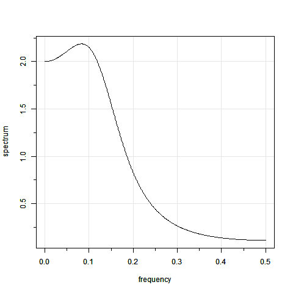
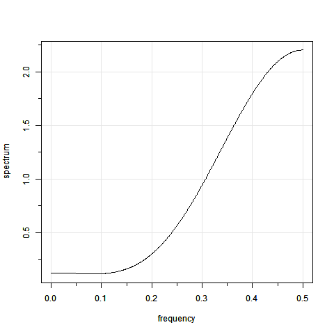
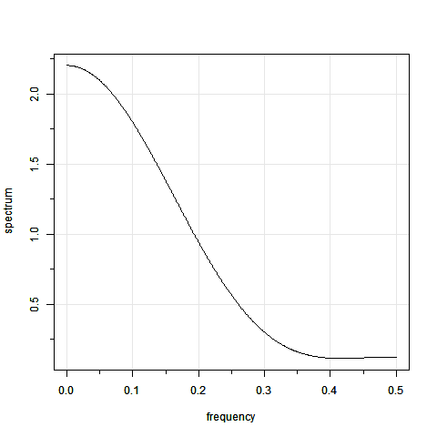

::::: {.content-visible unless-profile="HC"}

::: {.callout-caution}
Section omitted to comply with the Honor Code
:::

:::::

::::: {.content-hidden unless-profile="HC"}

::: {#exr-1}
Which is the most likely spectral density for the following AR(2) process,

$Y_t = 0.8Y_{t-1} - 0.3Y_{t-2} + \epsilon_{t}, \quad \epsilon_{t} \sim \mathcal{N}(0, 0.5)$
:::

::: {.solution}

1. [X] 
2. [ ] 
3. [ ] 

:::

::: {#exr-2}
Consider an AR(4) with two pairs of complex valued reciprocal roots with the following moduli and periods:

  - One pair of complex valued reciprocal roots has modulus 0.6 and period 12 (frequency $\omega=2\pi/12$)
  - One pair of complex valued reciprocal roots has modulus 0.8 and period 8 (frequency $\omega=2\pi/8$)

Then, the spectral density of this process has the following features:
:::

::: {.solution}

- [ ] The spectral density has two modes, one at frequency $\omega=2\pi/12$ and another one at frequency $\omega=2\pi/8$ with the highest peak at $\omega=2\pi/12$.
- [X] The spectral density has two modes, one at frequency $\omega=2\pi/12$ and another one at frequency $\omega=2\pi/8$ with the highest peak at $\omega=2\pi/8$.
- [ ] The spectral density has only one mode at frequency $\omega=2\pi/8$.
- [ ] The spectral density has only one mode at frequency $\omega=2\pi/12$.

:::

:::::
