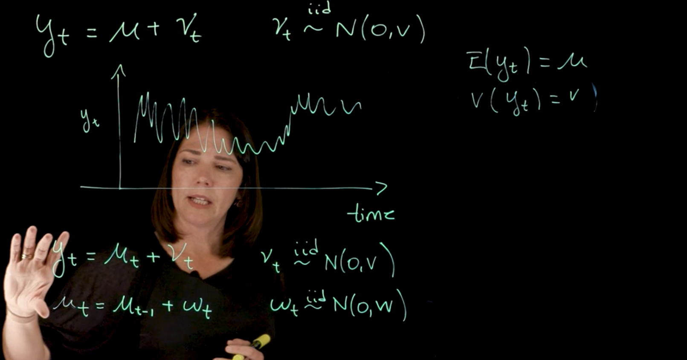
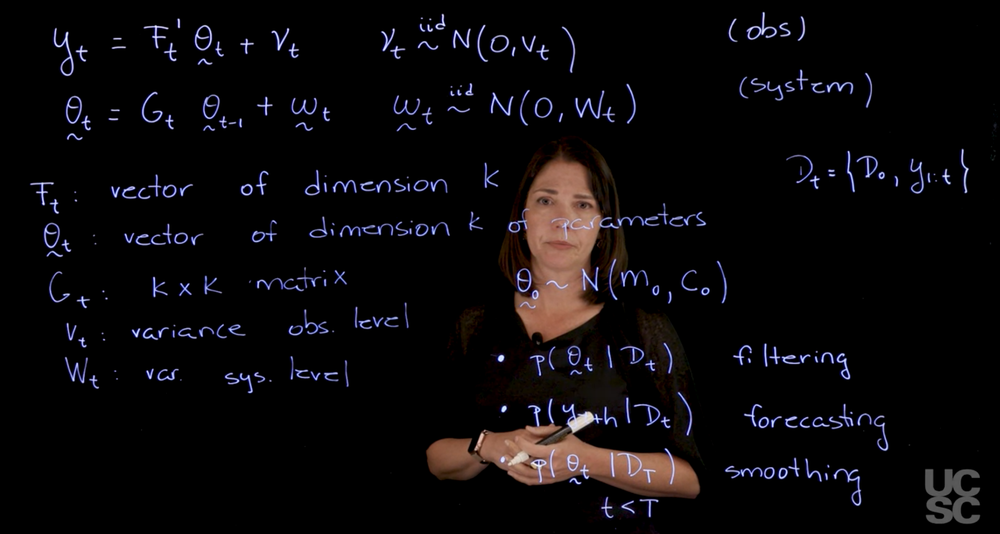
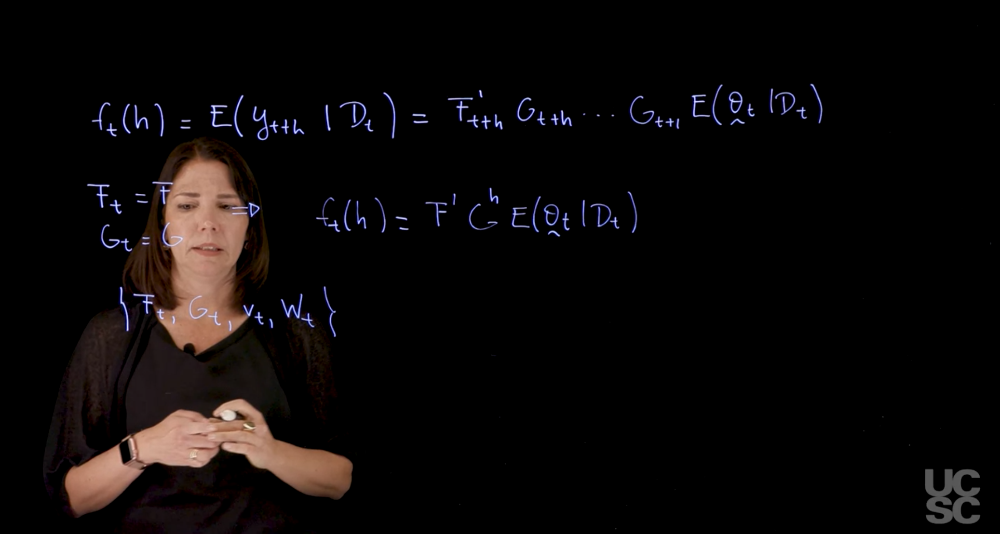
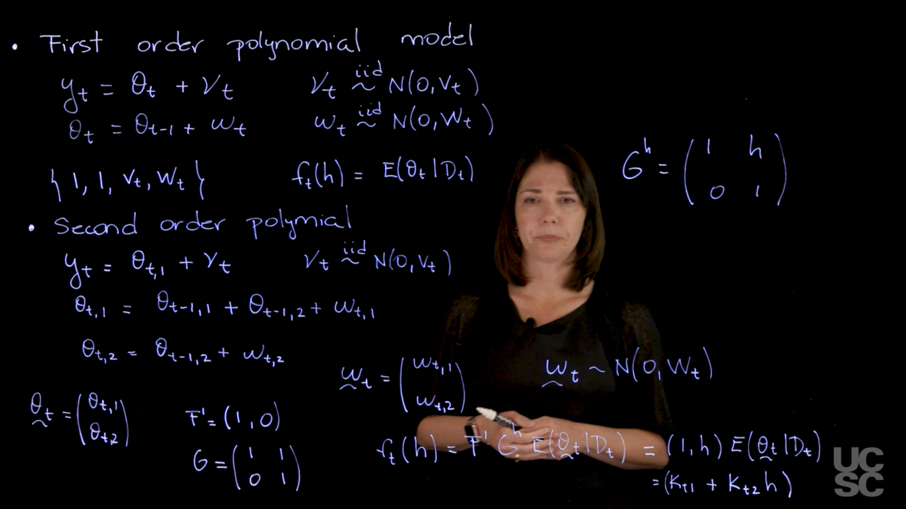
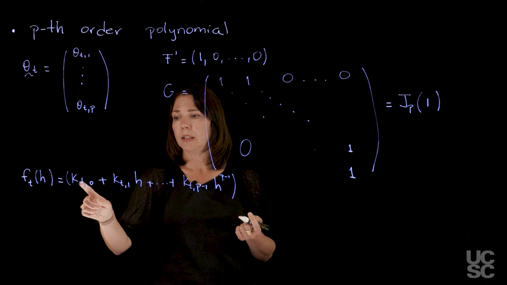
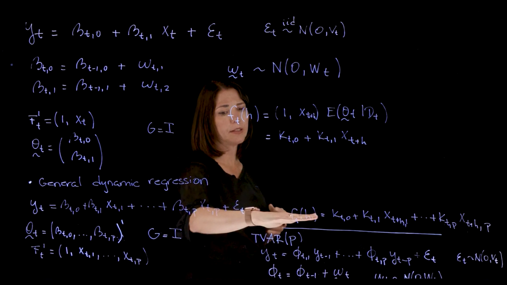
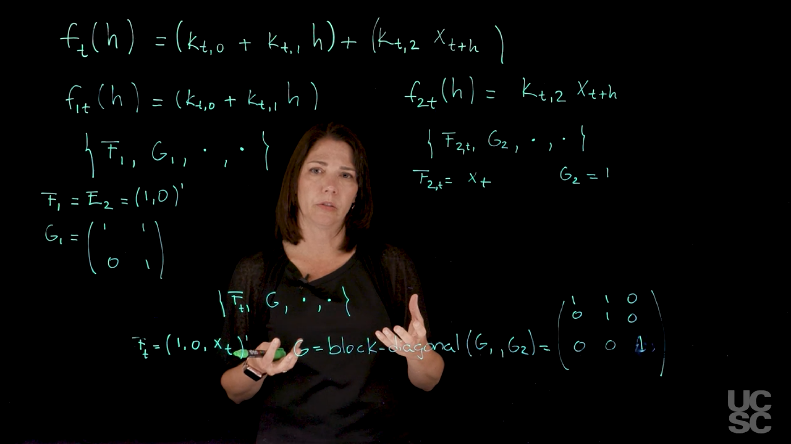

<!-- 
The challenge in taking notes in this courses is that the instructors speak out the maths as they go along. I supply the math but I want to extract the non-math parts and put them in the right place. 
-->

[Normal Dynamic Linear Models (NDLMs) are defined and illustrated in this module using several examples Model building based on the forecast function via the superposition principle is explained. Methods for Bayesian filtering, smoothing and forecasting for NDLMs in the case of known observational variances and known system covariance matrices are discussed and illustrated.]{.mark}.

The Normal Dynamic Linear Model (DLM) is covered  [@prado2023time pp. 117-144]

:::{.callout-note collapse="true"}

## Learning Objectives {.unnumbered}

- [x] Use R for analysis and forecasting of time series using NDLM (case of known observational and system variances) [\#](#m3g1)
- [x] Derive the equations to obtain posterior inference and forecasting in the NDLM with known observational and system variances, including the filtering, smoothing and forecasting equations [\#](#m3g2)
- [x] Apply the NDLM superposition principle and explain the role of the forecast function [\#](#m3g3)
- [x] Define trend and regression normal DLMs [\#](#m3g4)
- [x] Explain the general normal dynamic linear model (NDLM) representation [\#](#m3g5)

:::

## NDLM FAQ {#sec-ndlm-faq}

**Everything you wanted to know about NDLMs but were afraid to ask** meets **Everything I would tell my younger self if ....**

I collected many of the questions raised by the course and book and by the time my notes were almost complete I was able to come up with these answers. I'm not sure I got everything right but perhaps this will be a useful resource to other students. If you find any errors please let me know.


---

As I am working though these questions many questions have come up which I believe are instrumental to people unfamiliar with DLMs. Despite having learned about DLM and done some work on time series it is still a challenge not just to understand but to even ask smart question about this topic.

Some reasons why this is complicated and how to make it simpler. 

One reason I find DLM tricky is that unlike AR(p) or even ARIMA(q,q) we are not dealing with a model for which we set up a bayesian model with some $\theta$ some priors for the thetas and pour in the data and get a posterior for the parameters, and a posterior predictive distribution for doing predictions.

- NDLMs are multifaced like diamonds:
  - one facet is that they are like a multiple regression
  - another facet is that they are like a state space model
  - another facet is the use of kalman filters in filtering and smoothing
  - another facet is that like neural networks they have an arcature and hyperparameters
  - another attractive feature is that unlike neural models they can be interpreted and can be fit with a relatively less data.
  - another facet is that the number of degrees of freedom and the number of parameters are not the same.
  - architecture:
    - they can contain a polynomial trend that is smooth
    - they can contain AR(p) components which can be jagged
    - they can contain MA(q) components - but these are not as straight forward as the AR($p$)
    - they can encode seasonality using dummies (jumping patterns)
    - they can encode seasonality using sinusoids (complex smooth patterns)
    - they can also incorporate time indexed regressors
    - they can incorporate geo-spatial data but this is not covered in this course or the R package and is more of an extension of the DLM framework to [DLSTM](https://spacetimewithr.org/)

We can literally add the components into one big DLM. 
However here things get more interesting. 
We are adding parts into the system or evolution equation. But we don't necessarily want to have a separate variance for each component. (We can if we really want to). However we can pick and choose a version with one overall system variance component.  We also have a separate observation variance component. Did I say separate - it can be  but it can also be related via an RV times a diagonal matrix. 


---


### What Books are there on NDLMs? {#sec-faq-books}

- [@west2013bayesian] which lays down the theory but is long winded. Often meanders rather than giving a clear and concise expiation. Perhaps the authors assume the readers will read it serval times during the PHD and a few more for their post doc. There  are many gaps in this book

- [@prado2023time] is much longer, more recent, far more advanced, covers many more models, tends to reference many research papers, poorly motivated and suffers from an even greater tendency to meander rather than provide the deep insights its maven of authors clearly possess. The book has many appendices that feel more like handouts on unrelated topics with one or two result that we might have used.

- [@petris2009dynamic] Is the most accessible of the trio. Part of the excellent Use R! series which I've skimmed though years and years ago.
The book takes a hands on approach to using the DLM library in R. 
It is a text that fills in some of the gaps in the two text above. However 
It isn't so easy to pick up NDLMs without background in Bayesian statistics and time series.

The first two books are hard to read but they also contain a slew of exercises. Like most mathematical textbooks you won't get more than 25% of the material  unless you do enough of these exercises. I doubt you'll even memorize the recursion equations and their interpretations unless you do enough of these. P.S. unless you are in the middle of your PhD doing the exercises is very very taxing.  **There are no solutions and even reading the derivation in my own solution was taxing**. With enough details I could be fairly sure I had a decent answer. But it could take a couple of hours or a couple of days to get there. I feel that to a large extent I would learn more making models than derivations. It is clear that to handle missing data, handle structural change points or intervention requires great facility with the with the kalman filtering as well as setting up the data and model so that the DLM package can do its magic. This is well beyond the level of the course.

That said lots of the material seems rather theoretical and I want to use NDLM in some sophisticated models. In hindsight I do believe this stuff isn't as complicated to the student. Other books on the subject seem to be from Econometrics or Ecology and other applied areas exist and are likely far more accessible. There is also more software in the wild that can facilitate things like finding structural changepoint.


---


### What is a Normal Dynamic Linear Model (NDLM)? {#sec-faq-ndlm}

A Normal Dynamic Linear Model (NDLM), often simply called a Dynamic Linear Model (DLM) when normality is understood, is a class of dynamic models commonly assumed to have normal (Gaussian) distributions. It is characterized for each time `t` by a set of **quadruples $\{\mathbf{F}_t, \mathbf{G}_t, V_t, \mathbf{W}_t\}$**.

The core of an NDLM is defined by two sequential equations:
*   **Observation Equation**: `Yt = Ft'θt + νt`, where `Yt` is the observation vector, `θt` is the parameter (or state) vector, `Ft` is a known design matrix, and `νt` is an observational noise term assumed to be **normally distributed with zero mean and known variance matrix Vt** (`νt ~ N[0, Vt]`).
*   **System Equation**: `θt = Gtθt-1 + ωt`, where `Gt` is a known system matrix (or transition matrix), and `ωt` is a system noise term assumed to be **normally distributed with zero mean and known variance matrix Wt** (`ωt ~ N[0, Wt]`).

The error sequences (`νt` and `ωt`) are assumed to be internally independent, mutually independent, and independent of the initial information. NDLMs are widely used for modeling time series, capturing how processes change over time. Their flexibility and generality allow them to handle complex problems and directly quantify uncertainty, enabling the fitting of models with many parameters and intricate probability specifications.


---


### Isn't the NDLM overspecified? {#sec-faq-overspecified}

If $\{\mathbf{F}_t, \mathbf{G}_t, V_t, \mathbf{W}_t\}$ changes every time point t i.e. is some or all of the components of the model change we are likely to have overfitting or underfitting problems (too many/few parameters compared to the data). The Kalman Filter performs filtering and smoothing and while these operations have optimality guarantees these stabilize only if they are permitted to converge to some limit (i.e. enough steps where enough might depend on $V_t, \mathbf{W}_t$)

NDLM framework is very flexible, generalizing many known time series models in a single framework. In practice changes in the model at some index $t$ should be due to:

- handle NA's,
- handle intervention or
- handle structural change point (These are covered in [@sec-faq-structural-change-point]).


---


### How much data do I need to fit an NDLM with k dimensions ?{#sec-faq-data-requirements}

The amount of data required to fit an NDLM with `k` dimensions depends on several factors, including the complexity of the model, the number of parameters to be estimated, and the desired level of precision in the estimates. In general, more data is needed for:

1. **Higher Dimensionality**: As the number of dimensions (`k`) increases, the parameter space becomes larger, requiring more data to obtain reliable estimates.

2. **Model Complexity**: More complex models with intricate structures (e.g., multiple state variables, non-linear relationships) typically require more data to accurately capture the underlying dynamics.

3. **Desired Precision**: If high precision is needed in the parameter estimates or predictions, more data will be necessary to reduce uncertainty.

A common rule of thumb is to have at least 10-20 observations per parameter to be estimated. However, this is a rough guideline, and the actual data requirements may vary based on the specific context and goals of the analysis.

---


### How are filtering, smoothing, and forecasting performed in NDLMs? {#sec-faq-filtering-smoothing-forecasting}

NDLMs provide a coherent framework for these key time series analyses:
*   **Filtering**: This process estimates the current state of the system (`θt`) based on all available observations up to the current time `t`. In NDLMs, this is typically achieved using **Kalman filter recurrences**. The posterior mean of the state is a weighted average of the prior mean and the current observation, with weights proportional to their precisions.
*   **Smoothing (Retrospective Analysis)**: This involves estimating past states (`θs` for `s < t`) by incorporating all available data, including future observations up to a fixed interval `T`. It provides a retrospective view of the parameter values based on the entire dataset. Conditional independence results are crucial for developing efficient smoothing algorithms.
*   **Forecasting**: This involves predicting the future behavior of the system state and observations (`Yt+k`, `θt+k`) for `k` steps ahead, given data up to the current time `t`. Forecast functions define the qualitative form and expected numerical development of the time series.

These processes provide linear posterior means and variances, which is a justification for their use even outside strict normality assumptions.


---


### What are the computational challenges and methods used for NDLMs with unknown parameters? {#sec-faq-computational}

When NDLM parameters, especially variances, are unknown and time-varying, obtaining exact analytical solutions for the full posterior distributions becomes complex. This necessitates the use of various computational techniques:
*   **Approximation Techniques**:
    *   **Normal Approximation**: Often applied to posterior distributions, especially for parameters that are difficult to model directly.
    *   **Linearization**: For models with non-linear components, linear approximations can be used to transform them into (approximate) DLMs, allowing for standard DLM analysis.
*   **Simulation-Based Methods (Markov Chain Monte Carlo - MCMC)**:
    *   **General MCMC**: These methods are widely used for posterior inference in complex dynamic models.
    *   **Gibbs Sampling**: A common MCMC approach, it is often easily implemented for sampling posterior distributions of model parameters and state vectors within a fixed time interval, especially for conditionally linear/normal models.
    *   **Forward Filtering, Backward Sampling (FFBS)**: A specific and efficient MCMC algorithm introduced for sampling the full set of state vectors from the posterior distribution in conditionally Gaussian DLMs. It exploits the Markovian structure of the model.
    *   **Particle Filters (Sequential Monte Carlo - SMC)**: These are crucial for "on-line" or recursive inference, where new observations frequently arrive and re-running an entire MCMC every time is computationally inefficient. Particle filters are particularly well-suited for non-linear and non-Gaussian state-space models. Rao-Blackwellized particle filters can improve efficiency in conditionally Gaussian contexts.


---


### How are NDLMs specified, designed? {#sec-faq-specification}

*   **Model Specification and Design**: DLMs are often constructed by **superposition** (combining) two or more **component DLMs**, each capturing a specific feature like trend, seasonality, or regression. The starting point for model design is typically the desired **forecast function**, which determines the qualitative and quantitative form of the time series development.
*   **Hierarchical Models**: These are powerful extensions for problems involving multiple, related parameters. Data are modeled conditionally on parameters, which themselves are given a probabilistic specification in terms of hyperparameters. This structure allows "borrowing strength" across related groups or units, enhancing inference.


---


### How are NDLMs checked for adequacy? {#sec-faq-checking}

*   **Model Checking (Diagnostics)**: Essential for assessing how well the model fits the data and substantive knowledge:
    *   **Posterior Predictive Checks**: Involve simulating replicated datasets from the model's posterior predictive distribution and comparing them to the observed data. For NDLMs, this often includes examining **standardized forecast errors** (`et/sqrt(Qt)`), which should resemble Gaussian white noise if the model is adequate. Graphical tools like QQ-plots and empirical autocorrelation functions are used to assess normality and uncorrelatedness.
    *   **Sensitivity Analysis**: Involves recomputing posterior inferences under plausible alternative models to evaluate the robustness of conclusions to modeling assumptions.
    *   **Model Comparison**: Competing models can be evaluated based on measures like **predictive accuracy** (e.g., log score), **information criteria** (e.g., AIC, DIC, WAIC), or **Bayes factors**.


---


### What is the difference between DLM and NDLM? {#sec-faq-dlm-vs-ndlm}

DLMs are the subject of [@west2013bayesian]. NDLM are a special case of DLMs in which the priors and the variance terms come from a Normal distribution. This normality assumption simplifies the analysis and allows for the use of conjugate priors, making the Bayesian updating process more straightforward.


---


### Why are $F_t$ and $G_t$ a vector and a matrix respectively? {#sec-faq-Ft-Gt}

It may helps to think about $F$ and $G$ as follows:

$F_t'$ acts as a linear transformation that maps the latent state $\vec{\theta}_t$ into the observation space, of $y$.  While $\nu_t$ injects some observation noise. In practice $F$ almost always takes the form $(1,0, \ldots)^\top$ Which means it grabs the first term from the output of $\theta_t$ suggesting that the first term in $\theta$ corresponds to the visible state.

$G_t$ is a linear transformation that describes the dynamics of state vector evolves over time. I like to think about it as a Hidden Markov state transition matrix.
In the state evolution equations we multiply out $\theta_t G_t$ to deterministically update the state and we then add $\omega_t$ to account for process noise.

In other words, $F_t$ takes the current hidden state $\theta_t$ and produces an observation $y_t$, while $G_t$ takes the current state and produces the next state.


---

### Why is a DLM this called a linear model? {#sec-faq-linear-model}

This is because both the observation equation is a linear equation that relates the observations to the parameters in the model and the system equation is a linear equation that tells us how the time-varying parameter is going to be changing over time. This is why we call this a linear model.


---

### Why are the noise terms $\nu_t$ and $\omega_t$ assumed to be normally distributed? {#sec-faq-noise-normal}

This is a common assumption in time series analysis. 
It is a convenient assumption that allows us to perform Bayesian inference and forecasting in a very simple way. And this is why we call this a **normal** dynamic linear model.

### Isn't this just a hierarchical model? {#sec-faq-hierarchical}

It is a hierarchical model but **not just**. 
First the observation and system evolution equations are also auto-recursive giving them a temporal structure.
We have a model for the observations and a model for the system level. 
The system level is changing over time and the observations are related to the system level through the observation equation. 
As explained above $G$ is a matrix i.e. a set of simultaneous equations and these may capture a hierarchial, multilevel or other structures.

We saw in the development of the p order polynomial trend model that we can add p levels to the evolution equation. 
And so it is possible to extend this model to more complex structures if we wish to do so by adding another level, etc... 

However as we add more level they must be written in a representation that the KF algorithm can process. 

This means we will take all these levels and fold them into $G$ and keep the temporal structure of the two level overall framework!

One more thought on structure is that we can combine different dlm into bigger one using stacking.
This isn't something we considered before for hierarchical models so again **not just**.


---

### What is the difference between NDLMs and AR(p)/ARIMA model? {#sec-faq-ndlm-arp}

NDLMs are built of component and one of the components can be an AR(p) models. 
AR(p) models need to be stationary but NDLM have no such requirement. 
Note that what I said above regarding AR($p$) applies to an ARIMA component which is a more general model than AR($p$).

- Intuitively though the NDLM can have seasonal and trend components and if they do account for the non stationary part of the series then the Ar(p) might account for the stationary residual. 

TODO: It is unclear that this does happen nor that there are guarantees that the algorithms will do this.

---

### What are moments for NDLM? {#sec-faq-moments-ndlm}

The instructor and the book references parts of the NDLM model as moments what is that about? We just said in [Q1]{#sec-dlm-vs-ndlm} that NDLM posit a normal structure on the priors and errors. When they talk about the moments they mean the mean and variance in these distributions. These are quantities of interest.
The priors obviously are known. The errors are not generally unknowns 

To make things a bit clearer, the Kalman filter optimal in some sense at assigning the state of the system at time $t$ given the data up to time $t$.
The state is what we call $\theta_t$ what the kalman filter can't eliminate are the impact of the variance in the system and the observation level. There is always an error. However there are theoretical guarantees that the Kalman filter will provide the best linear unbiased estimate (BLUE) of the state so long as sufficient data has been seen.

The moments are the inputs and outputs of the model. We get a MLE for the means which we don't need to worry about. But we will get a posterior for the variance of the system and the observation level. This is the other moment of the model and it is here that we actually need to make strategic decisions.
We can set a complex prior and get many measurements to get a good posterior for the variance or more likely we don't really know much about the errors and we prefer to postulate something as simple as possible and then use the data to get a posterior for the variance. (Simple here means a model that only requires to compute and interpret the noise at the observation level i.e. a difference between the model's forecast and the actual observation we see next)


---

### What is this thing called $\delta$ can I ignore it?

In the NDLM where we don't know the system variance we can replace it under a simplifying assumption by decomposing $R_t$. In the filtering equations. I think of this as providing us with a "surrogate" model. I.e. a simpler model that approximate out original model. 

What we do is we decompose the system model into a deterministic part and a stochastic part. We update the covariance using a `reduced form` which means we have a raw estimate of covariance based on how the previous times system error term evolves according to $G$ i.e. $G C_t G^\top$ and we use $\delta$ as a weight to set how much of that term we want to pass through.

So to sum up: we can use the discount factor hyper-parameter denoted as  $\delta$ which we learned to estimate using MSE on a loss associated with $\delta$. This question is an informal outline of [@specifying-the-system-covariance-matrix-via-discount-factors])

---

### What is the Kalman gain

The Kalman gain is a key component of the Kalman filter, which is used in NDLMs to update the state estimates based on new observations. It determines how much weight to give to the new observation relative to the current state estimate.

---

### What are these **moments** we keep hearing about ? {#sec-faq-moments}

Let's take a ~~moment~~ *time out* to unpack the moments reference.

When we talk about filtering we have two or three equations called the filtering equations. These have a recursive form and are often either conditionaly or directly Normal or Student-t. And the first and second moments of these distributions are fed into the next update equations. They have names and interpretation which I might cover in another question. So that is the main usage of moments but we also have priors and other distribution and they also have moments and the professor might be talking about these ones as well. But the priors are the starting point of the recursive formulas so what I explained initially is a good place for an intuition. 

 but to sum up we have


In class the teacher often says some part of the model like the  parameters or the matrices or the moments of the of the Model are known, unknown but assumed to be constant.

We can use Bayesian methods to infer the parameters of an NDLM ?

Here be dragons.... NDLM are bayesian but they have both a strong normality assumption, a conjugate structure and primarily make use of Kalman Filtering. 
This means that aspects of the model are assumed, others are inferred via filtering and smoothing and others yet are 

---

### How does the kalman filter features in DLMs {#sec-faq-kalman-filter}

The Kalman filter is an iterative algorithm driving the NDLMs. It is used for estimating the hidden states of the model and updating these estimates as new observations become available. But Kalman Filters require four matrices to do their magic and the NDLM puts all our assumptions into $F$ and $G$ and the variances into a Jordan form which is compatible with the Kalman filter.

Unfortunately, [the Kalman filter has a tendency to amplify noise]{.mark}, which can be problematic in practice. This means that if the model is not well-specified or if the noise characteristics change over time, the Kalman filter may produce unreliable estimates. It is my guesstimate that we do smoothing to mitigate this issue.

---

### What is a structural change point. {#sec-faq-structural-change-point}

This is a point in the time series where we need new parameters or even a more parameters. The basic structure of the model is not good moving forward.

There is a lot of criticism of the Facebook prophet algorithm breaking at some point. Digging deeper this is due to a distributional drift or more likely even a structural change point. FB prophet is

- much simpler than NDLM and 
- uses MCMC rather than KF for its inference and
- its regular users lack the ability to modify its  internal components.

So it is a huge problem to fix FB prophet blows up in production and is used in a recommendation system. Retaining FB prophet may not work.

In contrast DLM theory emphasizes that DLMs are open to at any time point to changes at all levels. (Without worrying the student how in practice they are supposed to do this or how robust the model is to such changes) After all the Kalman filter is fantastic at using feedback to give an optimal updates. 
But it probably just as hard to handle a structural change, intervention or NA. I think that the extra code we got in class which takes or creates list of matrices indexed in time is exactly an NDLM in short notation that handle this.
It then becomes a matter of practice in inserting NAs, interventions and adding or changing components from a certain point. 

While the course and the book seems to have provided the math to do this the course lacks and explanations of how to use that part of the theory to handle these three modeling need s nor does it have exercises on the subject. 

I imagine if you can do this it would be a bit like Einstein teaching the first course on general relativity and then being surprised how one of Karl Schwarzschild then got back to him within weeks with with a black hole solution for the case of a static spherically symmetric black hole. 

So when you want to use this in work or research it will always be harder!
You will almost always need to adjust the data or the model etc for this to work for your uses case. So you should try to do a do a few of each (NAs,different levels of interventions and structural changes) so when the day comes you can say at least I have done this before and I know how to do it and how to validate it!


Getting back on topic there are state space models that incorporate identifying and switching between different models. These are called **hidden Markov models** (HMMs) and they are a generalization of NDLMs. HMMs can be used to model time series with structural change points, but they are more complex and require more data to estimate the parameters.

---

### Q. What does Polynomial mean in a Polynomial trend DLM ? {#faw-faq-polynomial}

I was confused about this and there are three good reasons to be!

1. The AR($p$) has a **characteristic polynomial which is unrelated** to do with the Polynomial in these trend models. They are AR($p$) component of DLMs which create jagged forms in the forecast function, while polynomial models are popular as they add a smooth trend. The polynomial model is a sub-model that covers the trend. This allows us to model the residual as an AR($p$) even if the data is non-stationary
2. In [@west2013bayesian] the authors talks about Taylor series approximation before delving into the first polynomial trend model. This is an intuitive way to think about about multiple regression model. This is a polynomial in which we can pick the order one or two to get better approximations lingo common in physics and numerical methods. However it is **completely unrelated** to the Polynomial that gives the model its name.

For a polynomial model of order $p$, when we multiply out the terms of the forecast function we get a polynomial of order $p-1$. 


---


### Can NDLMs handle unknown and non-constant observational (Vt) and system (Wt) variances? {sec-faq-unknown-variances}

**Yes, NDLMs can be extended to handle cases where both observational variance (Vt) and system variance (Wt) are unknown and vary over time**. This moves beyond the simplest Kalman filter assumptions of known variances.

Here's how this is typically managed:
*   **Unknown but Constant Variances**:
    *   If the observational variance `V` is unknown but constant, it can be estimated using a conjugate **Normal-Gamma prior** for the state vector and observational precision (inverse variance). This results in the state and predictive distributions following **Student-t distributions** rather than normal distributions.
    *   If the system variance `W` is unknown but constant, it can be estimated using methods like the **EM algorithm**.
*   **Time-Varying System Variance (Wt)**:
    *   The most common and practical approach is through **discount factors (δ)**. A discount factor defines `Wt` as a proportion of the previous time step's prior covariance, effectively `Wt = GtCt-1G't(δ-1 - 1)`. This allows `Wt` to be automatically time-varying and adaptive, simplifying the specification of complex covariance elements to a single scalar. Different discount factors can be applied to different components of the state vector.
*   **Time-Varying Observational Variance (Vt)**:
    *   This is handled through **variance discounting** or **discounted variance learning**. This technique models a decay of information about the observational precision (`φt = 1/Vt`) over time, maintaining the conjugate Gamma distribution form for precision. The prior for `φt` at time `t` is derived by discounting the degrees of freedom and scale parameter from the previous posterior (e.g., `G[δnt-1/2, δdt-1/2]`). This makes the variance estimate more adaptive to recent data. The concept of "power-discounting" is also mentioned in relation to modifying the prior distribution, suggesting a general method for flattening distributions, which can be applied to precision parameters.
*   **Multivariate Extensions**: These discounting approaches extend to multivariate DLMs. For instance, **matrix normal/Inverse Wishart distributions** can be used to handle time-varying observational covariance matrices (`Σt`), often with dynamics defined by a **matrix beta evolution model**.

---

---

### What are some common extensions and generalizations of NDLMs? {#sec-faq-extensions}

The DLM framework is highly flexible and can be extended in various ways:
*   **Non-Normal and Non-Linear Dynamic Models**:
    *   **Dynamic Generalized Linear Models (DGLMs)**: Extend DLMs by using exponential family distributions (e.g., Poisson for count data, Binomial for proportions) for the observational model, often involving non-linear link functions.
    *   **General Non-Linear Dynamic Models**: Arise when parameters (e.g., `λ` in a transfer response function or a discount factor itself) introduce non-linearities into the system or observation equations.
    *   **Stochastic Volatility (SV) Models**: Often formulated as non-linear/non-Gaussian state-space models where volatility parameters evolve dynamically, requiring specialized computational methods.
    *   **Mixture Models**: Can be incorporated to handle non-normal error distributions or to model phenomena like occasional outliers.
*   **Multivariate and Matrix Normal DLMs**:
    *   **Multivariate DLMs**: Generalize to handle vector-valued observations, allowing for joint modeling of multiple time series.
    *   **Matrix Normal DLMs**: Provide a framework for multivariate time series analysis where the covariance structure across series is unknown, leveraging matrix-variate normal distributions for fully conjugate analyses.
*   **Dynamic Graphical Models**: Combine matrix-variate DLMs with Gaussian graphical models, allowing for structured and often sparse precision matrices, which is useful for scalability in high-dimensional time series.
*   **Dynamic Dependence Network Models (DDNMs)**: These models define multivariate dynamic models by coupling customized univariate DLMs, extending time-varying vector autoregressive (TV-VAR) models and allowing for flexible modeling of time-varying parameters and volatilities.
*   **Spatio-Temporal Models**: NDLMs form the foundation for **dynamic spatio-temporal models (DSTMs)**, which model processes that vary across both space and time. These models can also incorporate non-linearity and non-Gaussian elements. Hidden Resolution Models (HRMs) are a type of multiscale time series model that can be formulated as DLMs.

---

## The Normal Dynamic Linear Model: Definition, Model classes & The Superposition Principle

Dynamic Linear Models (DLMs) extend classical linear regression to time-indexed data, introducing dependencies between observations through latent evolving parameters. A Normal DLM (NDLM) assumes Gaussian noise at both observation and system levels, enabling tractable Bayesian inference through the Kalman filter.

While superficially complex, NDLMs are conceptually close to linear regression. Instead of I.I.D. observations indexed by $i$, we index data by time $t$ and allow parameters to evolve with time, resulting in a two-level hierarchical model. At the top level is the observation equation. Below this there is the evolution equation(s) that can be understood as a latent state transition model that can capture trends, periodicity, and regression. The evolution equations can have more than one level however we will see that with some work these are summarized into a matrix form.

To make things simpler this is demonstrated using a white noise process and then a random walk model. What makes the NDLM somewhat different is that that there are two variance elements at two levels, necessitating learning more parameters. Once we cover these to models the instructor walks us though all the bits and pieces of the notation. Later we will see that we can add trends, periodicity, regression components in a more or less systematic way. However we need to pick and choose these components to get a suitable forecast function. This approach require an intimate familiarity with the data generating process to model.

This approach is Bayesian in that we draw our parameters from a multivariate normal and use updating to improve this initial estimate by incorporating the data and we end up with a posterior i.e. we have distributional view of the time series incorporating uncertainties.
Additionally we have a number of Bayesian quantities that can be derived from the model, such as 

- the **filtering distribution** that estimates the current state $\mathbb{P}r(\theta_t \mid \mathcal{D}_t)$, 
- the **forecasting distribution** - to predict future observation: $\mathbb{P}r(y_{t+h} \mid \mathcal{D}_t)$, 
- the **smoothing distribution** - retrospective estimate of past state: $\mathbb{P}r(\theta_t \mid \mathcal{D}_{T})\quad t<T$ and 
- the **forecast function** when $F_t=F$ and $\mathbf{G}_t=\mathbf{G}$ $f_t(h)=\mathbb{E}[y_{t+h} \mid \mathcal{D}_{T}] = F'G^h \mathbb{E}[\theta_{t} \mid \mathcal{D}_{T}]$ 
- the usual credible intervals for forecasts and parameter estimates.

However the DLM framework is quite flexible and once you understand it it can ve adapted to support features like seasonality using the superposition principle. NDLMs don't need to be non-stationary time series.

As far as I cen tell NDLMs are just DLM with their errors distributed normally at the different levels.


## NDLM Definition  :movie_camera: 

{.column-margin  group="slides" width="53mm"}


{.column-margin  group="slides" width="53mm"}


{.column-margin  group="slides" width="53mm"}


<!--
::: {.callout-caution collapse="true"}

### Hard to follow :weary:

- I found this video hard to follow. I watched it carefully a number of times and reworked the math and video's transcript. But in the end this and the next two video are more like a summary of the material rather than a motivated development of the models. 

- The text also diverge when it comes to the $F$ in the state space representation equation. In @west2013bayesian it is a matrix and in @prado2023time it is called a vector. In some places it is referenced as a $p \times 1$. As far as I can tell this reflects different state space representation of the model which neither text is particularly clear. 
- Although we are give a couple of motivational examples the way they generalize to the NDLM is not as clear as in @west2013bayesian but this text is very verbose and covers much more material.

- @west2013bayesian also discusses how the math relates to more common statistical scenarios and how the model can be adapted to these scenarios e.g. replacing the obs. normal distribution with a t-distribution or a mixture of normals to handle outliers. I.e. see NDLMs as a looser framework with the assumptions of independence and normality as guidelines rather than strict assumptions.

In @prado2023time we quickly get a large number of mathematically concise format, that illustrate how NDLMs generalize other time series models. However these examples assume we are sufficiently familiar with this models.

- The NDLM is also a hierarchical model which we have not looked into in much depth in this specialization. This is another missed opportunity to connect to previous material and deepen our understanding. Particularly as the bayesian formulation should be able to overcome the limitations of the frequentist approach where we need to make strong assumptions on IID of the shocks but in a time series local observations often highly correlated.

- NDLM have efficient algorithms for inference and forecasting mostly by using the Kalman filter, again this is not mentioned not is a bayesian formulation presented

- So I guess the main issue is that the vide just lists lots of equations and does not really without providing a good intuition behind the model.

- I hope that with the rest of this and the next lesson we can get a better understanding of the NDLM.

- I ended up skimming through large portions of [@west2013bayesian] which goes into much greater detail on the NDLM. The first and second polynomial models developed, explained and motivation is clearer. The state space representation is not explained but the model is developed in a more coherent way and this is a good starting point for developing a more intuitive understanding of the NDLMs. The notation in this book is also easier to follow.

  - We use $\theta_t$ for the parameters of the vector and \theta_{t,1} and \theta_{t,2} for the first two components of the parameter vector. This continues the convention of greek characters for parameters from the previous courses and many texts. However if the parameters have a clear meaning it much easier to follow math where we use a more descriptive notation and avoid the second subscripts.
- The state space representation here is omitted. The $F$ vector or matrix is not really motivates as a latent state space representation.

:::
-->

In this module, [we will motivate and develop a class of models suitable for for analyzing and forecasting **non-stationary time series** called  **normal dynamic linear models** . We will talk about Bayesian inference and forecasting within this class of models and describe model building as well]{.mark}. 

### White Noise - A motivating example

Let's begin with a very simple model that has no temporal structure, just a mean value with some variation that is: 

$$
y_t = \mu + v_t \qquad v_t \overset{\text{iid}}{\sim}  \mathcal{N}(0, \nu) \qquad  \text{(white noise model)}
$$ {#eq-white-noise-model}

where:

- $y_t$ is the observed time series at time $t$,
- $\mu$ is the expected value of $y_t$ this is characteristic we are interested in, 
- $\nu_t$ is a white noise process  as usual iid standard normal N(0,1).

If we plot this model we might see the following graph:

```{r}
#| label: fig-NDLM-white-noise
set.seed(123)
n <- 100
V <- 1
mu <- 0
y <- mu + rnorm(n, 0, V)
plot(y, type = "l", col = "blue", lwd = 2, xlab = "Time", ylab = "y", main = "Model with no temporal structure")
```

For this model the mean of the time series is $\mu$ will be the the expected value of $y_t$, which is $\mu$. And the variance of $y_t$ is $\nu$.

$$
\mathbb{E}[y_t] = \mu \qquad \text{and} \qquad \mathbb{V}ar[y_t] = \nu \qquad
$$ {#eq-NDLM-mean-variance}


### A Random walk model with a slowly changing mean

[Next we incorporate some temporal structure, we allow the expected value of the time series, to change over time. To can achieve this, by update the model definition with a $\mu_t$ where the index indicates that it can change at every time step. And let us keep the noise unchanged. i.e. we set it to $\mu_t \in N(0,\nu)$.]{.mark}  

We get the following model:

$$
y_t = \mu_t + \nu_t \quad \nu_t \overset{\text{iid}}{\sim} N(0, V) \qquad \text{(radom walk model)}
$$ {#eq-NDLM-model-random-walk}

To complete this we need to also decide how to incorporate the the changes over time in the parameter $\mu_t$. We might consider different options but we should pick the simplest possible to start with. One option is to assume that the expected value of $\mu_t$ is just the expected value of $\mu_{t-1}$ plus some noise. 

We now have that random walk type of structure where $\mu_t$ can be written in terms of $\mu(t-1)$. The expected value of $\mu_t$, we can think of it as $\mu_{t-1} + \text{some noise}$. This error is once again, assumed to be normally distributed random variable centered at zero and with variance $W$. 
[Another assumption that we have made here is that the $\nu_t$ and $\omega_t$, are also independent of each other]{.mark}. 

putting this together we get:

$$
\begin{aligned}
y_t &= \mu_t + \nu_t & \nu_t & \overset{\text{iid}}{\sim}  \mathcal{N}(0, V)  & \text{(Observation eq.)} \\
\mu_t &= \mu_{t-1} + \omega_t  & \omega_t & \overset{\text{iid}}{\sim}  \mathcal{N}(0, W) & \text{(System/evolution eq.)}
\end{aligned}
$$ {#eq-random-walk-model-hierarchical}


With this model, what we are assuming is that the mean level of the series is changing over time. 
Note that this is an example of a **Gaussian or Normal dynamic linear model**. 

NDLMs are a two level hierarchical models where :

1. At the top is an **observation level equation** relating observations y at time t to some time dependent, (hidden) state parameters and some observation level iid distributed error.
2. The **system evolution level equation** describes the dynamics of parameters over time and incorporates some system iid distributed error.
3. [These equations have a linear structure, in the sense that the expected value of y at time t is a linear function of the parameters.]{.mark} 
4. We have the **assumption of normality for the noise terms** in both these equations as well as independence within and between levels. 

This is our first example. Next we will be discuss the general class of models. Later we will consider how to incorporate different structures into the model, and how to perform Bayesian inference for filtering smoothing and forecasting.


### General form of the NDLM

The general class of dynamic linear models can be written as follows:

We are going to have two equations. One is the so-called observation equation that relates the observations to the parameters in the model, and the notation we are going to use is as follows.

$$\begin{aligned}
y_t &= \vec{F}_t' \vec{\theta}_t   + \nu_t && \nu_t \overset{\text{iid}}{\sim}  \mathcal{N}(0, V_t) && \text{(obs)} \\
\vec{\theta}_t &= G_t \vec{\theta}_{t-1} + \vec{\omega}_t && \vec{\omega}_t \overset{\text{iid}}{\sim}  \mathcal{N}(0, W_t) && \text{(system)}
\end{aligned}
$$ {#eq-NDLM-general-form}

Where:

- $y_t$ a univariate observation at time $t$.
- $\vec{\theta}_t$ the **state vector** is a k-dimensional vector of unknown parameters at time t.
- $\vec{F_t}$ the **observation operator** a $k*1$-dimensional vector at time t that transforms  the **state parameters** into observations.
- $\nu_t$ is the observation noise at time t from a Normal distribution with variance $V_t$.
- $G_t$ the **state evolution operator** is a  $k \times k$ matrix (known)
- $\omega_t$ the **innovation** or state evolution noise  at time t distributed as $N(0,W_t)$(known)
- the noise at the observation level and the system level are each iid and mutually iid.

We also have the prior distribution for the state vector at time 0:

- $\vec{\theta}_0 \sim N(\vec{m}_0,c_0)$ a prior k-dimensional Normal distribution.
  - $m_0$ the mean in the prior is a k-dimensional vector of means. (known)
  - $c_0$ is the covariance matrix k by k. (known)


### Inference in the NDLM

In terms of the inference, there are a few different kinds of densities and quantities that we are interested in:

[Filtering distribution]{.column-margin}  One of the distributions that we are interested in finding is the so-called **filtering distribution**. We may be interested here in finding what is the density of $\theta_t$ *given all the observations that we have up to time* $t$. 

$$
\mathcal{D}_t= \{\mathcal{D}_0, y_{1:T}\} 
$$ {#eq-NDLM-filtering-distribution}

We will denote information as $\mathcal{D}_t$. Usually, it is all the information we have at time zero (i.e. our prior), coupled with all the data points I have up to time $t$. 

Here we conditioning on all the observed quantities and the prior information up to time $t$, and I may be interested in just finding what is the distribution for $\theta_t$. This is called filtering.

$$
\mathbb{P}r(\theta_t \mid \mathcal{D}_t) \qquad \text{filtering distribution}
$$ {#eq-NDLM-filtering}


[forecasting distribution]{.column-margin}  

Another distribution that is very important in time series analysis is the  forecasting distribution.
We may be interested in the distribution of $y{t+h}$? where we consider $h$ lags into the future and we have all the information $\mathcal{D}_t$, up to time t. 
We want to do a predictions here

$$
\mathbb{P}r(y_{t+h} \mid \mathcal{D}_t) \qquad \text{forecasting distribution}
$$ {#eq-NDLM-forecasting-distribution}

[Smoothing Distribution]{.column-margin} Another important quantity or an important set of distributions is what we call the smoothing distribution. Usually, you have a time series, when you get your data, you observe, I don't know, 300 data points. As you go with the filtering, you are going to start from zero all the way to 300 and you're going to update these filtering distributions as you go and move forward. [We may want instead to revisit the parameter at time 10, for example, given that you now have observed all these 300 observations. In that case, you're interested in densities that are of the form. Let's say that you observe capital T in your process and now you are going to revisit that density for $\theta_t$. This is now in the past. Here we assume that $t<T$. This is called **smoothing**.]{.mark}


So you have more observation once you have seen the data. We will talk about how to perform Bayesian inference to obtain all these distributions under this model setting. 

$$
\mathbb{P}r(\theta_t \mid \mathcal{D}_T)  \qquad t < T \qquad \text{smoothing distribution}
$$ {#eq-NDLM-smoothing-distribution}

### The forecast function for the NDLM 

In addition to all the structure that we described before and all the densities that we are interested in finding, we also have as usual, the so-called *forecast function*, which instead of being the density is just $\mathbb{E}[y(t+h)\mid \mathcal{D}_t]$ i.e. expected value of y at time t given all the information we have before time t. 

$$
\mathbb{E}[y(t+h)\mid \mathcal(D_t)] = F'_{t+h} G_{t+h} \ldots G_{t+1} \mathbb{E}[\theta_t \mid \mathcal{D}_t]
$$ {#eq-forecast-function-for-NDLM}


This is the form of the forecast function. 

There are particular cases and particular models that we will be discussing in which the $F_t=F$, i.e. constant and also $G_t = G$ is also constant for all t. 
In these cases, the forecast function can be simplified and written as:

$$
f_t(h) = \mathbb{E}(y_{t+h} \mid D_t) = F'G^h \mathbb{E}(\theta_t \mid \mathcal{D}_t)
$$ {#eq-forecast-function-for-NDLM-constant-F-G}


One thing that we will learn is that the eigen-structure of this matrix is very important to define the form of the forecast function, and it's very important for model building and for adding components into your model. 

### NDLM short form notation

Finally, just in terms of short notation, we can always write down when we're working with normal dynamic linear models, we may be referring to the model instead of writing the two equations, the system and the observation equation. I can just write all the components that define my model.
$$ 
\{F_t, G_t, v_t, W_t\} 
$$ {#eq-NDLM-model-shothand-notation}

::: {.callout-note collapse="true"}
## Video Transcript {.unnumbered}



:::

## Polynomial Trend Models  :movie_camera: 

{#fig-first-and-second-order-polynomial-model .column-margin  group="slides" width="53mm"}


{#fig-p-order-polynomial-model .column-margin  group="slides" width="53mm"}


While we haven't talked about the superposition principle yet we start at looking at adding different components to the DLM. 

We might :

  - setting a baseline mean and variance
  - adding a random walk with its variance
  - add a trend 
  - add a regression 
  - add seasonality


Next we want to extend the random walk model to include different types of trends and this will be covered by the polynomial trend models. [These are models that are useful to model linear trends or polynomial trends in your time series. So if you have a data set, where you have an increasing trend, or a decreasing trend, you would use one of those **components** in your model.]{.mark} Also 

### First order polynomial model

The first order model is developed at great detail in chapter In [@west2013bayesian ch. 2]. I don't know what to make of it, isn't this a trivial white noise model?

The math for Bayesian updating is fairly straight forward and must be much more complex with more sophisticated dynamics. So this is used by the authors to introduce their DLM and an 30 pages of the book is dedicated to in depth analysis and Bayesian development of this specific model and different distribution of interests as well as including comparison to other models and a look at the signal to noise ratio in the model.

It is worthwhile pointing out that these models get their name from their forecast function which will takes the general form [@eq-DLM-n-order-polynomial-forecast-function]

The first order polynomial model is a model that is useful to describe linear trends in your time series. 
If you have a data set where you have an increasing trend or a decreasing trend, you would use one of those components in your model.

So the all those can be incorporated using the general p-order polynomial model, so I will just describe the form of this model.

A first order polynomial is of the form $Ax+B$ where A is the slope and B is the intercept. This is the same random walk model we saw  above.

$$
\begin{aligned}
y_t &= \theta_t + \nu_t, \qquad & \nu_t & \overset{\text{iid}}{\sim}  \mathcal{N}(0, V_t) \\
\theta_t &= \theta_{t-1} + \omega_t, \qquad & \omega_t & \overset{\text{iid}}{\sim}  \mathcal{N}(0, W_t) \\
&\{1,1,v_t,W_t\} && \text{(short form)} \\
f_t(h) &= \mathbb{E}[\theta_t \mid \mathcal{D}_t] && \text{(forecast fn)} \\
\end{aligned} 
$$ {#eq-DLM-first-order-polynomial-model}

In the observation equation, $\theta_{t}$ is the level of the series at time t and $\nu_t$ is the observation error. In the evolution equation we see the mean for this parameter changing over time as a random walk or a local constant mean with evolution noise $\omega_t$.

[@west2013bayesian §2.1] gives the following representation of the model:

It is useful to think of $\theta_t$ as a smooth function of time $\theta(t)$ with an associated Taylor series representation 

$$
\theta(t + \delta t) = \theta(t) + \text{higher-order terms}
$$ {#eq-DLM-taylor-series-representation}

where the higher-order terms are assumed to be zero-mean noise. This is a very important point, because it means that we are not trying to model the higher-order terms explicitly, but rather we are assuming that they are just noise.

with the model simply describing the higher-order terms as zero-mean noise.

This is the genesis of the first-order polynomial DLM: the level model is a locally constant (first-order polynomial) proxy for the underlying evolution.·

We can write it down in short form with the following quadruple/

$$
\{1, 1, V_t, W_t\} \qquad f_t(h) = \mathbb{E}[\theta_t \mid \mathcal{D}_t] = k_t \ \forall   h>0
$$ {#eq-DLM-1-order-polynomial-model-short}


Next we can write the forecast function $f_t(h)$ of this model using the representation we gave in  [@eq-DLM-1-order-polynomial-model-short].

Again, we're going to have something of the form $F$ transposed $G$ to the power of h and then the expected value of that $\theta_t$ given $\mathcal{D}_t$. $F$ is 1, $G$ is 1, therefore I'm going to end up having just expected value of $\theta_t$ given $\mathcal{D}_t$.

Which depending on the data that you have is you're just going to have something that is a value that depends on $t$ and it doesn't depend on $h$. What this model is telling you is that the forecast function, how you expect to see future values of the series h steps ahead is something that looks like the level that you estimated at time $t$.

### Second order Polynomial model AKA Linear Growth model

[@west2013bayesian §7.1-7.2] gives a detailed analysis of this model.

Now we want to create a model in which captures things that has a linear trend either increasing or decreasing. To do thus we need to have two components in our parameter vector of the state vector. For this we will need two components in our parameter vector of the **state vector**^[the state makes it's appearance]. 

So we have again something that looks like in my observation equation. 
I'm going to have, 
I'm going to call it say $\theta_{t,1} \sim  \mathcal{N}(v_t)$, and then I'm going to have say $\theta_{t,1}$ is going to be of the form to $\theta_{t-1,1}$ and there is another component here. The other component enters this equation plus let's call this $\theta_{t-1,2}$. And then I have finally also I need an evolution for the second component of the process which is going to be again having a random walk type of behavior.

$$\begin{aligned}
  y_t &= \theta_{t,1} + \nu_t \quad &\nu_t &\overset{\text{iid}}{\sim}  \mathcal{N}(0, v_t) \\
  \theta_{t,1} &= \theta_{t-1,1} + \theta_{t-1,2} + \omega_{t,1} \qquad &\omega_{t,1} &\overset{\text{iid}}{\sim}  \mathcal{N}(0, w_{t,11}) \\
  \theta_{t,2} &= \theta_{t-1,2} + \omega_{t,2} \qquad &\omega_{t,2} &\overset{\text{iid}}{\sim}  \mathcal{N}(0, w_{t,22})
\end{aligned}
$$ {#eq-NDLM-2-order-polynomial-model}

So there are different ways in which you can interpret this two parameters but essentially:

- $\theta_{t-1,1}$ is related to the **baseline** level of the series 
- $\theta_{t-1,2}$ is related to the **rate of change** of the of the series. 

::: {.callout-tip collapse="true"}
## Short form DLM notation {.unnumbered}

- Having the short form notation makes the model easier to understand in relation to other DLM models.
- It will soon be instrumental in communicating the model structure with different software packages.

:::

Next we should summarize this model using the familiar short form DLM representation, which requires a bit of creative algebra.

$$
\mathbf{\theta}_t = (\theta_{t,1}, \theta_{t,2}) \qquad \{\mathbf{F}, \mathbf{G}, V_t, \mathbf{W}_t\}
$$

First we collect the two variances for the evolution two components into the vector $\utilde{w}_t$ and then assume that this $w_t$ is Normal. Now this is a bi-variate normal.

$$
\utilde{\omega}_t = (\omega_{t,1},\omega_{t,2})' \qquad \utilde{\omega}_t \sim  \mathcal{N}(0,W_t)
$$

So what would be my $F$ and my $G$ in this model? So again my theta vector has two components, thus my $G$, so my $F$ is going to be a two dimensional. We can write down $F$ transposed as the only component that appears at this level is the first component of the vector. 
I'm going to have 1 and then a zero for $F$ transposed. c.f. [@eq-DLM-2-order-polynomial-model-short-form-simple]
And then my $G$ here if you think about writing down $\theta_t$ times $G$ say the $t-1 + \omega_t$. Then you have that you're $G$ is going to have this form.

$$
\begin{aligned}
\mathbf{F} &= (1,0)' & V_t &= v_t \\
\mathbf{G} &= 
\begin{pmatrix} 
1 & h \\ 
0 & 1 
\end{pmatrix} 
& \mathbf{W}_t &= 
\begin{pmatrix} 
w_{t,11} & 0 \\ 
0 & w_{t,22} 
\end{pmatrix}
\end{aligned}
$$ {#eq-DLM-2-order-polynomial-model-short-form-simple}

this is the form from the video
$$
\begin{aligned}
\mathbf{F} &= (1,0)' & V_t &= v_t \\
\mathbf{G} &= 
\begin{pmatrix} 1 & h \\ 
0 & 1 \end{pmatrix} 
& \mathbf{W}_t &= 
\begin{pmatrix} 
w_{t,11} & w_{t,12} \\ 
w_{t,21} & w_{t,22} 
\end{pmatrix}
\end{aligned}
$$ {#eq-DLM-2-order-polynomial-model-short-form-complex}

this is the more general form from the handout. Note that in this case we have 
$w_{t,12}=w_{t,21}$ so there is just one extra parameter.

The lesson videos and the handouts differ in the form $\mathbf{W}_t$. In the lecture we assumed zero covariance but in the handout the covariance was snuck in. This gives us a slightly more general model. The covariance though is symmetric so we get an extra parameter we need to infer and include in the prior. Anyhow I kept the more general form, though in most cases we will keep the off diagonal terms at zero.

So for the first component, I have past values of both components. That's why I have a 1 and 1 here for the second component I only have the past value of the second component. So there is a zero and a 1. So this tells me what is the structure of this second order polynomial. If I think about how to obtain the forecast function for this second order polynomial is going to be very similar to what we did before. So you can write it down as F transposed G to the power of h, expected value of theta t given Dt. Now the expected value is going to be vector also with two components because theta_t is a two dimensional vector. The structure here if you look at what G is G to the power of h going to be a matrix, that is going to look like 1, h, 0 1. When you multiply that matrix time this times this F what you're going to end up having is something that looks like 1 h times this expected value of theta t given Dt. So I can think of two components here, so this gives you a constant on h, this part is not going to depend on h. So I can write this down as k t 11 component multiplied by 1 and then I have another constant, multiplied by h. So you can see what happens now is that your forecast function has the form of a linear polynomial. So it's just a linear function on the number of steps ahead. The slope and the intercept related to that linear function are going to depend on the expected value of, theta_t given the all the information I have up to time t. But essentially is a way to model linear trends. So this is what happens with the second order polynomial model.

As we included linear trends and constant values in the forecast function, we may want to also incorporate other kinds of trends, polynomial trends in the model. So you may want to have a quadratic form, the forecast function or a cubic forecast function as a function of h. 

$$
\theta_t = (\theta_{t,1}, \theta_{t,2})' \qquad \mathbf{G} = \mathbf{J}_2(1) \qquad \mathbf{E}_2 = (1, 0)'
$$

$$
\mathbf{G^h} = 
\begin{pmatrix} 
1 & h \\ 
0 & 1 
\end{pmatrix}
$$

$$
\begin{aligned}
f_t(h) &= F' G^h \mathbb{E}[\theta_t \mid \mathcal{D}_t] \\
&= (1,h) \mathbb{E}[\theta_{t}\mid D_t] \\ 
&= (1,h)(K_{t,0}, K_{t,1})' \\ 
&= (K_{t,0} + K_{t,1} h)
\end{aligned}
$$ {#eq-second-order-poly-prediction-fn}

$$
\begin{aligned}
\mathbf{G^h} &= 
\begin{pmatrix} 
1 & h \\ 
0 & 1 
\end{pmatrix}
\end{aligned}
$$ {#eq-second-order-poly-Gh}

### General p^-th^ order polynomial model 

We can consider a so called p^-th^ order polynomial model. This model will have a state-space vector of dimension p and a polynomial of order $p − 1$ forecast function on $h$. The model can be written as

$$
\{E_p, J_p(1), v_t, W_t\}
$$

with $F_t = E_p = (1, 0, \ldots, 0)′$ and $G_t = J_p(1)$, with

$$
J_p(1) = \begin{pmatrix}
1 & 1 & 0 & \cdots & 0 & 0  \\
0 & 1 & 1 & \cdots & 0 & 0  \\
0 & 0 & 1 & \cdots & 0 & 0 \\
\vdots & \vdots & \vdots & \ddots & \vdots \\
0 & 0 & 0 & \cdots & 1 & 1 \\
0 & 0 & 0 & \cdots & 0 & 1
\end{pmatrix}
$$ {#eq-Jordan-form-dynamics}

The forecast function is given by
$$
f_t(k) = a_{t_0} +  a_{t_1}k + \ldots + a_{t_{n-1}} k^{n-1} \qquad k \in \mathbb{N}
$$ {#eq-DLM-n-order-polynomial-forecast-function}

where $a_{t_i}$ are the coefficients of the polynomial and $k$ is the number of steps ahead we need in our forecast. There is also an alternative parameterization of this model that leads to the same algebraic form of the forecast function given by $\{Ep, Lp, vt, W t\}$, with

$$
L_p = \begin{pmatrix}
1 & 1 & 1 & \cdots & 1 & 1  \\
0 & 1 & 1 & \cdots & 1 & 1   \\
0 & 0 & 1 & \cdots & 1 & 1 \\
\vdots & \vdots & \vdots & \ddots & \vdots \\
0 & 0 & 0 & \cdots & 1 & 1 \\
0 & 0 & 0 & \cdots & 0 & 1
\end{pmatrix}
$$ {#eq-triangular-form-dynamics}

And in this type of model, the forecast function is going to have order $p-1$. So the parameter vector is going to have dimension $p$. So you're going to have $\theta_t =  \theta_{t1:p}$.

The observation operator $F$ is just a constant and if we write it as a row vector we get $F'$ as a p-dimensional vector with the one in the first entry and zeros everywhere else.

The dynamics  matrix $G$ may be written using either a $J$ Jordan form @eq-Jordan-form-dynamics or as a triangular form @eq-triangular-form-dynamics. These result in different parameterization of this model and we  will talk a little bit about this. 

In the @eq-Jordan-form-dynamics we have a matrix with ones on the diagonal and the super diagonal, the matrix is needs to be $p \times p$ i.e. with dimension $p$ to be compatible with the dimension of the hidden state vector $\theta$. So this matrix $G$ is what we call a Jordan block of dimension p of 1. So here 1 is the number that appears in the diagonal. And then I have a p $I_p$ matrix, I have ones in the upper diagonal part. So this is the form of the model, so once again I have the $F$ the $G$, and the $W_t$. I have my model. 

The forecast function in this case again can be written as $F' G^h \mathbb{E}[\theta_t \mid \mathcal{D}_t]$. And when you simplify times expected value of $\theta_t$, given $D_t$. Once you simplify those functions you get something that is a polynomial of order $p-1$ in $h$. So I just can write this down as $k_t + k_{t,1} h + k_{t, p-1} h^{p-1}$, so that's my forecast function. 

There is an alternative parameterization of this model that has the same $F$ and the same algebraic form of the forecast function, the same form of the forecast function. But instead of using @eq-Jordan-form-dynamics form of the $G$ matrix, it has a @eq-triangular-form-dynamics form that has ones in the diagonal and ones everywhere above the diagonal. So it's an upper triangular matrix with ones in the diagonal and above the diagonal. That's a different parameterization of the same model but it leads to the same general form of the forecast function just with a different parameterization. 

So again, we can consider the way you think about these models?

- What is you think what kind of forecast function makes sense here ? 
- What is the type of predictions that I expect to have in my model? 
- If they look like a linear trend, I use a second order polynomial. 
- If it looks like a quadratic trend in the forecast then I would use 3rd order polynomial model representation.

Note that the third order polynomial model is covered in 

::: {.callout-note collapse="true"}
## Video Transcript {.unnumbered}



:::


## Summary of polynomial trend  models  :spiral_notepad: 


### Polynomial Trend Models

#### First-Order Polynomial

$$
\begin{aligned}
y_t &= \mu_t + \nu_t, \qquad & \nu_t &\sim  \mathcal{N}(0, v_t) \\
\mu_t &= \mu_{t-1} + \omega_t, \qquad & \omega_t &\sim  \mathcal{N}(0, w_t)
\end{aligned}
$$

In this case, we have:

$\theta_t = \mu_t \quad \forall t$

$$
F_t = 1 \quad \forall t \qquad G_t = 1 \quad \forall t
$$

resulting in:

$$
\{1, 1, v_t, w_t\} \qquad \text{(short notation)}
$$

The forecast function is:

$$
f_t(h) = E(\mu_t \mid \mathcal{D}_t) = k_t, \quad \forall h > 0.
$$

#### Second-Order Polynomial

$$\begin{aligned}
  y_t &= \theta_{t,1} + \nu_t, \quad &\nu_t &\sim  \mathcal{N}(0, v_t) \\
  \theta_{t,1} &= \theta_{t-1,1} + \theta_{t-1,2} + \omega_{t,1}, \qquad &\omega_{t,1} &\sim  \mathcal{N}(0, w_{t,11}) \\
  \theta_{t,2} &= \theta_{t-1,2} + \omega_{t,2}, \qquad &\omega_{t,2} &\sim  \mathcal{N}(0, w_{t,22}),
\end{aligned}
$$

where we can also have:

$$
\mathbb{C}ov(\theta_{t,1}, \theta_{t,2} ) = w_{t,12} = w_{t,21}
$$

This can be written as a DLM with the state-space vector $\theta_t = (\theta_{t,1}, \theta_{t,2})'$, and 

$$
\{\mathbf{F}, \mathbf{G}, v_t, \mathbf{W}_t\}  \qquad \text{(short notation)}
$$ 

with $\mathbf{F} = (1, 0)'$ and 

$$
\mathbf{G} = 
\begin{pmatrix}
1 & 1 \\
0 & 1
\end{pmatrix}, \quad \mathbf{W}_t = 
\begin{pmatrix}
w_{t,11} & w_{t,12} \\
w_{t,21} & w_{t,22}
\end{pmatrix}.
$$

Note that 

$$
\mathbf{G}^2 = 
\begin{pmatrix}
1 & 2 \\
0 & 1
\end{pmatrix}, \quad \mathbf{G}^h = 
\begin{pmatrix}
1 & h \\
0 & 1
\end{pmatrix},
$$

and so:

$$
f_t(h) = (1, h) E(\mathbf{\theta}_t \mid \mathcal{D}_t) = (1, h) (k_{t,0}, k_{t,1})' = (k_{t,0} + h k_{t,1}).
$$

Here $\mathbf{G} = \mathbf{J}_2(1)$ (see below). 

Also, we denote $\mathbf{E}_2 = (1, 0)'$, and so the short notation for this model is 

$$
\{E_2, J_2(1), \cdot, \cdot\}
$$

#### General $p$^-th^ Order Polynomial Model

We can consider a $p$^-th^ order polynomial model. This model will have a state-space vector of dimension $p$ and a polynomial of order $p-1$ forecast function on $h$. The model can be written as 

$$\{E_p, J_p(1), v_t, W_t\}  \qquad \text{(short notation)}
$$

with $\mathbf{F}_t = \mathbf{E}_p = (1, 0, \dots, 0)'$ and $\mathbf{G}_t = \mathbf{J}_p(1)$, with

$$
\mathbf{J}_p(1) =
\begin{pmatrix}
1 & 1 & 0 & \cdots & 0 & 0 & 0 \\
0 & 1 & 1 & \cdots & 0 & 0 & 0 \\
\vdots & \vdots & \ddots & \ddots & & \vdots \\
0 & 0 & 0 & \cdots & 0 & 1 & 1 \\
0 & 0 & 0 & \cdots & 0 & 0 & 1
\end{pmatrix}.
$$

The forecast function is given by

$$
f_t(h) = k_{t,0} + k_{t,1} h + \dots + k_{t,p-1} h^{p-1}.
$$

There is also an alternative parameterization of this model that leads to the same algebraic form of the forecast function, given by $\{E_p, L_p, v_t, W_t\}$, with

$$
L_p =
\begin{pmatrix}
1 & 1 & 1 & \cdots & 1 \\
0 & 1 & 1 & \cdots & 1 \\
\vdots & \vdots & \ddots & \ddots & \vdots \\
0 & 0 & 0 & \cdots & 1
\end{pmatrix}.
$$


## Regression models  :movie_camera: 

{.column-margin  group="slides" width="53mm"}


### Simple dynamic regression

$$
\begin{aligned}
y_t &= \beta_{t,0} + \beta_{t,1}x_t + ν_t \\
\beta_{t,0} &= \beta_{t−1,0} + \omega_{t,0} \\
\beta_{t,1} &= \beta_{t−1,1} + \omega_{t,1}
\end{aligned}
$$ {#eq-simple-dynamic-regression}

and so $\theta_t = (\beta_t,0, \beta_{t,1})′$, $F_t = (1, x_t)′$ and $G = I_2$. 

This results in a forecast function of the form 

$$
f_t(h) = k_{t,0} + k_{t,1}x_{t+h}
$$ {#eq-simple-dynamic-regression-forecast-function}

where $k_{t,0} = \mathbb{E}[\beta_{t,0} \mid \mathcal{D}_t]$ and $k_{t,1} = \mathbb{E}[\beta_{t,1} \mid \mathcal{D}_t]$.

### General dynamic regression

$$
\begin{aligned}
y_t &= \beta_{t,0} + \beta_{t,1}x_{t,1} + \ldots \beta_{t,M} x_{t,M} + ν_t \\
\beta_{t,m} &= \beta_{t−1,m} + \omega_{t,m,} & m = 0 : M.
\end{aligned}
$$ {#eq-regression-in-short-form}

Then, $\theta = (\beta_t,0, \ldots , \beta_{t,M} )′$, $F_t = (1, x_{t,1}, \ldots , x_{t,M} )′$ and $G = I_M$ . The forecast
function is given by

$$
f_t(h) = k_{t,0} + k_{t,1}x_{t+h,1} + \ldots + k_{t+h,M}x_{t+h,M}
$$ {#eq-gen-regression-forecast-function}

A particular case is of dynamic regressions is the case of time-varying auto-regressions (TVAR) with

$$
\begin{aligned}
y_t &= \varphi_{t,1}y_{t−1} + \varphi_{t,2}y_{t−2} + \ldots + \varphi_{t,p} y_{t−p} + ν_t,\\
\varphi_{t,m} &= \varphi_{t−1,m} + \omega_{t,m,} & m = 1 : p
\end{aligned}
$$ {#eq-tvar}

There is a paper [@prado2000bayesian] on TVAR models that is a good reference for this model.

::: {.callout-note collapse="true"}
## Video Transcript {.unnumbered}



:::


## Summary of Regression Models  :spiral_notepad: 

### Dynamic Regression Models

#### Simple Dynamic Regression

$$
\begin{aligned}
  y_t &= \beta_{t,0} + \beta_{t,1} x_t + \nu_t \\
  \beta_{t,0} &= \beta_{t-1,0} + \omega_{t,0} \\
  \beta_{t,1} &= \beta_{t-1,1} + \omega_{t,1} 
\end{aligned}
$$

Thus:

$$
\theta_t = (\beta_{t,0}, \beta_{t,1})'
$$

$$
F_t = (1, x_t)'
$$ 

and 

$$
G = I_2
$$

This results in a forecast function of the form

$$
f_t(h) = k_{t,0} + k_{t,1} x_{t+h}.
$$

#### General Dynamic Regression

$$
\begin{aligned}
y_t &= \beta_{t,0} + \beta_{t,1} x_{t,1} + \dots + \beta_{t,M} x_{t,M} + \nu_t \\
\beta_{t,m} &= \beta_{t-1,m} + \omega_{t,m}, \quad &m = 0:M.
\end{aligned}
$$ {#eq-general-dynamic-regression}

Then, 

$\theta_t = (\beta_{t,0}, \dots, \beta_{t,M})'$, 

$\mathbf{F}_t = (1, x_{t,1}, \dots, x_{t,M})'$ and 

$\mathbf{G} = \mathbf{I}_M$. 

The forecast function is given by:

$$
f_t(h) = k_{t,0} + k_{t,1} x_{t+h,1} + \dots + k_{t,M} x_{t+h,M}.
$$ {#eq-forecast-function-general-dynamic-regression}

A particular case of dynamic regressions is the case of **time-varying autoregressive (TVAR)** with
[time-varying autoregressive (TVAR)]{.column-margin width="53mm" group="slides"}

$$
\begin{aligned}
  y_t &= \phi_{t,1} y_{t-1} + \phi_{t,2} y_{t-2} + \dots + \phi_{t,p} y_{t-p} + \nu_t \\
  \phi_{t,m} &= \phi_{t-1,m} + \omega_{t,m}, \quad m = 1:p.
\end{aligned}
$$

## The superposition principle  :movie_camera: 

{#fig-superposition-principle .column-margin  group="slides" width="53mm"}


[We can use the superposition principle to build models that have different kinds of components. The main idea is to think about what is the general structure we want for the forecast function and then isolate the different components of the forecast function and think about the classes of dynamic linear models that are represented in each of those components.]{.mark} Each of those components has a class and then we can build the general dynamic linear model with all those pieces together using this principle.

Two references for the Superposition principle are

- [@west2013bayesian §3.1 p. 98]
- [@prado2023time §4.2.1 p. 136]

::: {#imp-superposition .callout-important}

## Superposition Principle

In the first the author state:

> Conditional independence also features strongly in initial model building and in choosing an appropriate parametrization. For example, the linear superposition principle states that any linear combination of deterministic linear models is a linear model. This extends to a normal linear superposition principle:
>
> [Any linear combination of independent normal DLMs is a normal DLM.]{.mark} - > -- [@west2013bayesian §3.1 p. 98]

:::

We will illustrate how to do that with an example:

Let's say that we want to create a model here with a forecast function that has a linear trend component. Let's say we have a linear function as a function of the number of steps ahead that you want to consider. Then suppose you also have a covariate here that you want to include in your model as a regression component.
$$
f_t(h) = \underbrace{(k_{t,0} + k_{t,1}\; h)}_{\text{linear trend component}} + \underbrace{(k_{t,2}\; x_{t+h})}_{\text{regression component}}
$$ {#eq-superposition-principle-example}

where:

- $f_t(h)$ is our forecast function.
- $k_{t,0}$, $k_{t,1}$ and $k_{t,2}$ are just constants (that we index using time $t$ and a second subscript).
- $x_{t+h}$ is a time dependent regression covariate.

When we look at the forecast function, we can isolate a linear trend and a regression components as indicated.
Each of these can be set in terms of two forecast functions]{.mark}. I'm going to call the forecast function $f_{1,t}(h)$, this is just the first piece.

$$
\begin{aligned}
f_t(h) &= f_{1,t}(h) + f_{2,t}(h) \\
f_{1,t}(h) &= k_{t,0} + k_{t,1} & \text{(linear trend component)} \\
f_{2,t}(h) &= k_{t,2}x_{t+h} & \text{(regression component)}
\end{aligned}
$$ {#eq-superposition-breaking-it-down}

We know how to represent forecast function $f_{1,t}$ and $f_{2,t}$ in terms of dynamic linear models.

For the linear trend component, $f_{1,t}(h)$ , we have a 2-dimensional state vector, $\theta_t = (\theta_{t,1}, \theta_{t,2})'$, which yields the following DLM shortform:

$$
\{F_1, G_1, \cdot, \cdot\}  \qquad \text{(short notation)}
$$ {#eq-superposition-linear-trend-short-form}

- Where we don't explicitly specify the observational and system variances, $V$ and $W$ 
- The important bit are $F$ and $G$. The forecast function is given by:

$$
F_{1} = E_2 = (1, 0)'
$$ {#eq-superposition-F1}

$$
G_{1} =
\begin{pmatrix}
1 & 1 \\
0 & 1
\end{pmatrix}
$$ {#eq-superposition-G1}

for the regression component $f_{2,t}(h)$ we have the following DLM representation:

$$
\{F_2,t, G_2, \cdot, \cdot\}  \qquad \text{(short notation)}
$$ {#eq-superposition-regression-short-form}

where we have $F_{2t}$ is $X_t$ and my $G$ is simply going to be 1. This is a one-dimensional vector in terms of the state parameter vector. 

$$
F_{2,t} = x_{t+h}
$$ {#eq-superposition-F2}

$$
G_{2} = 1
$$ {#eq-superposition-G2}


Once we have these, we can assemble them into our final model. $\{F_t, G, \cdot, \cdot\}$

We care more about $F$, $G$, and less about the observational variance and some covariance also for the system where the

F is going to be an F that has, you just concatenate the two Fs. You're going to get 1, 0 and then you're going to put the next component here.
Again, this one is dependent on time because this component is time dependent and 

The model with forecast function $f_t(h)$ above is a model with a 3-dimensional state vector with 

$$
F_t = (F_1', F_{2,t})' = (1, 0, x_t)'
$$ 

Then the G, you can create it just taking a block diagonal structure by concatenating $G_1$ and $G_2$. though formally there must be a better term for this operation.

$$
G = \text{blockdiag}[G_1, G_2] = 
\begin{pmatrix}
1 & 1 & 0 \\
0 & 1 & 0 \\
0 & 0 & 1
\end{pmatrix}.
$$


This gives us the full $G$ dynamics matrix for the model. A model with this $F_t$ and this $G$ that is constant over time will give us this particular forecast function @eq-superposition-principle-example we started with.

We used the superposition principle to build this model. If we need additional components, we will learn how to incorporate seasonal components, regression components, trend components. One  can build a fairly sophisticated model with different structures into this particular model using the superposition principle.

::: {.callout-note collapse="true"}
## Video Transcript {.unnumbered}



:::


## Superposition principle: General case  :spiral_notepad: 

[You can build dynamic models with different components, for example, a trend component plus a regression component, by using the principle of superposition. The idea is to think about the general form of the forecast function you want to have for prediction. You then write that forecast function as a sum of different components where each component corresponds to a class of DLM with its own state-space representation. The final DLM can then be written by combining the pieces of the different components.]{.mark}

For example, suppose you are interested in a model with a forecast function that includes a linear polynomial trend and a single covariate $x_t$, i.e.,

$$
f_t(h) = k_{t,0} + k_{t,1}h + k_{t,3}x_{t+h}.
$$

This forecast function can be written as $f_t(h) = f_{1,t}(h) + f_{2,t}(h)$, with

$$
f_{1,t}(h) = (k_{t,0} + k_{t,1}h), \quad f_{2,t}(h) = k_{t,3}x_{t+h}.
$$

The first component in the forecast function corresponds to a model with a 2-dimensional state vector, $F_{1,t} = F_1 = (1, 0)'$,

$$
G_{1,t} = G_1 = 
\begin{pmatrix}
1 & 1 \\
0 & 1
\end{pmatrix}.
$$

The second component corresponds to a model with a 1-dimensional state vector, $F_{2,t} = x_t$, $G_{2,t} = G_2 = 1$.

The model with forecast function $f_t(h)$ above is a model with a 3-dimensional state vector with $F_t = (F_1', F_{2,t})' = (1, 0, x_t)'$ and

$$
G_t = \text{blockdiag}[G_1, G_2] = 
\begin{pmatrix}
1 & 1 & 0 \\
0 & 1 & 0 \\
0 & 0 & 1
\end{pmatrix}.
$$

### General Case

The general case wasn't covered in the video and we didn't have a proper statement of the superposition principle. However, in [@imp-superposition] I extracted the statement of the principle above. This statement clarifies that the principle arises via conditional independence, a tool we also used extensively in the previous course on mixture models. 
Now let us consider the general case from the handout.

Assume that you have a time series process $y_t$ with a forecast function

$$
f_t(h) = \sum_{i=1}^{m} f_{i,t}(h),
$$

where each $f_{i,t}(h)$ is the forecast function of a DLM with representation $\{F_{i,t}, G_{i,t}, v_{i,t}, W_{i,t}\}$.

Then, $f_t(h)$ has a DLM representation $\{F_t, G_t, v_t, W_t\}$ with

$$
F_t = (F_{1,t}', F_{2,t}', \dots, F_{m,t}')',
$$

$$
G_t = \text{blockdiag}[G_{1,t}, \dots, G_{m,t}],
$$

$$
v_t = \sum_{i=1}^{m} v_{i,t},
$$

and

$$
W_t = \text{blockdiag}[W_{1,t}, \dots, W_{m,t}].
$$

