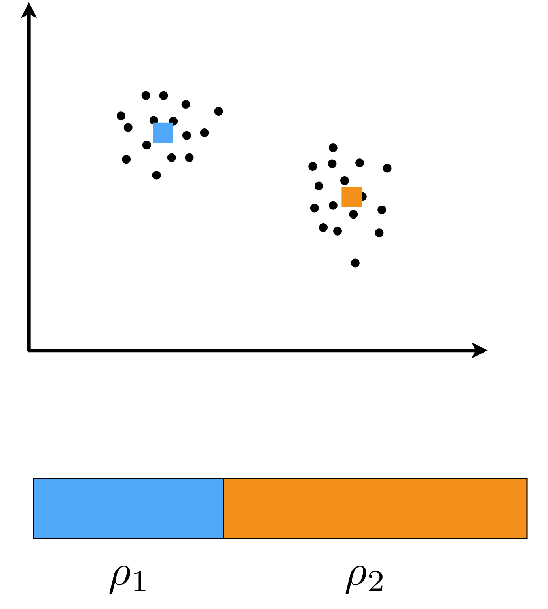
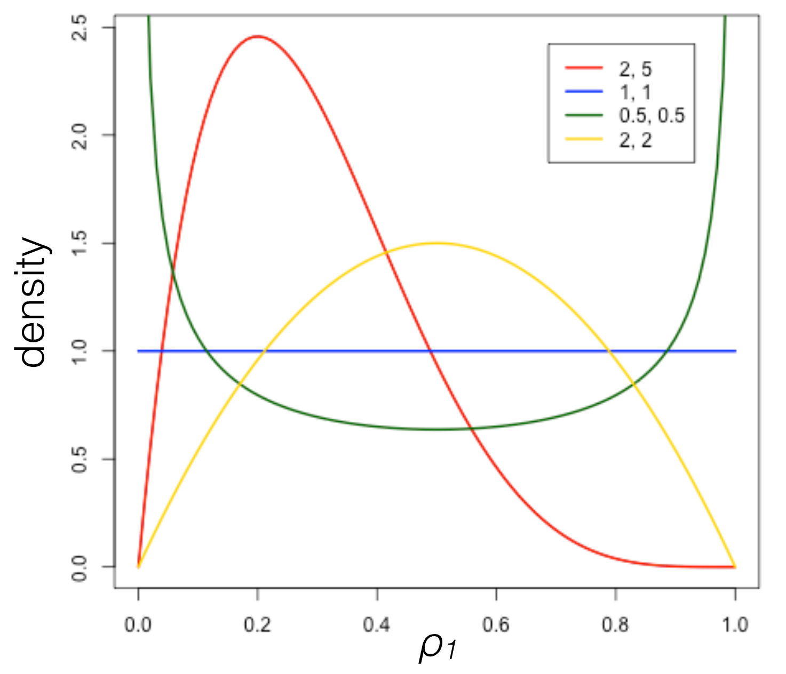
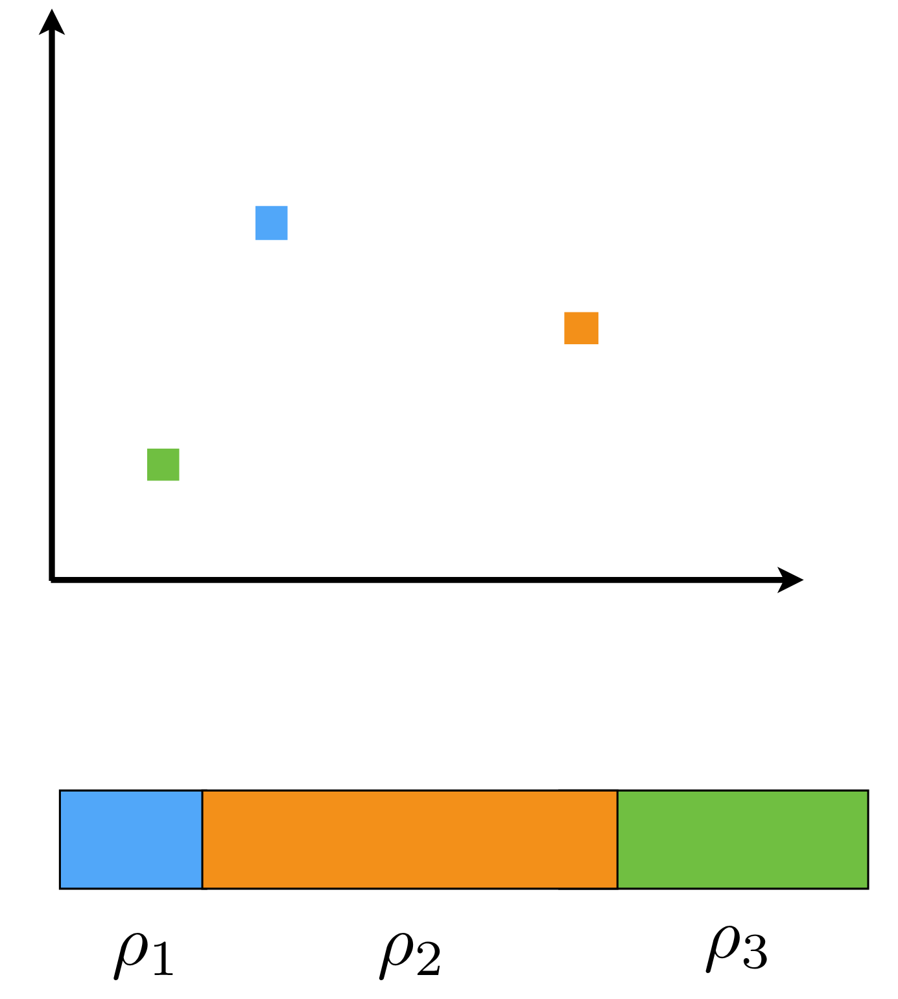
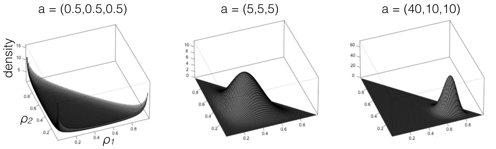

::: {.callout-note}
## Credit

The following material is based on the [Nonparametric Bayes Tutorial](https://https://tamarabroderick.com/tutorial_2016_mlss_cadiz.html) that took place in the 2016 ML the University of Cádiz in Cádiz, Spain. Which focuses primarily on the Dirichlet Process and related processes.

There is so much material on BNP and non-parametric methods out there it is hard to get started. The speaker has a [blog](https://tamarabroderick.com/blog/) and [YouTube channel](https://www.youtube.com/@tamara_broderick) with more material on this topic. 

I find that MIT Tenured Professor, Tamara Broderick's explanations are very clear and accessible. She uses simple motivating examples, she shares the basis of how she has built her intuition for the topic. Most significantly she is very enthusiastic about the BNP which I find inspiring and contagious.

I found the videos hard to follow at times, as she is talking fast (a good thing). So I watched them a number of times at my leisure. Many times I found myself surprised by things she said. But each time I checked I not only learned something new but was able to put aside some of my misconceptions. 

So while I am shamelessly  copying her material, I will try to fill in some of the gaps with my own explanations and examples.

## Nonparametric Bayes

- Bayesian Nonparametrics (BNP) = Bayesian + Nonparametric
- The Bayesian part should be familiar to us at this point. Here is how we fuse data and beliefs during an experiment:

$$ 
\underbrace{\mathbb{P}r(parameters \mid data)}_{\substack{\text{our beliefs about the params.} \\ \text{at the end of the experiment}}} \propto \underbrace{\mathbb{P}r(data \mid parameters)}_{\substack{\text{data we collected}\\ \text{in our experiment}}} \underbrace{\mathbb{P}r(parameters)}_{\substack{\text{prior beliefs about params.} \\ \text{going into our experiment}}} \qquad
$$ {#eq-bnp-bayes-theorem} 
<!-- {#eq-bnp-bayes-theorem .column-page-right} -->

- [Non-parametric is a bit of a misnomer, it does not mean we don't have parameters but rather that we reduce our restrictions on parameters]{.mark} like:
   - from independence and identically distributed items to exchangeable^[order does not matter], and 
   - from fixed and finite to a growing and unbounded i.e. a potentially infinite family of parameters

This empowers us to model more complex data and phenomena there complexity grows as data accrues.

- Some Examples:
  - Topic modeling for Wikipedia articles 
  - Classifying/Clustering Species [@jin2012simple] c.f. [DNA Bar coding Reveals Diversity of Parasitoid Wasps in Great Smoky Mountains](https://entomologytoday.org/2024/07/17/dna-barcoding-reveals-diversity-of-parasitoid-wasps-in-great-smoky-mountains)
  - Density Estimation [@Escobar1995bayesian] [@Ghosal1999posterior]
  - Survival analysis curves
  - Fitness exercises [@Fox2014MediationBrainStructure]
  - Genetics [@EWENS197287], [@hartl2006principles]
  - Health issues in newborn babies [@Saria2010IntegrationOfEarly]
  - Social networks [@Lloyd2012RandomFunctionPriors] [@Miller2009NonparametricLatent]
  - Images [@Sudderth2008SharedSegmentation]
  - Time series [@fox2011bayesian], [@fox2009sharing]

## Nonparametric Bayes {#sec-NPB-nonparametric-bayes}

Next The speaker is vehemently excited about de Finetti's theorem. This is a key theoretical motivation for BNP. And without the BNP the theorem is not that interesting or as easy to understand.

- A theoretical motivation: [De Finetti's Theorem](https://en.wikipedia.org/wiki/De_Finetti%27s_theorem)
- A data sequence is infinitely exchangeable if the distribution of any N data points doesn't change when permuted
- This is a much weaker assumption than independence and Exchangeability is the prerequisite for De Finetti's theorem:

$$
p(X_1, \ldots , X_N ) = p(X_{\sigma(1)} , \ldots , X_{\sigma(N)} )
$$ {#eq-BNP-exchangeablity}

- De Finetti’s Theorem (roughly): A sequence is infinitely exchangeable $\iff$, for all N and some distribution $P$ over parameters $\theta$,
$$
p(X_1, \ldots , X_N ) = \int_\theta \prod_{}^N p(X_n\mid\theta)P(d\theta)
$$

- Motivates:
  -  Parameters and likelihoods
  -  Priors
  -  "Nonparametric Bayesian" priors

- Note: that De Finetti's proved his theorem in 1931 but for finite exchangeability.
- In [@hewitt1955symmetric] Savage and Hewitt extended the result from finite to infinite exchangeability in 1955. 
- There were also a few other related results by Diaconis and Freedman in the 1970s.
- In [@aldous1983random] Aldous proved a more general for arrays 1983. 

## The Dirichlet Process {#sec-NPM-dirichlet-process}

### Background {#sec-BNP-dirichlet-background}

- We want to develop an intuition for the Dirichlet Process (DP). 
- According to the speaker, the DP can be viewed as the archtype of BNP models.
- Once you mastered the DP you can understand papers in this field and most other BNP models. She uses the analogy of mastering your first programming language and then you can learn other languages far more easily.
- We usually use it together with some likelihood function to build a nonparametric model. 
- Once we understand the DP we look at the closely related Chinese Restaurant Process (CRP) and the stick-breaking construction. We should then understand how these three relate to each other. (Why do we want these different processes?)
- Finally the tutorial will cover what other nonparametric processes exist and when to use them. (And I will consider if they deserve a full lectures in this course notes.)

<!--
- The Dirichlet distribution is a distribution over the K-simplex. It is a multivariate generalization of the Beta distribution.

The Dirichlet Process (DP) is a non parametric pr
 stochastic process whose sample paths are probability distributions. It is a distribution over distributions.
-->

### Generative Model {#sec-NPM-generative-model}

{.column-margin}

The DP is often used with another likelihood function to build a nonparametric model. In this case we will use it with a Finite Gaussian Mixture to build a clustering model for a set of points.

Recall our material for mixture models: we have $k=2$ components in our mixture and one way we can set  things up is to generate a component selector $z_n$ for each data point then to use it to draw the data point $x_n$ from the normal distribution associated with the selected component.

#### The Generative model as a Story:

Lets start a story: 

- Finite Gaussian mixture model (K=2 clusters)
- We start by generating a component selector $z_n$ from two clusters by drawing it from a Categorical distribution with parameters $\rho_1$ and $\rho_2$. In this case these parameters are simply the probabilities of selecting each of the two clusters and since we have two clusters $\rho_2 = 1 - \rho_1$. 
- However, we do not know these parameters, so we will be putting a prior on them.
- Next we generate the data points $x_n$ from a normal distribution with mean $\mu_0$ and covariance $\Sigma$. We assume that the data points are independent given the cluster assignments. 
- Again we don't know the means of the clusters so we will put a prior on them as well.

Actually this is a bit backwards, thinking causally we need to start at the top of the PGM plate model ((priors or hyper-priors) and work our way down.

So at the end of the slide the instructor summarizes the generative story as follows:

1. we generate the weights $\rho_1, \rho_2$ for the two clusters from a Beta distribution with parameters $\alpha_0, \beta_0$. 
2. we generate the means $\mu_1, \mu_2$ for the two clusters from a normal distribution with mean $\mu_0$ and variance $\sigma_0^2$.
3. we generate the points $x_n$ from a normal distribution with mean $\mu_{z_n}$ and covariance $\Sigma$ where $z_n$ is the cluster assignment for point $n$.

#### The Hierarchical Model for the Generative Story:

we can write this as follows:
$$
\begin{aligned}
z_n & \stackrel{iid}{\sim} \text{Categorical}(\rho_1, \rho_2) &&  \text{cluster assignments} \\
x_n & \stackrel{indep}{\sim} \mathcal{N}(\mu_0, \Sigma) && \text{data points} \\
\rho_1 & \sim \text{Beta}(\alpha_0, \beta_0) && \text{prior for weights} \\
\rho_2 & = 1 - \rho_1 && \text{since } K=2 \\
\mu_k & \stackrel{iid}{\sim} \mathcal{N}(\mu_0, \sigma_0^2), \quad k=1,2 && \text{prior for means} 
\end{aligned}
$$ {#eq-bnp-gaussian-mixture-model}

- We do not know $\mu_1 , \mu_2, \rho_1 , \rho_2$
- We assume the quantities $\Sigma, \sigma_0^2, \mu_0, \alpha_0, \beta_0$ are fixed and known to keep things simple but the instructor notes that we we could also put priors on these hyperparameters.

- Inference goal: assignments of data points to clusters, cluster parameters. 
$$ 
\mathbb{P}r(parameters \mid data) \propto \mathbb{P}r(data \mid parameters)\; \mathbb{P}r(parameters)
$$ 

### The Beta Distribution (review){#sec-NPM-beta-distribution}

{.column-margin}

\index{distribution!Beta}

We just used the Beta distribution in our generative model. We picked the Beta distribution as a prior because it is the conjugate prior for the Categorical distribution.

It turns out that the Beta distribution is a special case of the Dirichlet distribution. We need to understand it well,  as we can use it in a number of constructions of the Dirichlet Process. Once we have a basic intuition for the Beta distribution we can extend it to the Dirichlet distribution and then to the Dirichlet Process. So let us review it.

The Beta distribution is a distribution over the interval [0,1]. It is often used as a prior for probabilities. It is the conjugate prior for the Categorical distribution.

$$
\text{Beta}(\rho \mid \alpha_1, \alpha_2) = \frac{\Gamma(\alpha_1 + \alpha_2)}{\Gamma(\alpha_1)\Gamma(\alpha_2)} \rho^{\alpha_1 - 1} (1 - \rho)^{\alpha_2 - 1} 
$$

-  $\alpha_1, \alpha_2 > 0$
-  $\rho \in [0,1]$

-  Gamma function $\Gamma$
  - integer m: $\Gamma(m+1) = m!$
  - for x > 0: $\Gamma(x+1) = x\Gamma(x)$
  - What happens?
    - $a = a_1 = a_2 \to 0$
    - $a = a_1 = a_2 \to \infty$
    - $a_1 > a_2$
- Beta is conjugate to Cat

$$
\rho \sim \text{Beta}(\alpha_1, \alpha_2),\qquad z \sim \text{Cat}(\rho_1, \rho_2)
$$

$$
p(\rho_1 , z) \propto \rho_1^{\mathbb{1}_{z=1}} (1 - \rho_1 )^{\mathbb{1}_{z=2}} \rho_1^{a_1 -1} (1 - \rho_1 )^{a_2 -1}
$$

$$
p(\rho_1 , z) \propto \rho_1^{\mathbb{1}_{z=1-1}} (1 - \rho_1 )^{\mathbb{1}_{z=2}-1} \propto \text{Beta}(\rho_1 \mid a_1 + \mathbb{1}_{z=1}, a_2 + \mathbb{1}_{z=2})
$$

{.column-margin}

{.column-margin}
