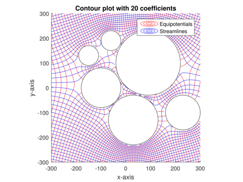

::: {.callout-note}
## Plan


1. Who are the authors and what is the book about?
1. what makes me exited when browsing the book?
1. what are the datasets (AKA as the problems) that are covered in the book?
1. Grabbing the algorithms and add any missing math excluded from them.
1. Add brief Explanation for the algorithms and the math.
1. Add the code for running the algorithms in R or Python.
1. consider add per chapter summaries and deep dives!
1. convert this to an intro when done
:::


## Overview 

Gramacy's has implemented a number of algorithms in a low level language (C++) and made them available in an R package called *laGP*. He also worked on some papers that use GPs to get better results on some real world problems. 

The book walks us through a large number (10) of algorithms even though it is not an algorithm book. Although GPs have a reputation for not scaling as they require inverting matrix of rank N (size of the data) which is $O(N^3)$ working well in low dimensions, Gramacy in his Journey video suggests that these bottlenecks can be overcome with the right algorithms which allows using them with datasets with 100,000s of data points.

Learning this reminded me of Gelman work on developing the Stan software for Bayesian inference, though if I recall correctly, he didn't code it himself but rather hired a team of programmers to do it. In contrast, Gramacy seems to have coded all the algorithms himself which is quite impressive. The book on surrogates is also a solo effort. Going though it quickly shows that it is more easy to read than some books on the subject. It also suggests that the bayesian side of GPs is more of a reinterpretation of the same algorithms rather than different field.  Boroderick's tutorial on GPs also suggests that the GPs are a means for getting an uncertainty estimate on the predictions and an uncertainty rather than a full posterior analysis. Gramacy also points out that compared to many spline and fitting methods GP's easily arise from the multivariate normal distribution. Since this was the central area in working on the DLMs in the time series course. I think it is a great opportunity to strengthen my understanding of the MVNs and their properties. 

Though he doesn't have the same clarity of McKay or the simplicity of McElereth, Gramacy makes up for it with practical expereience in hard science/engineering problems and his approachable writing that is easy to read and understand. I think that he also provides a nice exit point in the book - so that I might take care of one level of deep dives and later move to a second one involving algorithms with more hyperparameters for covariance and mean functions.  

Gramacy has the benefit of coming after Rasmussen so that he was able to build on the work of Rasmussen and others and provide a more practical and applied perspective on GPs.

The book also covers latent random fields and their applications to spatial data, which is a topic that I have been interested in for a while, particularly as it is a stepping stone towards learning about the more  general Conditional random fields.


## 4 Datasets

::: {#exm-1-rocket-booster-dynamics}
### Rocket booster dynamics

THis looks at
:::

::: {#exm-2-ocean-currents}
### Radiative shock hydrodynamics
:::

::: {#exm-3-radiative-shock-hydrodynamics}
### Predicting Satellite Drag
:::

---

Comprehensive Study Guide: Motivating Datasets for Surrogate Modeling

This study guide provides a detailed review of modern surrogate modeling technology as applied to complex, real-world datasets. The material covers four primary domains: aeronautics, radiative shock hydrodynamics, satellite positioning, and groundwater remediation.

Part 1: Short-Answer Quiz

Instructions: Answer the following questions using 2–3 sentences based on the information provided in the source text.

1. What was the primary engineering goal of the Langley Glide-Back Booster (LGBB) project?
2. How did the second version of the LGBB data improve upon the first version's limitations?
3. In the context of the CRASH experiment, what are "calibration parameters"?
4. What specific challenge does "effective laser energy" address in the CRASH simulations?
5. Why are surrogate models necessary for predicting satellite drag in real-time applications?
6. How did LANL researchers modify their satellite drag experiment to achieve a 1% Root Mean-Squared Percentage Error (RMSPE)?
7. What is the "blackbox" optimization problem defined for the Lockwood Solvent Groundwater Plume Site?
8. Describe the function of the "Objective Improving Candidate" (OIC) algorithm in the Lockwood study.
9. What distinguishes "environmental variables" from "design variables" in the TPMC satellite simulations?
10. What is the significance of the "sound barrier" (Mach = 1) in the LGBB dataset analysis?


--------------------------------------------------------------------------------


Part 2: Answer Key

1. LGBB Engineering Goal: The goal was to design a reusable rocket booster that could glide back to Earth and be cheaply refurbished rather than becoming scrap metal. NASA used computer simulations of computational fluid dynamics (CFD) to explore the booster's dynamics during atmospheric re-entry before building expensive prototypes.
2. LGBB Version Improvements: The second version replaced hand-designed grids with an adaptive, model-based sequential design using a treed Gaussian process (TGP). This approach resolved numerical instabilities found in the first version and provided high-resolution surfaces using fewer total simulations.
3. Calibration Parameters: Calibration parameters, such as the electron flux limiter and laser energy scale factor, are "knobs" in computer models used to represent unknown or uncontrollable physical constants. They allow researchers to align simulation results with observed field data by adjusting for discrepancies in heat transfer or energy scales.
4. Effective Laser Energy: This variable accounts for the discrepancy where simulated shocks are driven further down the tube than observed in field experiments for a given laser energy. It is a constructed input combining actual laser energy and a scale factor to ensure the simulation's energy flux matches physical reality.
5. Satellite Drag Surrogates: While high-fidelity TPMC simulations provide accurate drag coefficients, the calculations are too computationally expensive and slow for real-time positioning and collision avoidance. Surrogates provide a fast, approximate alternative that can be evaluated instantly to maintain satellite orbits.
6. Achieving 1% RMSPE: To reach this accuracy goal with only 1,000 data points, researchers reduced the input space by focusing on a narrow, representative band of yaw and pitch angles. This reduction increased the density of the training data within the study region, making the Gaussian process (GP) fit more precise.
7. Lockwood Blackbox Optimization: The optimization seeks to minimize the cost of operating six pump-and-treat wells while satisfying constraints that ensure contaminant levels at site boundaries remain at zero. It is "blackbox" because the internal physics of the groundwater solver are opaque, providing only outputs for given input pumping rates.
8. Objective Improving Candidate (OIC): The OIC algorithm identifies the current best valid input and then uses a search (often via rejection sampling) to find new candidates that are likely to improve the objective function. This process allows the optimizer to focus on promising regions of the input space without initially performing expensive simulation runs.
9. Variable Distinction: Design variables include scalar inputs like velocity, orientation (yaw and pitch), and temperature that describe the satellite's state. Environmental variables refer to the atmospheric chemical composition (mole fractions of species like Oxygen or Helium) at specific altitudes and positions in Low Earth Orbit.
10. Sound Barrier Significance: The region near Mach = 1 is characterized by complex and interesting physical responses, necessitating denser sampling to characterize input-output relationships. Both versions of the LGBB data show focused sampling at the sound barrier, particularly for large angles of attack, where dynamics are most volatile.


--------------------------------------------------------------------------------


Part 3: Essay Questions

Instructions: Use the themes and data points provided in the source context to develop comprehensive responses to the following prompts.

1. Data Fidelity and Complexity: Compare the two versions of the LGBB datasets. Discuss how the transition from a traditional grid-based design to an adaptive, model-based sequential design reflects the evolving needs of surrogate modeling in aeronautics.
2. The Role of Calibration and Bias: Using the CRASH dataset as a case study, explain why computer simulations often require calibration parameters and bias correction. How does the integration of field data and simulation data improve the predictive power of a meta-model?
3. Computational Scaling in Big Data: The TPMC satellite drag simulations range from small pilot studies to "Big TPM" runs involving millions of evaluations. Analyze the computational challenges of using Gaussian processes for these large datasets and discuss the role of "divide-and-conquer" or "local" approximation strategies.
4. Optimization under Constraints: Analyze the Lockwood groundwater remediation problem as a constrained optimization task. Compare the performance of traditional optimizers (like Nelder-Mead or BFGS) against stochastic searches like OICs, and discuss why a "statistical decision process" might be superior for blackbox functions.
5. Multidisciplinary Applications of Surrogates: Review the four datasets provided (LGBB, CRASH, TPMC, Lockwood) and identify common features such as limited field data, expensive simulations, and the goals of uncertainty quantification. How do these diverse domains contribute to the "anchoring" of surrogate modeling technology in the real world?


--------------------------------------------------------------------------------


##  Glossary of Key Terms

One reason I found this chapter is so exciting is the high and mighty hard science examples. However thees are not as easy to as say Intori to Statitical Learning. I took a time out to quickly educate myslef about some of the terms and here is a braeakdown of the key terms and concepts mentioned in the chapter in case you are not familiar with them. I also added some links to the relevant wikipedia pages for further reading.

AEM (Analytic Element Method)
:	A groundwater modeling and solver method used to simulate the flow and spread of contaminants in a hydrogeologic system.

APM (Additive Penalty Method)	
:   A technique used in optimization to handle constraints by adding a penalty to the objective function when constraints are violated.

BO (Bayesian Optimization)	
:   A strategy for the optimization of blackbox functions that uses a surrogate model and an acquisition function to decide where to sample next.

CFD (Computational Fluid Dynamics)	
:	A branch of fluid mechanics that uses numerical analysis and data structures to solve and analyze problems involving fluid flows.

EI (Expected Improvement)	
:   A popular acquisition function in Bayesian optimization that leverages predictive mean and variance to identify the next sample point.

FMF (Free Molecular Flow)
: A regime of fluid dynamics where the mean free path of molecules is much larger than the characteristic size of the object (common in Low Earth Orbit).

GSI (Gas-Surface Interaction)	
:   Models describing how atmospheric gases interact with the surface of a satellite, affecting drag coefficients.

LAGP (Local Approximate GP)	
:   A surrogate modeling approach that facilitates soft partitioning of the input space to make Gaussian process inference computationally efficient for large datasets.

LHS (Latin Hypercube Sample)	
:   A statistical method for generating a near-random sample of parameter values from a multidimensional distribution, often used for space-filling designs.

Mach Number
:	The ratio of the speed of an object to the speed of sound in the surrounding medium.

Nonstationary Modeling
:	A modeling approach, such as Treed Gaussian Processes, that can account for relationships between inputs and outputs that change across the input space.

RMSPE
:	Root Mean-Squared Percentage Error; a metric used to evaluate the accuracy of a surrogate model relative to the true simulation output.

Sequential Design
:	An experimental strategy where new data points are selected based on the information gathered from previous runs to maximize accuracy or reduce uncertainty.

SU (Service Unit)
:	A unit of computational effort equivalent to one CPU core-hour.

TGP (Treed Gaussian Process)
:	A nonstationary modeling tool that partitions the input space into regions and fits separate Gaussian processes to each, allowing for more flexible surface fitting.

TPMC (Test Particle Monte Carlo)	
:	A simulation method used to estimate satellite drag by tracking the trajectories of individual particles bombarding the satellite's geometry.

UQ (Uncertainty Quantification)	
:	The science of characterizing and reducing uncertainties in computational and real-world systems.

---

::: {#fig-1-AEM-solution .column-margin}


EToller, [CC BY-SA 4.0](https://creativecommons.org/licenses/by-sa/4.0), via Wikimedia Commons
:::

::: {#exm-4-groundwater-remediation}
### Groundwater remediation

Preventing migration of contaminant plumes is vital to protect water supplies and prevent disease. In *Pump-and-treat remediation*, wells are strategically placed to pump out contaminated water, purify it, and inject treated water back into the system to prevent contaminant spread.

To mitigate contamination of the Yellowstone River, at the Lockwood Solvent Groundwater Plume site in Montana, the USGS has been monitoring groundwater quality and flow since 1995. The goal is to predict the future spread of the contaminant plume and optimize the placement of pump-and-treat wells to contain it effectively.

```{mermaid}
timeline
    title History of Social Media Platform
    1986 : Polution detected
    2002 : [Matott, Rabideau, & Craig] AEM model   
         : [Mayer, Kelley, and Miller] blackbox optimization
    2005 : Remediation Plan Selected
    2011 : [Matott, Leung, and Sim] comparison
    2016 : [Gramacy et al.] surrogate model
```

The original model [cn] for this problem was an [analytic element method (AEM) model](https://en.wikipedia.org/wiki/Analytic_element_method), a physics-based model simulating groundwater flow and contaminant transport. 

The model takes six parameters for the pumping rate at each of the treatment wells and the solver seeks the minimal pumping rate that gives zero output at the two river locations.


:::

::: {.callout-important}
## Algorithm 2.0 - Rejection Sampling

**Reqire** Target density $f(x)={\frac {f_{\varpropto }(x)}{\int f_{\varpropto }(y)dy}}$, proposal density $g(x)$, constant $M$ such that $f_{\varpropto }(x)\leq Mg(x)$ for all $x$.

**Then**

1. Sample $X \sim g(x)$
2. Sample $U \sim \mathrm{Unif}(0,1)$, independently of $X$.
3. Compute likelihood ratio $W = \frac{f_{\varpropto}(X)}{g(X)}$.
4. If $W < M \times U$, **reject** $X$ and repeat from step 1.
   Otherwise, **accept** and output $X$.

**Return** A sample $X$ drawn from $f$.
:::
The algorithm will take an average of ${\frac {M}{\int f_{\varpropto }(y)dy}}$ rejections to obtain a sample. 


::: {.callout-important}
## Algorithm 2.1 - Next Objective Improving Candidate

**Assume** the search region is $B$, perhaps a unit hypercube.

**Require** input settings  $x_1, \dots, x_n$  at which the objective  $f$  and constraints  $c$  have already been evaluated.

Then

1. Find the current best valid input,  $x^\star$, that is, the input with the lowest objective value among those that satisfy the constraints:
$$
\begin{aligned}
x^\star = \mathrm{arg}\min_{i=1,\dots,n} \{ f(x_i) : c_j(x_i) \leq 0, \forall j \}
\end{aligned}
$$ {#eq-current-best}
2. Draw  $x_{n+1}$ uniformly from  $\{x \in \mathcal{B} : f(x) < f(x^\star)\}$, for example with rejection sampling.

**Return**  $x_{n+1}$, the next objective improving candidate.
:::