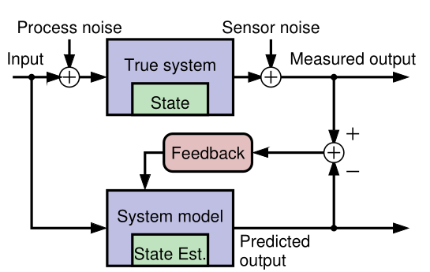

## Model-based state estimation {#sec-kf-1.1.2-model-based-state-estimation}

### What are some key Kalman-filter concepts? 

- KFs use sensed measurements and a mathematical model of a dynamic system to estimate its internal hidden state
- A **model** of the system and its state dynamics is assumed to be known.
- A system's **state** is a vector of values that completely summarizes the effects of the past on the system
- The model's state should be a twin of the system's state

::: {#exp-system-state-vector .callout-tip}
### Aircraft state vector
A system state vector might include the 

$$
\vec{state} =[ x,y,z, \alpha,\beta,\gamma, x', y', z', \alpha',\beta',\gamma' ] 
$$ {#eq-aircraft-system-state-vector}

- where:
  - $x, y, z$ are the position coordinates, 
  - $\alpha, \beta, \gamma$ are the [Euler angles](https://en.wikipedia.org/wiki/Euler_angles) representing the orientation of the aircraft,  Or more accurately the Tait–Bryan angles
    - $\alpha$ is the roll angle,
    - $\beta$ is the pitch angle,
    - $\gamma$ is the yaw angle,
  - $x', y', z'$  are the velocities in the respective directions.
  - $\alpha', \beta', \gamma'$ are the angular velocities in the respective directions.

The number of elements in the state vector is called the **state dimension** or [degrees of freedom](https://en.wikipedia.org/wiki/Degrees_of_freedom_(mechanics)).
:::

### Why do we need a model?

{#fig-kf-001 .column-margin  group="slides" width="53mm"}

{#fig-kf-002 .column-margin  group="slides" width="53mm"}

- [Generally it is neither possible nor practical to measure the **state of a dynamic system** directly.]{.mark}
- According to Laplace's view of classical mechanics if we measure the system's inputs we can  propagate those measurements through a model, updating the model's prediction of the true state.
- We make measurements that are linear or nonlinear functions of members of the state.
- The measured and predicted outputs are compared.
- The KF is an algorithm that updates the model's state estimate using this prediction error as feedback regarding the quality of the present state estimate.

### What kind of model do we assume?

- Linear KFs use discrete-time state-space models of the form:
$$
\begin{aligned}
x_{t+1} &= Ax_t + Bu_t + w_t && \text{state eqn.}\\
z_t &= Cx_t + Du_t + v_t && \text{observation eqn.}
\end{aligned}
$$ {#eq-kalman-filter-equations}

- where:
    - $x_t$ is the state vector at time $t$,
    - $u_t$ is the input vector at time $t$,
    - $z_t$ is the output vector at time $t$,
    - $A \in \mathbb{R}^{n \times n}$ is the **system matrix**,
    - $B \in \mathbb{R}^{n \times r}$ is the **input matrix**,
    - $C \in \mathbb{R}^{m \times n}$ is the **output matrix**,
    - $D \in \mathbb{R}^{m \times r}$ is the **feedforward matrix**,
    - $w_t \sim \mathcal{N}(0,Q)$ is the process noise
    - $v_t \sim \mathcal{N}(0,R)$ is the sensor noise
    - the state  equation describes how the state evolves over time,
    - the observation equation describes how the state is observed through measurements.

That too many new definitions, I feel like my hair is on fire, so here is an annotated version of the Kalman Equations:
$$
\begin{array}{rccccccl}
\overbrace{x_{t+1}}^{\text{predicted state}} 
&= \underbrace{A}_{\text{system}} 
&\overbrace{\color{red} x_t}^{\text{current state}} 
&+ 
&\underbrace{B}_{\text{input}} 
&\overbrace{\color{green} u_t}^{\text{current input}} 
&+
& \underbrace{w_t}_{\text{process noise}} \\[2ex]
\underbrace{z_t}_{\text{predicted output}} 
&= \underbrace{C}_{\text{output}} 
&{\color{red} x_t} 
&+
& \underbrace{D}_{\text{feed forward}} 
&{\color{green} u_t} 
&+
& \underbrace{v_t}_{\text{sensor noise}} 
\end{array}
$$ {#eq-kalman-filter-equations-annotated}

::: {.callout-tip collapse="true"}
### Kalman Filter v.s. NDLM and interventions

In the NDLM we see simplified versions of these equations, where $B$ and $D$ are set to zero and we don't have a current input $u_t$. 

Another major difference explained in [@petris2009dynamic] is that in a statistics settings the modeler typically knows much less about the system dynamics than users of a Kalman filter who has access to some set of differential equations that describe the system dynamics. 

In [@west2013bayesian] the authors make a big point about their models being able to handle **interventions**.

My initial impression was that there seems to be a gap in their logic regarding this and as far as I can with the absence of the input term $u(t)$ which should embody an interventions, these are supposed to be reflected via a change in the matrix $\mathbf{F}_t,\mathbf{G}_t$. However if these matrices are change every time step $t$, we don't really have a model in any useful sense. (We need to somehow come up with a different model for each time step. This is not feasible even if we have access to the differential equations that describe the system dynamics.) 

Looking deeper into the literature, I found that this kind of intervention is considered  
in [@west2013bayesian ch. 11]. In fact there is a whole chapter dedicated to 
interventions and monitoring where the authors eventually discuss arbitrary interventions.

It appears that the interventions seem to lead to the same form being used but with either an additional term for the noise or an expansion of G to incorporate an expansion of the state vector to include new parameters that if such are required.

[@prado2023time p. 154] also discusses three types of interventions but not in the same depth as the above.

1. Treating $y_t$ as an outlier
2. Increasing uncertainty at the system level by adding a second error term to the state equation.
3. Arbitrary intervention by setting the prior moments of the state vector to some specific values.

$$
\begin{array}{rccccl}
\overbrace{x_{t+1}}^{\text{predicted state}} 
&= \underbrace{G}_{\text{system}} 
&\overbrace{\color{red} x_t}^{\text{current state}} 
&+ 
& \underbrace{w_t}_{\text{process noise}} 
\\
\underbrace{y_t}_{\text{predicted output}} 
&= \underbrace{F}_{\text{output}} 
&{\color{red} x_t} 
&+
& \underbrace{v_t}_{\text{sensor noise}} 
\end{array}
$$ {#eq-NLDM-equations-annotated}

:::

### A simple example model

- Concrete example: Consider the 1-d motion of a rigid object.
  - The state comprises position $p_t$ and velocity (speed) $s_t$ :

$$
\underbrace{\begin{bmatrix} p_t \\ s_t \end{bmatrix}}_{x_t} =
\underbrace{\begin{bmatrix} 1 & \Delta t \\ 0 & 1 \end{bmatrix}}_{A}
\underbrace{\begin{bmatrix} p_{k-1} \\ s_{k-1} \end{bmatrix}}_{x_{k-1}} +
\underbrace{\begin{bmatrix} 0 \\ \Delta t \end{bmatrix} }_{B} u_{k-1} + w_{k-1}
$$ {#eq-kf-rigid-object-motion-1d-state}

  - where $\Delta t$ is the time interval between iterations $t-1$ and $t$ .
    - $u_t$ is equal to force divided by mass;
    - $w_t$ is a vector that perturbs both $p_t$ and $s_t$ .
- The measurement could be a noisy position estimate:

$$
z_t =
\underbrace{\begin{bmatrix} 1 & 0 \end{bmatrix}}_{C}
\underbrace{\begin{bmatrix} p_t \\ s_t \end{bmatrix}}_{x_t}  + v_t
$$ {#eq-kf-rigid-object-motion-1d-observations}

- Example illustrates how the state-space form can model a specific dynamic system.
- The form is extremely flexible: can be applied to any finite-dimensional linear system.

### Why do we need feedback?

- Our goal is to make an optimal estimate of $x_t$ in: @eq-kalman-filter-equations

- If we knew $x_0, w_t$, and $v_t$ perfectly, and if our model were exact, there would be no need for feedback to estimate $x_t$ at any point in time. We simply simulate the model! However, in practice:

  - [We rarely know the initial conditions]{.mark} $x_0$ exactly
  - [We never know the system or measurement noise]{.mark} $w_t, v_t$ (by definition).
  - Also, [no physical system is truly linear]{.mark} and even if one were, we would never know $A$, $B$, $C$, and $D$ exactly.

- So, simulating the model (specifically, simulating the state equation "open loop") is insufficient for robust estimation of $x_t$. 

[**open loop** - without feedback]{.column-margin}

- **Feedback** allows us to compare predicted $z_t$ with measured $z_t$ to adjust $x_t$.

### How does the feedback work?

- Discrete-time Kalman filters repeatedly execute two steps:
  1. [**Predict** the current state-vector values based on all past available data.]{.mark} E.g., a linear KF computes 
$$
\hat{x}_t^- = A \hat{x}_{t-1}^+ + B u_{t-1}
$$ {#eq-kalman-filter-prediction}

- where 
  - $\hat{x}_{t-1}^+$ is the *prediction* of $x_{t-1}$.
  - $\hat{x}_{t-1}^-$ is the *estimate* of $x_{t-1}$.  
  2. [**Estimate** the current state value by updating the prediction based on all presently available data.]{.mark} E.g., a linear KF computes 
$$
\hat{x}_{t}^+ = \hat{x}_t^- + {\textcolor{blue} {L_t}}\, (z_t - (C \hat{x}_t^- + D u_t))
$$ {#eq-kalman-filter-feedback}

- A very straightforward idea. But ...
  - What should be the *feedback gain matrix* $L_t$?
    - That is, how do we make this feedback optimal in some meaningful sense?
- Can we generalize this feedback concept to nonlinear systems?
- What if we don't know $u_t$ (as in the tracking application)?

### Summary

- [KFs use *sensed measurements* and a mathematical model of a dynamic system to estimate its internal hidden state.]{.mark}

[**Discrete--time state--space format**]{.column-margin}

- For the kind of KFs we will study, the mathematical model must be formulated in a **discrete-time state-space format**. 

- This form is very general, and can apply to nearly any dynamic system of interest.

- [KFs operate by repeatedly predicting the present state, and then updating that prediction using a measured system output to make an estimate of the state.]{.mark}

[**Gain matrix**]{.column-margin}

- [This process is *optimized* by computing an **optimal feedback gain matrix** $L_t$ at every time step that blends the prediction and the new information in the measurement.]{.mark}

- There is a lot to learn, and the next topic will present our roadmap for doing so.
