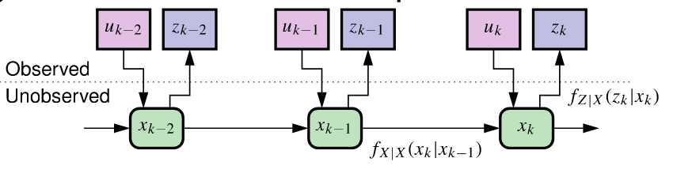
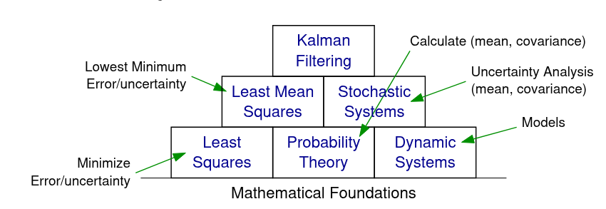

## Roadmap to this course -- context within the specialization {#sec-kf-1.1.4-roadmap}

::: {.callout-tip}
## TL-DR; -- Roadmap that can be skipped.

This section provides examples of applications that use Kalman filters. 
However, there is no new KF material, so it may be skipped if one is eager to get to the Kalman filter material.
:::

### We will need to study models

- Let's discuss the roadmap for this specialization.
- You have learned that linear KFs use models that look like:

$$
x_{k+1} = A x_k + B u_k + w_k \\
z_k = C x_k + D u_k + v_k
$$ 

- In later courses, we will generalize to a *nonlinear* state-space model form:
$$
x_{k+1} = f(x_k, u_k, w_k) \\
z_k = h(x_k, u_k, v_k)
$$

- To understand KF, you will need to understand important features of how to
    - generate, 
    - simulate, and 
    - analyze state-space models. 
- So, an important component of this “Kalman Filter Boot Camp” is to study features of linear discrete-time state-space models.

### Sequential probabilistic inference

- KF is special case of *sequential probabilistic inference* (SPI).
- Our goal is to estimate as best we can (in some sense) the
values of state vector xk given all past and present input and output measurements:
$$
\mathbb{U}_k = \{u_0, u_1, \ldots, u_k\} \qquad \mathbb{Z}_k = \{z_0, z_1, \ldots, z_k\},
$$ {#eqn-1.1.4-kf-prob-inference}

- A helpful way to think about the KF problem is in terms of conditional probabilities:

::: {#fig-kf-1.1.4-conditional-probabilities}

:::

-  The observations allow us to “peek” at what is happening in the true system. 
    - Based on observations and model, we recursively update the state estimate
- Process- and sensor-noise randomness is always present.
    - So, to understand the SPI solution (and the KF forms), we must study probability and vector random processes (week 3).

### Building blocks of Kalman filters

- The figure shows connections between the fundamental conceptual building blocks needed to support KF theory.

- As mentioned, we need to study dynamic systems (models) and probability theory; combining these we must study stochastic systems (weeks 2 and 3 of this course).

::: {#fig-kf-1.1.4-conceptual-building-blocks}

:::

- Combining probability theory and least-squares-estimation theory, you will learn concepts relating to least-mean-squares estimation (course 2).

- Finally, you will learn how to combine least-mean-squares and stochastic systems to develop the linear KF (course 2).

-  The following courses will generalize these concepts to nonlinear systems.

### Scope of the lesson materials

- It is possible to go really deep into any one of these individual areas—the more background you have the better—but our focus will be on developing methods that we can apply to real problems.

- The lessons will be primarily theoretical.

    - Ungraded (formative) and graded (summative) quizzes will test your understanding of these concepts.

    - Ungraded Coursera Labs Jupyter notebooks will allow you to experiment with code that illustrates concepts and implements KFs in Octave. 

      Often, you will use these notebooks to compute answers to ungraded and graded quizzes.
- The lessons will teach only the most important background material that you will ultimately need when developing KFs.

    - The optional textbook has much more information that can add to the richness of your experience in this course.

### Some comments to prepare you

- Be forewarned: You will see that I use different mathematical
notation from the optional textbook.

    - There are multiple conventions in common use. 

    - I choose the most compact one that is most compatible with other courses I teach.

-  Some knowledge of the Laplace, $\mathcal{z}$, and Fourier transforms is helpful to understand
certain topics covered in the lessons, but will not be critical for implementing Kalman filters and succeeding in this specialization.

- We will make extensive use of Octave (an open-source alternative to MATLAB).
    - No prior experience with Octave is necessary; I will teach what is needed.
    - However, general programming knowledge is very important (variables, procedures, conditions, loops ...).

### Summary

- You have now learned the fundamental conceptual building blocks you must master before being able to understand the details of Kalman filtering.
    
    - These include state-space dynamic systems, probability theory, stochastic systems, and least-mean squares optimization.

- You now understand the roadmap that we will follow to study these topics, and how
they fit together within the overall specialization.
    
    - Week 2 will focus on models and week 3 will focus on relevant content related to probability theory and stochastic systems.

- Course 2 will develop the linear KF in depth; Courses 3 and 4 will investigate different kinds of nonlinear KF.

- There are lots of nuances to KF theory. Our focus will be on learning the most useful forms of KF and how to apply them robustly to real problems.