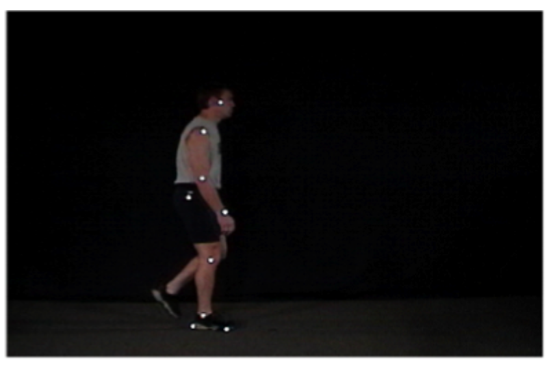
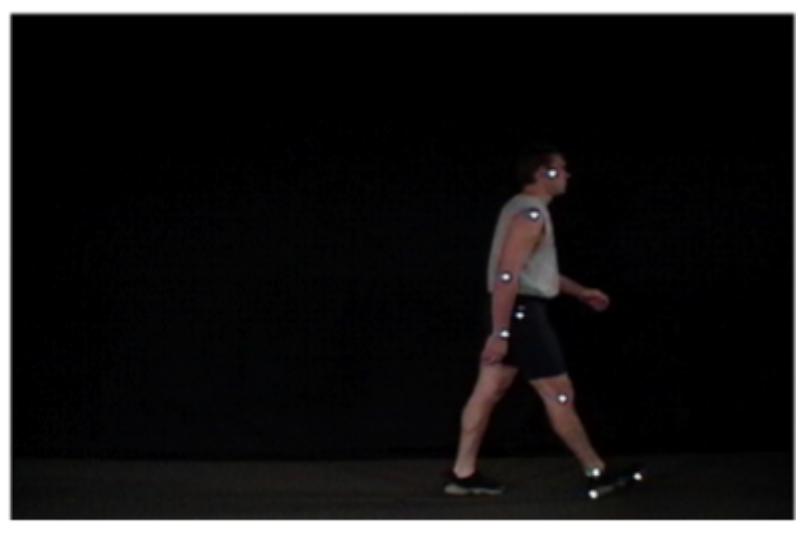
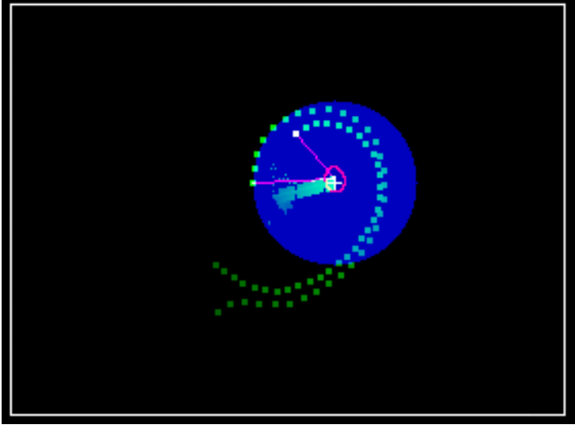
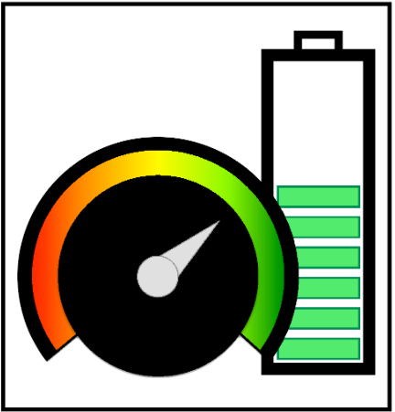
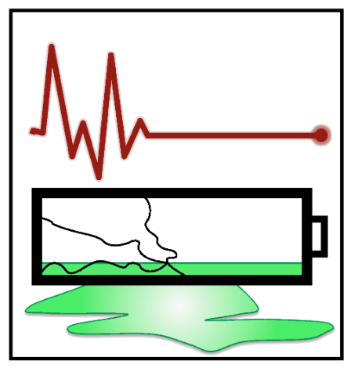
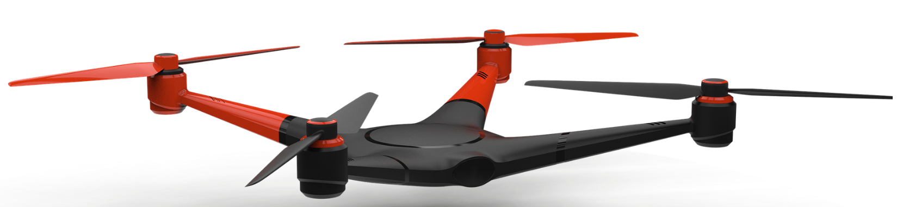

## Applications of Kalman Filters {#sec-kf-1.1.5-applications}

::: {.callout-tip}
## TL-DR; -- KF Applications.

This lesson provides examples of applications that use Kalman filters.

The instructor points out that these all require some level of re-derivation or modification of the standard KF methods to apply them to the specific problem.

This lesson does not contain any new KF material and can be skipped if you are eager to get to the Kalman filter material.
:::

### Why it is important to understand KF internals

- There are many nuances to applying KF to specific problems.
- You can “learn” KF in a week, but you can also spend an entire career exploring the breadth and depth of the subject.
- In this specialization, you will learn the most commonly used forms of KF and how to apply them robustly to real problems.
- You will learn how to develop the underlying math, which often proves to be
necessary to be able to re-derive the methods to adapt them to new situations.
    - It is not generally sufficient simply to implement a toolbox function.
    - Many applications violate the assumptions made during the standard
Kalman-filter derivation and require revising the derivation to compensate.
- The following slides share some examples that my students and I have worked on.
    - Most have required some level of mathematical and procedural modifications to the standard KF methods to apply KF to the specific problem

### Track marker dots on actors

:::{#fig-kf-1.1.5-track-markers .column-margin}

James Dennis Musick, [Target Tracking a Non-Linear Target Path Using Kalman Predictive Algorithm](http://mocha-java.uccs.edu/dossier/research/2006CASA-.pdf) MSEE Thesis, University of Colorado Colorado Springs, 2005
:::

- OBJECTIVE: Track marker dots on actors.

    - State: $(x, y)$ position and velocity of dots in frame.

    - Observation: $(x, y)$ positions of dots in frame (unlabeled).
    
    - Issues: Data association, tracking markers when dots are obscured.

### Track marker dots on actors

:::{#fig-kf-1.1.5-track-uncooperating-target .column-margin}

:::

- OBJECTIVE: Search-and-rescue (equivalently, localizing “bad guys”).

    - State: $(x, y)$ position and velocity of target.

    - Observation: Radar azimuth/elevation (and possibly also range).

    - Issues: 

        - Nonlinear relationship between measurements and position.

        - Measurements arriving to KF out-of-sequence from multiple measurement platforms.

        - Sensor fusion of these measurements.

### State estimation for nonlinear system

:::{#fig-kf-1.1.5-nonlinear-sys-state-estimation .column-margin}

:::

- OBJECTIVE: State-of-charge (SOC) estimation for lithium-ion battery cells.

- State: SOC, polarization voltages, hysteresis voltages.

- Observations: Battery-cell current, temperature, and voltage under load.

-  Issues: Lack of available simple battery model, nonlinear dynamics and measurement, dc bias in current sensor, cell-to-cell variation, efficient state estimation for large battery packs.

- c.f. the course: [Battery State-of-Charge (SOC) Estimation](https://www.coursera.org/learn/battery-state-of-charge) in the “Algorithms for [Battery Management Systems](https://www.coursera.org/specializations/algorithms-for-battery-management-systems)” Specialization on Coursera.

### Parameter estimation

:::{#fig-kf-1.1.5-nonlinear-sys-state-estimation .column-margin}

:::

- OBJECTIVE: State-of-health (SOH) estimation for lithium-ion battery cells. State: Resistance and capacity of battery cells.

- Observations: Battery-cell current, temperature, and voltage under load.

-  Issues: Parameter estimation, not state estimation; vastly different timescales of parameter and state dynamics; jointly estimating state and parameters.

- c.f. the course: [Battery State-of-Health (SOH) Estimation](https://www.coursera.org/learn/battery-state-of-health) in the [Algorithms for Battery Management Systems](https://www.coursera.org/specializations/algorithms-for-battery-management-systems) Specialization on Coursera.

### Navigation of quadrotor drone

:::{#fig-kf-1.1.5-nonlinear-sys-state-estimation .column-margin}

:::

- OBJECTIVE: Localize myself (navigation).

    - State: 3-d position, orientation.

    - Observations: Accelerations, rotations, GPS fixes.

    - Issues: Correct for drift of inertial-navigation system using GPS measurements.

### Summary 

There are often challenges when implementing KFs.

- Some level of re-derivation or modification is frequently required when applying KFs to a new application.
- But, when properly employed, there are innumerable applications.
- These include all kinds of state estimation, target tracking, parameter estimation, and navigation.
- In this specialization, you will learn how to derive and implement xKFs that are able to perform all the above kinds of tasks robustly.

### Reflection - prompts to build KF in RL agent 

I think that these are fun KF projects and would be even more fascinating as
RL projects built on to the KF state estimator. 

The KF is just a state estimator but an agent should be able to use the KF state to plan strategic actions in a larger system. 

How I got to think about this - when coding Atari agents, I was often fustrated that the agent was learning to play by looking at the pixels of the last four frames. It seemed that if only we could 

1. cluster the pixels into more meaningful clusters 
2. track and predict future positions of these clusters 
3. this might lead to an abstraction of
    - static/dynamic objects in the game. 
    - threatening vs non-threatening objects in the game. (positive v.s. negative reward objects in the game).
4. these abstraction might be more robust to changes in the game (e.g. different levels, different games) and might be more interpretable to humans. They might also be more easily mapped onto semantics that carry across many games and perhaps constitute the basis of a minimalist "world model" that could let a long running agent build priors to use in new situations, making it more generally capable.
5. The abstractions might be used to learn skill and even reward systems which would allow the agent to interact with more realistic environments where the reward system is not as well defined as
in an Atari game.
6. I think that such abstractions should enable the number of parameters that the agent needs to learn much smaller increasing the sample efficiency of learning.
7. This leads me to think of an agent architecture which
    1. uses an adaptor to try different KF with low level stats till it finds one that can predict the future states. e.g. what Martha White [called](https://webdocs.cs.ualberta.ca/~whitem/presentations/WAI_2022.pdf) a General Value Functions (GVF)
    2. Tracks the problem setting and adjusts its algorithmic approach to boot.
    3. Uses an LLM/CLIP to ground the problem setting + world model in a human-interpretable semantics. - answer the question is this environment more like (atari game, poker, go, backgammon, sokoban, soduko, a maze, etc.) and then configure it tools and algorithms accordingly. 

then the agent would be able to learn much more quickly

Here are three prompts to use in an agentic project to explore these applications further:

::: {.callout-tip}
## Prompt to Elicit dynamics + observation equations + simulator

You are helping me specify a state-space model for a Kalman Filter and a simulator for ground-truth trajectories.

### Task:

1. Propose a linear-Gaussian state space model in discrete time:
   x_{t+1} = F x_t + B u_t + w_t,   w_t ~ N(0, Q)
   y_t     = H x_t + v_t,          v_t ~ N(0, R)
   with optional control u_t.

2. Output the model in a Kalman-filter-ready form:

   - State definition (meaning + units) and dimension n
   - Observation definition and dimension m
   - Matrices: F, B (or None), H, Q, R
   - Initial prior: x0 ~ N(mu0, P0)
   - Any constraints/assumptions (stability, sampling interval dt, etc.)

3. Provide a Python simulator that generates:

   - Ground-truth states X[0:T]
   - Observations Y[0:T]
   - Controls U[0:T-1] (if used)
   - The sampled noise sequences W, V (optional, for debugging)

### Requirements:

- Use NumPy only.
- Provide a clean “ModelSpec” dict (or dataclass-like dict) containing all matrices.
- Include a reproducible RNG seed.
- Include one concrete example model (e.g., constant-velocity in 2D, or local level + trend).
- Ensure shapes are explicit and consistent.

### Output format:

1. [ModelSpec](https://github.com/openai/model_spec) (with shapes)
2. Explanation of each state component
3. Python code: build_model(), simulate(model, T, seed, control_policy=None)
4. Minimal sanity checks (shape checks + quick plot code is optional but not required).
:::

::: {.callout-tip}
## Prompt to Construct the Kalman Filter

Build a numerically stable Kalman Filter implementation for the following linear-Gaussian state space model.

Given:

- x_{t+1} = F x_t + B u_t + w_t,  w_t ~ N(0, Q)
- y_t     = H x_t + v_t,         v_t ~ N(0, R)
- x0 ~ N(mu0, P0)

Task:

1. Implement Kalman filtering (predict + update) that returns:
   - filtered means/covariances: mu_f[t], P_f[t]
   - predicted means/covariances: mu_p[t], P_p[t]
   - innovations: e[t] = y[t] - H mu_p[t]
   - innovation covariance S[t]
   - Kalman gain K[t]
   - total log-likelihood of observations under the model

2. Robustness requirements:

   - Handle missing observations: y_t can be None or contain NaNs (skip update for missing dims).
   - Use Joseph form covariance update OR a symmetric PSD-preserving update.
   - Add small jitter to S if needed (explain when/why).
   - Keep matrices symmetric: (P + P.T)/2

3. Code requirements:

   - Python + NumPy only
   - Clear typing via docstrings (dims, shapes)
   - Minimal tests using a simulated dataset (call the simulator; compare RMSE vs truth)

Output format:

1. Short explanation of the algorithm steps
2. Python code: kalman_filter(model, Y, U=None)
3. Example usage with simulated data
4. Print: final RMSE, and log-likelihood

:::

::: {.callout-tip}
## Prompt to Build an RL environment + agent that uses the KF

I want an RL environment where the agent uses a Kalman Filter as an internal belief-state estimator.

### Goal:

Construct a Gymnasium-style environment (or clean minimal equivalent if you avoid external deps) for partially observed control:
- Hidden state x_t evolves via known (or partially known) dynamics.
- Agent receives noisy observation y_t.
- Agent must choose action u_t to minimize a cost / maximize reward.
- The agent’s policy should condition on the KF belief (mu_t, P_t), not on true x_t.

### Task:

1. Define the environment:
   - state x_t (hidden), observation y_t (visible), action u_t
   - step() that:
     1. applies action u_t
     1. evolves x_{t+1}
     1. emits y_{t+1}
     1. computes reward r_t
   - reset() that samples x0 and returns y0
   - episode termination conditions

2. Integrate the Kalman Filter:
   - Provide a "BeliefWrapper" or integrated agent loop:
     1. after receiving y_t, run KF update -> (mu_t, P_t)
     1. choose action u_t = policy(mu_t, P_t)
     1. run environment step
   - Define the belief-state the policy observes:
     e.g., concat(mu_t, flatten(P_t)) or (mu_t, diag(P_t), maybe chol(P_t))

3. Provide one concrete task (pick one):
   - LQG (Linear Quadratic Gaussian) tracking/regulation
   - Target tracking with active sensing (agent controls sensor position or measurement noise)
   - Adaptive filtering: agent tunes Q/R online to maximize likelihood or minimize prediction error

4. Provide a baseline agent:
   - Either:
     1. LQR controller on mu_t (certainty-equivalence) for LQG, OR
     2. simple policy gradient / actor-critic skeleton that takes belief-state as input
   - Keep it minimal and runnable.
   - If you use PyTorch, keep it optional; otherwise give a pure-NumPy baseline.

### Output format:

1. Environment spec (dims, reward, termination)
2. Python code for env + KF-belief loop
3. Baseline agent code
4. Tiny training/evaluation loop that prints average return and a sanity-check metric (tracking RMSE).
:::
