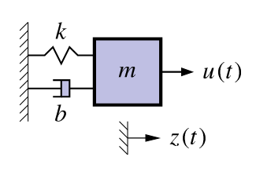

## What is a state-space model and why do I need to know about them {#sec-kf-1.2-example-of-a-continuous-time-state-space-model}

### Example of a continuous-time state-space model

::: {#fig-kf-1.2.1-1 .column-margin  group="slides" width="53mm"}

block diagram of a continuous-time state-space model for a damped oscillator. The state is $x(t)$, the input is $u(t)$, and the output is $z(t)$. The process noise is $w(t)$ and the sensor noise is $v(t)$.
:::

- Representation of the dynamics of an nth-order system as a first-order differential equation in an n-vector called the *state*.
  - n coupled first-order equations.
- Classic example: Second-order equation of motion

$$
\begin{aligned}
m\ddot{z}(t) &= u(t) - b \dot{z}(t) -k z(t) \\
\ddot{z}(t) &=   \frac{1}{m} u(t) - \frac{b}{m} \dot{z}(t) -\frac{k}{m} z(t) \\
\end{aligned}
$$ {#eq-damped-oscillator-mechanics}

- where:
  - $m$ is the mass,
  - $z(t)$ is the position of the mass at time $t$,
  - $\dot{z}(t)= \frac{d z(t)}{dt}$ is the velocity of the mass at time $t$,
  - $\ddot{z}(t) = \frac{d^2 z(t)}{dt^2}$ is the acceleration of the mass at time $t$,
  - $k$ is the spring constant,
  - $b$ is the damping coefficient,

- Define a (non-unique) state vector:

$$
x(t) = \begin{bmatrix} z(t) \\ \dot{z}(t) \end{bmatrix}, \quad \therefore \quad \dot{x}(t) = \begin{bmatrix} \dot{z}(t) \\ \ddot{z}(t) \end{bmatrix} = \begin{bmatrix} \dot{z}(t) \\ \frac{u(t) - b \dot{z}(t) - kz(t)}{m} \end{bmatrix}
$$

### Example in continuous-time state-space form

- So far, we have:

$$
\dot{x}(t) = \begin{bmatrix} z(t) \\ \dot{z}(t) \end{bmatrix} = \begin{bmatrix} \dot{z}(t) \\ \frac{u(t) - b \dot{z}(t) - kz(t)}{m} \end{bmatrix}
$$

- We can rewrite this as $\dot{x}(t) = Ax(t) + Bu(t)$ where $A$ and $B$ are constant matrices.

$$
\dot{x}(t) = \begin{bmatrix} z(t) \\ \dot{z}(t) \end{bmatrix} =  \underbrace{\begin{bmatrix} \phantom{0} & \phantom{0} \\ \phantom{0} & \phantom{0}\end{bmatrix}}_{A} x(t) + \underbrace{\begin{bmatrix} \phantom{0} & \phantom{0} \\ \phantom{0} & \phantom{0} \end{bmatrix}}_{B} u(t) 
$$

- Complete the model by computing $z(t) = Cx(t) + Du(t)$ where $C$ and $D$ are constant matrices.

$$
C = \begin{bmatrix} \phantom{0} & \phantom{0} \\ \phantom{0} & \phantom{0} \end{bmatrix} \qquad 
D = \begin{bmatrix} \phantom{0} & \phantom{0} \\ \phantom{0} & \phantom{0} \end{bmatrix}
$$ 

### Standard state-space model form

- Standard form for continuous-time linear state-space model:

$$
\begin{aligned}
\dot{x}(t) &= Ax(t) + Bu(t) + w(t) \\ 
z(t) &= Cx(t) + Du(t) + v(t)
\end{aligned}
$$ {#eq-state-space-model}

- where 
  - $u(t)$ is the known input, 
  - $x(t)$ is the state, 
  - $A$, $B$, $C$, $D$ are constant matrices.

- Convenient way to express dynamics (matrix format great for computers). 
- The first equation is called the **state equation** or the **process equation**. 
  - Note that this is the only equation that evolves over time (since it is a first-order vector ODE that integrates the right-hand side to find $x(t)$). 
  - So, this equation summarizes the *dynamics* of the model. 
- The second equation is called the **output equation** or the **measurement equation**. 
  - It is a static linear combination of variables known at time $t$.

### What is the system state vector?

---

- Standard form for continuous-time linear state-space model:
$$
\begin{aligned}
\dot{x}(t) &= Ax(t) + Bu(t) + w(t) \\ 
z(t) &= Cx(t) + Du(t) + v(t)
\end{aligned}
$$ 

---

 - We think of the system state at time $t_0$ as a minimum set of information at $t_0$ that, together with input $u(t)$, $t \ge t_0$, uniquely determines system behavior for all $t \ge t_0$.
  - State variables provide access to what is going on inside the system.  
  - The state has dimensions $x(t) \in \mathbb{R}^n$, so $A \in \mathbb{R}^{n \times n}$ and $w(t) \in \mathbb{R}^n$.
- Note that in principle we can solve the state equation numerically,

$$
x(t) = x(0) + \int_0^t A x(\tau) + B u(\tau) + w(\tau) d\tau \qquad (\text {integral form})
$$

- but it will usually be more convenient to keep the equation in differential form.

### What are the output and inputs?

---

- Standard form for continuous-time linear state-space model:
$$
\begin{aligned}
\dot{x}(t) &= Ax(t) + Bu(t) + w(t) \\ 
z(t) &= Cx(t) + Du(t) + v(t)
\end{aligned}
$$ 

---

- The model *output* is $z(t) \in \mathbb{R}^m$. This is the measurement we make.
-  There are three *input signals* to the model: $u(t)$, $w(t)$, and $v(t)$.
- We consider $u(t) \in \mathbb{R}^r$ to be **a deterministic input**, i.e. we  we know its value exactly at all times.
  - Based on the size of $u(t)$, we infer that $B \in \mathbb{R}^{n \times r}$.
  - The deterministic input causes $x(t)$ to evolve over time in different ways,
depending on its values.
  - It also influences the output via the $D$ term

### What are the random (stochastic) inputs?

---

- Standard form for continuous-time linear state-space model:
$$
\begin{aligned}
\dot{x}(t) &= Ax(t) + Bu(t) + w(t) \\ 
z(t) &= Cx(t) + Du(t) + v(t)
\end{aligned}
$$ 

---

- The model has two random input signals: $w(t)$ and $v(t)$.
- They are random in the sense that we assume that we never know their values
exactly.
  - We have already seen that $w(t) \in \mathbb{R}^n$; if $z(t) \in \mathbb{R}^m$, then $v(t) \in \mathbb{R}^m$ also.
- The $w(t)$ signal is **process noise**. Note that it affects the dynamics of the model by making direct changes to the evolution of $x(t)$.
- The $v(t)$ signal is **sensor noise**. Note that it does not affect the dynamics of the model; it only affects the measurement $z(t)$.
- Systems having noise inputs $w(t)$ and $v(t)$ are considered in detail in week 3

### What are the matrices called?

---

- Standard form for continuous-time linear state-space model:
$$
\begin{aligned}
\dot{x}(t) &= Ax(t) + Bu(t) + w(t) \\ 
z(t) &= Cx(t) + Du(t) + v(t)
\end{aligned}
$$ {#eq-state-space-model-standard-form}

---

- $A \in \mathbb{R}^{n \times n}$ is the **system matrix** which models the evolution of the state in the absence
of input. 
- $B \in \mathbb{R}^{n \times r}$ is the **input matrix** which defines how linear combinations of $u(t)$ impact the
evolution of the state. 
- $C \in \mathbb{R}^{m \times n}$ is the **output matrix** which defines how the output depends on linear
combinations of states. 
- $D \in \mathbb{R}^{m \times r}$ is the **feed--forward** or **feed--through) matrix** which models how the output depends on linear combinations of the input (instantaneously). 
- Time-varying systems have $A$, $B$, $C$, $D$ that change with time.

### Why do you need to know about them?

- It can be of vital interest to know the state of the system, but
we usually cannot measure it directly.
-  Instead, we can measure $u(t)$ and $z(t)$, and although we cannot measure the
random signals $w(t)$ and $v(t)$, we can model some of their critical attributes.
-  This enables us to make methods to estimate $x(t)$ based on what we measure and
what we model.
-  Kalman filters are (in some cases optimal) estimators of $x(t)$
   - The derivation and implementation of the KF depends on modeling the system in
state-space form and having knowledge of the model $A$, $B$, $C$, and $D$ matrices.
   - This is why we care!

### Summary

- [State-space models are a compact representation of an n^^th^^-order linear system in terms of a 1st-order vector ODE.]{.mark}
- The standard form for linear continuous-time state-space models is  @eq-state-space-model-standard-form

- We have learned the names of the equations, the names of the matrices, and the
names of the signals (and what they all mean).
- We have seen one example of a model in state-space form; 
- Next, we shall look at three other important general models.

