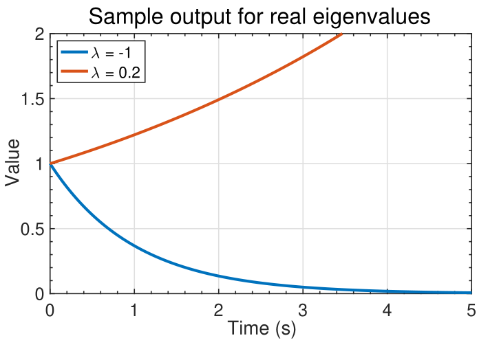
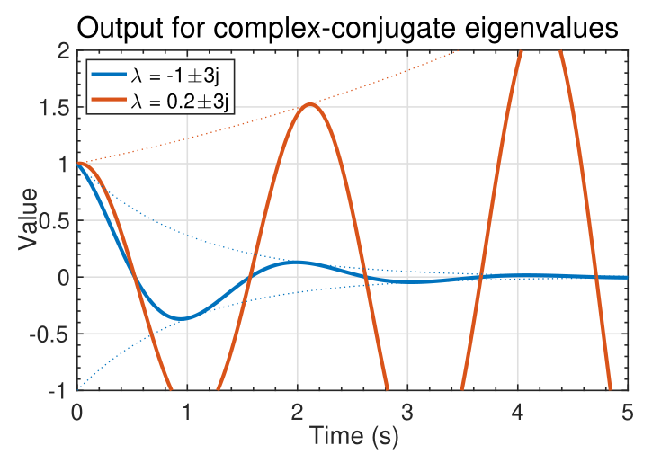
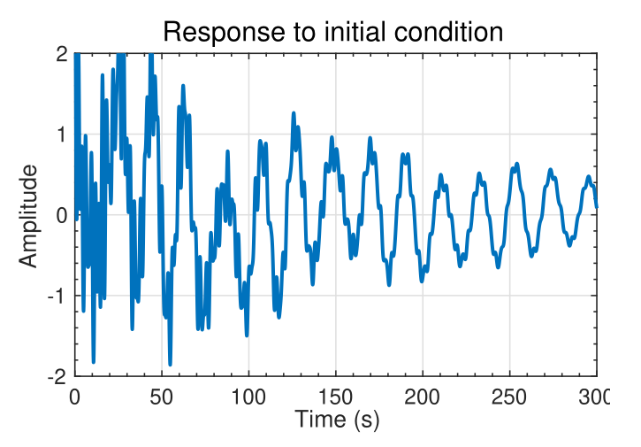
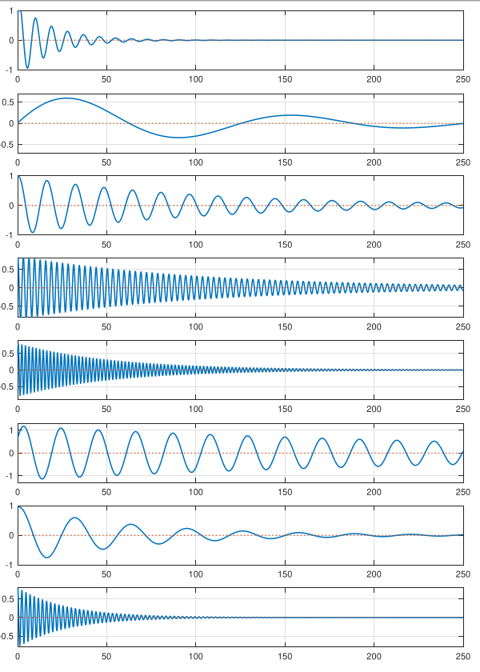

## Illustrating the time-domain response {#sec-kf-1.2.4-time-domain-response}

### Deconstructing the matrix exponential

- Have seen the key role of $e^{At}$ in the solution for $x(t)$.
- Impacts the system response, but need more insight.
- Consider what happens if the matrix A is diagonalizable, that is, there exists a
matrix $T$ such that $T^{-1}AT = \Delta$ is diagonal. Then,

$$
\begin{aligned}
e^{At} &= I + At + \frac{1}{2!} A^2t^2 + \frac{1}{3!} A^3t^3 + \cdots \\ 
       &= I + T \Delta T^{-1}t + \frac{1}{2!}T \Delta^2 T^{-1}t^2 + \frac{1}{3!}T \Delta^3 T^{-1}t^3 + \cdots \\ 
       &= T \left( I + \Delta t + \frac{1}{2!} \Delta^2 t^2 + \frac{1}{3!} \Delta^3 t^3 + \cdots \right) T^{-1} \\ 
       &= T e^{\Delta t} T^{-1}
\end{aligned}
$$

and

$$
e^{\Delta t} = \text{diag} \left( e^{\lambda_1 t}, e^{\lambda_2 t}, \ldots, e^{\lambda_n t} \right)
$$

### How to find the transformation matrix

- Much simpler form for the exponential, but how to find  $T, \Delta$ ?
- Write $T^{-1}AT = \Delta$ as $T^{-1}A = \Delta T^{-1}$ with

$$
T^{-1} = \begin{bmatrix}
w_1^T \\
w_2^T \\
\vdots \\
w_n^T
\end{bmatrix}
\qquad w^T_j \text{ are the rows of } T^{-1}
$$

- We have: $w^T_i A = \lambda_i w^T_i$; so $w_i$ is a left eigenvector of $A$. 
- Can also write $T^{-1}AT = \Delta$ as $AT = \Delta T$ with 

$$
T = \begin{bmatrix} v_1 & v_2 & \cdots & v_n \end{bmatrix}
$$

i.e $v_j$ are the columns of $T$. 
   - We have $Av_i = \lambda_i v_i$, so $v_i$ is a right eigenvector of $A$. Also, since $T^{-1}T = I$, we have that $w^T_i v_j = \delta_{i,j}$

### How the deconstruction simplifies things 

So $T$ comprises the eigenvectors of $A$. How does this help?

$$
e^{At} = Te^{\Delta t} T^{-1} 
= \begin{bmatrix} v_1, v_2, \ldots, v_n \end{bmatrix}
\begin{bmatrix}
e^{\lambda_1 t} & 0 & \cdots & 0 \\
0 & e^{\lambda_2 t} & \cdots & 0 \\
\vdots & \vdots & \ddots & \vdots \\
0 & 0 & \cdots & e^{\lambda_n t}
\end{bmatrix}
\begin{bmatrix} w_1^T \\ w_2^T \\ \vdots \\ w_n^T \end{bmatrix}
= \sum _{}^n e^{\lambda_i t} v_i w_i^T
$$

- Very simple form, which can be used to develop intuition about dynamic response:

$$
x(t) = e^{At} x(0) =T e^{\Delta t} T^{-1} x(0) = \sum _{}^n e^{\lambda_i t} v_i w_i^T x(0).
$$

- Notice that the only time-varying components are $e^{\lambda_i t}$ , which are then multiplied by constant matrices so that the states are linear combinations of $e^{\lambda_i t}$ .

### Visualizing $e^{\lambda_i t}$

{#fig-kf-016 .column-margin  group="slides" width="53mm"}

{#fig-kf-017 .column-margin  group="slides" width="53mm"}

- The signal $e^{\lambda_it}$ can take on several different characteristics,
as shown in the figures below.
- If $\lambda_i$ is real, we observe a smooth monotonically growing or decaying signal.
- If $\lambda_i$ occur in complex-conjugate pairs, the output is of the pair is of the form $e^{\lambda_i t} \cos(\lambda_i t)$ : a cosine with an exponential 
"envelope."

### An example to illustrate the complexity

{#fig-kf-018 .column-margin  group="slides" width="53mm"}

- Consider again: $\sum _{i=1}^n e^{\lambda_i t} v_i (w^T_i x(0))$
- The state $x(t) = e^{At} x(0) =T e^{\Delta t} T^{-1} x(0) = \sum _{}^n e^{\lambda_i t} v_i w_i^T x(0)$ is a linear combination of the modes $e^{\lambda_i t} v_i$.
- The left eigenvectors $w_i^T$ decompose the initial state $x(0)$ into modal coordinates $w^T_i x(0)$.
- The modes $e^{\lambda_i t}$ propagate the modal components forward in time.
- The output $y(t) = C x(t)$ is
- Can be expressed as a linear combination of modes: $v_i e^{\lambda_i t}$. 
- Left eigenvectors decompose $x(0)$ into modal coordinates $w^T_i x(0)$. 
- $e^{\lambda_i t}$ propagates mode forward in time. 

- EXAMPLE: Consider a specific system with $x(t) \in R^{16 \times 1}; \dot{y}(t) \in R (16-state, 1-output):Px(t) = Ax(t)$
  $\dot{y}(t) = C x(t)$ 
-  A lightly damped system, for which typical output to initial conditions is shown. 
- Waveform is complicated. Appears random

### Now  we see the underlying simplicity

{#fig-kf-019 .column-margin  group="slides" width="53mm"}

- However, the solution can be decomposed into much simpler modal components.
- The waveforms to the left show $e^{\lambda_i t}$ for complex-conjugate pairs $\lambda_i,\lambda_i^*$ summed together.
-  All are decaying sinusoids with different
magnitudes, frequencies, and phase shifts.
- When summed together, the result appears complicated; but the individual components of the response are simple.

### Summary

- [The matrix exponential is key to understanding the response of a state-space model.]{.mark}
- As it's been a while since I saw the matrix exponent, it's worthwhile to refresh my intuition regarding what it looks like.^[Actually this is the first time I see the matrix exponential being used in an application]
- You have learned that we can usually write $e^{At} = T e^{\Delta t} T^{-1}$, where the columns of $T$ are the eigenvectors of $A$.
-  All the dynamics are contained in $e^{\Delta t}$ , which turn out to be the standard scalar exponentials of (possibly complex) $\lambda_i t$ terms.
- So, the matrix exponential is a linear sum of exponentially-enveloped sinusoids.
- The frequencies of the sinusoids are the eigenvalues of $A$. The eigenvectors specify the relative weighting of each component to the overall output.

