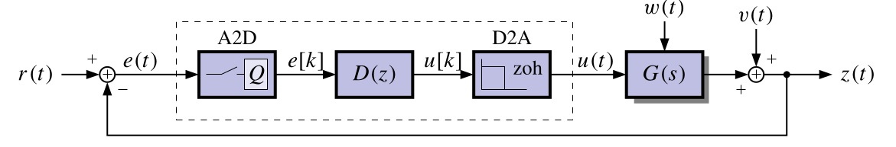
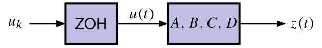

## Converting continuous-time state-space models to discrete-time {#sec-kf-1.2.5-continuous-to-discrete}

::: {.callout-tip collapse="true"}
### Questions {.unnumbered}

Here are question to consider as we learn how to convert continuous-time state-space models to discrete-time state-space models:

- What is the difference between continuous-time and discrete-time state-space models?
- which matrix are the same for continuous-time and discrete-time state-space models?
- for the rest how do we convert continuous-time state-space models to discrete-time state-space models?
- any shortcuts to remember?
:::

### Discrete-time state-space models

- Computer monitoring of real-time systems requires analog-to-digital (A2D) and digital-to-analog (D2A) conversion

{#fig-kf-020  group="slides"}

- Linear discrete-time systems can also be represented in state-space form:

$$
\begin{aligned}
x_{t+1} &= A_dx_t + B_du_t + w_t && \text{state eqn.}\\
z_t &= C_dx_t + D_du_t + v_t && \text{observation eqn.}
\end{aligned}
$$ {#eq-kalman-filter-discrete-time-state-space-model}

- The subscript **d** emphasizes that, in general, the $A$, $B$, $C$ and $D$ matrices are different for the same discrete-time and continuous-time system.
- The  **d** subscript will usually be dropped as it can be interpreted from the context.

### Time (dynamic) response of discrete-time models

The full solution, via induction from $x_{t+1} = A_d x_t + B_d u_t + w_t$, is:

$$
x_{t} = A_d^t x_0 + 
\underbrace{\sum_{j=0}^{t-1} A_d^{t-j-1} B_d u_j }_{\text{convolution}}
$$ {#eq-kalman-filter-discrete-time-state-space-model-solution}

Since $z_t = C_d x_t + D_d u_t$, we also have:

$$
z_t= 
\underbrace{C_d A_d^t x_0}_{\text{initial response}}+
\underbrace{\sum_{j=0}^{t-1} C_d A_d^{t-j-1} B_d u_j }_{\text{convolution}} 
\underbrace{+ D_d u_t}_{\text{feed-through}}
$$ {#eq-kalman-filter-discrete-time-state-space-model-output}

- Comparing with the *continuous-time solution*, 
   - $e^{At}$ has been replaced by $A_d^t$ and 
   - integrals have been replaced by summations

Note: we wont cover the proof by induction and these are covered in Linear Systems Theory.

<!-- TODO: find an actual reference for this proof by induction. -->

### Converting plant dynamics to discrete time (1)

- Combine the dynamics of the zero-order hold and the plant.

{#fig-kf-021  group="slides"}

- Recall that the continuous-time state dynamics of the plant are:
$$
\dot{x} = Ax(t) + Bu(t)
$$

- Evaluate $x(t)$ at discrete times. Recall also the solution for $x(t)$:

$$
x(t) =  \int_0^t e^{A(t-\tau)} B u(\tau) d\tau
$$

$$
x_{t+1}(t) = x((t+1)\Delta t) = \int_0^{(t+1)\Delta t} e^{A((t+1)\Delta t-\tau)} B u(\tau) d\tau
$$

### Converting plant dynamics to discrete time (2)

- We break up the integral into two pieces:

$$
\begin{aligned}
x_{k+1}(t) &= \int_0^{k\Delta t} e^{A((k+1)\Delta t-\tau)} B u(\tau) d\tau \\
&= \int_0^{k\Delta t} e^{A((k+1)\Delta t-\tau)} B u(\tau) d\tau  + \int_{k\Delta t}^{(k+1)\Delta t} e^{A((k+1)\Delta t-\tau)} B u(\tau) d\tau \\
&= \int_0^{k\Delta t} e^{A\Delta t}e^{A((k)\Delta t-\tau)} B u(\tau) d\tau  + \int_{k\Delta t}^{(k+1)\Delta t} e^{A((k+1)\Delta t-\tau)} B u(\tau) d\tau \\
&= e^{A\Delta t}x(k\Delta t) + \int_{k\Delta t}^{(k+1)\Delta t} e^{A((k+1)\Delta t-\tau)} B u(\tau) d\tau 
\end{aligned}
$$

The first integral has become $A_d \times x(k \Delta t)$
The second will become $B_d \times u(k \Delta t)$ after a little more work

### Converting plant dynamics to discrete time (3)

- In the remaining integral, note that $u(\tau)$ is assumed to be constant from $k\Delta t$ to $(k+1)\Delta t$; and equal to $u(k\Delta t)$.
- We evaluate the integral via change of variables. 
   - Let $\sigma = (k+1)\Delta t - \tau$, 
   - $\tau = (k+1)\Delta t - \sigma$, and
   - $d\tau = -d\sigma$.

$$
\begin{aligned}
x_{k+1} & = e^{A\Delta t}x(k\Delta t) + \int_{k\Delta t}^{(k+1)\Delta t} e^{A((k+1)\Delta t-\tau)} B u(\tau)\; d\tau \\
&= e^{A\Delta t}x(k\Delta t) + \left [\int_{(k+1)\Delta t}^{\Delta t} e^{A\sigma} B\; d\sigma \right ] u(k\Delta t)\\
&= \underbrace{ e^{A\Delta t}}_{A_d}\; x_k + 
   \underbrace{ \left [\int_{(k+1)\Delta t}^{\Delta t} e^{A\sigma} B\; d\sigma \right ] u_k }_{B_d} 
\end{aligned}
$$

### Computing $A_d, C_d$, and $D_d$

- Summarizing to this point, we have a discrete-time state-space
representation from the continuous-time representation:
$$
x_{k+1} = A_d x_k + B_d u_k
$$

- where
  - $A_d = e^{A\Delta t}$ and
  - $B_d = \int_0^{\Delta t} e^{A(\Delta t-\sigma)} B d\sigma$.
- Similarly, we have: $z_k = C_d x_k + D_d u_k$.
- where
  - $C_d = C$ and
  - $D_d = D$.
- [There is no conversion for the $C$ and $D$ matrices,]{.mark}
- [The conversion for $A$ is straightforward via the matrix exponential]{.mark} $A_d = e^{A\Delta t}$.
- If Octave, we can type in: `Ad = expm(A*dT)`.
- Otherwise, we'll need to compute $e^{A\Delta t} = \mathcal{L}^{-1}\left[(sI - A)^{-1}\right]\Big|_{t = \Delta t}$

### Computing $B_d$

- Now we focus on computing $B_d$ . Recall that:
$$
\begin{aligned}
B_d &= \int_0^{\Delta_t} e^{A(\Delta_t-\sigma)} B d\sigma \\
    &= \int_0^{\Delta_t} \left( I + A(\sigma) + \frac{1}{2!}A^2(\sigma)^2 + \cdots \right) B d\sigma \\
    &= \int_0^{\Delta_t} \left( I + \Delta t + \frac{1}{2!}(\Delta t)^2 + \cdots \right) B d\sigma \\
    &= \left( I + \Delta t + \frac{1}{2!}(\Delta t)^2 + A^2 \frac{1}{2!}(\Delta t)^3 + \cdots \right) B \\
    &= A^{-1}(e^{A\Delta_t} - I)B  \\
    &= A^{-1}(A_d - I)B.
\end{aligned}
$$

- If $A$ is invertible, this method works nicely!
- Otherwise, we will need to perform the integral in the first line manually.
- Also, in Octave, `[Ad,Bd]=c2d(A,B,dT)`

### Summary

- Computer monitoring of physical systems requires A2D and D2A conversion.
- The system that is “seen” by the computer is a discrete-time system, and must be
represented by a discrete-time state-space model:

$$
\begin{aligned}
x_{t+1} &= A_dx_t + B_du_t + w_t && \text{state eqn.}\\
z_t &= C_dx_t + D_du_t + v_t && \text{observation eqn.}
\end{aligned}
$$

- Generally, the discrete $A$, $B$, $C$ and $D$ matrices differ from their continuous-time counterparts.
- We have learned to convert from the continuous $A$, $B$, $C$ and $D$ matrices to the discrete-time $A_d$, $B_d$, $C_d$ and $D_d$ matrices.
- Next we will see some examples of converting continuous-time to discrete-time and of simulating discrete-time state-space models.

