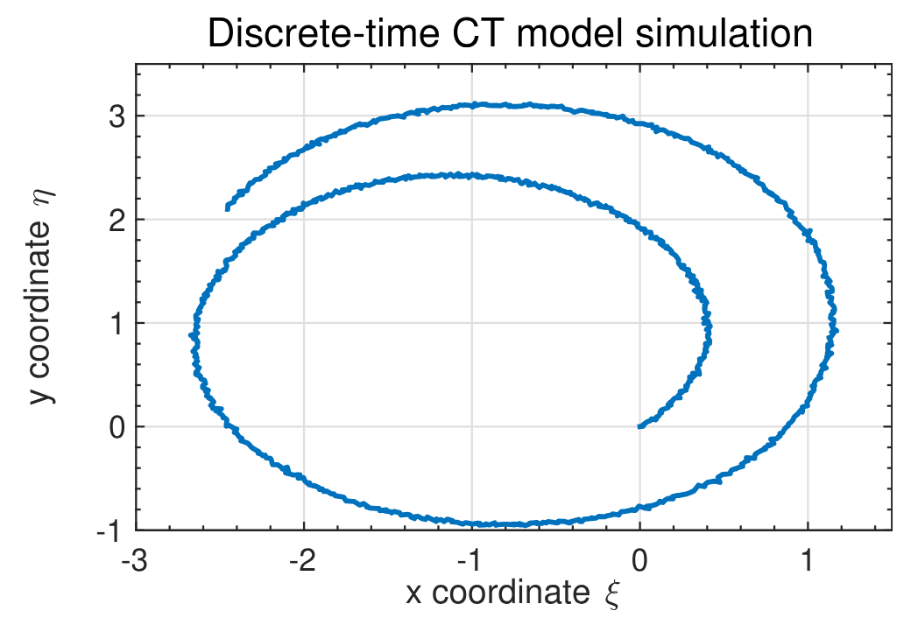

```{r}
#| label: setup-octave
#| include: false

knitr::knit_engines$set(octave = function(options) {
  code <- paste(options$code, collapse = "\n")

  cmd <- Sys.which("octave-cli")
  if (cmd == "") cmd <- Sys.which("octave")
  if (cmd == "") stop("Octave not found on PATH (octave-cli/octave).")

  # write chunk to a temp .m file (avoids --eval quoting issues entirely)
  f <- tempfile(fileext = ".m")
  on.exit(unlink(f), add = TRUE)

  # fail-fast + useful error message
  wrapped <- paste0(
    "try\n",
    code, "\n",
    "catch err\n",
    "  disp(err.message);\n",
    "  exit(1);\n",
    "end\n"
  )
  writeLines(wrapped, f)

  args <- c("--quiet", "--no-gui", "--no-window-system", f)
  out <- system2(cmd, args = args, stdout = TRUE, stderr = TRUE)

  status <- attr(out, "status")
  if (!is.null(status) && status != 0) stop(paste(out, collapse = "\n"))

  knitr::engine_output(options, code, paste(out, collapse = "\n"))
})
```

```r
#| label: setup
#| include: false

knitr::knit_engines$set(octave = function(options) {
  code <- paste(options$code, collapse = "\n")

  # wrap code so multi-line works reliably under --eval
  # (also prevents accidental early termination)
  wrapped <- paste0("try; ", code, "; catch err; disp(getfield(err,'message')); exit(1); end;")

  cmd  <- Sys.which("octave-cli")
  if (cmd == "") cmd <- Sys.which("octave")  # fallback
  if (cmd == "") stop("Octave not found on PATH (octave-cli/octave).")

  args <- c("--quiet", "--no-gui", "--eval", wrapped)

  out <- system2(cmd, args = args, stdout = TRUE, stderr = TRUE)

  # If Octave errored, surface it as a knitr error
  status <- attr(out, "status")
  if (!is.null(status) && status != 0) {
    stop(paste(out, collapse = "\n"))
  }

  # Return output as verbatim text (knitr will render it nicely)
  knitr::engine_output(options, code, paste(out, collapse = "\n"))
})
```

## How do I simulate a discrete-time state-space model? {#sec-kf-1.2.6-simulating-discrete-time-models}

### Simulating discrete-time systems

- When simulating discrete-time state-space models, we have (at least) two options.
   - There is a direct approach where we write the simulation code ourselves;
   - Also, Octave has two functions in its `control` package that help us simulate these
models easily. 
      - As with continuous-time models, the first of these is `ss`, which creates a state-space object from $A$, $B$, $C$, and $D$ matrices. 
      - The second is `lsim`, which simulates a state-space object for given input
conditions and an optional initial state.
- This lesson will show examples of both approaches, applied to the *NCP*, *NCV*, and *CT* models that were introduced for continuous-time simulations in Lesson 1.2.2.
- But first, we need to convert these continuous-time state-space models to
equivalent discrete-time models.

### Converting the nearly-constant-position model

- We might be interested to simulate a discrete-time version of the continuous-time nearly-constant-position model.
- Recall that in continuous time, the 2-d NCP model is^[We are treating random input $w(t)$ in the same way we have discussed treating deterministic input $u(t)$ here. As you will learn next week, this assumption is somewhat incorrect, but is "okay for now."] :

$$
\begin{aligned}
\dot x(t) &= 0_{2 \times 2} x(t) + I_2 w(t) \\
z(t) &= x(t) + v(t)
\end{aligned}
$$

In discrete time, we must then have (where ĩt is the sample period):

$$
\begin{aligned}
x_{k+1} &= e^{0\Delta t} x_k + \left( \int_0^{\Delta t} e^{0\sigma} d\sigma \right) I w_k \\
z_{k} &= x_k + v_k
\end{aligned}
$$


### Scaled discrete-time NCP model

- To compute $A_d$ , note that $e^{0\Delta t} = I$, which is perhaps most
easily confirmed using the infinite-series expansion for $e^{At}$ .
- To compute $B_d$ , note that we cannot use the simplified method $B_d = A^{-1}(A_d - I)B$ since $A$ is not invertible.
    - Instead, we use the longer-form integration method, where $\int_0^{\Delta t} Id\sigma= I \Delta t$.
- Therefore, we arrive at the discrete-time form of the NCP model:
$$
\begin{aligned}
x_{k+1}&= x_k + \Delta t w_k \\
z_k &= x_k + v_k
\end{aligned}
$$ {#eq-i86r4o} 


- Note, $w_k$ is often scaled vis-à-vis $w(t)$ so that another commonly seen form  is:

$$
\begin{aligned}
x_{k+1} &= x_k + \Delta t w_k \\
z_k &= x_k + v_k
\end{aligned}
$$ {#eq-er3pik}


### NCP Time (dynamic) response using toolbox

::: {#fig-l126-1 .column-margin  group="slides" width="53mm"}


Discrete-time NCP model simulated using the toolbox methods.
:::

- First let us consider simulating an NCP model using `lsim`.
- The figure on the right is the output from simulating the Octave code below, which uses the toolbox methods.

::: {.panel-tabset}

#### Octave🎶

```{octave} 
#| label: fig-NCP-dynamic-response-lsim-oct
#| fig-cap: "Discrete-time NCP model simulated using the toolbox methods"
pkg load control;

graphics_toolkit("gnuplot");
set(0, "defaultfigurevisible", "off");  % headless-safe

A  = eye(2);
Bw = eye(2);
C  = eye(2);
D  = zeros(2);

maxT = 1000;

randn("seed", 123);
w = 0.1  * randn(maxT, 2);   % (T x nu)
v = 0.01 * randn(maxT, 2);   % (T x ny)

Ts = 1;                      % <-- important
ncp = ss(A, Bw, C, D, Ts);   % discrete-time
z = lsim(ncp, w) + v;

plot(z(:,1), z(:,2));
xlabel("z1"); ylabel("z2");
print("-dpng", "images/fig-NCP-dynamic-response-lsim-oct.png");
```


#### Python🐍 {.active}

```{python}
#| label: fig-NCP-dynamic-response-lsim-py
#| fig-cap: "Discrete-time NCP model simulated using the toolbox methods."
import numpy as np
import matplotlib.pyplot as plt
from scipy.signal import StateSpace, dlsim

# Reproducibility (optional)
rng = np.random.default_rng(0)

A  = np.eye(2)
Bw = np.eye(2)
C  = np.eye(2)
D  = np.zeros((2, 2))

maxT = 1000
dt   = 1.0  # sample time (discrete steps)

# time x inputs, time x outputs
w = 0.1  * rng.standard_normal((maxT, 2))
v = 0.01 * rng.standard_normal((maxT, 2))

# Discrete-time state-space system
sys = StateSpace(A, Bw, C, D, dt=dt)

# dlsim returns (t, y, x) for discrete systems
t = np.arange(maxT) * dt
tout, y, x = dlsim(sys, w, t=t)

z = y + v  # noisy observations

plt.figure()
plt.plot(z[:, 0], z[:, 1])
plt.grid(True)
plt.xlabel("z1")
plt.ylabel("z2")
plt.show()
```

:::

- Trajectory starts at (0,0) and moves randomly from there as w pushes object.

### Time (dynamic) response using direct method

- In discrete-time we can implement the model without `lsim`
- We use a “for” loop to implement the state-equation recursion directly.


::: {.panel-tabset}


#### Octave 🎶

```{octave} 
#| label: fig-l126-NCP-Direct-oct
#| fig-cap: "Discrete-time NCP model simulated using the direct method"

A  = eye(2);   
Bw = eye(2);
C  = eye(2);   
D  = zeros(2);
maxT = 1000;

randn("seed", 123);   % normal RNG
w = 0.1 * randn(2, maxT);   % <-- time x inputs (1000 x 2)
v = 0.01 * randn(2, maxT);  % <-- time x outputs (1000 x 2)

x = zeros (2 , maxT ) ; % storage for x
x (: ,1) =[0;0];        % initial posn .
for k =2: maxT          % simulate model
    x(: , k ) = A * x(: ,k -1) + w(: ,k -1) ;
end
z = C * x + v ;

plot ( z (1 ,:) ,z (2 ,:) ) ;
```


#### Python 🐍 {.active}

```{python}
#| label: fig-l126-NCP-Direct-py
#| fig-cap: "Discrete-time NCP model simulated using the direct method."
import numpy as np
import matplotlib.pyplot as plt

A  = np.eye(2)
Bw = np.eye(2)          # unused in the direct method (kept for parity)
C  = np.eye(2)
D  = np.zeros((2, 2))   # unused in the direct method

maxT = 1000

# Octave: randn("seed", 123)
rs = np.random.RandomState(123)  # closer to Octave's legacy RNG style

w = 0.1  * rs.randn(2, maxT)   # (2, maxT)
v = 0.01 * rs.randn(2, maxT)   # (2, maxT)

x = np.zeros((2, maxT))
x[:, 0] = np.array([0.0, 0.0])

# Octave: for k = 2:maxT  => Python indices 1..maxT-1
for k in range(1, maxT):
    x[:, k] = A @ x[:, k-1] + w[:, k-1]

z = C @ x + v  # (2, maxT)

plt.figure()
plt.plot(z[0, :], z[1, :])
plt.grid(True)
plt.xlabel("z1")
plt.ylabel("z2")
plt.show()
```

:::

- This code produced the figure on the right when using the same $w$ and $v$ as prior slide; results are indistinguishable

### Converting the nearly-constant-velocity model

- We now consider a discrete-time version of the continuous time nearly-constant-velocity model.
- Recall the 2-d continuous-time state equation:

$$
\dot{x}(t) =
\underbrace{
    \begin{bmatrix}
        0 & 1 & 0 & 0 \\
        0 & 0 & 0 & 0 \\
        0 & 0 & 0 & 1 \\
        0 & 0 & 0 & 0
    \end{bmatrix}
}_{A} x(t) + 
\underbrace{
    \begin{bmatrix}
        0 & 0 \\
        1 & 0 \\
        0 & 0 \\
        0 & 1 \\
    \end{bmatrix}
}_{B} w(t)  
$$

where we are again treating random input $w(t)$ in the same way we have discussed treating deterministic input $u(t)$ here.
- We will need to compute $A_d = e^{A \Delta t}$ and also $B_d = \int_0^{\Delta t} e^{A \tau} B \, d\tau$

### Computing NCV $A_d$

The discrete-time $A$ matrix is $A_d = e^{A \Delta t}$

$$
\begin{aligned}
A_d &= \mathcal{L}^{-1} \left . \left\{ (sI - A)^{-1} \right\} \right |_{t=\Delta t} \\
    &= \mathcal{L}^{-1} \left . \left\{
\begin{bmatrix}
s & -1 & 0 & 0 \\
0 & s & 0 & 0 \\
0 & 0 & s & -1 \\
0 & 0 & 0 & s
\end{bmatrix}^{-1}
\right\} \right |_{t=\Delta t} \\
&=
\mathcal{L}^{-1} \left . \left\{
\begin{bmatrix}
\frac{1}{s} & \frac{1}{s^2} & 0 & 0 \\
0 & \frac{1}{s} & 0 & 0 \\
0 & 0 & \frac{1}{s} & \frac{1}{s^2} \\
0 & 0 & 0 & \frac{1}{s}
\end{bmatrix}
\right\} \right |_{t=\Delta t} \\ 
&= \begin{bmatrix}
1 & \Delta t & 0 & 0 \\
0 & 1 & 0 & 0 \\
0 & 0 & 1 & \Delta t \\
0 & 0 & 0 & 1
\end{bmatrix}
\end{aligned}
$$ {#eq-rpk8dd}

- This can be verified in Octave using the “symbolic” package

This code require `sympy` in Python and `symbolic` package in Octave, which are not part of the default installation.  You may need to install these packages before running the code below.

::: {.panel-tabset}


#### Octave🎶

```{octave}
#| label: lst-computing-NVC-Ad-oct
#| lst-cap: "Computing the discrete-time A matrix for the NCV model using Octave's symbolic package."

pkg load symbolic
syms dT
A = [0 1 0 0; 0 0 0 0; 0 0 0 1; 0 0 0 0];
Ad = expm ( A * dT )
```


#### Python🐍 {.active}
```{python}
#| label: lst-computing-NCV-Ad-py
#| lst-cap: "Computing the discrete-time A matrix for the NCV model using Python's sympy package."
#| output: asis
import sympy as sp

# symbolic timestep
dT = sp.Symbol("dT", real=True)

# system matrix A (4x4)
A = sp.Matrix([
    [0, 1, 0, 0],
    [0, 0, 0, 0],
    [0, 0, 0, 1],
    [0, 0, 0, 0],
])

# discrete-time state transition matrix
Ad = sp.exp(A * dT)   # matrix exponential

# pretty print
##sp.pprint(Ad)
latex_Ad = sp.latex(Ad)  # Ad is a sympy Matrix
print(r"$$A_d = " + sp.latex(Ad, mat_str="pmatrix") + r"$$") # knit R compatible LaTeX output
```
:::


### Computing NCV $B_d$

Note that $A$ is not invertible, so we cannot use the *simple* method to find $B_d$ ; instead, we need to use the more general integration approach:

$$
\begin{aligned}
B_d &= \int_0^{\Delta t} e^{A \tau} B \, d\tau \\
&= \int_0^{\Delta t} \begin{bmatrix}
1 & \tau & 0 & 0 \\
0 & 1 & 0 & 0 \\
0 & 0 & 1 & \tau \\
0 & 0 & 0 & 1
\end{bmatrix} \begin{bmatrix}
0 & 0 \\
1 & 0 \\
0 & 0 \\
0 & 1
\end{bmatrix} d\tau \\
&= \int_0^{\Delta t} \begin{bmatrix}
\tau & 0 \\
1 & 0 \\
0 & \tau \\
0 & 1
\end{bmatrix} d\tau \\      
&= \begin{bmatrix}\frac{1}{2} \Delta t^2 & 0 \\
\Delta t & 0 \\
0 & \frac{1}{2} \Delta t^2 \\
0 & \Delta t
\end{bmatrix}
\end{aligned}
$$ {#eq-9l8h7o}

- This can also be verified in Octave using the “symbolic” package,

::: {.panel-tabset}

#### Octave 🎶

```{octave}
#| label: lst-computing-NCV-Bd-oct
#| lst-cap: "Computing the discrete-time B matrix for the NCV model using Octave's symbolic package."
#| 
pkg load symbolic
syms sigma dT
A = [0 1 0 0; 0 0 0 0; 0 0 0 1; 0 0 0 0];
B = [0 0; 1 0; 0 0; 0 1];
z = expm ( A * sigma ) ;
Bd = int (z ,0 , dT ) * B
```


#### Python🐍 {.active}

```{python}
#| label: lst-computing-NCV-Bd-py
#| lst-cap: "Computing the discrete-time B matrix for the NCV model using Python's sympy package."
#| output: asis

import sympy as sp
#from IPython.display import display, Math

# symbols
sigma, dT = sp.symbols("sigma dT", real=True)

# matrices
A = sp.Matrix([
    [0, 1, 0, 0],
    [0, 0, 0, 0],
    [0, 0, 0, 1],
    [0, 0, 0, 0],
])

B = sp.Matrix([
    [0, 0],
    [1, 0],
    [0, 0],
    [0, 1],
])

z = sp.exp(A * sigma) # SymPy matrix exponential

# Bd = ∫_0^{dT} expm(A*sigma) dσ  * B
Bd = sp.integrate(z, (sigma, 0, dT)) * B
Bd = sp.simplify(Bd)
#sp.pprint(Bd)
latex_Bd = sp.latex(Bd)          # Bd is a sympy Matrix
#display(Math(r"B_d = " + sp.latex(Bd, mat_str="pmatrix"))) # Jupyter display (not knit compatible)
print(r"$$B_d = " + sp.latex(Bd, mat_str="pmatrix") + r"$$") # knit R compatible LaTeX output
```

:::


### Rescaling the discrete-time NCV model

- Again, we often state the discrete-time NCV model in terms of a 4-vector wk having rescaled components.
- So, the overall discrete-time NCV model is

$$
\begin{aligned} 
x_{k+1} &= \begin{bmatrix}
1 & \Delta t & 0 & 0 \\
0 & 1 & 0 & 0 \\
0 & 0 & 1 & \Delta t \\
0 & 0 & 0 & 1
\end{bmatrix} x_k + w_k \\
z_k &= \begin{bmatrix} 1 & 0 & 0 & 0 \\ 0 & 0 & 1 & 0 \end{bmatrix} x_k + v_k
\end{aligned}
$$
- Remembering the meaning of the xk components, this is stating (what we expect!):

$$\begin{aligned}
\varepsilon_k= \varepsilon_{k-1} + \Delta t \dot{\varepsilon}_{k-1} + \text{noise} \\
{\eta}_k = {\eta}_{k-1} + \Delta t \dot{\eta}_{k-1} + \text{noise}
\end{aligned}
$$

### NCV Time (dynamic) response using toolbox

- Let us first consider simulating an NCP model using `lsim`.
- Figure on the right shows the output from using the toolbox methods.

::: {.panel-tabset}

#### Octave 🎶

```{octave, results="asis",echo=TRUE}
#| label: fig-l126-NCV-Toolbox-oct
#| fig-cap: "Discrete-time NCV model simulation."

pkg load control;

maxT = 1000;    % # simulation steps
dT = 0.1;       % sample period
A = [1 dT 0 0; 0 1 0 0; 0 0 1 dT; 0 0 0 1];
Bw = [dT^2/2 0; dT 0; 0 dT^2/2; 0 dT];
C = [1 0 0 0; 0 0 1 0];
D = zeros(2);
randn("seed", 123);
w = 0.1  * randn(maxT, 2);     % (T x 2)
v = 0.01 * randn(maxT, 2);     % (T x 2)
x0 = [0; 0.1; 0; 0.1];         % (4 x 1)

ncv = ss(A, Bw, C, D, dT);     % discrete-time
z = lsim(ncv, w, [], x0) + v; % (T x 2)

plot(z(:,1), z(:,2));
xlabel("epsilon"); ylabel("eta");
```

#### Python 🐍 {.active}

```{python}
#| label: fig-l126-NCV-Toolbox-py
#| fig-cap: "Discrete-time NCV model simulated using the toolbox methods."
import numpy as np
import matplotlib.pyplot as plt
from scipy import signal

# --- Model ---
maxT = 1000          # simulation steps
dT = 0.1             # sample period

A = np.array([[1, dT, 0,  0],
              [0,  1, 0,  0],
              [0,  0, 1, dT],
              [0,  0, 0,  1]], dtype=float)

Bw = np.array([[dT**2/2, 0],
               [dT,      0],
               [0,  dT**2/2],
               [0,      dT]], dtype=float)

C = np.array([[1, 0, 0, 0],
              [0, 0, 1, 0]], dtype=float)

D = np.zeros((2, 2), dtype=float)

# --- Noise + initial state ---
rng = np.random.default_rng(123)
w = 0.1  * rng.standard_normal((maxT, 2))   # process noise input u_k
v = 0.01 * rng.standard_normal((maxT, 2))   # measurement noise
x0 = np.array([0, 0.1, 0, 0.1], dtype=float)

# --- Discrete-time state-space + simulation ---
sys = signal.dlti(A, Bw, C, D, dt=dT)
t = np.arange(maxT) * dT

# SciPy returns (t_out, y_out, x_out). For MIMO, y_out is (T, ny).
t_out, y, x = signal.dlsim(sys, u=w, t=t, x0=x0)

z = y + v  # (T x 2)

# --- Plot ---
plt.figure()
plt.plot(z[:, 0], z[:, 1])
plt.xlabel("epsilon")
plt.ylabel("eta")
plt.tight_layout()
plt.show()
```
:::

### Time (dynamic) response using direct method

- In discrete-time we can implement the model without `lsim`.
- We again use a 'for' loop to implement the state-equation recursion directly.

::: {.panel-tabset}

#### Octave 🎶

```{octave, results="asis",echo=TRUE}
#| label: fig-l126-NCV-Direct-oct
#| fig-cap: "Discrete-time NCV model simulated using the direct method."

maxT = 1000;    % simulation steps
dT = 0.1;       % sample period
A = [1 dT 0 0; 0 1  0 0; 0 0  1 dT; 0 0  0 1];
Bw = [dT^2/2 0; dT 0; 0 dT^2/2; 0 dT];
C = [1 0 0 0; 0 0 1 0];
D = zeros(2);
randn("seed", 123);

w = 0.1  * randn(maxT, 2);   % (T x 2)
v = 0.01 * randn(2, maxT);   % (2 x T)  ✅ match C*x

x0 = [0; 0.1; 0; 0.1];       % ✅ define initial state (x, vx, y, vy)

% Simulate directly
x = zeros(4, maxT);
x(:,1) = x0;

for k = 2:maxT
  x(:,k) = A * x(:,k-1) + Bw * w(k-1,:)';   % note w row -> column
end

z = C * x + v;   % (2 x T)

plot(z(1,:), z(2,:));
xlabel("x"); ylabel("y");
```

#### Python 🐍 {.active}

```{python}
#| label: fig-l126-NCV-Direct-py
#| fig-cap: "Discrete-time NCV model simulated using the direct method."
import numpy as np
import matplotlib.pyplot as plt

# --- Parameters ---
maxT = 1000
dT = 0.1

A = np.array([[1, dT, 0,  0],
              [0,  1, 0,  0],
              [0,  0, 1, dT],
              [0,  0, 0,  1]], dtype=float)

Bw = np.array([[dT**2/2, 0],
               [dT,      0],
               [0,  dT**2/2],
               [0,      dT]], dtype=float)

C = np.array([[1, 0, 0, 0],
              [0, 0, 1, 0]], dtype=float)

# --- Randomness (Octave-like seeding intent) ---
rng = np.random.default_rng(123)
w = 0.1  * rng.standard_normal((maxT, 2))   # (T x 2)
v = 0.01 * rng.standard_normal((2, maxT))   # (2 x T)

x0 = np.array([0, 0.1, 0, 0.1], dtype=float)  # (4,)

# --- Direct simulation ---
x = np.zeros((4, maxT), dtype=float)
x[:, 0] = x0

for k in range(1, maxT):
    x[:, k] = A @ x[:, k-1] + Bw @ w[k-1, :]

z = C @ x + v   # (2 x T)

# --- Plot ---
plt.figure()
plt.plot(z[0, :], z[1, :])
plt.xlabel("x")
plt.ylabel("y")
plt.tight_layout()
plt.show()
```

:::

- This code produced the figure on the right when using the same $w$ and $v$ as prior slide; results are indistinguishable.

### Converting the coordinated-turn model

- Similarly, it can be shown that the discrete-time coordinated
turn model in 2-d is:


xk D2
6
6
41 sin.ĩt /= 0 .cos.ĩt/  1/=
0 cos.ĩt / 0  sin.ĩt /
0 .1  cos.ĩt //= 1 sin.ĩt/=
0 sin.ĩt/ 0 cos.ĩt /3
7
7
5 xk1C2
6
6
4.1  cos.ĩt //=2 .sin.ĩt/  ĩt/=2sin.ĩt/= .cos.ĩt /  1/=
.ĩt  sin.ĩt//=2 .1  cos.ĩt //=2.1  cos.ĩt //= sin.ĩt/=3
7
7
5 wk1 ́k D 1 0 0 0
0 0 1 0xk C vk

$$
\begin{aligned}
x_k &= \begin{bmatrix} 1 & \frac{\sin(\Omega \Delta t)}{\Omega}  & 0 & \frac{\cos(\Omega \Delta t) - 1 }{\Omega}\\
0 & \cos(\Omega \Delta t) & 0 & -\sin(\Omega \Delta t) \\
0 & \frac{1 - \cos(\Omega \Delta t)}{\Omega} & 1 & \frac{\sin(\Omega \Delta t)}{\Omega} \\
0 & \sin(\Omega \Delta t) & 0 & \cos(\Omega \Delta t) \end{bmatrix} x_{k-1} + \begin{bmatrix} \frac{1 - \cos(\Omega \Delta t)}{\Omega} & \frac{\sin(\Omega \Delta t)}{\Omega} \\
\sin(\Omega \Delta t) & \frac{1 - \cos(\Omega \Delta t)}{\Omega} \\
\frac{1 - \cos(\Omega \Delta t)}{\Omega} & \frac{\sin(\Omega \Delta t)}{\Omega} \\
\sin(\Omega \Delta t) & \frac{1 - \cos(\Omega \Delta t)}{\Omega} \end{bmatrix} w_{k-1} \\
z_k &= \begin{bmatrix} 1 & 0 & 0 & 0 \\
0 & 0 & 1 & 0 \end{bmatrix} x_k + v_k
\end{aligned}
$$ {#eq-jlbdkh} 

### CT Time (dynamic) response using toolbox

- Let’s first consider simulating an CT model using `lsim`

::: {.panel-tabset}

#### Octave 🎶

```{octave}
#| label: fig-l126-CT-Toolbox-oct
#| fig-cap: "Continuous-time CT model simulated using the toolbox methods."
%% Simulate the CT model using lsim

maxT = 1000; % # sim . steps
randn("seed", 123);
w = 0.01* randn (2 , maxT ) ;   % rand input
v = 0.01* randn (2 , maxT ) ;
x0 = [0;0.1;0;0.1];             % init state
dT = 0.1; W = 0.1; WT = W * dT ;
sW = sin ( WT ) ; cW = cos ( WT ) ;
A = [1 sW / W 0 ( cW -1) / W ; 0 cW 0 - sW ;
     0 (1 - cW ) / W 1 sW / W ; 0 sW 0 cW ];
Bw = [(1 - cW ) / W ^2 , ( sW - WT ) / W ^2;
      sW /W , ( cW -1) / W ;
      ( WT - sW ) / W ^2 , (1 - cW ) / W ^2;
      (1 - cW ) /W , sW / W ];
C = [1 0 0 0; 0 0 1 0]; 
D = zeros(2);
ct = ss(A , Bw ,C ,D , dT);
z = lsim( ct ,w ,[] , x0 ) +v';
plot (z(:,1) ,z(:,2) ) ;
```

#### Python 🐍 {.active}
```{python}
#| label: fig-l126-CT-Toolbox-py
#| fig-cap: "Continuous-time CT model simulated using the toolbox methods."
```
:::


### CT Time (dynamic) response using direct method

{#fig-l126-CT-Direct-oct  .column-margin  group="slides" width="53mm"}

- In discrete-time we can implement the model without `lsim`.
- We again use a “for” loop to implement the state-equation recursion directly.

::: {.panel-tabset}

{#fig-l126-CT-Direct-oct  .column-margin  group="slides" width="53mm"}

#### Octave 🎶
```{octave}
#| label: fig-l126-CT-Direct-oct
#| fig-cap: "Continuous-time CT model simulated using the direct method."
%% Simulate the CT model using direct method

maxT = 1000; % # sim . steps
randn("seed", 123);
w = 0.01* randn (2 , maxT ) ;   % rand input
v = 0.01* randn (2 , maxT ) ;
x0 = [0;0.1;0;0.1];             % init state
dT = 0.1; W = 0.1; WT = W * dT ;
sW = sin ( WT ) ; cW = cos ( WT ) ;
A = [1 sW / W 0 ( cW -1) / W ; 0 cW 0 - sW ;
     0 (1 - cW ) / W 1 sW / W ; 0 sW 0 cW ];
Bw = [(1 - cW ) / W ^2 , ( sW - WT ) / W ^2;
      sW /W , ( cW -1) / W ;
      ( WT - sW ) / W ^2 , (1 - cW ) / W ^2;
      (1 - cW ) /W , sW / W ];
C = [1 0 0 0; 0 0 1 0]; 
D = zeros(2);

%% Simulate the CT model directly
% Assume A , Bw ,C ,D , maxT , x0 ,w , v defined
x = zeros (4 , maxT ) ; % storage for x
x (: ,1) = x0 ; % init state
for k =2: maxT % simulate model
    x (: , k ) = A * x (: ,k -1) + Bw * w (: ,k -1) ;
end
z = C * x + v ;
plot ( z (1 ,:) ,z (2 ,:) ) ;
 
```
:::


### Summary

{#fig-kf-022  .column-margin  group="slides" width="53mm"}


{#fig-kf-023   .column-margin  group="slides" width="53mm"}

- In this lesson, you learned two different ways to simulate discrete-time models in Octave: toolbox and direct.
-  Both methods produce identical results; which one you use is mainly a matter of preference.
- You also learned how to convert NCP, NCV, and CT continuous-time models into discrete-time models.
-  Note that the continuous-time models and discrete-time models produce identical computations at the sample points, but different values in-between sample points (technically, the discrete-time state and output are not defined in-between sample points).
