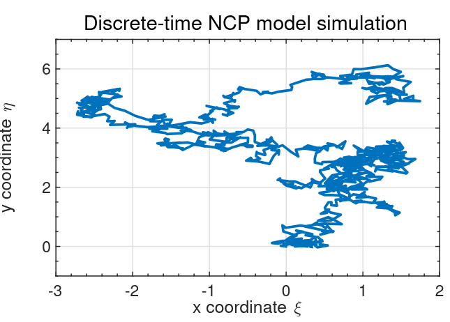
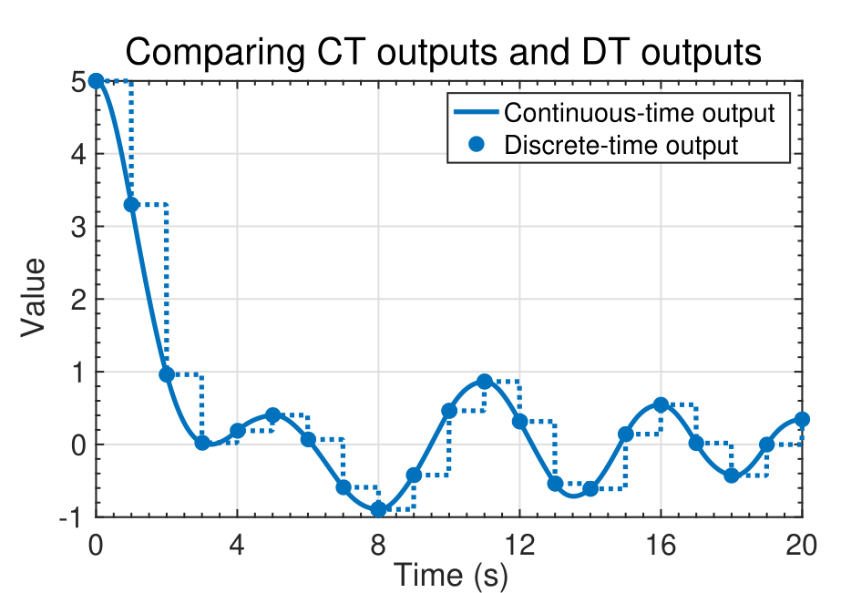

## How do I simulate a discrete-time state-space model? {#sec-kf-1.2.6-simulating-discrete-time-models}

### Simulating discrete-time systems

- When simulating discrete-time state-space models, we have (at least) two options.
   - There is a direct approach where we write the simulation code ourselves;
   - Also, Octave has two functions in its `control` package that help us simulate these
models easily. 
      - As with continuous-time models, the first of these is `ss`, which creates a state-space object from $A$, $B$, $C$, and $D$ matrices. 
      - The second is `lsim`, which simulates a state-space object for given input
conditions and an optional initial state.
- This lesson will show examples of both approaches, applied to the *NCP*, *NCV*, and *CT* models that were introduced for continuous-time simulations in Lesson 1.2.2.
- But first, we need to convert these continuous-time state-space models to
equivalent discrete-time models.

## Converting the nearly-constant-position model

- We might be interested to simulate a discrete-time version of the continuous-time nearly-constant-position model.
- Recall that in continuous time, the 2-d NCP model is^[We are treating random input $w(t)$ in the same way we have discussed treating deterministic input $u(t)$ here. As you will learn next week, this assumption is somewhat incorrect, but is "okay for now."] :

$$
\begin{aligned}
\dot x(t) &= 0_{2 \times 2} x(t) + I_2 w(t) \\
z(t) &= x(t) + v(t)
\end{aligned}
$$

In discrete time, we must then have (where ĩt is the sample period):

$$
\begin{aligned}
x_{k+1} &= e^{0\Delta t} x_k + \left( \int_0^{\Delta t} e^{0\sigma} d\sigma \right) I w_k \\
z_{k} &= x_k + v_k
\end{aligned}
$$


### Scaled discrete-time NCP model

- To compute $A_d$ , note that $e^{0\Delta t} = I$, which is perhaps most
easily confirmed using the infinite-series expansion for $e^{At}$ .
- To compute $B_d$ , note that we cannot use the simplified method $B_d = A^{-1}(A_d - I)B$ since $A$ is not invertible.
    - Instead, we use the longer-form integration method, where $\int_0^{\Delta t} Id\sigma= I \Delta t$.
- Therefore, we arrive at the discrete-time form of the NCP model:
$$
\begin{aligned}
x_{k+1}&= x_k + \Delta t w_k \\
z_k &= x_k + v_k
\end{aligned}
$$ {#eq-i86r4o} 


- Note, $w_k$ is often scaled vis-à-vis $w(t)$ so that another commonly seen form  is:

$$
\begin{aligned}
x_{k+1} &= x_k + \Delta t w_k \\
z_k &= x_k + v_k
\end{aligned}
$$ {#eq-er3pik}


### Time (dynamic) response using toolbox

::: {#fig-l126-1 .column-margin  group="slides" width="53mm"}


Discrete-time NCP model simulated using the toolbox methods.
:::

- First let us consider simulating an NCP model using `lsim`.
- The figure on the right is the output from simulating the Octave code below, which uses the toolbox methods.

::: {.panel-tabset}

## Octave 

```{octave} 
#| label: fig-plot-octave-dynamic-response-lsim
#| fig-cap: "Discrete-time NCP model simulated using the toolbox methods"
pkg load control

A  = eye(2);   Bw = eye(2);
C  = eye(2);   D  = zeros(2);
maxT = 1000;

randn("seed", 123);         % normal RNG
w = 0.1 * randn(maxT, 2);   % <-- time x inputs (1000 x 2)
v = 0.01 * randn(maxT, 2);  % <-- time x outputs (1000 x 2)
ncp = ss(A, Bw, C, D, -1);  % continuous-time (Ts = -1)
z = lsim(ncp, w) + v;       % z is (maxT x 2)
plot(z(:, 1), z(:, 2))
```

## Python

```{python}
#| label: "fig-l126-1"
#| fig-cap: "Discrete-time NCP model simulated using the toolbox methods."
import numpy as np
import matplotlib.pyplot as plt
from scipy.signal import StateSpace, dlsim

# Reproducibility (optional)
rng = np.random.default_rng(0)

A  = np.eye(2)
Bw = np.eye(2)
C  = np.eye(2)
D  = np.zeros((2, 2))

maxT = 1000
dt   = 1.0  # sample time (discrete steps)

# time x inputs, time x outputs
w = 0.1  * rng.standard_normal((maxT, 2))
v = 0.01 * rng.standard_normal((maxT, 2))

# Discrete-time state-space system
sys = StateSpace(A, Bw, C, D, dt=dt)

# dlsim returns (t, y, x) for discrete systems
t = np.arange(maxT) * dt
tout, y, x = dlsim(sys, w, t=t)

z = y + v  # noisy observations

plt.figure()
plt.plot(z[:, 0], z[:, 1])
plt.grid(True)
plt.xlabel("z1")
plt.ylabel("z2")
plt.show()
```

:::

- Trajectory starts at (0,0) and moves randomly from there as w pushes object.

### Time (dynamic) response using direct method

- In discrete-time we can implement the model without `lsim`
- We use a “for” loop to implement the state-equation recursion directly.


::: {.panel-tabset}

## Octave 

```{octave} 
#| label: fig-l126-NCP-Direct-oct
#| fig-cap: "Discrete-time NCP model simulated using the direct method"

A  = eye(2);   Bw = eye(2);
C  = eye(2);   D  = zeros(2);
maxT = 1000;

randn("seed", 123);   % normal RNG
w = 0.1 * randn(2, maxT);   % <-- time x inputs (1000 x 2)
v = 0.01 * randn(2, maxT);  % <-- time x outputs (1000 x 2)

x = zeros (2 , maxT ) ; % storage for x
x (: ,1) =[0;0];        % initial posn .
for k =2: maxT          % simulate model
    x(: , k ) = A * x(: ,k -1) + w(: ,k -1) ;
end
z = C * x + v ;

plot ( z (1 ,:) ,z (2 ,:) ) ;
```

## Python

```{python}
#| label: fig-l126-NCP-Direct-py
#| fig-cap: "Discrete-time NCP model simulated using the direct method."
import numpy as np
import matplotlib.pyplot as plt

A  = np.eye(2)
Bw = np.eye(2)          # unused in the direct method (kept for parity)
C  = np.eye(2)
D  = np.zeros((2, 2))   # unused in the direct method

maxT = 1000

# Octave: randn("seed", 123)
rs = np.random.RandomState(123)  # closer to Octave's legacy RNG style

w = 0.1  * rs.randn(2, maxT)   # (2, maxT)
v = 0.01 * rs.randn(2, maxT)   # (2, maxT)

x = np.zeros((2, maxT))
x[:, 0] = np.array([0.0, 0.0])

# Octave: for k = 2:maxT  => Python indices 1..maxT-1
for k in range(1, maxT):
    x[:, k] = A @ x[:, k-1] + w[:, k-1]

z = C @ x + v  # (2, maxT)

plt.figure()
plt.plot(z[0, :], z[1, :])
plt.grid(True)
plt.xlabel("z1")
plt.ylabel("z2")
plt.show()
```

:::

- This code produced the figure on the right when using the same $w$ and $v$ as prior slide; results are indistinguishable

### Converting the nearly-constant-velocity model

- We now consider a discrete-time version of the continuous time nearly-constant-velocity model.
- Recall the 2-d continuous-time state equation:

$$
\dot{x}(t) =
\underbrace{
    \begin{bmatrix}
        0 & 1 & 0 & 0 \\
        0 & 0 & 0 & 0 \\
        0 & 0 & 0 & 1 \\
        0 & 0 & 0 & 0
    \end{bmatrix}
}_{A} x(t) + 
\underbrace{
    \begin{bmatrix}
        0 & 0 \\
        1 & 0 \\
        0 & 0 \\
        0 & 1 \\
    \end{bmatrix}
}_{B} w(t)  
$$

where we are again treating random input $w(t)$ in the same way we have discussed treating deterministic input $u(t)$ here.
- We will need to compute $A_d = e^{A \Delta t}$ and also $B_d = \int_0^{\Delta t} e^{A \tau} B \, d\tau$

### Computing NCV $A_d$

TODO

### Computing NCV $B_d$

TODO

### Rescaling the discrete-time NCV model

TODO

### Time (dynamic) response using toolbox

TODO

### Time (dynamic) response using direct method

TODO

### Converting the coordinated-turn model

TODO

### Time (dynamic) response using toolbox

TODO

### Time (dynamic) response using direct method

TODO

### Summary

{#fig-kf-022  .column-margin  group="slides" width="53mm"}


{#fig-kf-023   .column-margin  group="slides" width="53mm"}

- In this lesson, you learned two different ways to simulate discrete-time models in Octave: toolbox and direct.
-  Both methods produce identical results; which one you use is mainly a matter of preference.
- You also learned how to convert NCP, NCV, and CT continuous-time models into discrete-time models.
-  Note that the continuous-time models and discrete-time models produce identical computations at the sample points, but different values in-between sample points (technically, the discrete-time state and output are not defined in-between sample points).
