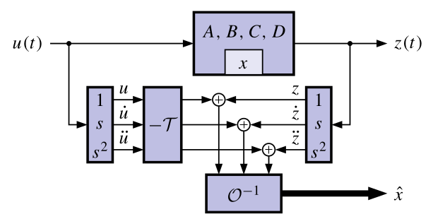
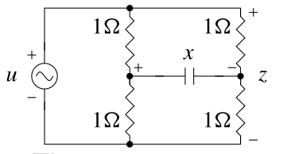
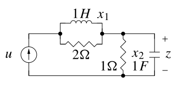
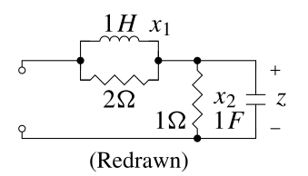
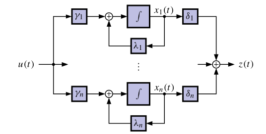
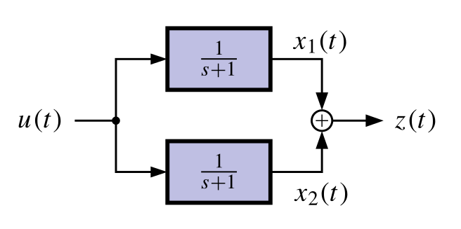
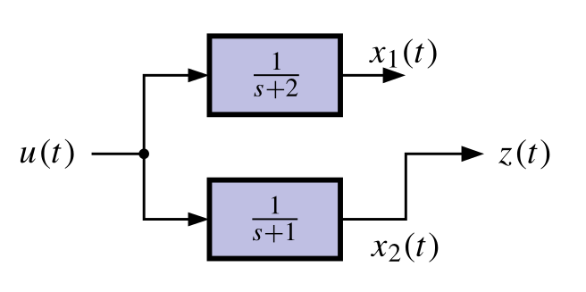

## Is it even possible for a KF to estimate this model’s state? {#sec-kf-1.2.7-kf-estimation}

### Observability: Can I estimate an initial state?

- We define a system to be observable if we can determine its initial state vector $x(0)$ via processing its input signal $u(t)$ and its output signal $z(t)$.
- Since we can simulate the system's state and output if we know $x(0)$ and $u(t)$, this also implies that we can determine $x(t)$ for all $t \geq 0$.

$$
x(t) = e^{At} x(0) + \int_0^t e^{A(t-\tau)} B u(\tau) d\tau
$$
- So, it should not be surprising that a system must be observable for the KF to work
(noting an exception to this rule that is stated on the summary slide).
- How do we determine whether a system is observable?

### Finding an equation describing output derivatives

- Consider a brute-force approach. Suppose we have the model:

    $$
    \begin{aligned}
    \dot x(t) &= A x(t) + B u(t) \\
    z(t) &= C x(t) + D u(t)
    \end{aligned}
    $$

  and we have initial conditions $z(0)$, $\dot{z}(0)$, $\ddot{z}(0)$,  $u(0)$, $\dot{u}(0)$, and $\ddot{u}(0)$.
  - How can we determine $x(0)$ from these initial conditions?
$$
\begin{aligned}
z(0) &= C x(0) + D u(0), \\
\dot{z}(0) &= C (\underbrace{A x(0) + B u(0)}_{\dot{x}(0)})  + D \dot{u}(0) = C A x(0) + C B u(0) + D \dot{u}(0), \\
\ddot{z}(0) &= C A^2 x(0) + C A B u(0) + C B \dot{u}(0) + D \ddot{u}(0)
\end{aligned}
$$
- In general (where superscript parentheses indicate derivatives, not powers),
$$
z^{(k)}(0) = C A^k x(0) + C A^{k-1} B u(0) + \dots + C B u^{k-1}(0) + D u^{(k)}(0), 
$$

### The Observability matrix $\mathcal{O}$

- We can write this compactly in matrix form (for n D 3):
    $$
    \begin{bmatrix}z(0) \\ \dot{z}(0) \\ \ddot{z}(0) \end{bmatrix} = 
    \underbrace{\begin{bmatrix} C \\ CA \\ CA^2 \end{bmatrix}}_{\mathcal{O}(C,A)} x(0) +
    \underbrace{\begin{bmatrix} D & 0 & 0 \\ CB & D & 0 \\ CAB & CB & D \end{bmatrix}}_{\mathcal{T}(C,A,B,D)} \begin{bmatrix} u(0) \\ \dot{u}(0) \\ \ddot{u}(0) \end{bmatrix}
    $$
    where $\mathcal{T}$ is a (block) “Toeplitz matrix” (in general, $\mathcal{O}$ has n (block) rows).
- Thus, if the observability matrix $\mathcal{O}$ is invertible, then:
$$
x(0) = \mathcal{O}^{-1} \left( \begin{bmatrix}z(0) \\ \dot{z}(0) \\ \ddot{z}(0) \end{bmatrix} - \mathcal{T} \begin{bmatrix} u(0) \\ \dot{u}(0) \\ \ddot{u}(0) \end{bmatrix} \right)
$$
- We say that $\{C,A\}$ is an observable pair if $\mathcal{O}$ is nonsingular (for multi-input multi-output systems, $\mathcal{O}$ must be full rank).

### A brute-force continuous-time observer

{#fig-kf-024 .column-margin group="slides"}

- One possible approach to determine the system state, directly
from the equations, uses differentiators.
- A big problem is that differentiators amplify noise, corrupting the state estimate.
- The KF is a more practical observer that doesn’t use differentiators.
- Regardless of the approach, it turns out that the system must be observable to be able to determine its initial state.
- **CONCLUSION**: If $\mathcal{O}$ is nonsingular, we can determine/estimate the initial state $x(0)$ of the system using only $u(t)$ and $z(t)$ (and so we can estimate $x(t)$ for all $t \geq 0$).
- **ADVANCED TOPIC**: If some states are unobservable but stable, an observer will still converge to the true state, although $x(0)$ may not be uniquely determined.

### Examples of unobservable models

{#fig-kf-025 .column-margin  group="slides" width="53mm"}

{#fig-kf-26 .column-margin  group="slides" width="53mm"}

{#fig-kf-027 .column-margin  group="slides" width="53mm"}

- Consider the following two unobservable circuits:

- The state-space model for the first circuit is:

$$
\begin{aligned}
\dot{x}(t) &= - \frac{1}{C} x(t) + \frac{1}{C} u(t)  \\ 
      z(t) &= u(t)
\end{aligned}
$$

- Notice that $z(t)$ is not a function of $x(t)$. The state-space model output equation has $C$ matrix equal to zero. Therefore, $\mathcal{O} = 0$. Not observable.
- In the second circuit, if $u(t) = 0$, $x_1(0) \neq 0$ and $x_2(0) = 0$, then $\dot{z}(t) = 0$ and we cannot determine $x_1(0)$ (circuit redrawn for $u(t) = 0$).

### Controllability: Can I get there from here?

- **Controllability** is a *dual* idea to observability. We won’t go into
depth here since it is not as important for our topic of study.
- Controllability asks the question, “Can I move from any initial state to any desired state via suitable selection of the control input u.t/?”
- The answer boils down to a condition on a matrix called the controllability matrix
$$
C = [B\; AB\; \cdots\; A^{N-1}B]
$$

- TEST: If C is nonsingular, then the system is controllable.

## Diagonal systems, controllability and observability

{#fig-kf-028 .column-margin  group="slides" width="53mm"}

We can gain insight by considering a system in diagonal form:

$$
\begin{aligned}
\dot{x}(t) &= \begin{bmatrix} \lambda_1 & 0 & \cdots & 0 \\ 0 & \lambda_2 & \cdots & 0 \\ \vdots & \vdots & \ddots & \vdots \\ 0 & 0 & \cdots & \lambda_n \end{bmatrix} x(t) + \begin{bmatrix} \gamma_1 \\ \gamma_2 \\ \vdots \\ \gamma_n \end{bmatrix} u(t) \\
z(t) &= \begin{bmatrix} \delta_1 & \delta_2 & \cdots & \delta_n \end{bmatrix} x(t) + d u(t)
\end{aligned}
$$

- When controllable? When observable?

$$
\mathcal{O} = \begin{bmatrix} C \\ CA \\ \vdots \\ CA^{n-1} \end{bmatrix} =\begin{bmatrix} \delta_1 & \delta_2 & \cdots & \delta_n \\ \lambda_1 \delta_1 & \lambda_2 \delta_2 & \cdots & \lambda_n \delta_n \\ \vdots & \vdots & \ddots & \vdots \\ \lambda_1^{n-1} \delta_1 & \lambda_2^{n-1} \delta_2 & \cdots & \lambda_n^{n-1} \delta_n  \end{bmatrix} \\
= \underbrace{\begin{bmatrix} 1 & 1 & \cdots & 1 \\ \lambda_1 & \lambda_2 & \cdots & \lambda_n \\ \vdots & \vdots & \ddots & \vdots \\ \lambda_1^{n-1} & \lambda_2^{n-1} & \cdots & \lambda_n^{n-1}  \end{bmatrix}}_{\text{Vandermonde matrix } \mathcal{V}}
\begin{bmatrix} \delta_1 & 0 & \cdots & 0 \\ 0 & \delta_2 & \cdots & 0 \\ \vdots & \vdots & \ddots & \vdots \\ 0 & 0 & \cdots & \delta_n  \end{bmatrix}
$$

### Why is a system unobservable? Uncontrollable?

{#fig-kf-030 .column-margin  group="slides" width="53mm"}

{#fig-kf-031 .column-margin  group="slides" width="53mm"}

- Is the observability matrix singular?
    $$
    \det\{\mathcal{O}\} = ( \delta_1 \cdots \delta_n )  \det\{\mathcal{V}\} =  ( \delta_1 \cdots \delta_n ) \prod_{1 \leq i < j \leq n} (\lambda_j - \lambda_i)
    $$
    - Observable $\iff \lambda_i \neq \lambda_j \forall i \neq j$ and $\delta_i \neq 0 \forall i$.
- If $\lambda_1 = \lambda_2$ then not observable. Can only “observe” the sum $x_1 + x_2$.
- If $\delta_k = 0$ then not observable. Cannot observe mode $k$.
- What about controllability? Analysis is similar: just switch the roles of the $\gamma$s and $\lambda$s. 
    - Controllable $\iff \lambda_i \neq \lambda_j \forall i \neq j$ and $\gamma_i \neq 0 \forall i$.
- If $\gamma_1 = \gamma_2$ then not controllable. Can only “control” the sum $x_1 + x_2$.
- If $\gamma_k = 0$ then cannot control mode $k$.

### Equations describing discrete-time outputs

- Can we reconstruct $x_0$ from the output $z_k$ and input $u_k$ ?

$$
\begin{align}
z_{k} &= C x_{k} + D_d u_{k} \text {so}\\
z_{0} &= C[A x_{0} + B u_0]+ D u_{0} \\
z_{1} &= C[A^2 x_{0} + A B u_0 + B u_1]+ D u_{1} \\
\vdots \\
z_{n-1} &=C[A^{n-1} x_0 + A^{n-2} B u_0 + \cdots + B u_{n-2}]+ D u_{n-1} 
\end{align}
$$

- In matrix/vector form, we can write:
$$
\begin{bmatrix} z_0 \\ z_1 \\ \vdots \\ z_{n-1} \end{bmatrix} =
\underbrace{\begin{bmatrix} C \\ CA \\ \vdots \\ CA^{n-1} \end{bmatrix}}_{\mathcal{O}(C,A)} x_0 + 
\underbrace{\begin{bmatrix} D & 0 & \cdots & 0 \\ CB & D & \cdots & 0 \\ \vdots & \vdots & \ddots & \vdots \\ CA^{n-2}B & CA^{n-3}B & \cdots & D \end{bmatrix}}_{\mathcal{T}(C,A,B,D)} \begin{bmatrix} u_0 \\ u_1 \\ \vdots \\ u_{n-1} \end{bmatrix}
$$

### Discrete-time observability matrix

- So, similar to continuous-time, we write
$$
x_0 = \mathcal{O}^{-1} \left( \begin{bmatrix} z_0 \\ z_1 \\ \vdots \\ z_{n-1} \end{bmatrix} - \mathcal{T} \begin{bmatrix} u_0 \\ u_1 \\ \vdots \\ u_{n-1} \end{bmatrix} \right)
$$
- If $\mathcal{O}$ is invertible, $x_0$ may be found for any $z_k ; u_k$ , and so the system is observable; also, we say that $\{C, A\}$ forms an observable pair.
- Do more measurements of $z_n;  z_{n+1}; \dots$ help in reconstructing $x_0$?
    - No! (Advanced topic: the [Caley–Hamilton theorem](https://en.wikipedia.org/wiki/Cayley%E2%80%93Hamilton_theorem)).
    - So, if the original state is not observable with $n$ measurements, then it will not be observable with more than $n$ measurements either.
    - There is a structural problem where either a state is not connected (at all) to the output, or multiple states have the same eigenvalues (time constants).

### A brute-force discrete-time observer

- Since we know $u_k$ and the dynamics of the system, if the system is observable we can determine the entire state sequence $x_k , k \ge 0$ once we determine $x_0$
$$
\begin{aligned}
x_n &= A^n x_0 + \sum_{i=0}^{n-1} A^{n-1-i} B u_i \\
&= A^n \mathcal{O}^{-1} \left( \begin{bmatrix} z_0 \\ z_1 \\ \vdots \\ z_{n-1} \end{bmatrix} - \mathcal{T} \begin{bmatrix} u_0 \\ u_1 \\ \vdots \\ u_{n-1} \end{bmatrix} \right) + \mathcal{C} \begin{bmatrix} u_0 \\ u_1 \\ \vdots \\ u_{n-1} \end{bmatrix}
\end{aligned}
$$ 

- This is a perfectly good observer! (no differentiators...).
- But it is still not nearly as good as the Kalman filters we will develop when there is noise present.

### Discrete-time controllability

- On the previous slide, I condensed the convolution sum
    $$
    \sum_{i=0}^{n-1} A^{n-1-i} B u_i = \mathcal{C} \begin{bmatrix} u_{n-1} \\ \vdots \\ u_0 \end{bmatrix}
    $$
    using a discrete-time controllability matrix, which I now define explicitly
- The discrete-time **controllability matrix** is formed by (where we use the discrete-time $A$ and $B$ matrices):

$$
\mathcal{C} = \begin{bmatrix} B & AB & \cdots & A^{n-1}B \end{bmatrix}
$$

- The matrix $\mathcal{C}$ is invertible iff the system is controllable. 

- Similar concept for discrete-time compared to continuous-time (and again, we won't make much use of it in this specialization).

### Summary

- Is it even possible to estimate the state of our model?
- The (continuous- or discrete-time) observability matrix $\mathcal{O}$ tells us whether the initial state can be found using measurements of input and output. 
  -  If $\mathcal{O}$ is invertible, the system is observable and we can find $x(0)$ or $x_0$.
  -  If $\mathcal{O}$ is not invertible, we cannot find $x(0)$ or $x_0$ uniquely because either a state is not connected to the output or multiple states have the same eigenvalues.
- If we can find the initial state, we can compute it at any other time. Otherwise, we cannot compute the state uniquely at any other time.
-  Therefore, we will say and assume that it is necessary for our models be observable for the KF to be able to estimate the state. ^[Advanced topic: A system is detectable if all states that cannot be observed are stable. We can apply KF to a detectable system (as the unobservable states decay toward a known trajectory in the absence of process noise) but uncertainties of unobservable states will generally become large.]
