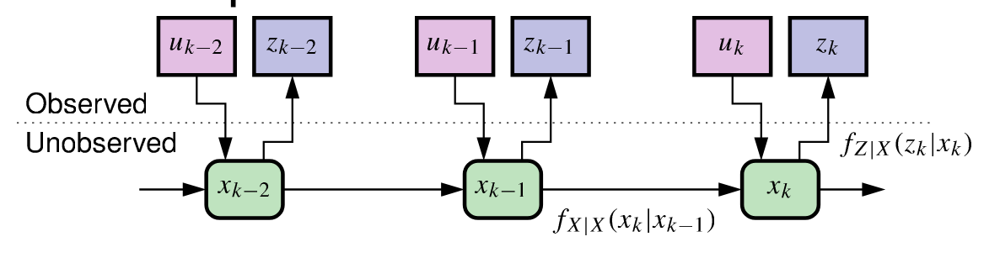

### Review of probability {#sec-kf-1.3.1-review-of-probability}

::: {#fig-sequential-probabilistic-inference .column-margin group="slides"}

:::

- [Sequential probabilistic inference (and hence also any type of Kalman filter) seeks to find the best state estimate in the presence of unknown process and sensor noises.]{.mark}
- By definition, noise is non-deterministic, i.e., it is random in some sense.
- To discuss the impact of noise on the system dynamics, we must understand (vector) **random variables** (RVs).
     - We **can't predict** exactly what we will get each time we measure the RV, but,
     - We **can characterize** the likelihood of different possible measurements by the RV's **probability density function** (PDF).

### Review of random vectors {#sec-kf-1.3.1-review-of-random-vectors}

- As review, define random vector $X$, sample vector $x_0$:

$$
\begin{aligned}
X   = \begin{bmatrix}X_1 \\ X_2 \\ \vdots \\ X_n\end{bmatrix} \quad 
\text{and} \quad 
x_0 = \begin{bmatrix}x_{1} \\ x_{2} \\ \vdots \\ x_{n}\end{bmatrix}
\end{aligned}
$$

Where $X_1$ through $X_n$ are themselves scalar RVs, and $x_1$ through $x_n$ are scalar constant values these RVs can take on.

- Random vector $X$ is described by (scalar function) joint PDF $f_X(x)$ of vector $x$:
  - $f_X(x_0)$ means $f_X(X_1 = x_1, X_2 = x_2, \ldots, X_n = x_n)$
  - $f_X(x_0) dx_1 dx_2 \ldots dx_n$ is the probability that $X$ is between $x_0$ and $x_0 + dx$.
  - $f_X(x_0)$ is the scaled probability or **likelihood** of measuring sample vector $x_0$. 

### Key properties of joint PDF of random vector

1. $f_X(x) \geq 0 \forall x \qquad \text{(Non-negativity)}$.
2. $\displaystyle{\int_{-\infty}^{\infty} \int_{-\infty}^{\infty} \ldots \int_{-\infty}^{\infty} f_X(x) dx_1 dx_2 \ldots dx_n = 1 \quad \text{(Normalization)}}$.
3. $\displaystyle{\bar{x} = \mathbb{E}[X] = \int_{-\infty}^{\infty} \int_{-\infty}^{\infty} \ldots \int_{-\infty}^{\infty} x f_X(x) dx_1 dx_2 \ldots dx_n \qquad \text{(Mean)}}$
4. Correlation matrix (note outer product, not inner product): 

$$
\Sigma_X = \mathbb{E}[XX^T] = \int_{-\infty}^{\infty} \int_{-\infty}^{\infty} \ldots \int_{-\infty}^{\infty} xf_X(x) dx_1 dx_2 \ldots dx_n
$$

5. Covariance matrix: Define $\tilde{X} = X - \bar{x}$. Then, 

$$
\begin{aligned}
\Sigma_X &= \mathbb{E}[(X - \bar{x})(X - \bar{x})^T] \\
&= \int_{-\infty}^{\infty} \int_{-\infty}^{\infty} \ldots \int_{-\infty}^{\infty} (x - \bar{x})(x - \bar{x})^T f_X(x) dx_1 dx_2 \ldots dx_n
\end{aligned}
$$

### Properties of Correlation and Covariance

- $\Sigma_{\tilde{X}}$ is symmetric and positive-semi-definite (PSD). This means:
$$
y^T \Sigma_X y \geq 0 \quad \forall y:
$$
- Notice that correlation = covariance for zero-mean random vectors. 
- The covariance entries have specific meaning: 
$$
\begin{aligned}
(\Sigma_X)_{ii} &= \sigma^2_{X_i} \\
(\Sigma_X)_{ij} &= \rho_{ij}\sigma_{X_i}\sigma_{X_j} = \text{Cov}(X_i, X_j) \\
(\Sigma_X)_{ji} &= (\Sigma_X)_{ij}
\end{aligned}
$$

- The diagonal entries are the variances of each vector component. 
- Correlation coefficient $\rho_{ij}$ is a measure of linear dependence between $X_i$ and $X_j$; $|\rho_{ij}| \leq 1$.

### The Multivariate Gaussian PDF

- There are infinite variety in PDFs. However, we assume only (Multivariate) Gaussian PDF in (linear) KF.
- All noises and the state vector itself are assumed to be Gaussian random vectors.
- Gaussian or normal PDF is (we say $X \sim \mathcal{N}(\bar{x}, \Sigma_{\tilde{X}})$):

$$
\begin{aligned}
f_X(x) &= \frac{1}{(2\pi)^{\frac{n}{2}} |\Sigma_{\tilde{X}}|^{\frac{1}{2}}} \exp\left(-\frac{1}{2}(x - \bar{x})^T \Sigma_{\tilde{X}}^{-1} (x - \bar{x})\right) \\
|\Sigma_{\tilde{X}}| &= \text{det}(\Sigma_{\tilde{X}}) \qquad \qquad \Sigma_{\tilde{X}}^{-1} \text{ requires PSD } \Sigma_{\tilde{X}}
\end{aligned}
$$ {#eq-multivariate-gaussian-pdf}

- Contours of constant $f_X(x)$ are hyper-ellipsoids, centered at $\bar{x}$, rotated via eigenvectors of $\Sigma_{\tilde{X}}$.
- Good news ... We won't need to work directly with this equation very much!

### Summary

- To develop sequential-probabilistic-inference solution, must have a background understanding of random variables (RVs).
- RVs are described by probability density functions (PDFs).
- These PDFs have important properties, which we have reviewed.
- In particular, we will be making use of mean and covariance a lot.
- The PDF we will assume for all RVs is Multivariate Gaussian (or normal) distribution.
- While this seems complicated at first, it turns out to simplify the math a lot later on.