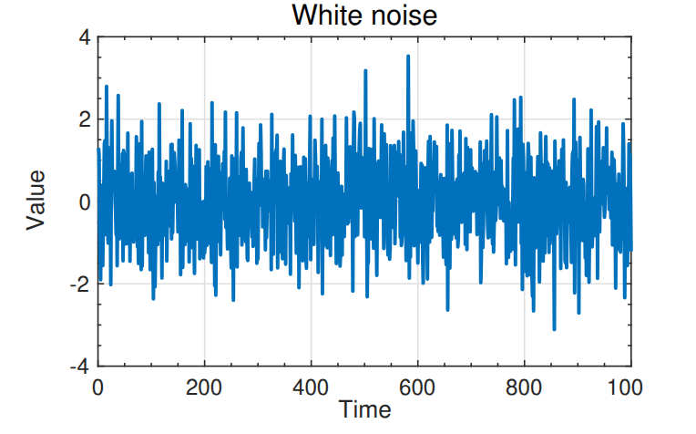
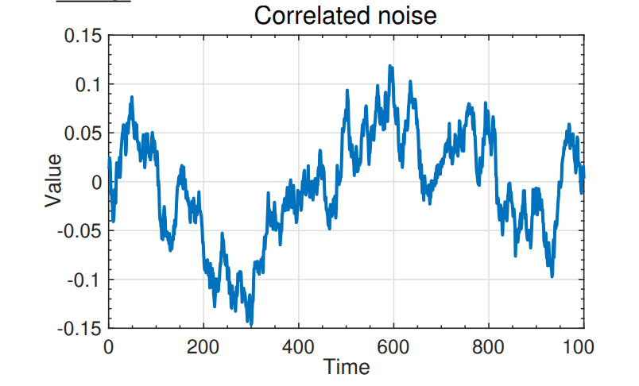
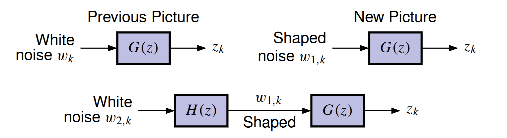

## Overview of vector random (stochastic) processes

- [A stochastic process is a family of random vectors indexed by a parameter set]{.mark} ("time" in our case).
- For example, we might refer to a random process $X_k$ for generic $k$.
  - Value of random process at any specific time $k = m$ is a random variable $X_m$.
- Usually assume *stationarity*.
  - The statistics (i.e., PDF) of the random variable are time-shift invariant.
  - Therefore, $\mathbb{E}[X_k] = \bar{x}$ for all $k$ and $\mathbb{E}[X_{k_1} X_{k_2}^T] = R_X(k_1-k_2)$.

## Properties and important points

1. **Autocorrelation:**

   $$
   R_X(k_1, k_2) = \mathbb{E}[X_{k_1} X_{k_2}^T].
   $$

   If stationary,

   $$
   R_X(\tau) = \mathbb{E}[X_k X_{k+\tau}^T].
   $$

   - Provides a measure of correlation between elements of the process having time displacement $\tau$.
   - $R_X(0) = \sigma_X^2$ for zero-mean $X$.
   - $R_X(0)$ is always the maximum value of $R_X(\tau)$.

2. **Autocovariance:**

   $$
   C_X(k_1, k_2) = \mathbb{E}\left[(X_{k_1} - \mathbb{E}[X_{k_1}])(X_{k_2} - \mathbb{E}[X_{k_2}])^T\right].
   $$

   If stationary,

   $$
   C_X(\tau) = \mathbb{E}\left[(X_k - \bar{x})(X_{k+\tau} - \bar{x})^T\right].
   $$

## White noise

- **White noise:** Some processes have a unique autocorrelation:
  1. Zero mean.
  2. 
     $$
     R_X(\tau) = \mathbb{E}[X_k X_{k+\tau}^T] = S_X\,\delta(\tau)
     $$

     where $\delta(\tau)$ is the Dirac delta, and

     $$
     \delta(\tau) = 0 \quad \forall\; \tau \neq 0.
     $$

- Therefore, the process is uncorrelated in time.
- Clearly an abstraction, but proves to be a very useful one.

:::: {.columns}
::: {.column width="45%"}

{}
:::

::: {.column width="10%"}
<!-- empty column to create gap -->
:::

::: {.column width="45%"}
{}
:::
::::

## Shaping filters: Idea

- Will assume noise inputs to dynamic systems are white.
  - Limiting assumption, but one that can be easily fixed.
    - Can use second linear system to "shape" the noise as desired.

{}

- Can drive our linear system with noise that has desired characteristics by introducing shaping filter $H(\cdot)$ that itself is driven by white noise.

## Shaping filters: Model

- Combined system $GH(\cdot)$ looks exactly the same as before, but $G(\cdot)$ is not driven by pure white noise any more.
- Analysis augments original system model with filter states.

::: {.columns}

::: {.column width="45%"}

Original system has:

$$
x_{k+1} = A x_k + B_w w_{1,k}
$$

$$
z_k = C x_k.
$$
:::

::: {.column width="10%"}
<!-- empty column to create gap -->
:::

::: {.column width="45%"}

Shaping filter with white input and desired output statistics has:

$$
x_{s,k+1} = A_s x_{s,k} + B_s w_{2,k}
$$

$$
w_{1,k} = C_s x_{s,k}.
$$

:::
::::

Combine into larger-order augmented system driven by white noise:

$$
\begin{bmatrix}
x_{k+1} \\
x_{s,k+1}
\end{bmatrix}
=
\begin{bmatrix}
A & B_w C_s \\
0 & A_s
\end{bmatrix}
\begin{bmatrix}
x_k \\
x_{s,k}
\end{bmatrix}
+
\begin{bmatrix}
0 \\
B_s
\end{bmatrix} w_{2,k}
$$

$$
z_k = \begin{bmatrix} C & 0 \end{bmatrix}
\begin{bmatrix}
x_k \\
x_{s,k}
\end{bmatrix}.
$$

## Gaussian processes

- We will work with Gaussian noises to a large extent.
  - Uniquely defined by the first- and second central moments of the statistics.
  - Gaussian assumption not essential.
  - Our filters will always track only the first two moments.

**Notation:** Until now, we have always used capital letters for random variables.

- The state of a system driven by a random process is a random variable, so we could call it $X_k$.
- It is more common to retain standard notation $x_k$ and understand from the context that we are discussing a random variable.

## Summary

- Random process is a family of random variables indexed by time.
- Will assume our random processes are stationary.
- Autocorrelation and autocovariance measure self-predictability of a signal at different time offsets.
- White noise is zero mean signal, completely uncorrelated with self ("completely random").
  - An abstraction, but a very useful one.
- If noises in a system of interest are not white, we can model them as filtered white noise to imitate the same general characteristics.
- From now on, unless stated otherwise, all noise signals will be white and Gaussian.

