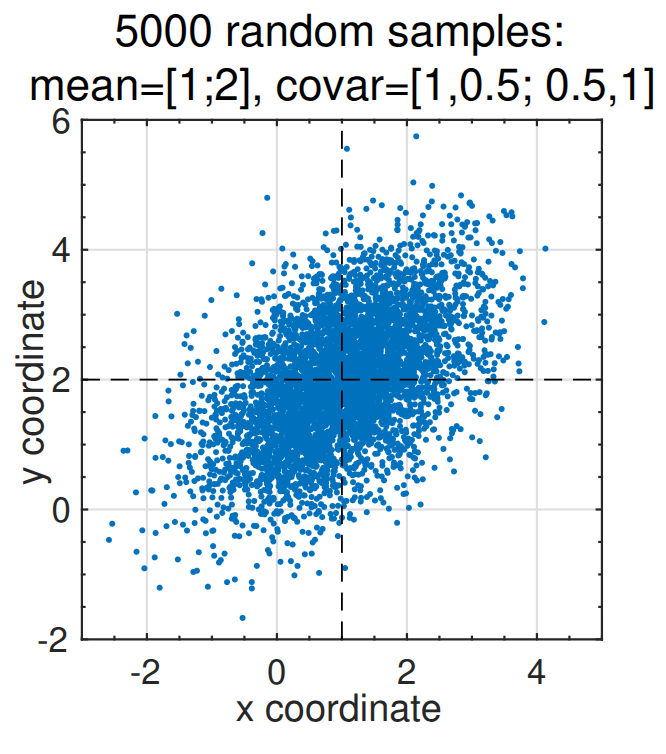

## Generating correlated random vectors {#sec-kf-1.3.4-correlated-random-vectors}

- Straightforward to implement KF steps in Octave.
- To validate KF code via simulation, however, we also must simulate system whose state is being estimated.
  - Produces system input/output data as input to the KF.
  - Provides “true” state value at every point in time.
- But, to simulate the true system, must be able to create nonzero mean Gaussian noise with covariance $\Sigma_{\tilde{Y}}$.
- That is, we want $\tilde{Y} \sim N(\bar{y}, \Sigma_{\tilde{Y}})$ but `randn.m` returns $X \sim N(0, I)$.
  - How to convert $X$ to $\tilde{Y}$?

## Functions of a random variable {#sec-kf-1.3.4-functions-of-random-variable}

Suppose we are given two random variables $Y$ and $X$ with
$$
Y = g(X).
$$

Also assume that $g^{-1}$ exists, and that $g$ and $g^{-1}$ are continuously differentiable. Then:
$$
f_Y(y) = f_X\!\left(g^{-1}(y)\right)
\left|\det\!\left(\frac{\partial g^{-1}(y)}{\partial y}\right)\right|
$$

where $|\det(\cdot)|$ means to take the absolute value of the determinant.

So what? Suppose that $X$ is a Gaussian random vector and we form some affine function of $X$ such as:
$$
Y = AX + b.
$$

- We can now form the PDF of $Y$ → handy!
- This is going to be a key step in learning how to simulate correlated Gaussian random variables.

## Example 1 with Gaussian {#sec-kf-1.3.4-example-1}

Let's find the PDF of
$$
Y = AX + b
$$
in a couple of steps.

Start with scalar $X$ and $Y = kX$, and
$$
X \sim N(0, \sigma_X^2).
$$

Then
$$
X = \frac{1}{k}Y
$$
and so
$$
g^{-1}(y) = \frac{1}{k}y.
$$

Also,
$$
\frac{\partial g^{-1}(y)}{\partial y} = \frac{1}{k}.
$$

Therefore,
$$
f_Y(y)
= f_X\!\left(\frac{y}{k}\right)\left|\frac{1}{k}\right|
= \frac{1}{|k|}\frac{1}{\sqrt{2\pi}\sigma_X}
\exp\!\left(-\frac{(y/k)^2}{2\sigma_X^2}\right)
= \frac{1}{\sqrt{2\pi(\sigma_X k)^2}}
\exp\!\left(-\frac{y^2}{2(\sigma_X k)^2}\right).
$$

Therefore, multiplication by gain $k$ results in a normally distributed random variable with scale change in standard deviation:
$$
Y \sim N(0, k^2\sigma_X^2).
$$

## Example 2 with Gaussian {#sec-kf-1.3.4-example-2}

Now, consider
$$
Y = AX + B
$$
where $A$ is a constant (non-singular) matrix, $B$ is a constant vector, and
$$
X \sim N(\bar{x}, \Sigma_{\tilde{X}}).
$$

Then
$$
X = A^{-1}Y - A^{-1}B
$$
so
$$
g^{-1}(y) = A^{-1}y - A^{-1}B.
$$

Also,
$$
\frac{\partial g^{-1}(y)}{\partial y} = A^{-1}.
$$

The pdf of $X$ is
$$
f_X(x)
= \frac{1}{(2\pi)^{n/2}|\Sigma_{\tilde{X}}|^{1/2}}
\exp\!\left[
-\frac{1}{2}(x-\bar{x})^T \Sigma_{\tilde{X}}^{-1}(x-\bar{x})
\right].
$$

Therefore,
$$
f_Y(y)
= |A^{-1}|
\frac{1}{(2\pi)^{n/2}|\Sigma_{\tilde{X}}|^{1/2}}
\exp\!\left[
-\frac{1}{2}
\left(A^{-1}(y-B)-\bar{x}\right)^T
\Sigma_{\tilde{X}}^{-1}
\left(A^{-1}(y-B)-\bar{x}\right)
\right].
$$

We are going to simplify this expression on the next slide.

To do so, note that we can use standard properties of expectation to show that
$$
\bar{y} = A\bar{x} + B
$$
and
$$
\Sigma_{\tilde{Y}} = A\Sigma_{\tilde{X}}A^T.
$$

## Example 2 with Gaussian (cont) {#sec-kf-1.3.4-example-2-cont}

Goal: simplify the following expression, knowing that
$$
\bar{y} = A\bar{x} + B
\qquad\text{and}\qquad
\Sigma_{\tilde{Y}} = A\Sigma_{\tilde{X}}A^T.
$$

$$
f_Y(y)
= |A^{-1}|
\frac{1}{(2\pi)^{n/2}|\Sigma_{\tilde{X}}|^{1/2}}
\exp\!\left[
-\frac{1}{2}
\left(A^{-1}(y-B)-\bar{x}\right)^T
\Sigma_{\tilde{X}}^{-1}
\left(A^{-1}(y-B)-\bar{x}\right)
\right]
$$

$$
=
\frac{1}{(2\pi)^{n/2}\left(|A||\Sigma_{\tilde{X}}||A^T|\right)^{1/2}}
\exp\!\left[
-\frac{1}{2}(y-\bar{y})^T
(A^{-1})^T \Sigma_{\tilde{X}}^{-1} A^{-1}
(y-\bar{y})
\right]
$$

$$
=
\frac{1}{(2\pi)^{n/2}|\Sigma_{\tilde{Y}}|^{1/2}}
\exp\!\left[
-\frac{1}{2}(y-\bar{y})^T
\Sigma_{\tilde{Y}}^{-1}
(y-\bar{y})
\right].
$$

**Conclusion:** Sum of Gaussians is Gaussian — very special case.

## Application to our problem {#sec-kf-1.3.4-application-to-our-problem}

Suppose that we can find matrix $A$ such that
$$
A^T A = \Sigma_{\tilde{Y}}.
$$

Then, we generate samples $x$ of random vector
$$
X \sim N(0, I)
$$
and compute samples $y$ of random vector
$$
Y = \bar{y} + A^T X.
$$

Since $X$ is zero-mean,
$$
E[Y] = E[\bar{y} + A^T X] = \bar{y},
$$
as desired.

The covariance of $Y$ is:
$$
E[(Y-\bar{y})(Y-\bar{y})^T]
= E[(A^T X)(A^T X)^T]
$$

$$
= E[(A^T X)(X^T A)]
$$

$$
= A^T E[XX^T] A
$$

$$
= A^T I A = \Sigma_{\tilde{Y}},
$$
also as desired.

## Important matrix factorizations {#sec-kf-1.3.4-important-matrix-factorizations}

So, if we can find $A$ such that
$$
A^T A = \Sigma_{\tilde{Y}},
$$
we can generate samples $x$ of $X \sim N(0, I)$ and compute
$$
y = \bar{y} + A^T x.
$$

Three ways to generate $A$:

- **Cholesky factorization** of $\Sigma_{\tilde{Y}}$ computes $A$ such that $A^T A = \Sigma_{\tilde{Y}}$ as long as $\Sigma_{\tilde{Y}}$ is positive definite (all eigenvalues are strictly greater than zero).
- **LDL factorization** of $\Sigma_{\tilde{Y}}$ produces $L, D$ such that
  $$
  LDL^T = \Sigma_{\tilde{Y}}
  $$
  and requires only that $\Sigma_{\tilde{Y}}$ be positive semi-definite. Can then compute
  $$
  A = \sqrt{D}\,L^T.
  $$
- **LU factorization** of $\Sigma_{\tilde{Y}}$ produces $L, U$ such that
  $$
  LU = \Sigma_{\tilde{Y}}
  $$
  and requires only that $\Sigma_{\tilde{Y}}$ be positive semi-definite. Can then compute
  $$
  A = \operatorname{diag}\!\left(\sqrt{\operatorname{diag}(U)}\right)L^T.
  $$

Cholesky and LU are built into Octave; all are built into MATLAB.

## Example Octave code

Suppose we wish to generate a single sample of $y$ using the Cholesky method:

```octave
ybar = [1; 2];
covar = [1, 0.5; 0.5, 1];
A = chol(covar);
x = randn([2, 1]);
y = ybar + A' * x;
```

Suppose we wish to generate 5000 samples of $y$ using the LU method:

```octave
ybar = [1; 2];
covar = [1, 0.5; 0.5, 1];
[L, U] = lu(covar);
A = diag(sqrt(diag(U))) * L';
x = randn([2, 5000]);
y = ybar(:, ones([1 5000])) + A' * x;
plot(y(1,:), y(2,:), '.');
```

{#fig-kf-1.3.4-1 .column-margin group="slides"}

## Summary {#sec-kf-1.3.4-summary}

- In order [to test KF code via simulation, must also simulate system whose state is being estimated.]{.mark}
- This requires ability to simulate (possibly) correlated, (possibly nonzero mean) noises.
- Octave only natively produces samples of zero-mean uncorrelated Gaussians.
- But, it can efficiently transform these to have desired mean and correlation using a matrix determined using either the [Cholesky](/A/A18.qmd) or LU matrix decompositions, both of which are built into Octave.