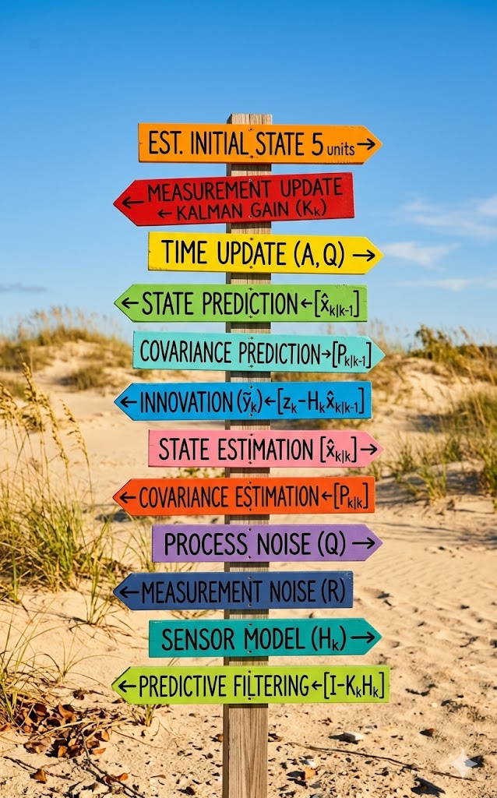

## Summary of this week

- Congratulations for making it this far! The most rigorous topics
of the boot camp are now complete!
    - This past week, we devoted our attention to strengthening your skills relating to random variables.
    - You learned how we will quantify randomness via mean and covariance.
    - You learned about ways to understand joint uncertainty of two random variables.
    - You learned about time-varying random variables—stochastic processes.
    -  You learned how to simulate correlated random variables.
    - You learned about discrete- and continuous-time systems having random inputs.- Finally, you learned how to convert a continuous-time model having random inputs into an equivalent discrete-time model.

## Where to from here?

{.column-margin group="slides"}

- The final week of each course in this specialization focuses on
a specific application of KF.
- In this course, we examine KF for generic state estimation applied to a linear model.
    -  In future courses, we will investigate applications of target
tracking, parameter estimation, and navigation.
-  Next week, you will first learn the actual specific steps that a
KF must implement.
-  Then, you will see how to implement them in Octave code. You will see more detail regarding defining a simulation model, and how to set up a simulation.
-  You will learn how to evaluate the output of a KF.