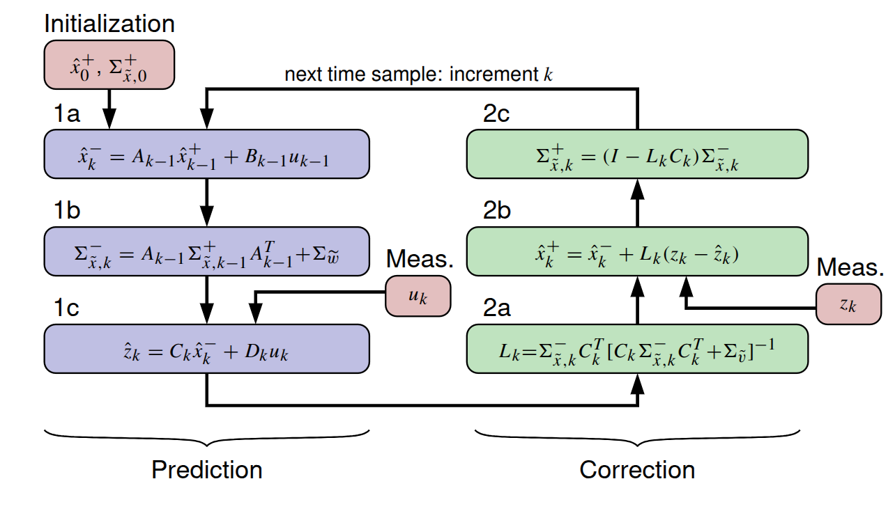
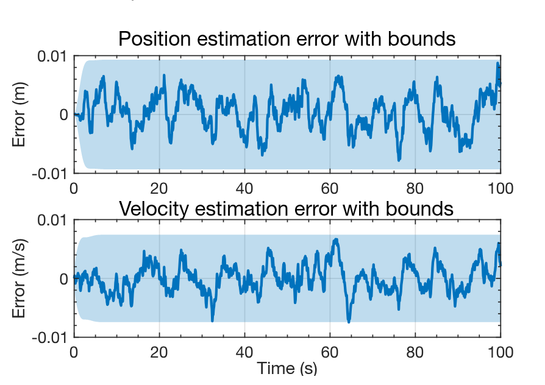
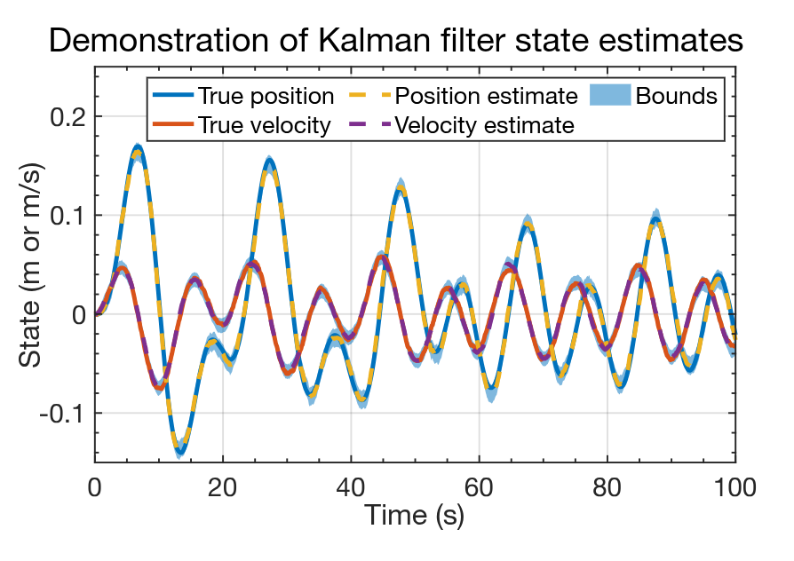

## Introduction to lesson

- In this lesson, you will learn how to implement KF in Octave.  
- It is recommended that you keep the KF equations nearby.

::: {.callout-tip style="background-color: #c58aff;"}
## Prediction

**Step 1a:** State prediction (time update)  

$$
\hat{x}_k^- = A_{k-1}\hat{x}_{k-1}^+ + B_{k-1}u_{k-1}
$$

**Step 1b:** Prediction-error covariance update  

$$
\Sigma_{\tilde{x},k}^- = A_{k-1}\Sigma_{x,k-1}^+ A_{k-1}^T + \Sigma_{\tilde{w}}
$$

**Step 1c:** Predict system output  

$$
\hat{z}_k = C_k \hat{x}_k^- + D_k u_k
$$

:::

::: {.callout-tip style="background-color: #72be68;"}
### Correction

**Step 2a:** Estimator gain matrix

$$
L_k = \Sigma_{\tilde{x},k}^- C_k^T \left[C_k \Sigma_{\tilde{x},k}^- C_k^T + \Sigma_{\tilde{v}}\right]^{-1}
$$

**Step 2b:** State estimate (measurement update)

$$
\hat{x}_k^+ = \hat{x}_k^- + L_k (z_k - \hat{z}_k)
$$

**Step 2c:** Estimation-error covariance update

$$
\Sigma_{\tilde{x},k}^+ = (I - L_k C_k)\Sigma_{\tilde{x},k}^-
$$

:::

## Visualizing the Linear Kalman Filter

- Linear Kalman-filter equations naturally form a recursion:
  - Initialization → Prediction → Correction → Next timestep

- Notes:
  - “Simple” to implement on a digital computer  
  - Only six lines of code execute each iteration  
  - Most effort is in setup and plotting  

{#fig-kf-recursion}

## KF Step 1 (Prediction)

```octave
% Load data from simulation of system dynamic model
load simOut.mat Ad Bd Cd Dd SigmaV SigmaW dT t u x z

% Determine number of states and timesteps
[nx,nt] = size(x);

% Initialize state estimate and covariance
xhat = zeros(nx,1); 
SigmaX = zeros(nx,nx);

% Initialize storage for state/bounds for plotting purposes
xhatstore = zeros(nx,nt); 
boundstore = zeros(nx,nt);

for k = 2:length(t)

  % KF Step 1a: State prediction time update
  xhat = Ad*xhat + Bd*u(:,k-1); % use prior value of "u"

  % KF Step 1b: Prediction-error covariance time update
  SigmaX = Ad*SigmaX*Ad' + SigmaW;

  % KF Step 1c: Predict system output
  zhat = Cd*xhat + Dd*u(:,k); % use present value of "u"
```

## KF Step 2 (Correction)

```octave
  % KF Step 2a: Compute estimator matrix
  L = SigmaX*Cd'/(Cd*SigmaX*Cd' + SigmaV);

  % KF Step 2b: State estimate measurement update
  xhat = xhat + L*(z(:,k) - zhat);

  % KF Step 2c: Estimation-error covariance measurement update
  SigmaX = (eye(nx) - L*Cd)*SigmaX;

  % Store estimate and bounds for evaluation / plotting purposes
  xhatstore(:,k) = xhat;
  boundstore(:,k) = 3*sqrt(diag(SigmaX));

end
```

* That's it! We’re now ready to plot results.

## Plot Results from KF Execution

```octave
figure(1); clf; % Plot the states and estimates

t2 = [t fliplr(t)]; % Prepare for plotting bounds via "fill"
x2 = [xhatstore - boundstore fliplr(xhatstore + boundstore)];

h1 = fill(t2,x2,'b','FaceAlpha',0.5,'LineStyle','none'); 
hold on; grid on

h2 = plot(t,x',t,xhatstore','--'); % Plot true state and estimate

legend([h2;h1], ...
  'True position','True velocity','Position estimate', ...
  'Velocity estimate','Bounds');

title('Demonstration of Kalman filter state estimates');
xlabel('Time (s)'); 
ylabel('State (m or m/s)');

figure(2); clf;

xerr = x - xhatstore; % Plot state-estimation errors

for k = 1:nx
  subplot(nx,1,k);

  fill(t2,[-boundstore(k,:) fliplr(boundstore(k,:))],'b', ...
       'FaceAlpha',0.25,'LineStyle','none'); 
  hold on; grid on;

  plot(t,xerr(k,:),'b');

  title(sprintf('State %d estimation error with bounds',k));
  xlabel('Time (s)'); 
  ylabel('Error');
end
```

## Sample Results: States and Estimates

* Output shown for spring-mass-damper example using simulation data.
* True states and estimated states are plotted with confidence bounds.

Key observations:

* KF estimates both position and velocity well
* Errors do not converge to zero
* Estimates remain within confidence bounds (as expected)

{#fig-demonstration-of-kalman-filter-state-estimates}

## Sample Results: Estimation Errors

* Alternative visualization: plot estimation errors directly

Insights:

* Errors always contain a random component (due to process noise (w_k))
* Easier to verify confidence bounds

Observations:

* Position estimate remains within bounds
* Velocity estimate exceeds bounds once (≈ 0.1% of time)
* Matches theoretical expectation (~99.7% confidence bounds)

{#fig-estimation-error-with-bounds}

## Summary

You have learned how to:

* Implement KF steps in Octave code
* Plot KF output in two ways

Notes:

* Code is general (not system-specific)
* Applies to any linear system satisfying KF assumptions
* Results provide intuition for KF behavior

