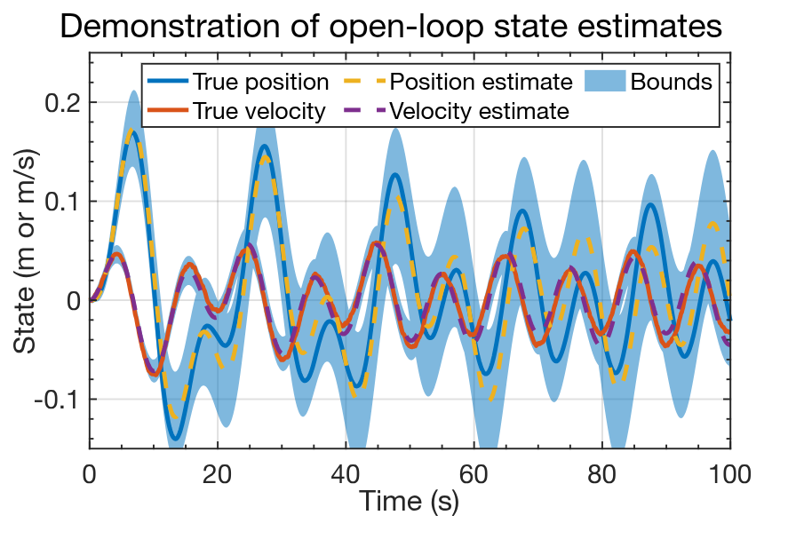
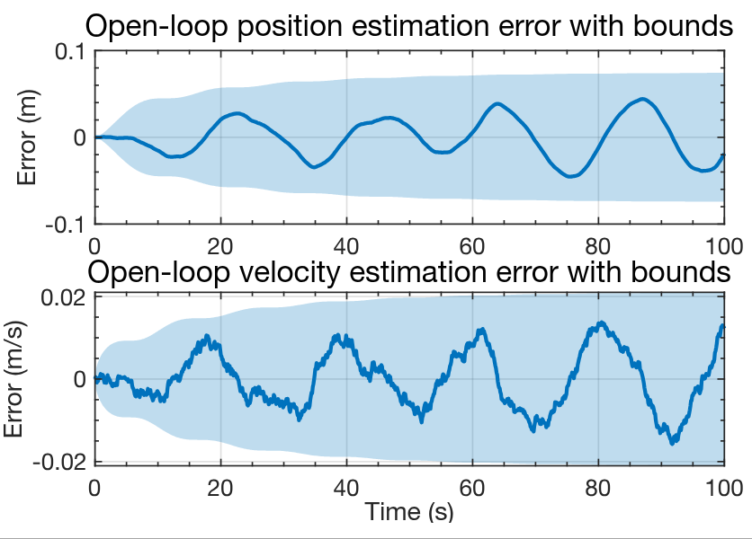
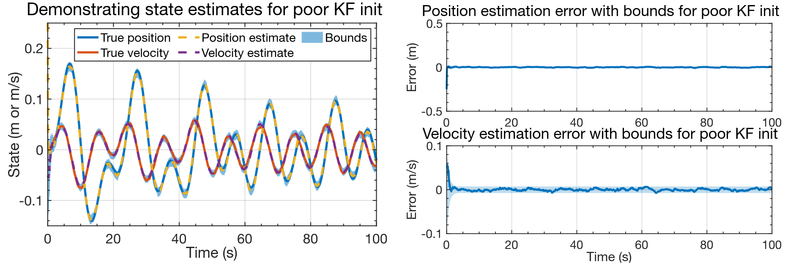
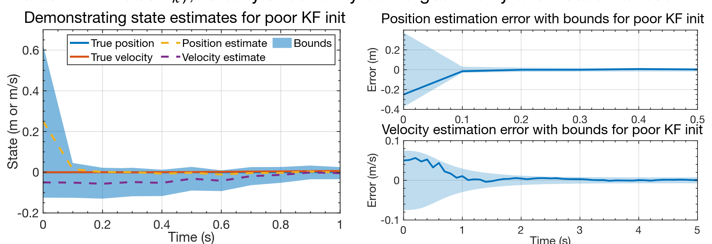

## Open-loop estimation

- In this lesson, we explore some additional examples, comparing with results from the KF in Lesson 1.4.3.
- The first example implements an open-loop state estimator, for comparison with KF.
- To perform open-loop (OL) estimation, the main program loop is modified as follows:

```octave
for k = 2:length(t)
    % KF Step 1a: State estimate time update
    xhat = Ad*xhat + Bd*u(k-1); % use prior value of "u"

    % KF Step 1b: Error covariance time update
    SigmaX = Ad*SigmaX*Ad' + SigmaW;

    % For open-loop state estimation, there is no measurement feedback.
    % So, delete steps 1c, 2a, 2b, and 2c.

    % [Store information for evaluation/plotting purposes]
    xhatstore(:,k) = xhat;
    boundstore(:,k) = 3*sqrt(diag(SigmaX));
end
```

## Sample open-loop results: States and estimates

- Plot shows OL output for the spring-mass-damper example, using simulation data from earlier this week.
- Comparing with the KF result for the same data in Lesson 1.4.3, we immediately notice that the confidence bounds for OL are much wider than they were for KF.
- We also notice that the position estimate (especially) of the OL estimator is far less accurate than it was for KF.
- The unknown influence of process noise $w_k$ has caused the OL estimator to be less accurate and less confident than the KF.



## Sample open-loop results: Estimation errors

- Plot shows an alternate way of viewing the OL output, looking directly at the state-estimation errors, $x_k - \hat{x}_k^+$.
- Comparing with the corresponding results from Lesson 1.4.3, we notice far more structure (correlation) in the OL prediction errors than the KF estimation errors.
- This is because $w_k$ causes the states to evolve according to the system's dynamics in a way that cannot be predicted OL.
- Hence, the confidence bounds are also much wider because of this uncertainty:
  - About 0.1 versus 0.01 for position, and
  - 0.02 versus 0.01 for velocity.
- OL predictions become even worse if we don't know $x_0$ exactly.



## What if the KF is poorly initialized?

- How well does the KF perform if we don't know $x_0$ exactly?
- Lesson 1.4.2 simulated the spring-mass-damper system with a true initial state $x_0 = 0$.
- Lesson 1.4.3 initialized the KF with $\hat{x}_0^+ = 0$ and $\Sigma_{x,0}^+ = 0$, indicating perfect knowledge of $x_0$ (i.e., no uncertainty).
- Suppose that we don't know $x_0$ exactly, which is the typical case.
  - Then, we must enter a different $\hat{x}_0^+$ and $\Sigma_{x,0}^+$ in the code.

```octave
% System's true initial state is x = [0;0]. But, what if we don't know that?
xhat = [0.25; -0.05];
xhatstore(:,1) = xhat;

% Assume that xhat is a 2-sigma sample from the true distribution of x(0).
SigmaX = diag(xhat/2).^2;
boundstore(:,1) = 3*sqrt(diag(SigmaX));

% Continue with standard KF code for the main simulation loop...
for k = 2:length(t)
```


## KF results for "bad" initialization

- Plots show KF output when the state is initialized poorly.
- After a few seconds, the results are nearly the same as when the KF was initialized with exact knowledge of $x_0$. Feedback works!



## KF results for "bad" initialization (zoom)

- Zooming in on the first portions of the KF output, we see how effective the feedback mechanism of the KF actually is.
- Position uncertainty plummets in a single timestep (we measure this state directly, albeit with noise $v_k$); velocity uncertainty converges in only a few seconds also.



## Summary

- In this lesson we implemented different scenarios to help gain intuition into how well the KF works.
  - I recommend that you also try different things---this is a great way to learn!
- Specifically, we first compared KF state estimation to open-loop state prediction.
  - The OL predictor has no feedback, so cannot know the impact of $w_k$ on the state.
  - So, its predictions are inferior to KF estimates; its confidence bounds are looser.
- We then looked at the KF output when we don't know $x_0$ exactly.
  - We found that the feedback mechanism built in to the KF allows the filter state estimates to converge to the true states quite quickly for this example.
  - Convergence rate depends on relative sizes $\Sigma_w$ and $\Sigma_v$, as you will learn later.
  - OL predictors have no way of knowing if their $\hat{x}_0$ is incorrect, so wouldn't converge.
- So, KF can work very well if all the assumptions made in their derivation are met.
  - What if they are not? We explore this in the next lesson.
