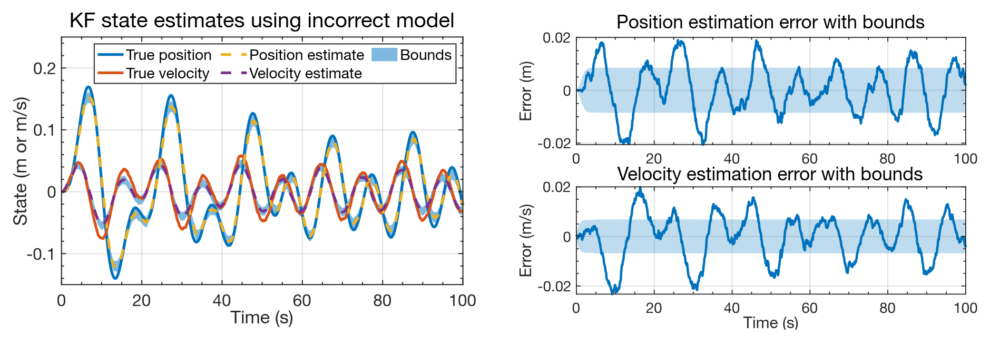
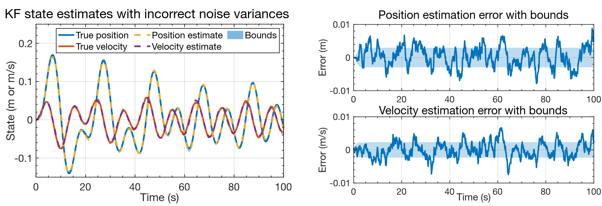
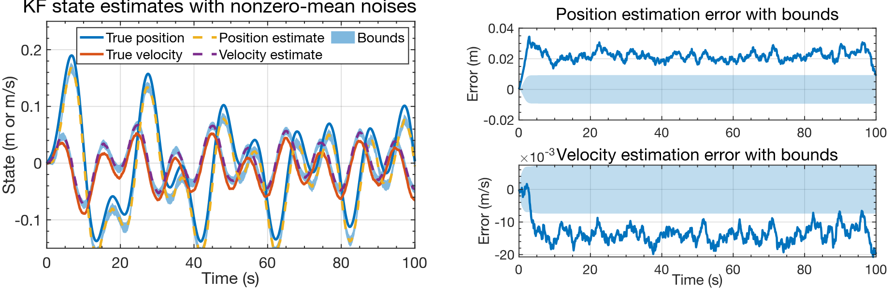
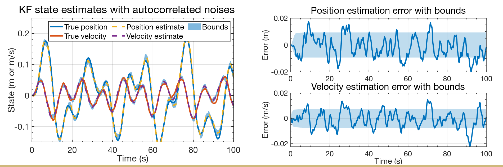

## Is the KF invincible?

- So far, the examples of the KF have been very positive!
- But, it turns out that there are ways to make a KF fail.
- The derivation of the KF makes several assumptions. If those assumptions are not met, the KF will not perform as expected.
- The first of these that we illustrate in this lesson is the case where our model of the system does not exactly agree with the true system dynamics.
- We keep the same simulation dataset, but force the KF to use different `Ad`, `Bd`, and `Cd` matrices from the true system (`Dd = 0`).

```matlab
load simOut.mat Ad Bd Cd Dd SigmaV SigmaW dT t u x z

% Force the KF to use different Ad, Bd, Cd, Dd from the model simulation:
Ad = 0.99*Ad;
Bd = 0.99*Bd;
Cd = 0.99*Cd;
Dd = 0.99*Dd;
```

## KF results when using incorrect dynamic model

- The plots show KF output for this scenario.
- Even though the model used by the KF is very close to the true model, the state estimates have degraded and the confidence bounds are no longer reliable.

**Plots shown in the handout:**

- KF state estimates using incorrect model
- Position estimation error with bounds
- Velocity estimation error with bounds

## KF results when using incorrect noise variances

- What if we know the system model exactly, but have poor information regarding the noise covariances?

```matlab
% Force the KF to use different SigmaW and SigmaV from the model simulation:
SigmaW = 0.1*SigmaW;
SigmaV = 0.1*SigmaV;
```

**Plots shown in the handout:**

- KF state estimates with incorrect noise variances
- Position estimation error with bounds
- Velocity estimation error with bounds

## Nonzero-mean process and sensor noises

- The KF derivation assumes that $E[w_k] = 0$ and $E[v_k] = 0$.
- I created a new spring-mass-damper dataset where $w_k$ and $v_k$ had the same covariances as before, but

$$
E[w_k] = \begin{bmatrix} 0.001 \\ -0.0001 \end{bmatrix}
$$

and

$$
E[v_k] = -0.025.
$$

- I then executed the KF on this new dataset.

**Plots shown in the handout:**

- KF state estimates with nonzero-mean noises
- Position estimation error with bounds
- Velocity estimation error with bounds

## Autocorrelated process and sensor noises

- The KF derivation assumes that $w_k$ and $v_k$ are white.
- I created a new spring-mass-damper dataset where $w_k$ and $v_k$ are self-correlated (filtered).
- I then executed the KF on this new dataset.
- State estimates have degraded and the confidence bounds are no longer reliable.

**Plots shown in the handout:**

- KF state estimates with autocorrelated noises
- Position estimation error with bounds
- Velocity estimation error with bounds

## Summary

- In this lesson you learned that the KF is not invincible.
- Some conditions cause KF to produce unreliable estimates.
- **Bad model:** If the model of the system's dynamics is incorrect, or if the model of the noise covariances is incorrect, the KF can fail.
  - This is especially true if the system dynamics are nonlinear; see Course 3.
- **Biased noises:** If the process and/or sensor noises are not zero mean, KF can fail.
  - But, we can estimate the biases; see Course 2.
- **Correlated noises:** If the process and/or sensor noises are not white, KF can fail.
  - But, we can model the correlations; see Course 2.
- **Non-Gaussian noise:** If the noises are not Gaussian (especially for nonlinear systems), the KF can fail; see Course 4.
- Also, there can be numeric instabilities (cf. Course 2); and performance degradation if measurements of $u_k$ and $z_k$ are not synchronized (cf. Course 2).




