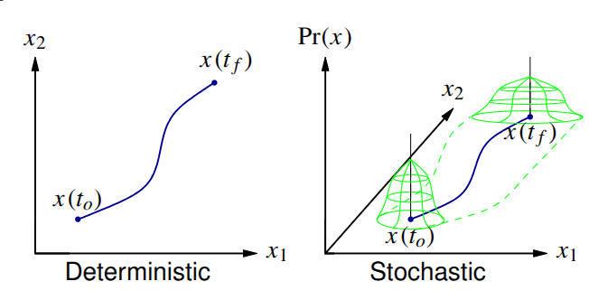
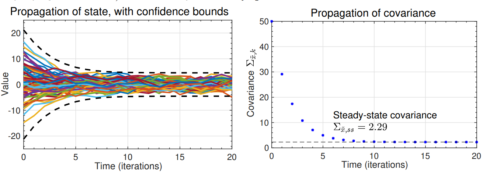

# 1.3.5: Discrete-time dynamic systems having random inputs

## Predicting stochastic-system statistics

- What are the statistics of the state of a system driven by a random process?
- That is, how do the system dynamics influence the time-propagation of $x(t)$?
  - We do not know $x(t)$ exactly, but we can develop a pdf for $x(t)$.
- First, we contrast a linear system driven by white noise $w(t)$, possibly in addition to deterministic input $u(t)$:

$$
\dot{x}(t) = A x(t) + B u(t) + w(t),
\qquad
x(0) \sim \mathcal{N}(\bar{x}_0, \Sigma_{x,0}),
\qquad
w(t) \sim \mathcal{N}(\bar{w}, \Sigma_w)
$$

with a deterministic model, which can be easily simulated:

$$
\dot{x}(t) = A x(t) + B u(t),
\qquad
x(0) = x_0,
\qquad
x(0), u(t)\ \text{known}.
$$

- In the first case, the state is never known with certainty; in the second case, the system response is completely specified. Therefore, there is no uncertainty.

## Visualizing the information

- In the stochastic case, the best we can do is to say how uncertainty in the state changes with time.
- Deterministic: $x(t_0)$ and inputs known
  - State trajectory is deterministic.
- Stochastic: pdfs for $x(t_0)$ and for inputs known
  - Can find only pdf for $x(t)$.
- We will work with Gaussian noises, which are uniquely defined by their first and second-central moments.
- The Gaussian assumption is not essential, but in any case we will only ever track the first two moments.

{group="slides"}

## Discrete-time systems

- **NOTATION:** Until now, we have always used capital letters for random variables (RVs). The state of a system driven by a random process is an RV, so we could now call it $X(t)$ or $X_k$. But, it is more common to retain standard notation $x(t)$ or $x_k$ and understand from context that we are now discussing an RV.
- We seek to find the statistics of $x_k$ for a discrete system; we will later look at how to get an equivalent answer for continuous systems.
- Model (where $A_{d,k-1}$ and $B_{d,k-1}$ are assumed known and can be time-varying):

$$
 x_k = A_{d,k-1} x_{k-1} + B_{d,k-1} u_{k-1} + w_{k-1}
$$

where

- $x_k$: State vector, a random process.
- $u_k$: Deterministic control inputs.
- $w_k$: Noise that drives the process (process noise), a random process.

---

## Discrete-time systems

- We make some key assumptions about the driving noise:

1. Zero mean: $E[w_k] = 0 \quad \forall k$.
2. White:

$$
E[w_{k_1} w_{k_2}^T] = \Sigma_{\bar{w}}\, \delta(k_1-k_2).
$$

- $\Sigma_{\bar{w}}$ is called the spectral density of the noise signal $w_k$.

- We also make assumptions regarding state uncertainty at startup. Statistics of initial condition:

$$
E[x_0] = \bar{x}_0;
$$

$$
E[(x_0 - \bar{x}_0) w_k^T] = 0 \quad \forall k
$$

$$
\Sigma_{x,0} = E[(x_0 - \bar{x}_0)(x_0 - \bar{x}_0)^T].
$$

- Key question: How do we propagate the statistics of this system?

## Propagating the mean

- The mean value is:

$$
E[x_k] = \bar{x}_k = E[A_d x_{k-1} + B_d u_{k-1} + w_{k-1}]
$$

$$
= A_d \bar{x}_{k-1} + B_d u_{k-1}.
$$

Therefore, the mean propagation is:

$$
\bar{x}_0 : \text{Given}
$$

$$
\bar{x}_k = A_d \bar{x}_{k-1} + B_d u_{k-1}.
$$

- Deterministic simulation and the mean values of a stochastic simulation are treated the same way.

## Propagating variations about the mean

- To study the random variations about the mean, we need to form the second central moment of the statistics:

$$
\Sigma_{x,k} = E[(x_k - \bar{x}_k)(x_k - \bar{x}_k)^T].
$$

- Easiest to study if we note that:

$$
x_k - \bar{x}_k = A_d x_{k-1} + B_d u_{k-1} + w_{k-1} - A_d \bar{x}_{k-1} - B_d u_{k-1}
$$

$$
= A_d (x_{k-1} - \bar{x}_{k-1}) + w_{k-1}.
$$

- Thus,

$$
\Sigma_{x,k} = E[(A_d (x_{k-1} - \bar{x}_{k-1}) + w_{k-1})(A_d (x_{k-1} - \bar{x}_{k-1}) + w_{k-1})^T].
$$

- Three terms:

1. 
$$
E[A_d (x_{k-1} - \bar{x}_{k-1})(x_{k-1} - \bar{x}_{k-1})^T A_d^T] = A_d \Sigma_{x,k-1} A_d^T.
$$
2. 
$$
E[w_{k-1} w_{k-1}^T] = \Sigma_{\bar{w}}.
$$
3. 
$$
E[A_d (x_{k-1} - \bar{x}_{k-1}) w_{k-1}^T] = ?
$$

---

## Propagating variations about the mean

- The third term $E[A_d (x_{k-1} - \bar{x}_{k-1}) w_{k-1}^T]$ is a cross-correlation.
  - But, $x_{k-1}$ depends only on $x_0$ and $w_m$ for $m = 0 \dots k-2$.
  - $w_{k-1}$ is white noise uncorrelated with $x_0$.
  - Therefore, the third term is zero.

Therefore, the covariance propagation is:

$$
\Sigma_{x,0} : \text{Given}
$$

$$
\Sigma_{x,k} = A_d \Sigma_{x,k-1} A_d^T + \Sigma_{\bar{w}}.
$$

- In this equation, $A_d \Sigma_{x,k-1} A_d^T$ is the homogeneous part; if the system is stable, $A_d \Sigma_{x,k-1} A_d^T \preceq 0$ (is contractive, reduces uncertainty).
- $\Sigma_{\bar{w}}$ is the driving term, which always increases uncertainty since $\Sigma_{\bar{w}} > 0$.

## Steady-state solution

- If $A_d$ and $\Sigma_{\bar{w}}$ are constant and $A_d$ is stable, there is a steady-state solution to

$$
\Sigma_{x,k} = A_d \Sigma_{x,k-1} A_d^T + \Sigma_{\bar{w}}.
$$

- As $k \to \infty$, $\Sigma_{x,k} = \Sigma_{x,k+1} = \Sigma_x$.
- Then,

$$
\Sigma_x = A_d \Sigma_x A_d^T + \Sigma_{\bar{w}}
$$

(a discrete Lyapunov equation. In Octave, `dlyap.m`)

- Can solve steady-state response by hand in the scalar case.
- For example, consider:

$$
x_k = \alpha x_{k-1} + w_{k-1}, \qquad E[w_{k-1}] = 0, \qquad \Sigma_{\bar{w}} = 1, \qquad \bar{x}_0 = 0.
$$

- Then, we solve for the steady-state covariance:

$$
\Sigma_x = \alpha \Sigma_x \alpha^T + 1
$$

$$
\Sigma_x (1 - \alpha^2) = 1
$$

$$
\Sigma_x = \frac{1}{1 - \alpha^2}.
$$

- Valid for $|\alpha| < 1$; otherwise unstable.

## Illustrating the example: $\alpha = 0.75$ and $\Sigma_{x,0} = 50$

- Example plots 100 random trajectories and compares propagation of $\Sigma_{x,k}$ with steady-state `dlyap.m` solution.
- The error bounds plotted are $3\sigma$ bounds (i.e., $\pm 3\sqrt{\Sigma_{x,k}}$).

{group="slides"}

---

## Summary

- With deterministic state-space systems, we can simulate a model and have no uncertainty regarding the state trajectory.
- With stochastic state-space systems, we instead track the mean and covariance of the random variable representing the state at every point in time.
- You learned how to update the mean and covariance:

$$
\bar{x}_k = A_d \bar{x}_{k-1} + B_d u_{k-1}.
$$

$$
\Sigma_{x,k} = A_d \Sigma_{x,k-1} A_d^T + \Sigma_{\bar{w}}.
$$

- The true state $x_k$ is expected to be within

$$
\bar{x}_k \pm 3\sqrt{\operatorname{diag}(\Sigma_{x,k})}
$$

approximately $99.7\%$ of the time if the model is correct and noises are Gaussian.
