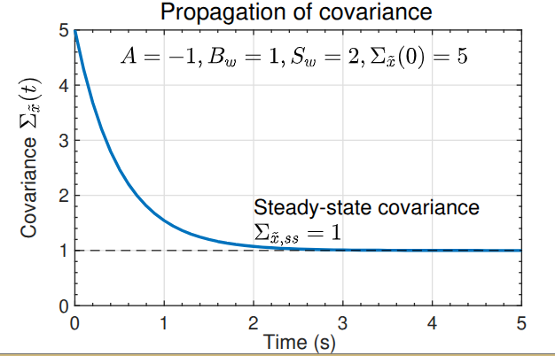

# 1.3.6: Continuous-time dynamic systems having random inputs

## Setting up the assumptions

- For continuous-time systems we have:

$$
\dot{x}(t) = A x(t) + B_u u(t) + B_w w(t),
$$

where $A$, $B_u$ and $B_w$ are assumed to be known and constant (can generalize later if needed) and:

- $x(t)$: State vector, a random process.
- $u(t)$: Deterministic control inputs.
- $w(t)$: Noise driving the process (process noise), a random process.

- Further:

$$
E[x(0)] = \bar{x}(0),
$$

$$
E\left[(x(0)-\bar{x}(0))(x(0)-\bar{x}(0))^T\right] = \Sigma_x(0),
$$

$$
E[w(t)] = 0,
$$

$$
E\left[w(t)w(\tau)^T\right] = S_w\,\delta(t-\tau).
$$

- $S_w$ is the spectral density of $w(t)$.

{group="slides"}

## Propagation of the mean

- Easiest analysis is to discretize model; then, use results obtained earlier for discrete-time systems letting $\Delta t \to 0$.
- We drop deterministic inputs $u(t)$ from the model for simplicity. (They affect only the mean, and in known ways, and we add their influence back in later.)
- Starting with the discrete case, we have:

$$
\bar{x}_k = A_d \bar{x}_{k-1} + B_d u_{k-1}
$$

$$
A_d = e^{A\Delta t} \approx I + A\Delta t + O(\Delta t^2).
$$

- Let $\Delta t \to 0$ and consider case when $u_k = 0$ for all $k$.

$$
\bar{x}_k = (A\Delta t + I)\bar{x}_{k-1}
$$

$$
\frac{\bar{x}_k - \bar{x}_{k-1}}{\Delta t} = A\bar{x}_{k-1}.
$$

- As $\Delta t \to 0$,

$$
\dot{\bar{x}}(t) = A\bar{x}(t),
$$

as we might expect.

## Summarizing propagation of the mean

- We add back in the influence of $u(t)$, skipping the full derivation here for simplicity.

Overall, the mean propagation for continuous-time dynamic systems having random inputs is:

$$
\bar{x}(0)\;\text{: Given}
$$

$$
\dot{\bar{x}}(t) = A\bar{x}(t) + B_u u(t).
$$

Simulation of a deterministic system and simulation of the mean value of the state for a stochastic system are treated the same way.

{group="slides"}

## Variations about the mean

- The result for discrete-time systems was:

$$
\Sigma_{\tilde{x},k} = A_d \Sigma_{\tilde{x},k-1} A_d^T + \Sigma_{\tilde{w}}.
$$

- But, we need a way to relate discrete $\Sigma_{\tilde{w}}$ to a continuous spectral density $S_w$ before we can proceed.
- Recall the discrete system response in terms of continuous system matrices:

$$
x_k = e^{A\Delta t}x_{k-1} + \int_{(k-1)\Delta t}^{k\Delta t} e^{A(k\Delta t-\tau)} B_w w(\tau)\,d\tau
$$

$$
= e^{A\Delta t}x_{k-1} + w_{k-1}.
$$

- The integral explicitly accounts for variations in the noise during $\Delta t$. We have:

$$
w_{k-1} = \int_{(k-1)\Delta t}^{k\Delta t} e^{A(k\Delta t-\tau)} B_w w(\tau)\,d\tau.
$$

## Evaluating $\Sigma_{\tilde{w}}$

- Recall, $w_k$ is discrete white noise having covariance:

$$
E[w_k w_l^T] =
\begin{cases}
\Sigma_{\tilde{w}}, & k=l \\
0, & k\neq l
\end{cases}
$$

- Form outer product using $w_{k-1}$ from prior slide to get equivalent $\Sigma_{\tilde{w}}$:

$$
\Sigma_{\tilde{w}} = E\left[\left(\int_{(k-1)\Delta t}^{k\Delta t} e^{A(k\Delta t-\tau)}B_w w(\tau)\,d\tau\right)
\left(\int_{(k-1)\Delta t}^{k\Delta t} e^{A(k\Delta t-\gamma)}B_w w(\gamma)\,d\gamma\right)^T\right]
$$

$$
= E\left[\int_{(k-1)\Delta t}^{k\Delta t}\int_{(k-1)\Delta t}^{k\Delta t}
 e^{A(k\Delta t-\tau)}B_w w(\tau)w(\gamma)^T B_w^T e^{A^T(k\Delta t-\gamma)}\,d\tau\,d\gamma\right].
$$

- Big ugly mess but has two saving graces:
  1. Expectation can go inside integrals.
  2. $E[w(\tau)w(\gamma)^T] = S_w\,\delta(\tau-\gamma)$ -> one of the integrals drops out.

## The solution for $\Sigma_{\tilde{w}}$

- So, we have:

$$
\Sigma_{\tilde{w}} = \int_{(k-1)\Delta t}^{k\Delta t} e^{A(k\Delta t-\tau)} B_w S_w B_w^T e^{A^T(k\Delta t-\tau)}\,d\tau.
$$

- **KEY POINT:** While $S_w$ may have a simple form, $\Sigma_{\tilde{w}}$ will be a full matrix in general.
- One approach to solving the integral is to approximate.
  - As $\Delta t \to 0$, then $k\Delta t - \tau \to 0$ and

$$
e^{A(k\Delta t-\tau)} \approx I + A(k\Delta t-\tau) + \cdots
$$

  - That is, $e^{A(k\Delta t-\tau)} \approx I$. Then,

$$
\Sigma_{\tilde{w}} \approx (B_w S_w B_w^T)\,\Delta t.
$$

- We will see a better method to evaluate $\Sigma_{\tilde{w}}$ when $\Delta t \neq 0$, but for now we continue with this result to determine the continuous-time system covariance propagation.

{group="slides"}

## The solution for $\Sigma_{\tilde{x},k}$

- We now substitute $\Sigma_{\tilde{w}} \approx B_w S_w B_w^T\Delta t$ and $A_d \approx (I + A\Delta t)$ into the covariance-propagation equation:

$$
\Sigma_{\tilde{x},k} = A_d \Sigma_{\tilde{x},k-1} A_d^T + \Sigma_{\tilde{w}}
$$

$$
\approx (I + A\Delta t)\Sigma_{\tilde{x},k-1}(I + A\Delta t)^T + B_w S_w B_w^T\Delta t
$$

$$
= \Sigma_{\tilde{x},k-1} + \Delta t\left(A\Sigma_{\tilde{x},k-1} + \Sigma_{\tilde{x},k-1}A^T + B_w S_w B_w^T\right) + O(\Delta t^2)
$$

$$
\frac{\Sigma_{\tilde{x},k} - \Sigma_{\tilde{x},k-1}}{\Delta t}
= A\Sigma_{\tilde{x},k-1} + \Sigma_{\tilde{x},k-1}A^T + B_w S_w B_w^T + O(\Delta t).
$$

- As $\Delta t \to 0$,

$$
\dot{\Sigma}_x(t) = A\Sigma_x(t) + \Sigma_x(t)A^T + B_w S_w B_w^T,
$$

initialized with $\Sigma_x(0)$.

## Interpreting the solution for $\Sigma_{\tilde{x},k}$

- Covariance:

$$
\dot{\Sigma}_x(t) = A\Sigma_x(t) + \Sigma_x(t)A^T + B_w S_w B_w^T.
$$

- This is a matrix differential equation.
- Symmetric, so don't need to solve for every element. Two effects:
  - $A\Sigma_x(t) + \Sigma_x(t)A^T$: Homogeneous part. Contractive for stable $A$. Reduces covariance.
  - $B_w S_w B_w^T$: Impact of process noise. Tends to increase covariance.
- Steady-state solution: Effects balance for systems having constant matrices $A$, $B_w$, $S_w$ and stable $A$.

$$
A\Sigma_{x,ss} + \Sigma_{x,ss}A^T + B_w S_w B_w^T = 0.
$$

- This is a continuous-time Lyapunov equation. In Octave, `lyap.m`.

## Summarizing propagation of the covariance

- So, after a short derivation, we now have the solution for how the uncertainty of the state is propagated over time.

The covariance propagation is:

$$
\Sigma_x(0)\;\text{: Given}
$$

$$
\dot{\Sigma}_x(t) = A\Sigma_x(t) + \Sigma_x(t)A^T + B_w S_w B_w^T.
$$

In this equation, $A\Sigma_x(t) + \Sigma_x(t)A^T$ is the homogeneous part; $B_w S_w B_w^T$ is the driving term.

{group="slides"}

## An example, solving for steady-state

- $\dot{x}(t) = Ax(t) + B_w w(t)$, where $A$ and $B_w$ are scalars.
- Then,

$$
\dot{\Sigma}_x = 2A\Sigma_x + B_w^2 S_w;
$$

the solution to this ODE is:

$$
\Sigma_x(t) = \frac{B_w^2 S_w}{2A}\left(e^{2At} - 1\right) + \Sigma_x(0)e^{2At}.
$$

- If $A < 0$ (stable) then the initial condition contribution goes to zero and:

$$
\Sigma_{x,ss} = -\frac{B_w^2 S_w}{2A}.
$$

- Increased $\Sigma_{x,ss}$ as more noise added via the $B_w^2 S_w$ term; decreased $\Sigma_{x,ss}$ as $A$ becomes "more stable".
- Example shown to the right.

## Summary

- With deterministic state-space systems, we can simulate a model and have no uncertainty regarding the state trajectory.
- With stochastic state-space systems, we instead track the mean and covariance of the RV representing the state at every point in time.
- You learned how to update the mean and covariance:

$$
\dot{\bar{x}}(t) = A\bar{x}(t) + B_u u(t).
$$

$$
\dot{\Sigma}_x(t) = A\Sigma_x(t) + \Sigma_x(t)A^T + B_w S_w B_w^T.
$$

- The true state $x(t)$ is expected to be within

$$
\bar{x}(t) \pm 3\sqrt{\operatorname{diag}(\Sigma_x(t))}
$$

approximately $99.7\%$ of the time if the model is correct and noises are Gaussian.

{group="slides"}
