For the longest time I wanted to cover measure based probability in my notes. 

I recently took a couple of courses by Jen Corcoran on coursera and when I came across her  online course on measure based probability, I decided to focus on it.

## Lesson 1: Measurable Sets

This lesson is a rather informal introduction to the measurable sets. We will define measures in lesson 2, but we get to build up to it by trying to understand what it means to measure a set.

::: {#vid-A04-L01 .column-margin }

:::

This video introduces measure-theoretic probability, an advanced course that unifies discrete and continuous probability. The instructor, Jem, explains that measure theory is a language that allows for a more comprehensive discussion of probability concepts.

The core of measure theory revolves around sets. Jem poses a thought experiment, asking the viewer to "measure" an irregular 2D set (2:13), highlighting that "measure" needs a clear definition, which can include area, length, volume, or other interpretations (2:42).

The video then delves into key definitions:

$\Omega$
    : A non-empty set representing the sample space of an experiment, encompassing all possible outcomes.

Event (A)
    : A subset of $\Omega$.

Probability (P)
    : A function that assigns numbers between zero and one to subsets of $\Omega$.

Jem elaborates on fields (or algebras), which are collections of subsets of $\Omega$ with three crucial properties:

Contains Omega: The collection must include the entire sample space (9:08).
Closed under complements: If a set is in the collection, its complement must also be closed under finite unions: The union of any finite number of sets in the collection must also be in the collection. This property implies closure under finite intersections due to De Morgan's laws (11:51).
The video distinguishes sigma fields (or sigma algebras) from fields 

A sigma field is a field that is also closed under countable unions. This means that a sigma field is automatically a field, but a field is not necessarily a sigma field.

Finally, Jem provides examples of fields and sigma fields:

Trivial sigma field
    : Consists only of $\Omega$ and the empty set.

Power set of $\Omega$
    : The collection of all possible subsets of $\Omega$, which forms a sigma field.

Sigma field generated by $A$
    : A small sigma field formed by a set $A$, its complement, the empty set, and $\Omega$.

Jem also demonstrates an example of a field that is not a sigma field using intervals on the real number line, illustrating that while it might be closed under finite unions, it may not be closed under countable (infinite) unions . The next video will discuss Borel sets, a special type of $\sigma$-field.

### Measure theory is focused on sets!

::: {#fig-l01-s00 .column-margin }
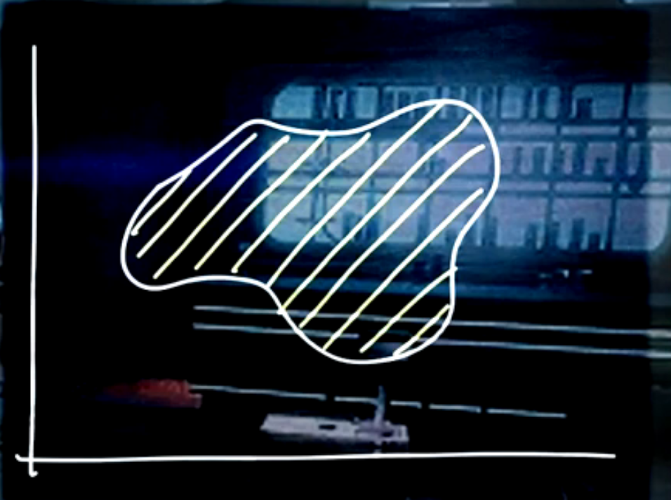

this is a set how can we measure it?
:::

### Lebesgue Measure

Let $\Omega$ be a non-empty set.

Think of $\Omega = \{1, 2, 3, 4, 5\}$ corresponding to a sample space of an experiment e.g. outcomes of tossing a coin. 

::: {#def-sample-space}
## Sample Space
Is the set of all possible outcomes of an experiment
:::

Then we can define a measure $\mu$ on $\Omega$ by assigning a non-negative number to each outcome. 

For example, we could define $\mu$ as follows:

::: {#fig-l01-s01 .column-margin }
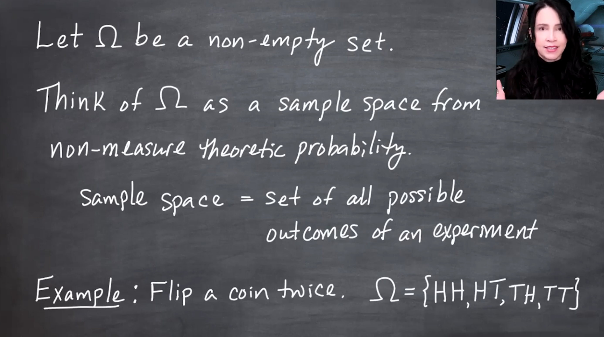

Starting with a set $\Omega$, an abstraction of a sample space.
:::

The set $\Omega$ is any set, but we can think about it as an abstraction of our coin toss sample space. 

Jen point out that it is an abstract set and I take it to mean that we might not be able to come up with an experiment that has the its sample space, i.e. outcomes as the subsets in $\Omega$ but we can still define a measure on it.

::: {#fig-l01-s02 .column-margin }
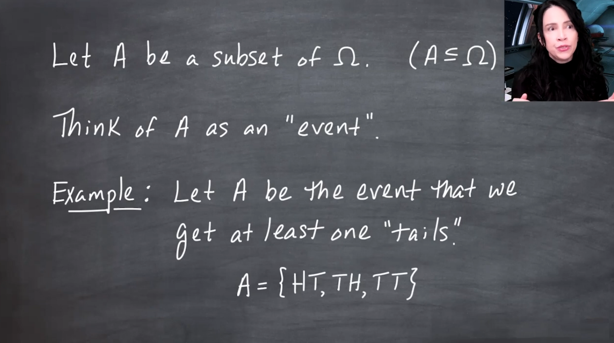
:::

::: {#fig-l01-s03 .column-margin }
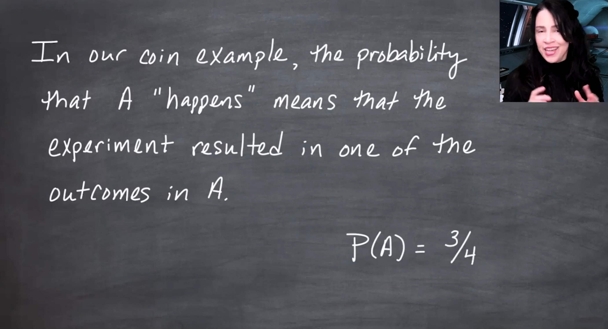
:::

::: {#fig-l01-s04 .column-margin }
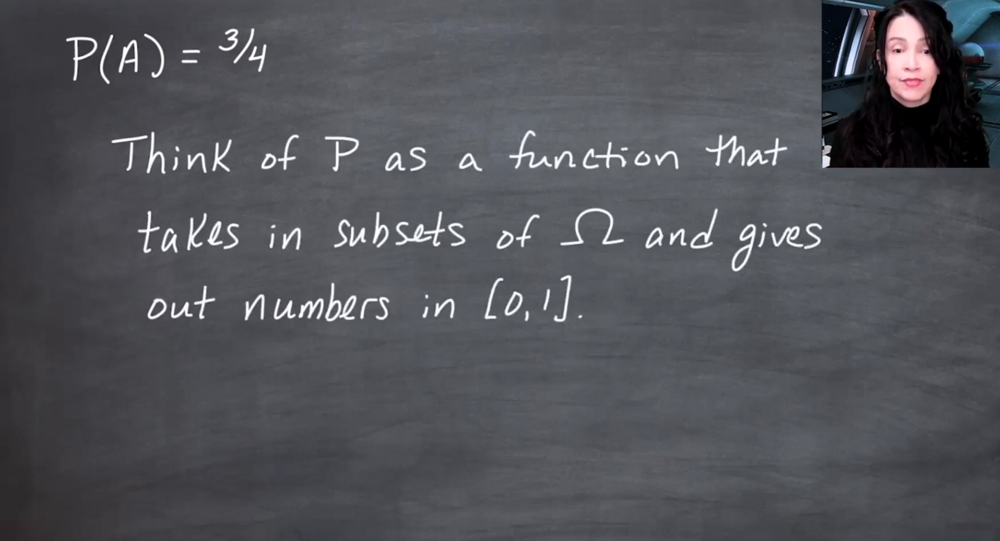
:::

::: {#fig-l01-s05 .column-margin }
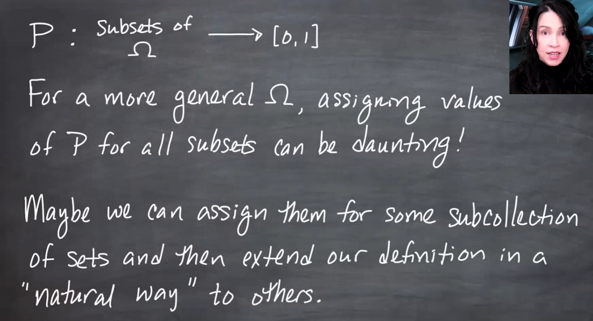
:::

::: {#fig-l01-s06 .column-margin }
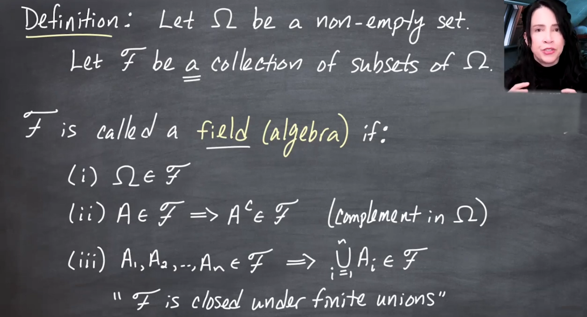
:::

::: {#fig-l01-s07 .column-margin }
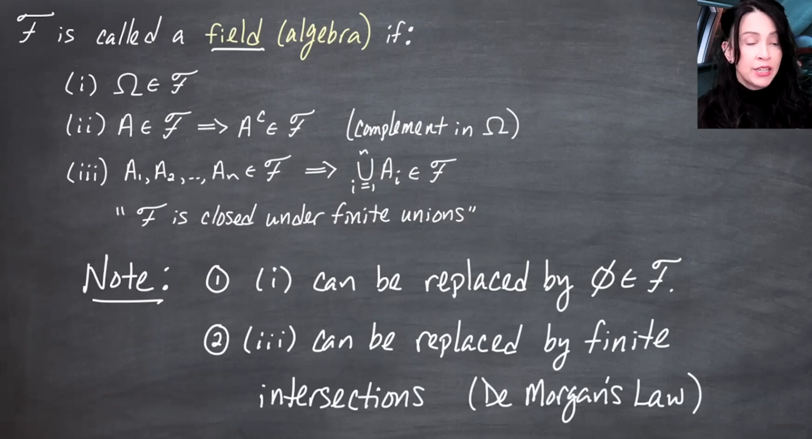
:::

::: {#fig-l01-s08 .column-margin }
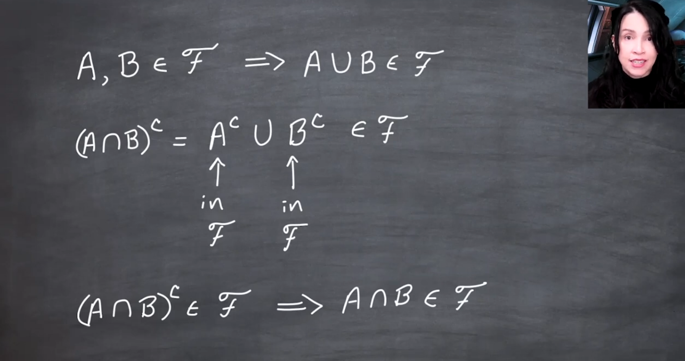
:::

::: {#fig-l01-s09 .column-margin }
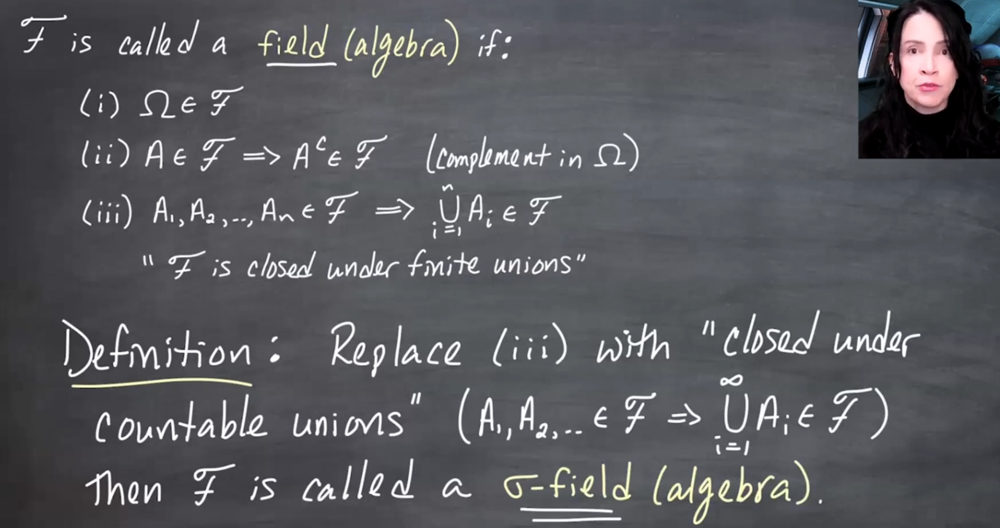
:::

::: {#fig-l01-s10 .column-margin }
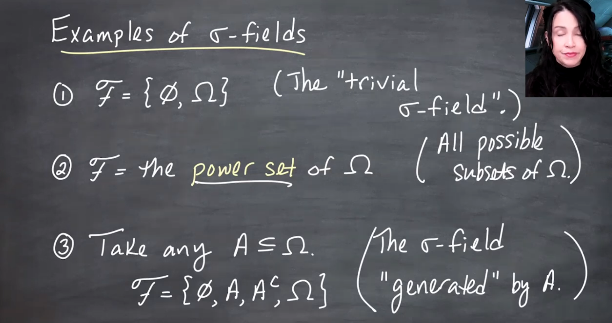
:::

--- 

::: {#fig-l01-s11 .column-margin }
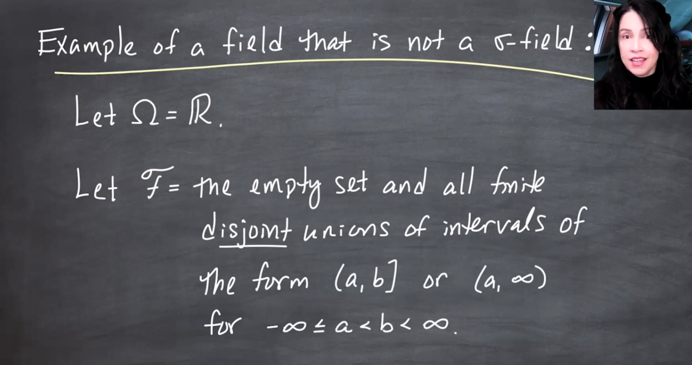
:::

## Examples of  $\sigma$-fields

1. $\mathcal{F}=\{\Omega, \emptyset\}$ is a $\sigma$-field. It is called the trivial $\sigma$-field.
2. $\mathcal{F}=\mathcal{P}(\Omega)$, the power set of $\Omega$, is a $\sigma$-field. It is called the discrete $\sigma$-field.
3. $\mathcal{F}=\{\emptyset, A, A^c, \Omega\}$ is a $\sigma$-field generated by a set $A$.

--- 

::: {#fig-l01-s12 .column-margin }
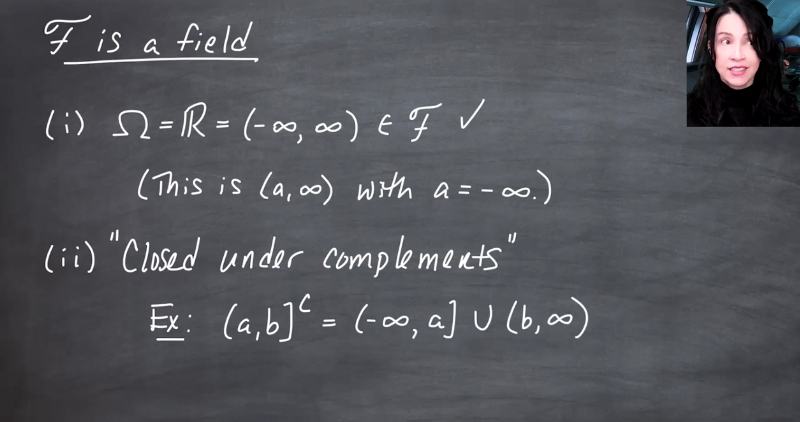
:::

::: {#fig-l01-s13 .column-margin }
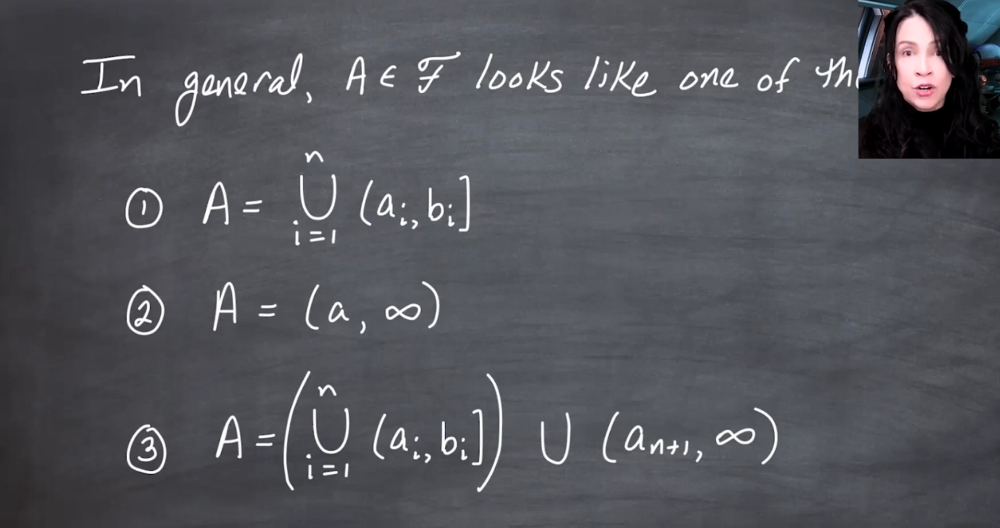
:::

::: {#fig-l01-s14 .column-margin }

:::

::: {#fig-l01-s15 .column-margin }
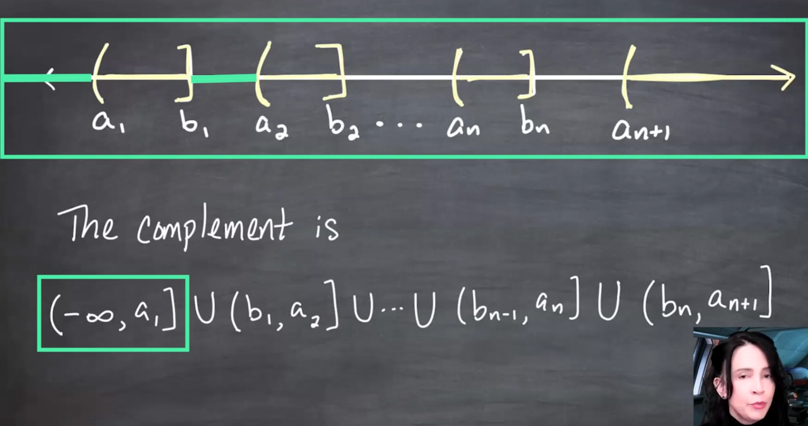
:::

::: {#fig-l01-s16 .column-margin }
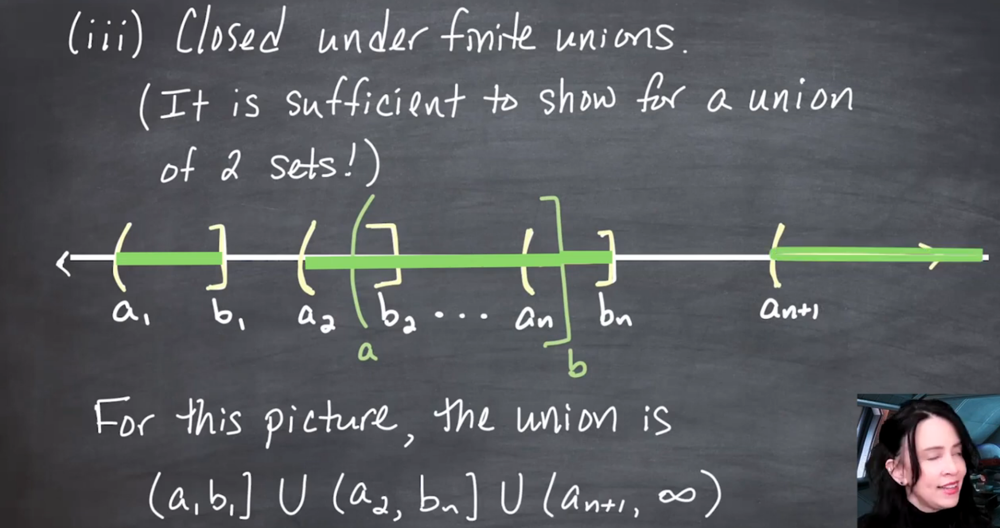
:::

we now show that the field of sets that we have defined closed under countable unions of 2 sets.

### Counter example

A field that is not a $\sigma$-field

::: {#fig-l01-s17 .column-margin }
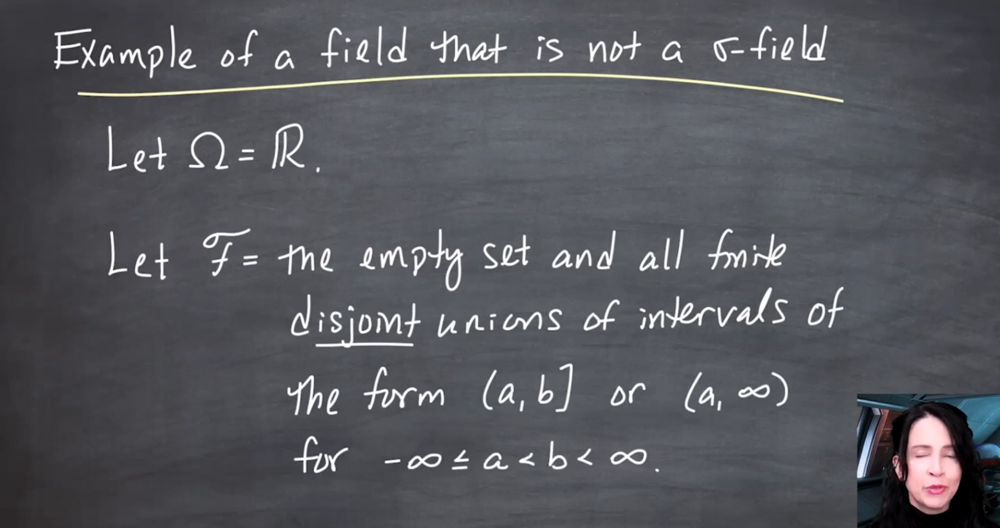

a field that is not a $\sigma$-field
:::

::: {#fig-l01-s18 .column-margin }
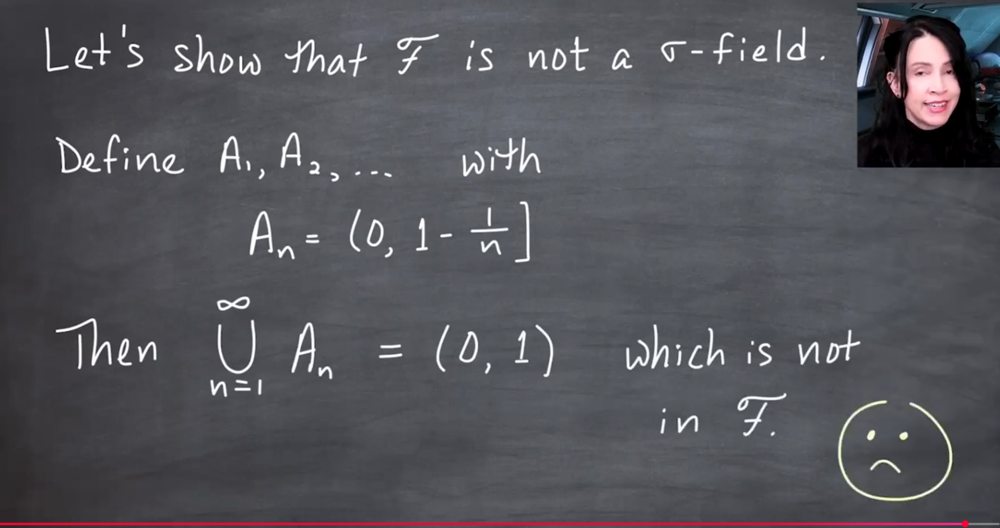

:::

