::: {#vid-C99-L03 .column-margin}


measurable spaces, measures, probability measures, and Borel sets on $[0,1]$.
:::

## Lesson map

- The union of two $\sigma$-fields need not be a $\sigma$-field.
- Intersections of $\sigma$-fields: finite, countable, and uncountable.
- Measurable sets.
- Measurable spaces.
- Definition of a measure.
- Countable additivity implies finite additivity.
- Alternative axiom replacing $\mu(\emptyset)=0$.
- Probability measures.
- Monotonicity: if $A \subseteq B$, then $\mu(A)\leq \mu(B)$.
- Countable subadditivity.
- Borel $\sigma$-field on $[0,1]$.
- Lebesgue measure on $[0,1]$ as a probability measure.
- Restricting a generated $\sigma$-field to a subset.

## Recap: Disjoint sets {#sec-disjoint-sets}

Lets recall the definition of disjoint sets, which will be needed very soon. [disjoint sets]{.column-margin} 

::: {#def-disjoint-sets}
## Disjoint sets

Two sets $A$ and $B$ are disjoint when they share no elements: $A\cap B=\emptyset$. 

The empty set is disjoint from every set because $\emptyset\cap A=\emptyset$ for all $A$.
:::

Disjoint sets are can simplify proofs since their union has no overlap thus avoiding double-counting their content.

## Recap: unions and intersections of $\sigma$-fields {#sec-unions-intersections}

::: {#fig-l03-slide-02 .column-margin}
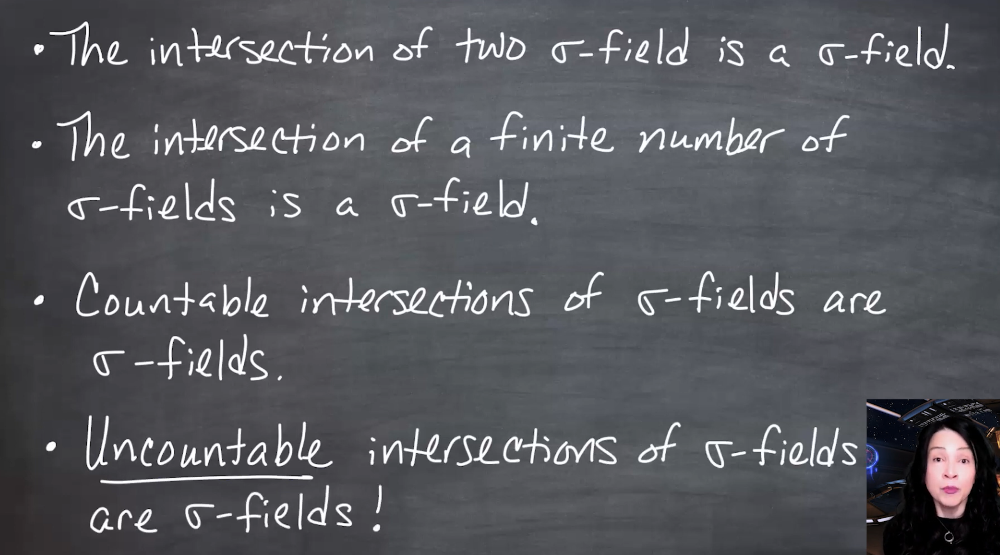{fig-alt="A chalkboard lists four facts: the intersection of two $\sigma$-fields is a $\sigma$-field; the intersection of a finite number of $\sigma$-fields is a $\sigma$-field; countable intersections of $\sigma$-fields are $\sigma$-fields; and uncountable intersections of $\sigma$-fields are $\sigma$-fields." group="slides"}

The intersection result scales beyond two $\sigma$-fields. If every $\mathcal{F}_\alpha$ is a $\sigma$-field on the same underlying set $\Omega$, then $\bigcap_{\alpha\in I}\mathcal{F}_\alpha$ is also a $\sigma$-field, even when the index set $I$ is uncountable.
:::

:::: {.proof}

::: {#fig-l03-slide-03 .column-margin}
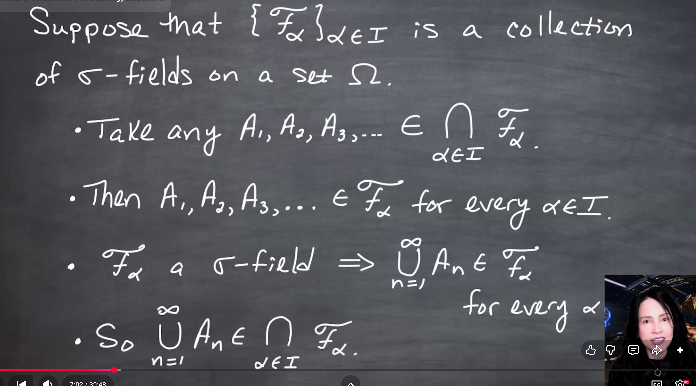{fig-alt="A chalkboard proof assumes a collection of $\sigma$-fields indexed by alpha in I. It takes A1, A2, A3 and so on in the intersection over alpha of F alpha, notes that all An belong to every F alpha, and concludes that the countable union of the An belongs to every F alpha and therefore to the intersection." group="slides"}

[The hardest property is closure under countable unions.]{.mark} If $A_1,A_2,\ldots \in \bigcap_{\alpha\in I}\mathcal{F}_\alpha$, then each $A_n$ belongs to every $\mathcal{F}_\alpha$. Since each $\mathcal{F}_\alpha$ is a $\sigma$-field, $\bigcup_{n=1}^{\infty}A_n \in \mathcal{F}_\alpha$ for every $\alpha$, so the union lies in the intersection.
:::

::::

The previous lesson showed that intersections of $\sigma$-fields are again $\sigma$-fields.

::: {.callout-warning}
Unions behave differently from intersections. $\sigma$-fields are closed under countable intersections However, [the union of two $\sigma$-fields may fail to be closed under the operations required of a $\sigma$-field.]{.mark} See the counter-example in @exm-union-sigma-fields-counterexample.
:::

If $A\subseteq B$, then $A\cup B=B$, so this particular obstruction disappears. But for generic sets $A$ and $B$, the union $\mathcal{F}_1\cup\mathcal{F}_2$ is not guaranteed to be a $\sigma$-field.

The union of two or more $\sigma$-fields is not necessarily a $\sigma$-field.

::: {#exm-union-sigma-fields-counterexample}
## Counter-example to closure under union for $\sigma$-fields

Let $A,B$ be subsets of $\Omega$  And let us construct the following two $\sigma$-fields, 

$\mathcal{F}_1=\sigma(\{A\})$and $\mathcal{F}_2=\sigma(\{B\})$, which are the smallest $\sigma$-fields containing $A$ and $B$, respectively. Their union is:

$$
\mathcal{F}_1\cup \mathcal{F}_2=\{\emptyset, A, A^c, B, B^c, \Omega\}
$$

We can see that this is not a $\sigma$-field, as it does not contain $A \cup B$, so it may fail closure under finite unions, and hence countable, unions. $\blacksquare$
:::

The same proof also gives the familiar special cases: 

- two intersections, 
- finite intersections, and 
- countable intersections. 

[The only essential requirement is that all $\sigma$-fields are defined on the same underlying set $\Omega$.]{.mark}

## Measurable sets and measurable spaces {#sec-measurable-sets}

The notation $(\Omega,\mathcal{F})$ packages the sample space and the collection of measurable sets. 
From this point onward, saying "let $(\Omega,\mathcal{F})$ be a measurable space" means $\Omega$ is non-empty and $\mathcal{F}$ is a $\sigma$-field on $\Omega$.

::: {#def-measurable-set}
## Measurable set

Let $\mathcal{F}$ be a $\sigma$-field on $\Omega$.  
A set $A$ is called **measurable** if $A\in\mathcal{F}$.
:::

::: {#def-measurable-space}
## Measurable space

A **measurable space** is a pair $(\Omega,\mathcal{F}),$ where $\Omega$ is a non-empty set and $\mathcal{F}$ is a $\sigma$-field on $\Omega$.
:::

## Measures {#sec-measures}

We will now define measures, which are the main objects of interest in measure theory and probability. Measure theory came out of attempts to make the integral more rigorous, but we ended up with a powerful abstraction that can be used to quantify the size of sets in many different ways.

The intuition is that set have different types of sizes. Radius, Area, Volume, fractal dimension and which we can use to quantify and order them and we want to be able to use an abstraction for quantifying all these different sizes by using a function that satisfies the measure axioms.

[A **measure** is a *function* that assigns a non-negative extended real number to each measurable set.]{.mark} 
The measure $\mu$ is defined on the $\sigma$-field $\mathcal{F}$, **not directly on all subsets of $\Omega$.** 
We now bring the definition of a measure using properties of zero measure for the $\emptyset$ and countable additivity for disjoint sets. The definition of a measure is short, but it gives several important facts for free, such as monotonicity and countable subadditivity.

It sends measurable sets to values in $[0,\infty]$ and is countably additive only over disjoint measurable sets.

::: {#def-measure}
## Measure

Let $(\Omega,\mathcal{F})$ be a measurable space.  A **measure** on this space is a function
$\mu:\mathcal{F}\to [0,\infty]$ such that:

1. $\mu(\emptyset)=0$.
2. If $A_1,A_2,\ldots \in \mathcal{F}$ are pairwise disjoint, then

$$
\mu\left(\bigcup_{n=1}^{\infty} A_n\right) = \sum_{n=1}^{\infty}\mu(A_n). \qquad \text {(countable additivity)}\qquad
$$ {#eq-countable-additivity}

:::

The disjointness condition is essential: if the sets overlap, summing the individual measures double-counts the overlaps.

## Countable additivity implies finite additivity

::: {#fig-l03-slide-06 .column-margin}
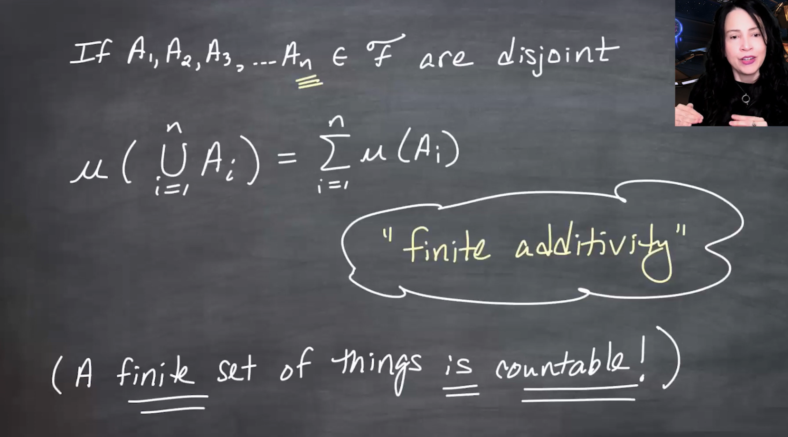{fig-alt="A chalkboard states that if A1 through An in F are disjoint, then mu of the finite union from i equals 1 to n of Ai equals the finite sum of mu(Ai). It labels this finite additivity and notes that a finite set of things is countable." group="slides"}

A finite collection is countable. By padding the collection with empty sets, countable additivity gives finite additivity without adding it as a separate axiom.
:::

Finite additivity is a consequence of countable additivity.

If $A_1,\ldots,A_n\in\mathcal{F}$ are disjoint, then

$$
\mu\left(\bigcup_{i=1}^{n}A_i\right) = \sum_{i=1}^{n}\mu(A_i). \qquad \text {(finite additivity)}\qquad
$$ {#eq-finite-additivity}

To see this as a special case of countable additivity, append infinitely many copies of $\emptyset$:

$$
A_1,\ldots,A_n,\emptyset,\emptyset,\ldots
$$

Since $\emptyset$ is disjoint from every set, including itself, countable additivity applies.

## Alternative axiom for the empty set

The usual measure axiom $\mu(\emptyset)=0$ can be replaced by a slightly different condition:

> There exists at least one set $A\in\mathcal{F}$ such that $\mu(A)<\infty$.

Together with countable additivity, this implies $\mu(\emptyset)=0$.

::: {#fig-l03-slide-08 .column-margin}
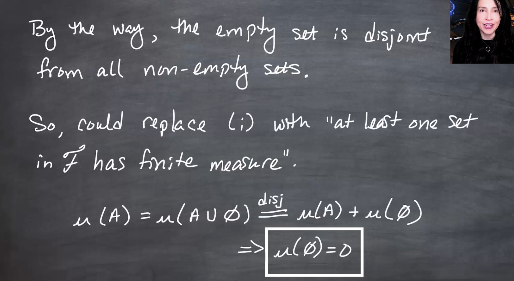{fig-alt="A chalkboard notes that the empty set is disjoint from all non-empty sets and says one can replace rule i with the condition that at least one set in F has finite measure. It then shows mu(A) equals mu(A union empty set), which by disjoint additivity equals mu(A) plus mu(empty set), implying mu(empty set) equals zero." group="slides"}

If $\mu(A)<\infty$, then $A=A\cup\emptyset$ with $A$ and $\emptyset$ disjoint. Finite additivity gives $\mu(A)=\mu(A)+\mu(\emptyset)$, so subtracting the finite number $\mu(A)$ gives $\mu(\emptyset)=0$.
:::

The finiteness assumption matters because expressions like $\infty=\infty+c$ do not let us conclude $c=0$ in ordinary extended-real arithmetic.

## Probability Measures {#sec-probability-measures}

So now that we have defined measures, we can define probability measures as a special case of measures. Probability measures are the main objects of interest in probability theory.

::: {#def-probability-measure}
## Probability Measure

Let $(\Omega,\mathcal{F})$ be a measurable space.  
A **probability measure** is a function that is a measure $P:\mathcal{F}\to [0,1]$
such that $P(\Omega)=1$
:::

A probability measure is still a measure, so it inherits $\mu(\emptyset)=0$ and countable additivity. 

The extra probability-specific condition is normalization: $P(\Omega)=1$. 
A probability measure is therefore a normalized measure: the whole space has total mass one.

Notation:

- $\mu(\cdot)$ denotes a *generic measure*.
- $P(\cdot)$ denotes a *probability measure*.
- $\lambda(\cdot)$ denotes *Lebesgue measure*. On $\mathbb{R}$, $\lambda((a,b))=b-a$ when $a<b$.

::: {#exm-probability-measure}
## Example: Lebesgue measure on $[0,1]$ is a probability measure
Let $\Omega = \mathbb{R}$, if we define $\lambda((a,b))=b-a$ when $a<b$.
then $\lambda$ is a measure on the Borel $\sigma$-field on $\mathbb{R}$, and its restriction to $[0,1]$ is a probability measure.
:::

## Consequences of the definition of measure {#sec-consequences-measure-definition}

::: {#fig-l03-slide-11 .column-margin}
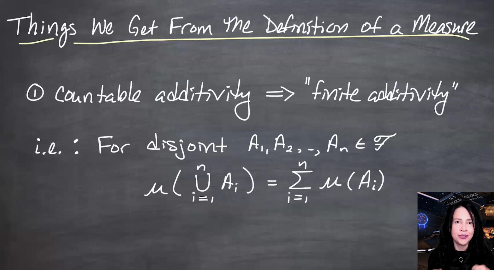{fig-alt="A chalkboard titled things we get from the definition of a measure lists item one: countable additivity implies finite additivity, and writes the finite-additivity formula for disjoint A1 through An." group="slides"}

Finite additivity is not an additional axiom. It follows by treating a finite collection as a countable collection padded by empty sets.
:::

The definition of measure is short, but it gives several important facts for free.

::: {#prp-finite-additivity}
## Finite additivity

If $A_1,\ldots,A_n\in\mathcal{F}$ are disjoint, then

$$
\mu\left(\bigcup_{i=1}^{n}A_i\right)
=
\sum_{i=1}^{n}\mu(A_i).
$$
:::

::: {#prp-probability-complement}
## Complement rule for probability

If $P$ is a probability measure and $A\in\mathcal{F}$, then

$$
P(A^c)=1-P(A).
$$
:::

Proof:

$$
1=P(\Omega)=P(A\cup A^c)=P(A)+P(A^c),
$$

because $A$ and $A^c$ are disjoint.

::: {#fig-l03-slide-12 .column-margin}
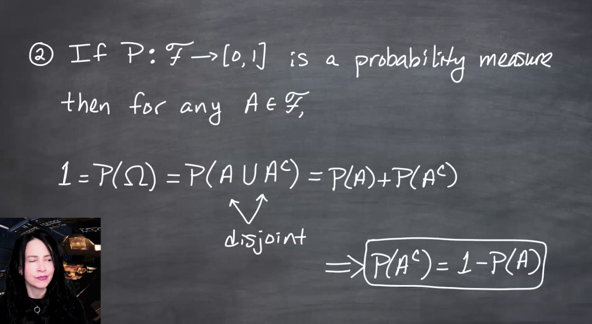{fig-alt="A chalkboard derives the complement rule. It assumes P from F to [0,1] is a probability measure, takes any A in F, writes 1 equals P(Omega) equals P(A union A complement), notes the sets are disjoint, and concludes P(A complement) equals 1 minus P(A)." group="slides"}

The usual probability identity $P(A^c)=1-P(A)$ is not a separate rule. It follows from normalization, complements in the $\sigma$-field, and finite additivity.
:::

::: {#prp-monotonicity}
## Monotonicity of measure

If $A,B\in\mathcal{F}$ and $A\subseteq B$, then $\mu(A)\leq \mu(B)$
:::

::: {.proof}
Proof:

Since $A\subseteq B$,

$$
B = A \cup (B\cap A^c),
$$

and the two sets on the right are disjoint. Therefore,

$$
\mu(B)=\mu(A)+\mu(B\cap A^c) \geq \mu(A),
$$

because measures are non-negative.
:::

::: {#fig-l03-slide-13 .column-margin}
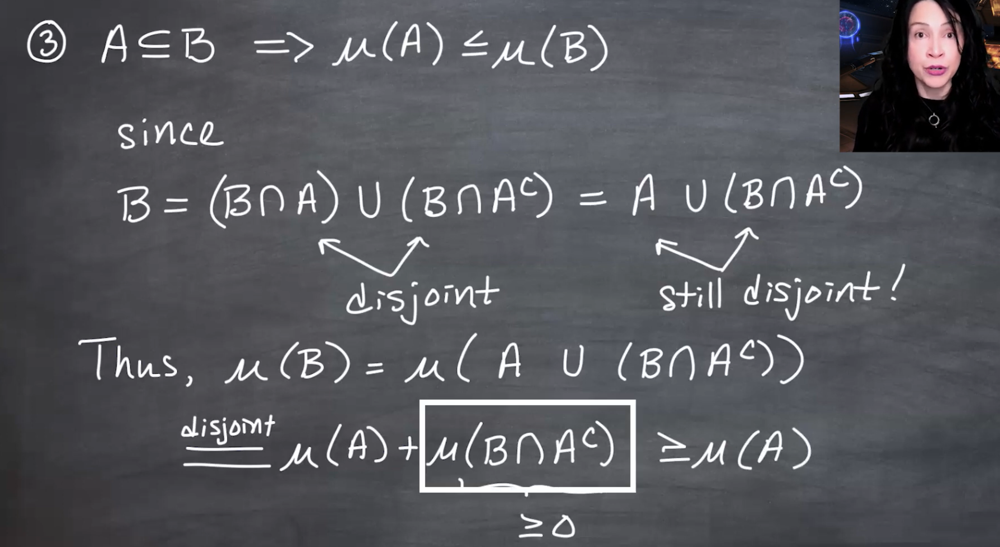{fig-alt="A chalkboard proves that A subset B implies mu(A) less than or equal to mu(B). It decomposes B as (B intersect A) union (B intersect A complement), then uses A subset B to rewrite this as A union (B intersect A complement), and applies disjoint finite additivity and non-negativity." group="slides"}

Monotonicity says larger sets cannot have smaller measure. The inequality need not be strict: a proper subset may have the same measure as the larger set.
:::

## Countable subadditivity {#sec-subadditivity}

::: {#prp-countable-subadditivity}
## Countable subadditivity

If $A_1,A_2,\ldots\in\mathcal{F}$, not necessarily disjoint, then

$$
\mu\left(\bigcup_{n=1}^{\infty}A_n\right)
\leq
\sum_{n=1}^{\infty}\mu(A_n).
$$
:::

::: {#fig-l03-slide-14 .column-margin}
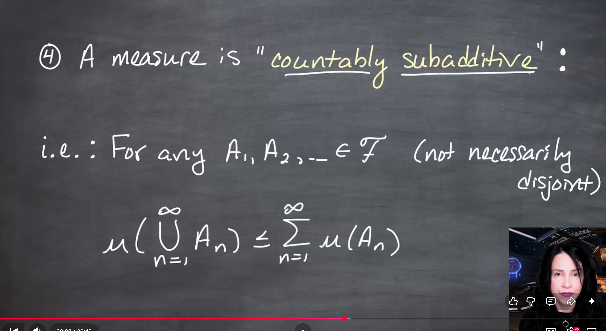{fig-alt="A chalkboard states that a measure is countably subadditive. For any A1, A2 and so on in F, not necessarily disjoint, mu of the countable union of An is less than or equal to the sum of mu(An)." group="slides"}

Countable additivity requires disjoint sets and gives equality. Countable subadditivity drops disjointness and gives an inequality, because overlapping regions may be counted more than once in the sum.
:::

::: {#fig-l03-slide-15 .column-margin}
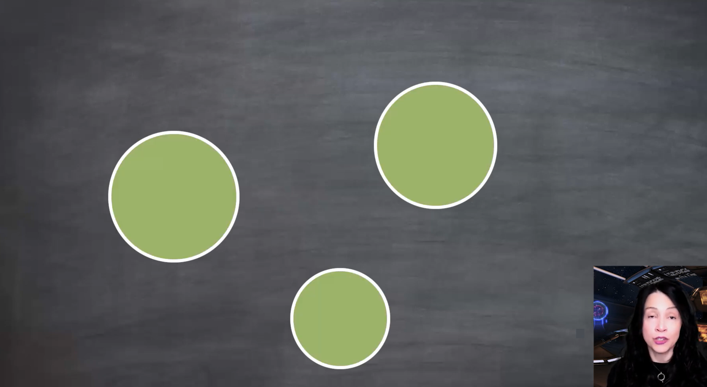{fig-alt="A visual diagram shows three separated green disks on a chalkboard background, illustrating disjoint sets whose union has measure equal to the sum of their individual measures." group="slides"}

For disjoint sets, the measure of the union is exactly the sum of the measures. The picture matches the area intuition: no overlap means no double-counting.
:::

::: {#fig-l03-slide-16 .column-margin}
{fig-alt="A visual diagram shows three overlapping green disks on a chalkboard background, illustrating that summing individual areas double-counts overlapping regions." group="slides"}

For overlapping sets, the sum of the individual measures counts the overlaps more than once. Therefore the measure of the union is less than or equal to the sum of the measures.
:::

To prove countable subadditivity, split the possibly overlapping sets into disjoint pieces.

::: {#fig-l03-slide-17 .column-margin}
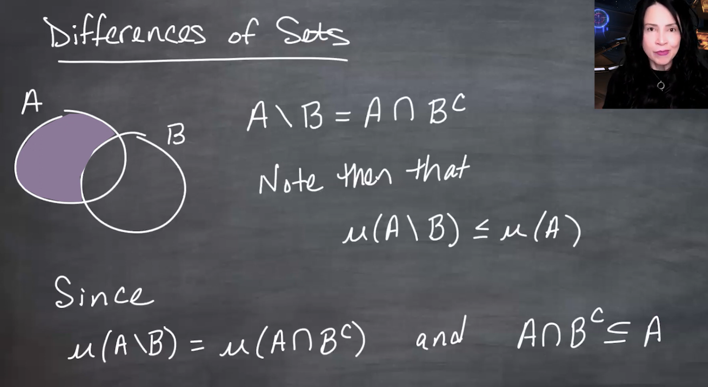{fig-alt="A chalkboard introduces differences of sets. It shows two overlapping sets A and B, shades the part of A outside B, and writes A backslash B equals A intersect B complement. It notes that mu(A backslash B) is less than or equal to mu(A)." group="slides"}

The set difference $A\setminus B$ means the part of $A$ outside $B$, so $A\setminus B=A\cap B^c$. Since $A\setminus B\subseteq A$, monotonicity gives $\mu(A\setminus B)\leq\mu(A)$.
:::

::: {#fig-l03-slide-18 .column-margin}
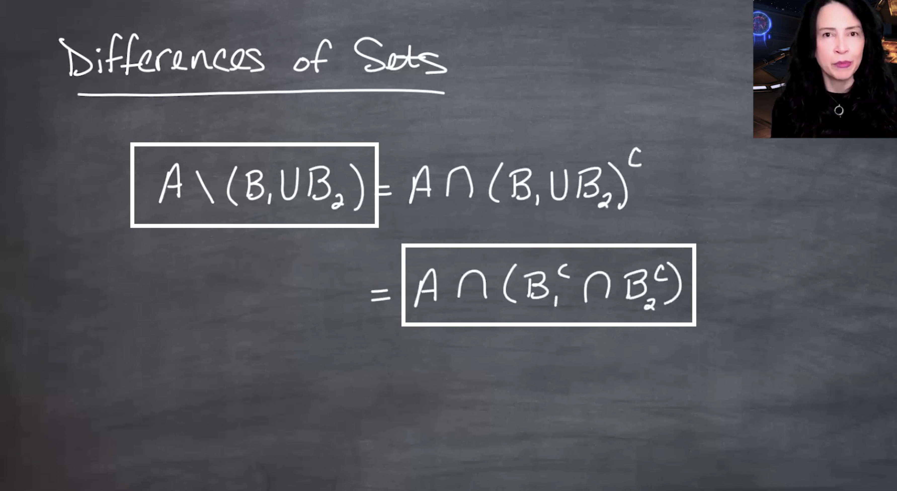{fig-alt="A chalkboard shows the identity A backslash (B1 union B2) equals A intersect (B1 union B2) complement, which equals A intersect B1 complement intersect B2 complement." group="slides"}

By De Morgan’s law, subtracting a union removes each component: $A\setminus(B_1\cup B_2)=A\cap B_1^c\cap B_2^c$. This is the template for removing earlier sets when constructing disjoint pieces.
:::

::: {#fig-l03-slide-19 .column-margin}
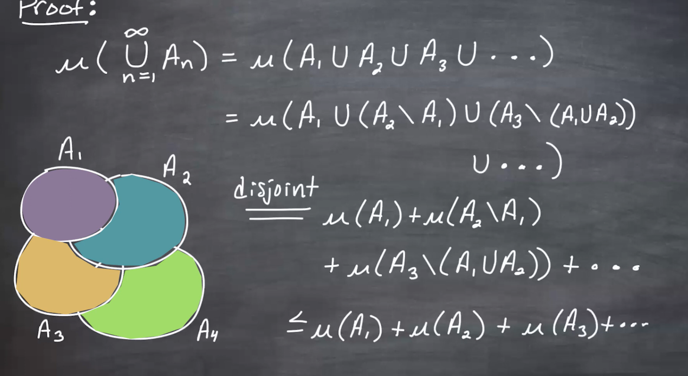{fig-alt="A chalkboard proof rewrites the union of A1, A2, A3 and so on as a disjoint union of A1, A2 minus A1, A3 minus (A1 union A2), and so on. It then applies countable additivity to the disjoint pieces and bounds each difference by the original set's measure." group="slides"}

Disjointize the sequence by keeping $A_1$, then only the new part of $A_2$, then only the new part of $A_3$, and so on. The union is unchanged, the pieces are disjoint, and each piece has measure at most the measure of the original $A_n$.
:::

## Measure spaces and probability spaces

::: {#fig-l03-slide-20 .column-margin}
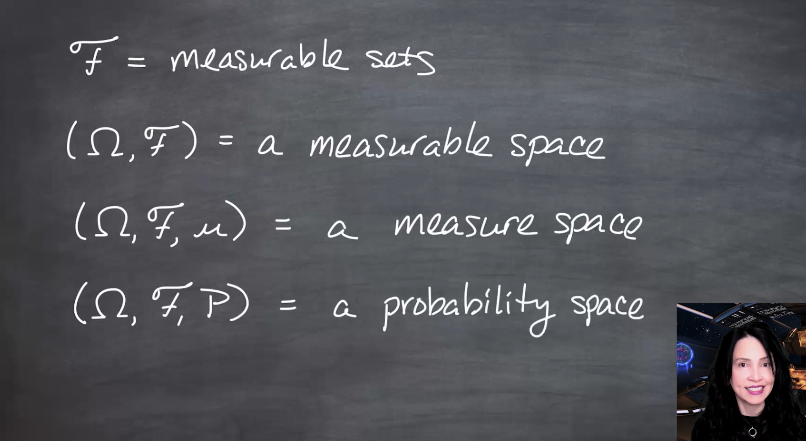{fig-alt="A chalkboard summarizes terminology: F equals measurable sets; (Omega, F) equals a measurable space; (Omega, F, mu) equals a measure space; and (Omega, F, P) equals a probability space." group="slides"}

The notation ladder is: $\mathcal{F}$ is the measurable sets, $(\Omega,\mathcal{F})$ is a measurable space, $(\Omega,\mathcal{F},\mu)$ is a measure space, and $(\Omega,\mathcal{F},P)$ is a probability space.
:::

::: {#def-measure-space}
## Measure space

A **measure space** is a triple

$$
(\Omega,\mathcal{F},\mu),
$$

where $(\Omega,\mathcal{F})$ is a measurable space and $\mu$ is a measure on $\mathcal{F}$.
:::

::: {#def-probability-space}
## Probability space

A **probability space** is a triple

$$
(\Omega,\mathcal{F},P),
$$

where $(\Omega,\mathcal{F})$ is a measurable space and $P$ is a probability measure on $\mathcal{F}$.
:::

## Examples of probability spaces

Coin-flipping probability space and Lebesgue measure on $[0,1]$ are examples of probability spaces.

 

::: {#exm-coin-flipping}
## Example 1: coin flipping

For three coin flips, the eight outcomes defines $\mathcal{F}$ as the power set of $\Omega$, defines $P$ from $\mathcal{F}$ to $[0,1]$ as the usual probabilities, and shows $P$ of the set containing HHH and HHT as the sum of the two singleton probabilities.

$$
\Omega=\{HHH,HHT,HTH,THH,HTT,THT,TTH,TTT\}.
$$

If $\mathcal{F}=\mathcal{P}(\Omega)$ is the power set, then every subset of outcomes is measurable. A probability measure $P$ can be defined by assigning probabilities to singleton outcomes and extending by additivity.

For a fair coin,

$$
P(\{HHH\})=P(\{HHT\})=\cdots=P(\{TTT\})=\frac18.
$$

Thus,

$$
P(\{HHH,HHT\})=P(\{HHH\})+P(\{HHT\})=\frac18+\frac18=\frac14.
$$

:::

The coin-flipping example shows why $\sigma$-fields are useful: once probabilities are assigned to basic outcomes, finite additivity extends them to larger events made from those outcomes.

::: {#fig-l03-slide-22 .column-margin}
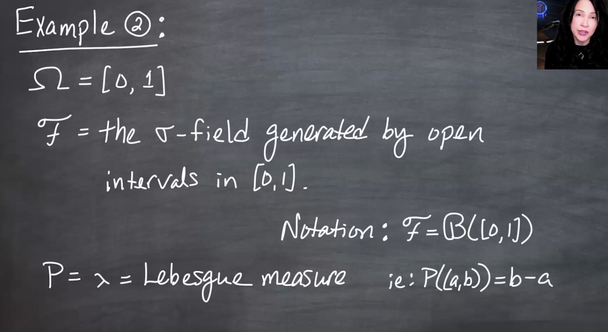{fig-alt="A chalkboard example sets Omega equal to the closed interval [0,1], defines F as the $\sigma$-field generated by open intervals in [0,1], writes F equals B([0,1]), and defines P as lambda, Lebesgue measure, with P((a,b)) equals b minus a." group="slides"}

On $[0,1]$, Lebesgue measure has total mass one, so it is a probability measure. This is the continuous analogue of the finite coin-flipping probability space.
:::

::: {#exm-lebesgue}
## Example 2: Lebesgue measure on $[0,1]$

Let $\Omega=[0,1]$ and let $\mathcal{F}$ be the Borel $\sigma$-field on $[0,1]$, written:

$$
\mathcal{B}([0,1]). \qquad\text{(Borel $\sigma$-field)}\qquad
$$ {#eq-borel-sigma-field}

Lebesgue measure $\lambda$ restricted to $[0,1]$ is a probability measure because

$$
\lambda([0,1])=1.
$$

For intervals inside $[0,1]$,

$$
\lambda((a,b))=b-a.
$$
:::

## Borel sets on $[0,1]$

::: {#fig-l03-slide-23 .column-margin}
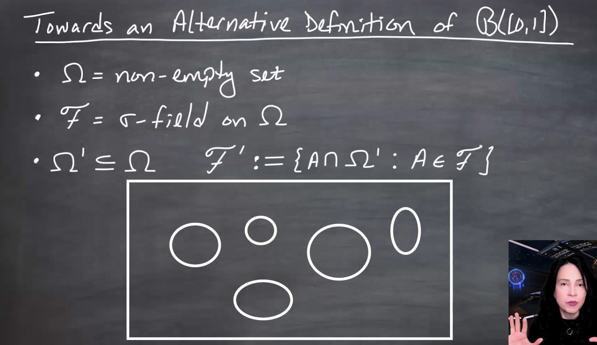{fig-alt="A chalkboard titled towards an alternative definition of B([0,1]) defines Omega as a non-empty set, F as a $\sigma$-field on Omega, Omega prime as a subset of Omega, and F prime as the collection of all A intersect Omega prime for A in F. A diagram shows a rectangular Omega prime cutting through several sets." group="slides"}

The restricted $\sigma$-field $\mathcal{F}'$ contains exactly the traces of sets in $\mathcal{F}$ on the smaller space $\Omega'$. This avoids separately defining openness inside the subspace.
:::

::: {#fig-l03-slide-24 .column-margin}
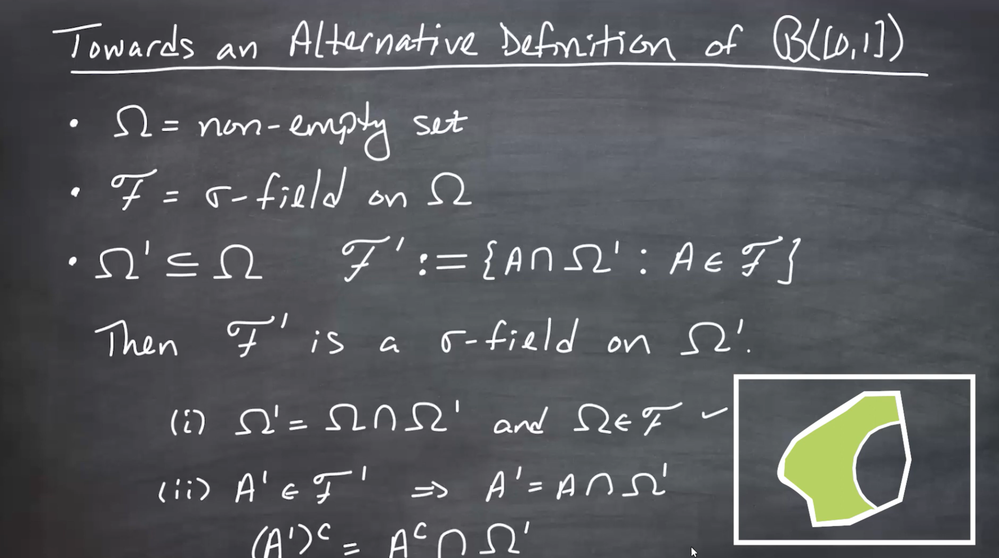{fig-alt="A chalkboard states that F prime is a $\sigma$-field on Omega prime. It verifies that Omega prime equals Omega intersect Omega prime and that complements in Omega prime can be written using complements in Omega intersected with Omega prime." group="slides"}

The full smaller space belongs to $\mathcal{F}'$ because $\Omega'=\Omega\cap\Omega'$ and $\Omega\in\mathcal{F}$. Complements are taken relative to $\Omega'$: if $A'=A\cap\Omega'$, then $(A')^c$ inside $\Omega'$ is $A^c\cap\Omega'$.
:::

::: {#fig-l03-slide-25 .column-margin}
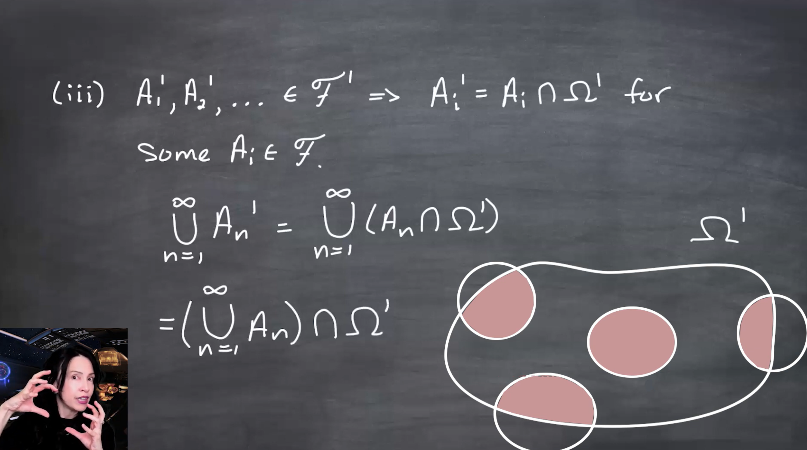{fig-alt="A chalkboard shows countable union closure for F prime. It writes Ai prime equals Ai intersect Omega prime and then shows the union over i of Ai prime equals the union over i of Ai, all intersected with Omega prime. A diagram shows sets clipped by Omega prime." group="slides"}

Countable unions commute with this restriction: $\bigcup_n(A_n\cap\Omega')=(\bigcup_n A_n)\cap\Omega'$. Since $\bigcup_nA_n\in\mathcal{F}$, the restricted union lies in $\mathcal{F}'$.
:::

Borel sets on [0,1] as restrictions of Borel sets on the real line.

The Borel $\sigma$-field on $[0,1]$ can be obtained by clipping real-line Borel sets to the interval: $\mathcal{B}([0,1])=\{A\cap[0,1]:A\in\mathcal{B}(\mathbb{R})\}$.

Defining open sets inside a restricted space such as $[0,1]$ requires topology. 
Instead of relying on that directly, the lesson gives an equivalent construction by restriction.

Start with a measurable space $(\Omega,\mathcal{F})$ and a subset $\Omega'\subseteq\Omega$. Define $\mathcal{F}' = \{A\cap \Omega' : A\in\mathcal{F}\}.$ Then $\mathcal{F}'$ is a $\sigma$-field on $\Omega'$.

Therefore, $\mathcal{B}([0,1]) = \{A\cap[0,1]: A\in\mathcal{B}(\mathbb{R})\}.$

## Restricting before or after generating a $\sigma$-field {#sec-restricting-generating}

The final result connects restriction and generated $\sigma$-fields.

Let $\mathcal{A}$ be a collection of subsets of $\Omega$, and let

$$
\mathcal{F}=\sigma(\mathcal{A}).
$$

For $\Omega'\subseteq\Omega$, define

$$
\mathcal{A}' = \{A\cap\Omega' : A\in\mathcal{A}\}
$$

and

$$
\mathcal{F}' = \{A\cap\Omega' : A\in\mathcal{F}\}.
$$

Then

$$
\mathcal{F}'=\sigma(\mathcal{A}').
$$

In words: restricting a generated $\sigma$-field to a subset gives the same result as first restricting the generators and then generating the $\sigma$-field.

::: {#fig-l03-slide-27 .column-margin}
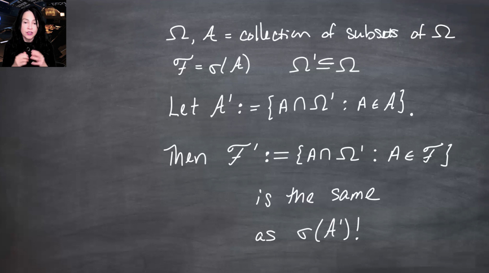{fig-alt="A chalkboard states that Omega is a space, A is a collection of subsets of Omega, F equals $\sigma$ of A, and Omega prime is a subset of Omega. It defines A prime as all A intersect Omega prime for A in script A, and F prime as all A intersect Omega prime for A in script F, then states that F prime is the same as $\sigma$ of A prime." group="slides"}

The important identity is $\{A\cap\Omega':A\in\sigma(\mathcal{A})\}=\sigma(\{A\cap\Omega':A\in\mathcal{A}\})$. This explains why the two definitions of $\mathcal{B}([0,1])$ agree.
:::

## Takeaway {#sec-takeaway}

A measurable space $(\Omega,\mathcal{F})$ specifies which sets are measurable.  
A measure space $(\Omega,\mathcal{F},\mu)$ adds a consistent notion of size.  
A probability space $(\Omega,\mathcal{F},P)$ is the normalized case where the whole space has measure one.

The key bridge to probability is:

$$
\text{sets in a } \sigma \text{-field}\quad\longrightarrow\quad 
\text{measurable sets} \quad\longrightarrow\quad
\text{measures on those sets}.
$$
