::: {#vid-C99-L04 .column-margin}


Lesson 4: Extending a probability measure from a field to the generated $\sigma$-field.
:::

## Lesson map

- Recap: measure, probability measure, and finite additivity.
- Goal: extend a probability measure from known sets to more sets.
- Start with a field $\mathcal{F}_0$ and the generated $\sigma$-field $\mathcal{F}=\sigma(\mathcal{F}_0)$.
- *Infimum* and *supremum*: minimum/maximum ideas when endpoints may not be included.
- *Infimum* as greatest lower bound; *supremum* as least upper bound.
- The $\varepsilon$ trick for *infimum* and *supremum* arguments.
- Cover arbitrary subsets of $\Omega$ using sets from $\mathcal{F}_0$.
- Define the associated outer measure $P^*$.
- Basic properties of $P^*$: empty set, monotonicity, and agreement direction on $\mathcal{F}_0$.
- Countable subadditivity of $P^*$.
- Open questions: is $P^*$ a measure, a probability measure, and does it preserve $P$ on $\mathcal{F}_0$?

## Goal of the lesson

The previous lesson defined measures and probability measures on a measurable space. This lesson begins the harder construction problem:

> Suppose a probability measure is already defined on a smaller collection of sets. Can we extend it to a larger $\sigma$-field without changing the values we already assigned?

The running setup is:

$$
\Omega \neq \emptyset,
\qquad
\mathcal{F}_0 \text{ is a field on } \Omega,
\qquad
\mathcal{F}=\sigma(\mathcal{F}_0).
$$

A **field** of sets is closed under complements and finite unions. A **$\sigma$-field** is closed under complements and countable unions. So $\mathcal{F}_0$ is almost a $\sigma$-field, but may fail countable-union closure.

::: {.column-margin #fig-L04-slide-01}
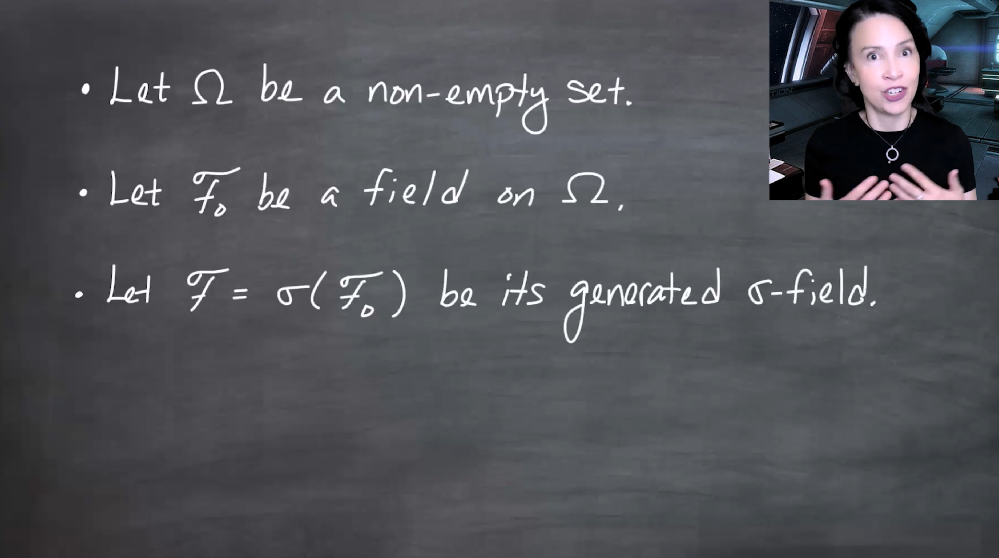{fig-alt="The slide lists three assumptions: Omega is a non-empty set, F naught is a field on Omega, and F is the sigma-field generated by F naught." group="slides"}

The construction starts from a field $\mathcal{F}_0$ on $\Omega$ and defines the larger measurable collection $\mathcal{F}=\sigma(\mathcal{F}_0)$.
:::

## Probability measure on a field

A probability measure on a $\sigma$-field satisfies:

1. $P(\emptyset)=0$;
2. if $A_1,A_2,\ldots$ are disjoint, then

$$
P\left(\bigcup_{n=1}^{\infty}A_n\right)
=
\sum_{n=1}^{\infty}P(A_n);
$$

3. $P(\Omega)=1$.

The subtlety is that $\mathcal{F}_0$ is only a field. If $A_1,A_2,\ldots\in\mathcal{F}_0$, the countable union $\bigcup_n A_n$ may not belong to $\mathcal{F}_0$. So countable additivity is only meaningful when the union is still in the domain.

::: {.column-margin #fig-L04-slide-02}
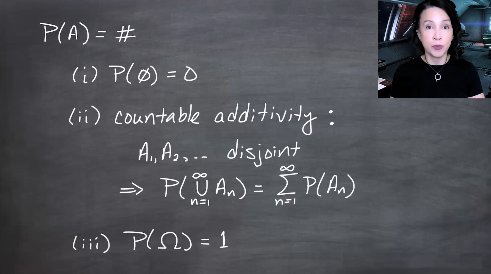{fig-alt="The slide writes P of A equals a number sign, then lists three rules: P of the empty set is zero, countable additivity for disjoint sets, and P of Omega equals one." group="slides"}

When $P$ is defined only on $\mathcal{F}_0$, the right-hand side $\sum_n P(A_n)$ always makes sense for $A_n\in\mathcal{F}_0$, but the left-hand side $P(\bigcup_n A_n)$ only makes sense if the countable union is also in $\mathcal{F}_0$.
:::

The goal is to extend $P$ from $\mathcal{F}_0$ to the larger $\sigma$-field $\mathcal{F}$, ideally without changing the original values of $P$.

::: {.column-margin #fig-L04-slide-03}
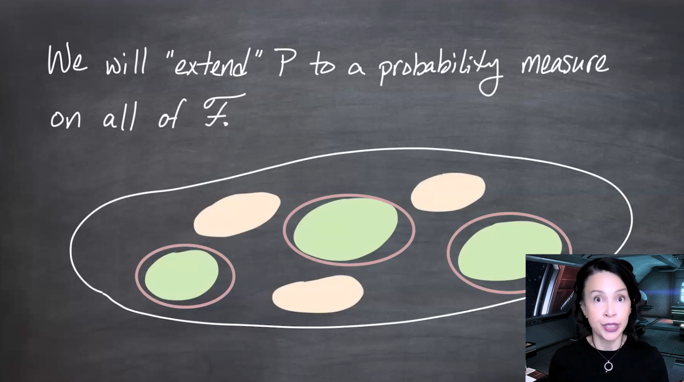{fig-alt="The slide says that P will be extended to a probability measure on all of F. A diagram shows smaller known sets inside a larger space, with additional sets suggested in the generated sigma-field." group="slides"}

The intended extension should keep the old probabilities on $\mathcal{F}_0$ while assigning probabilities to the new sets in $\mathcal{F}=\sigma(\mathcal{F}_0)$.
:::

## Infimum and supremum

The outer-measure construction uses **infimums**. The idea is close to a minimum, except the best lower bound need not itself be inside the set.

For example,

$$
S=(0,1).
$$

This set has no minimum and no maximum, but it has

$$
\inf S=0,
\qquad
\sup S=1.
$$

::: {.column-margin #fig-L04-slide-04}
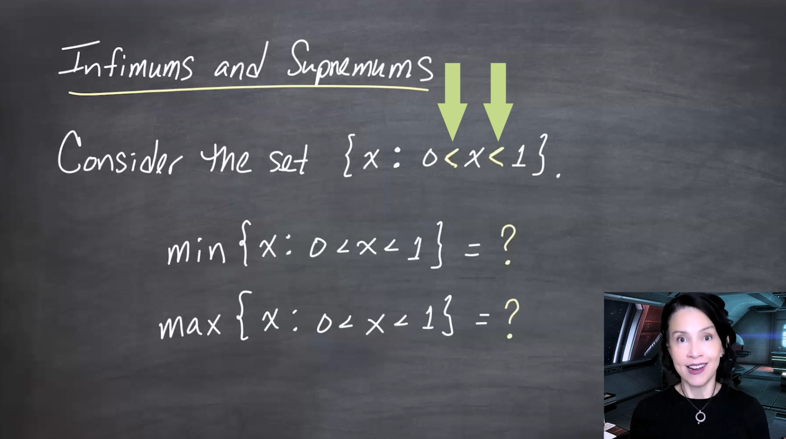{fig-alt="The slide introduces infimums and supremums using the set of real numbers strictly between zero and one, then asks what its minimum and maximum are." group="slides"}

For the open interval $(0,1)$, neither endpoint belongs to the set. So there is no minimum or maximum, even though $0$ and $1$ are the natural boundary values.
:::

::: {.column-margin #fig-L04-slide-05}
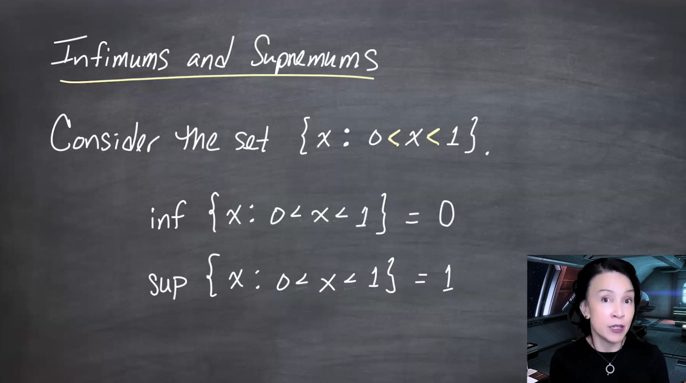{fig-alt="The slide states that the infimum of the set of real numbers strictly between zero and one is zero, and the supremum is one." group="slides"}

The infimum and supremum recover the boundary values: $\inf(0,1)=0$ and $\sup(0,1)=1$, even though $0,1\notin(0,1)$.
:::

::: {#def-infimum-supremum}
## Infimum and supremum

Let $S\subseteq\mathbb{R}$.

The **infimum** of $S$, written $\inf S$, is the greatest lower bound of $S$.

The **supremum** of $S$, written $\sup S$, is the least upper bound of $S$.
:::

::: {.column-margin #fig-L04-slide-06}
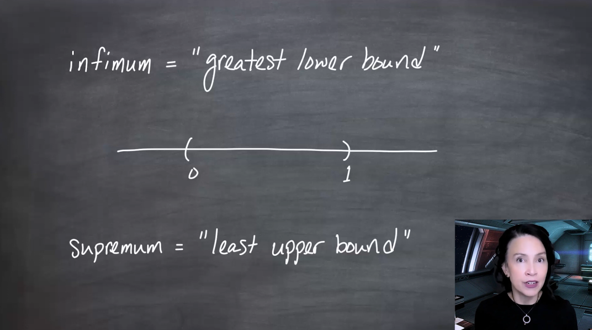{fig-alt="The slide labels the infimum as the greatest lower bound and the supremum as the least upper bound, illustrated on the open interval from zero to one." group="slides"}

For $(0,1)$, every number $\leq 0$ is a lower bound, but $0$ is the greatest one. Every number $\geq 1$ is an upper bound, but $1$ is the least one.
:::

If the minimum or maximum exists, then the infimum or supremum agrees with it.

::: {.column-margin #fig-L04-slide-07}
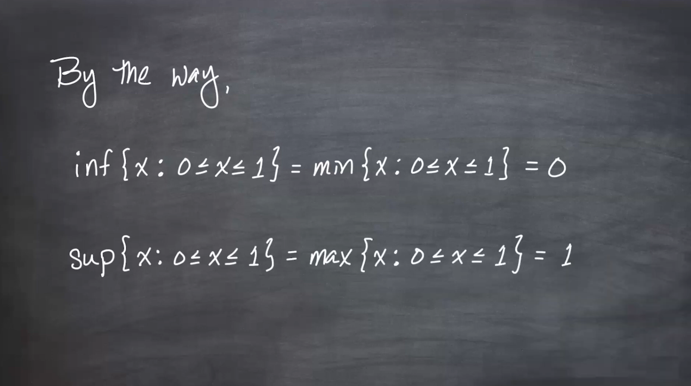{fig-alt="The slide states that the infimum of the closed unit interval equals its minimum, zero, and the supremum equals its maximum, one." group="slides"}

For the closed interval $[0,1]$, the endpoints belong to the set, so $\inf[0,1]=\min[0,1]=0$ and $\sup[0,1]=\max[0,1]=1$.
:::

## The epsilon trick

A recurring proof move in analysis is the $\varepsilon$ characterization of infimum and supremum.

If $m=\inf S$, then for every $\varepsilon>0$, there is some $s\in S$ such that

$$
s < m+\varepsilon.
$$

Otherwise, $m+\varepsilon$ would still be a lower bound, contradicting the claim that $m$ was the greatest lower bound.

::: {.column-margin #fig-L04-slide-08}
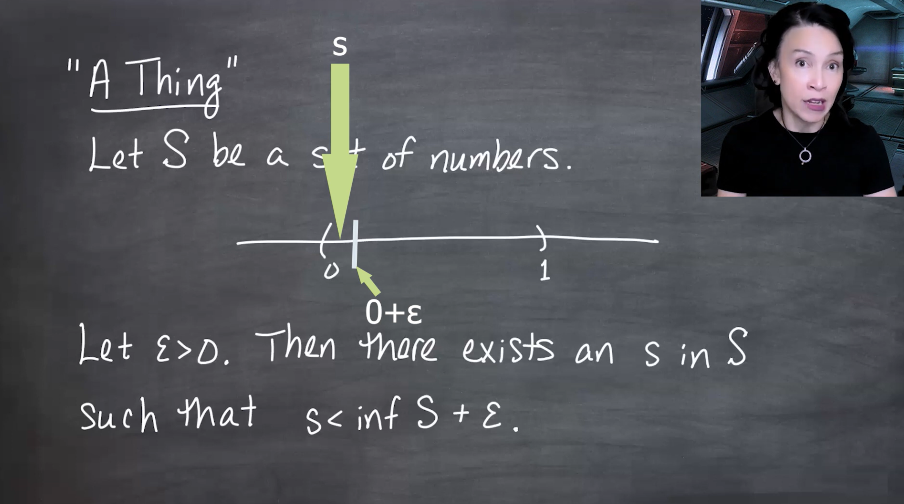{fig-alt="The slide illustrates that for any positive epsilon, there is a point s in the set S below the infimum plus epsilon." group="slides"}

The infimum can be approached from inside the set: once we move slightly above $\inf S$, we must encounter a point of $S$.
:::

Similarly, if $M=\sup S$, then for every $\varepsilon>0$, there is some $s\in S$ such that

$$
s > M-\varepsilon.
$$

::: {.column-margin #fig-L04-slide-09}
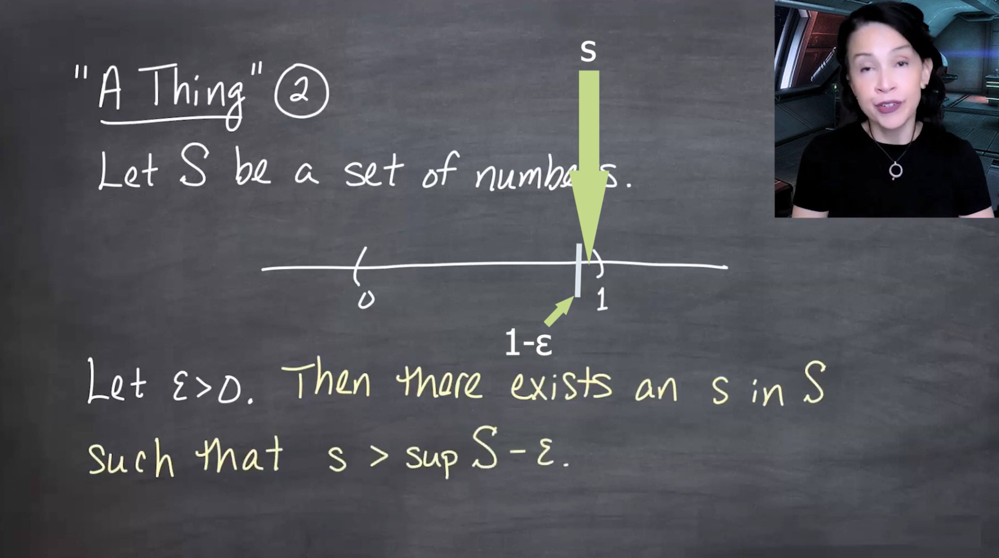{fig-alt="The slide illustrates that for any positive epsilon, there is a point s in the set S above the supremum minus epsilon." group="slides"}

The supremum can be approached from inside the set: once we move slightly below $\sup S$, we must encounter a point of $S$.
:::

This $\varepsilon$ idea is the technical lever in the proof of countable subadditivity for $P^*$.

## Covering arbitrary subsets of $\Omega$

Now return to the extension problem. Let

$$
A\subseteq\Omega.
$$

The set $A$ need not belong to $\mathcal{F}_0$ or even to $\mathcal{F}=\sigma(\mathcal{F}_0)$. To estimate its size, cover it using sets from $\mathcal{F}_0$, whose probabilities are already known.

::: {.column-margin #fig-L04-slide-10}
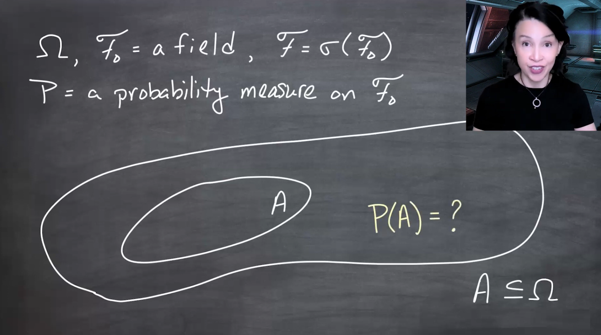{fig-alt="The slide shows Omega as a large region, a subset A inside it, and asks what P of A should be. It assumes F naught is a field, F is generated by F naught, and P is a probability measure on F naught." group="slides"}

For $A\subseteq\Omega$, the value $P(A)$ may not be defined. The construction therefore compares $A$ with countable covers by sets $A_n\in\mathcal{F}_0$.
:::

A cover means

$$
A\subseteq \bigcup_{n=1}^{\infty} A_n,
\qquad
A_n\in\mathcal{F}_0.
$$

Such covers always exist because $\Omega\in\mathcal{F}_0$ and $A\subseteq\Omega$.

::: {.column-margin #fig-L04-slide-11}
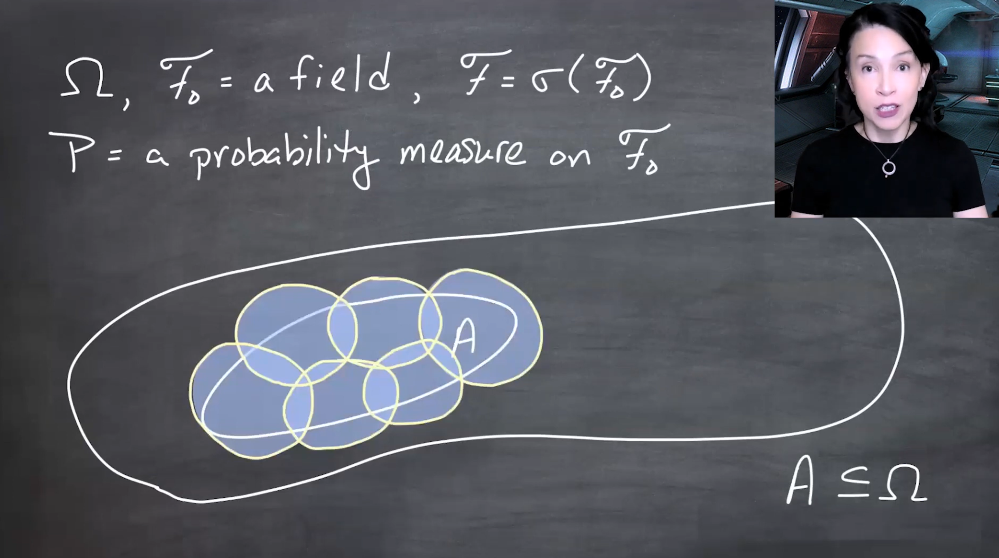{fig-alt="The slide shows the set A covered by several overlapping sets from F naught inside Omega." group="slides"}

The covering sets may overlap. The construction intentionally sums their probabilities anyway, producing an upper estimate for the unknown size of $A$.
:::

## The associated outer measure

::: {#def-associated-outer-measure}
## Outer measure associated with $P$

For any $A\subseteq\Omega$, define

$$
P^*(A)
=
\inf
\left\{
\sum_{n=1}^{\infty}P(A_n)
:
A_n\in\mathcal{F}_0
\text{ and }
A\subseteq\bigcup_{n=1}^{\infty}A_n
\right\}.
$$
:::

In words: cover $A$ by countably many sets from $\mathcal{F}_0$, add the probabilities of those covering sets, and take the smallest possible upper value in the infimum sense.

::: {.column-margin #fig-L04-slide-12}
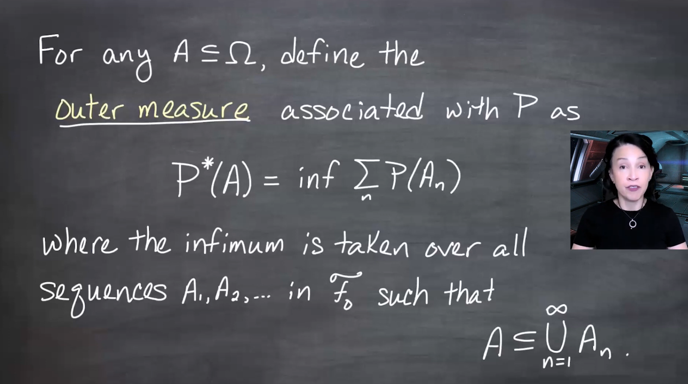{fig-alt="The slide defines the outer measure associated with P as P star of A equals the infimum of the sum of P of A n, taken over all sequences in F naught that cover A." group="slides"}

The outer measure $P^*(A)$ is defined for every subset $A\subseteq\Omega$, not just for sets in $\mathcal{F}_0$ or $\mathcal{F}$.
:::

More compactly,

$$
P^*(A)
=
\inf\left\{
\sum_{n=1}^{\infty}P(A_n)
:
A_n\in\mathcal{F}_0,\;
A\subseteq\bigcup_{n=1}^{\infty}A_n
\right\}.
$$

At this stage, $P^*$ is only a candidate extension tool. The lesson proves that it has several measure-like properties, but postpones the full extension result.

::: {.column-margin #fig-L04-slide-13}
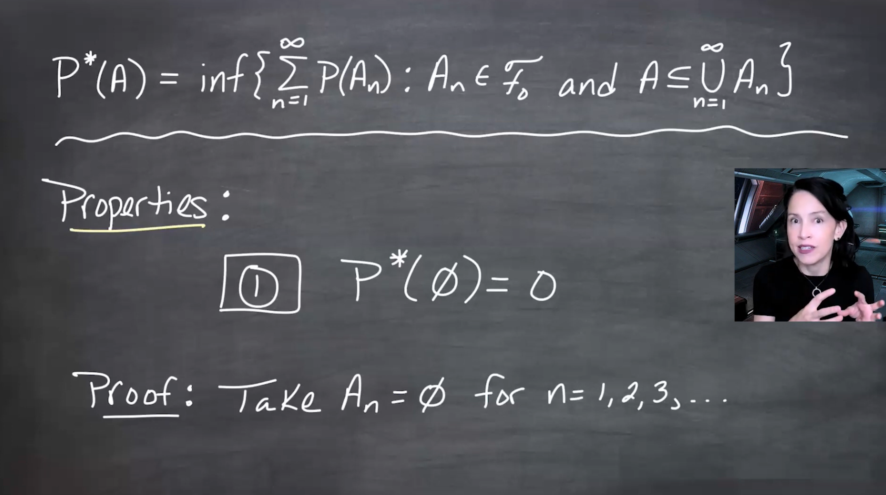{fig-alt="The slide restates the formula for P star and begins listing properties. The first property is P star of the empty set equals zero, proved by taking all covering sets to be empty." group="slides"}

The empty set can be covered by $\emptyset,\emptyset,\ldots$, and each has probability zero. Therefore $P^*(\emptyset)=0$.
:::

## Basic properties of $P^*$

::: {#prp-pstar-empty}
## Empty set

$$
P^*(\emptyset)=0.
$$
:::

Proof: cover $\emptyset$ by $A_n=\emptyset$ for all $n$. Then

$$
\sum_{n=1}^{\infty}P(A_n)=0.
$$

Since all candidate sums are non-negative, the infimum is $0$.

::: {#prp-pstar-monotone}
## Monotonicity

If $A\subseteq B\subseteq\Omega$, then

$$
P^*(A)\leq P^*(B).
$$
:::

Any cover of $B$ is also a cover of $A$. Since $A$ has at least as many admissible covers as $B$, the infimum for $A$ cannot be larger than the infimum for $B$.

::: {.column-margin #fig-L04-slide-14}
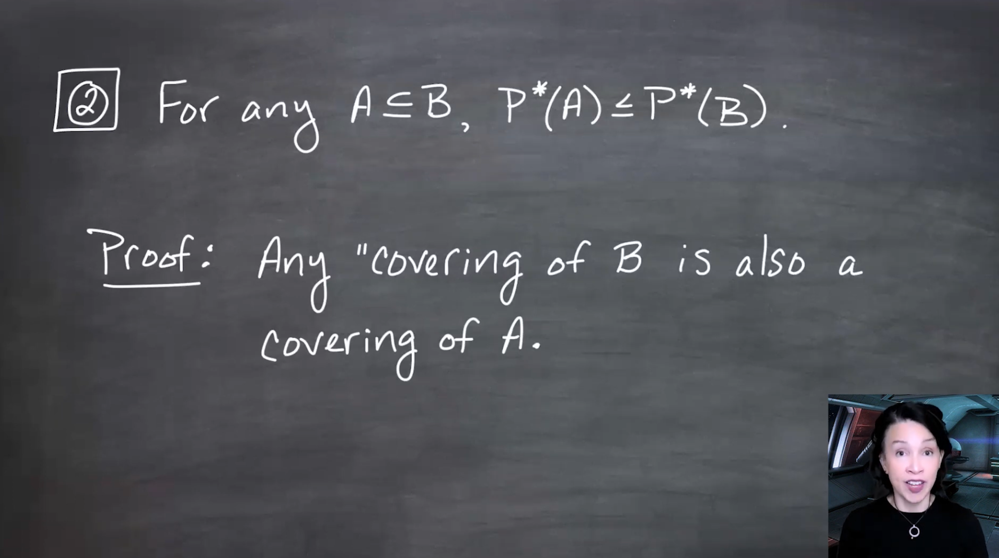{fig-alt="The slide states that if A is a subset of B, then P star of A is less than or equal to P star of B. The proof says any covering of B is also a covering of A." group="slides"}

Monotonicity follows directly from the cover definition: covering the larger set $B$ automatically covers the smaller set $A$.
:::

::: {#prp-pstar-upper-bound-on-field}
## Upper bound on original field values

If $A\in\mathcal{F}_0$, then

$$
P^*(A)\leq P(A).
$$
:::

Proof: cover $A$ by the sequence

$$
A_1=A, \qquad A_2=A_3=\cdots=\emptyset.
$$

Then

$$
P^*(A) \leq P(A)+P(\emptyset)+P(\emptyset)+\cdots = P(A).
$$

::: {.column-margin #fig-L04-slide-15}
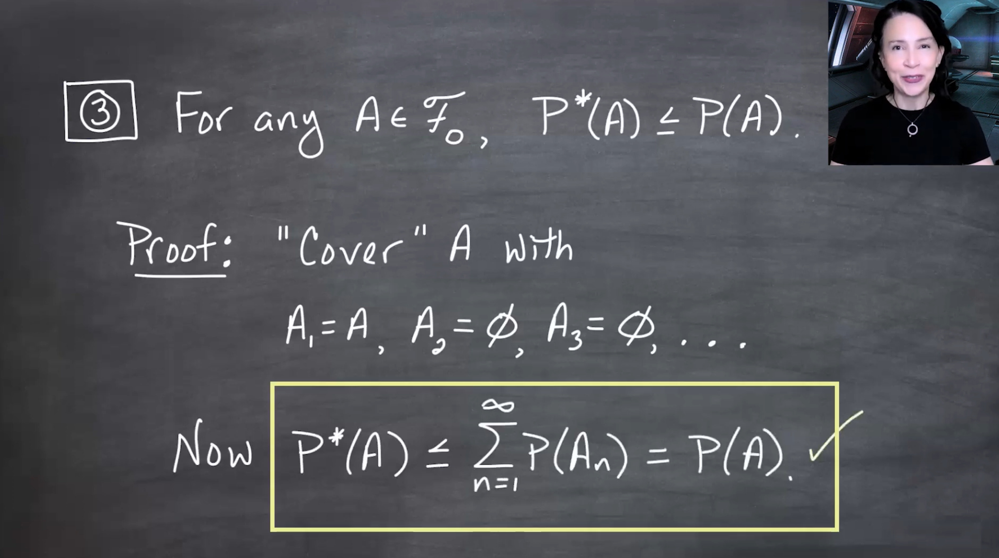{fig-alt="The slide states that for any A in F naught, P star of A is less than or equal to P of A. It covers A with A followed by empty sets, then sums the probabilities." group="slides"}

For original sets $A\in\mathcal{F}_0$, one admissible cover is $A,\emptyset,\emptyset,\ldots$. This proves $P^*(A)\leq P(A)$, but equality still requires more work.
:::

## Countable subadditivity of $P^*$

The main technical result in this lesson is that $P^*$ is countably subadditive.

::: {#prp-pstar-countably-subadditive}
## Countable subadditivity

For any sequence of subsets $A_1,A_2,\ldots\subseteq\Omega$,

$$
P^*\left(\bigcup_{n=1}^{\infty}A_n\right) \leq \sum_{n=1}^{\infty}P^*(A_n).
$$
:::

::: {.column-margin #fig-L04-slide-16}
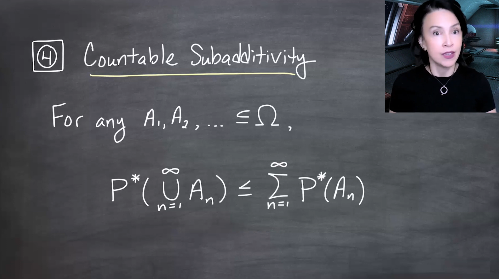{fig-alt="The slide states countable subadditivity for P star: for any sets A1, A2 and so on inside Omega, P star of their union is at most the sum of the P star values." group="slides"}

This property resembles countable additivity, but it does not require the $A_n$ to be disjoint and gives an inequality rather than equality.
:::

### Proof idea

For each $A_n$, choose a countable cover by sets from $\mathcal{F}_0$:

$$
A_n \subseteq \bigcup_{k=1}^{\infty} A_{nk}.
$$

The double index means: $n$ selects the set being covered, and $k$ selects a covering set for that particular $A_n$.

::: {.column-margin #fig-L04-slide-17}
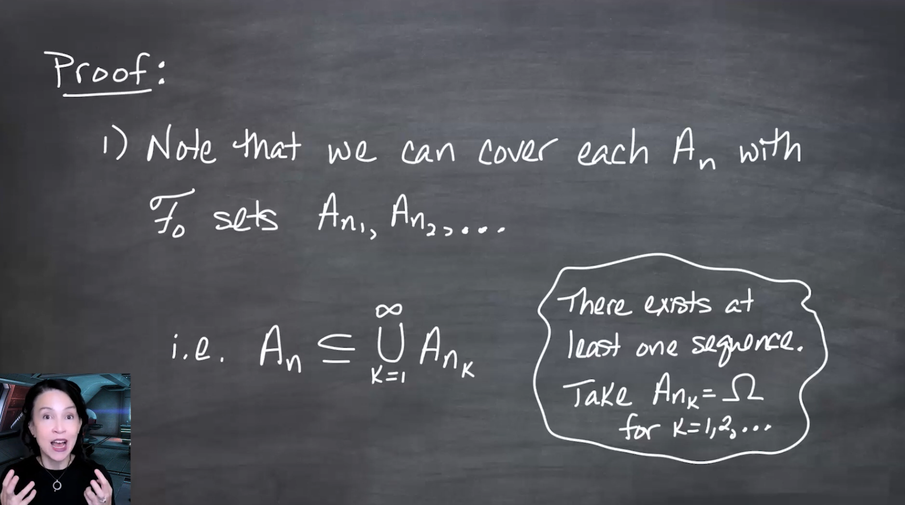{fig-alt="The slide begins the proof of countable subadditivity. It notes that each A n can be covered with F naught sets A n1, A n2 and so on. A note says at least one sequence exists by taking each covering set to be Omega." group="slides"}

Each $A_n$ has at least one admissible cover because we can always take $A_{nk}=\Omega$ for all $k$.
:::

Now use the infimum $\varepsilon$ trick. For any $\varepsilon>0$, choose the cover of $A_n$ so that its total probability is within $\varepsilon2^{-n}$ of the infimum:

$$
\sum_{k=1}^{\infty}P(A^*_{nk})
<
P^*(A_n)+\varepsilon 2^{-n}.
$$

::: {.column-margin #fig-L04-slide-18}
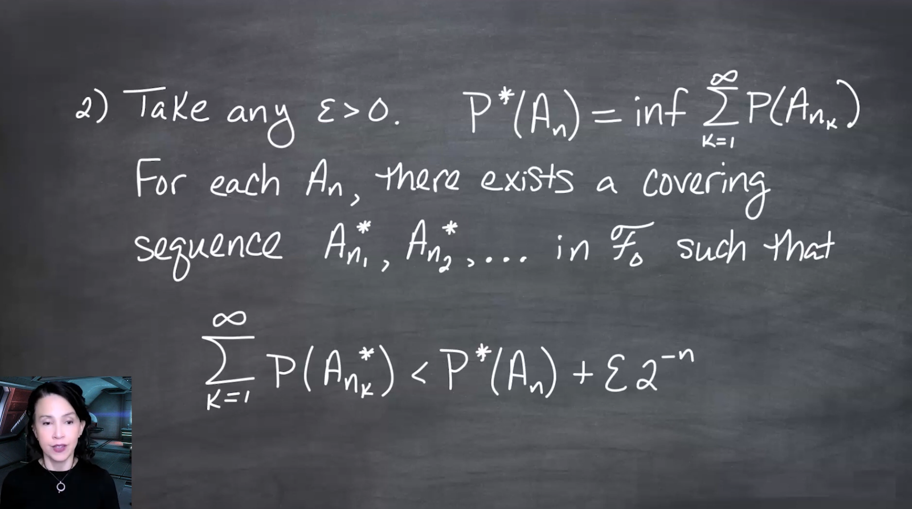{fig-alt="The slide chooses, for each A n, a covering sequence from F naught such that the sum of probabilities is less than P star of A n plus epsilon times two to the negative n." group="slides"}

The factor $2^{-n}$ splits the total error budget across the sequence. Since $\sum_{n=1}^{\infty}2^{-n}=1$, the accumulated error will be at most $\varepsilon$.
:::

Summing over $n$ gives

$$
\begin{aligned}
\sum_{n=1}^{\infty}\sum_{k=1}^{\infty}P(A^*_{nk})
& < \sum_{n=1}^{\infty} \left(P^*(A_n)+\varepsilon 2^{-n}\right) \\
& = \sum_{n=1}^{\infty}P^*(A_n)+\varepsilon.
\end{aligned}
$$

::: {.column-margin #fig-L04-slide-19}
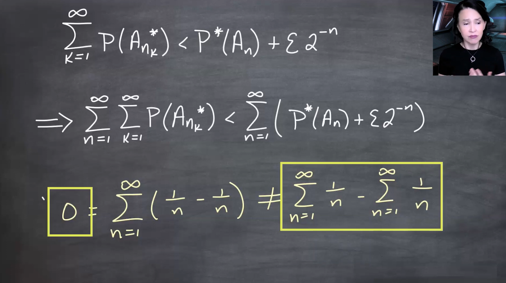{fig-alt="The slide sums the nearly optimal cover inequalities over n and warns that infinite sums must be handled carefully, especially when divergent positive and negative terms are involved." group="slides"}

The proof can distribute the sum here because all terms are non-negative. This avoids invalid manipulations such as treating divergent positive and negative infinite sums as if they were ordinary finite numbers.
:::

::: {.column-margin #fig-L04-slide-20}
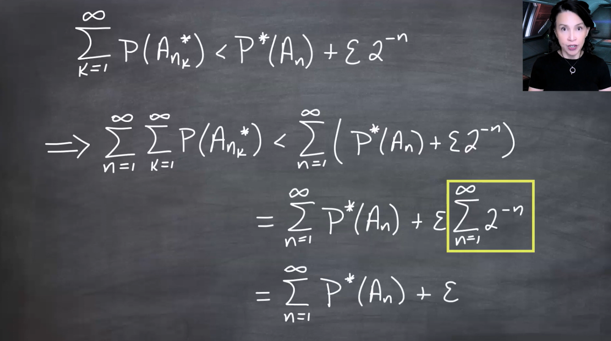{fig-alt="The slide simplifies the double sum bound by pulling out epsilon and using the geometric series sum of two to the negative n, resulting in the sum of P star of A n plus epsilon." group="slides"}

The error terms collapse neatly: $\varepsilon\sum_{n=1}^{\infty}2^{-n}=\varepsilon$.
:::

On the other hand,

$$
\bigcup_{n=1}^{\infty}A_n
\subseteq
\bigcup_{n=1}^{\infty}\bigcup_{k=1}^{\infty}A^*_{nk}.
$$

So the double-indexed family is a cover of the whole union. By definition of $P^*$,

$$
P^*\left(\bigcup_{n=1}^{\infty}A_n\right)
\leq
\sum_{n=1}^{\infty}\sum_{k=1}^{\infty}P(A^*_{nk}).
$$

::: {.column-margin #fig-L04-slide-21}
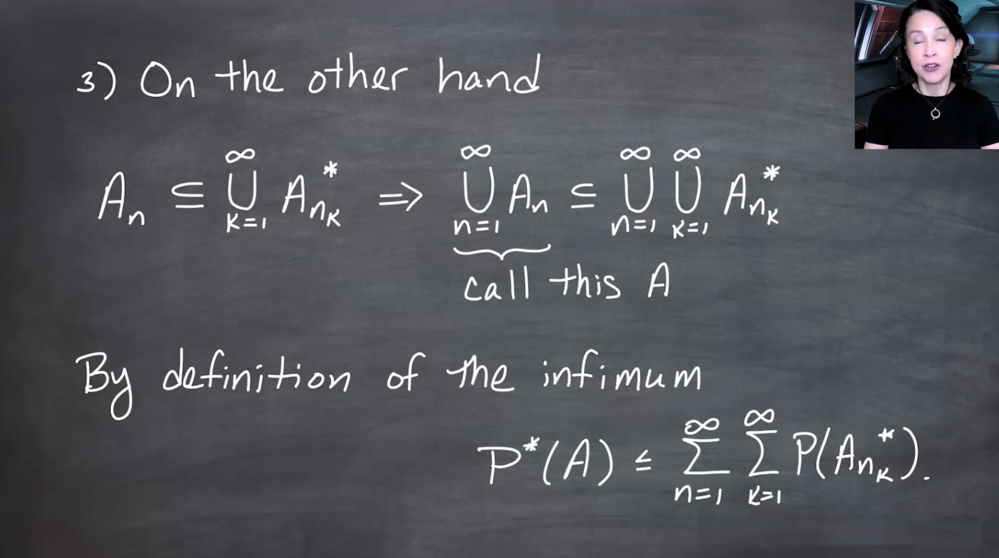{fig-alt="The slide shows that if each A n is covered by the union over k of A n k star, then the union over n of A n is covered by the double union over n and k. It then applies the definition of the infimum to bound P star of the union." group="slides"}

The double union is just one large countable cover of $\bigcup_n A_n$, so the outer measure of the union is no greater than the total probability of this cover.
:::

Combining the two inequalities,

$$
P^*\left(\bigcup_{n=1}^{\infty}A_n\right)
<
\sum_{n=1}^{\infty}P^*(A_n)+\varepsilon.
$$

Because $\varepsilon>0$ was arbitrary,

$$
P^*\left(\bigcup_{n=1}^{\infty}A_n\right)
\leq
\sum_{n=1}^{\infty}P^*(A_n).
$$

::: {.column-margin #fig-L04-slide-22}
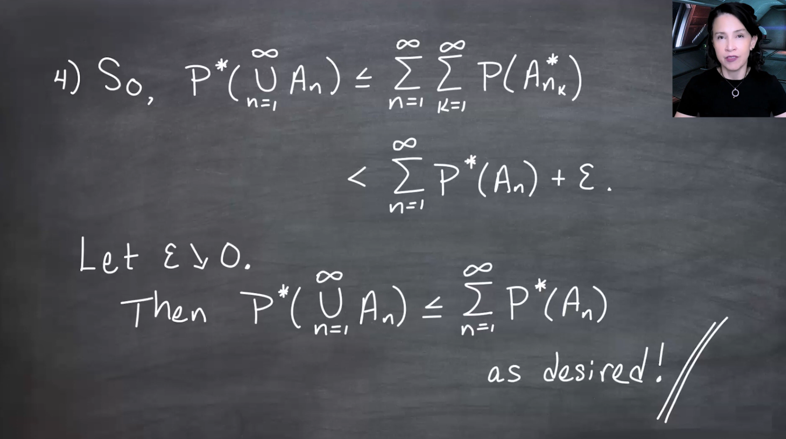{fig-alt="The slide completes the proof: P star of the countable union is less than the double sum, which is less than the sum of P star of A n plus epsilon. Letting epsilon go to zero gives the desired inequality." group="slides"}

The proof ends by letting the arbitrary error $\varepsilon$ shrink to zero. This gives countable subadditivity of $P^*$.
:::

## What has been proved so far?

Starting with a probability measure $P$ on a field $\mathcal{F}_0$, we defined an outer measure candidate on every subset of $\Omega$:

$$
P^*(A) = \inf \left\{ 
    \sum_{n=1}^{\infty}P(A_n): A_n\in\mathcal{F}_0,\; A\subseteq\bigcup_{n=1}^{\infty}A_n 
          \right\}.
$$

We proved:

1. $P^*(\emptyset)=0$;
2. if $A\subseteq B$, then $P^*(A)\leq P^*(B)$;
3. if $A\in\mathcal{F}_0$, then $P^*(A)\leq P(A)$;
4. $P^*$ is countably subadditive.

## What remains open?

The lesson ends with the natural extension questions:

- Is $P^*$ actually a measure?
- Is it a probability measure?
- Does it preserve the original values on the field, meaning

$$
P^*(A)=P(A) \qquad
\text{for all } A\in\mathcal{F}_0?
$$

Only one direction, $P^*(A)\leq P(A)$, was shown in this lesson. The rest is deferred to the next lesson.

## Takeaway

The strategy is to extend by **covering from above**:

$$
\text{known probabilities on } \mathcal{F}_0 \quad\longrightarrow\quad
\text{covers of arbitrary } A\subseteq\Omega \quad\longrightarrow\quad
P^*(A)=\inf \text{ cover-sums}.
$$

The infimum chooses the best upper estimate among all countable covers. This turns the extension problem into a covering problem, which is the key move behind the later construction of a probability measure on $\sigma(\mathcal{F}_0)$.
