::: {#vid-C99-l05 .column-margin}


Lesson 5: the outer-measure roadmap for extending $P$ from a field $\mathcal{F}_0$ to the generated $\sigma$-field $\mathcal{F}=\sigma(\mathcal{F}_0)$.
:::

## Lesson map

- 0:12 — Recap: extend a probability measure from a field $\mathcal{F}_0$ to $\sigma(\mathcal{F}_0)$.
- 1:08 — The outer-measure idea: cover arbitrary $A\subseteq\Omega$ by sets from $\mathcal{F}_0$.
- 3:37 — Definition of the outer measure $P^*$.
- 5:17 — What **extension** means: preserve old values on $\mathcal{F}_0$.
- 6:09 — Recap of the four known properties of $P^*$.
- 9:13 — Motivation: splitting a set $B$ by $A$ and $A^c$.
- 10:17 — Define the collection $\mathcal{M}$ of sets that split every $B$ correctly.
- 11:15 — Equivalent definition of $\mathcal{M}$ using only one inequality.
- 13:04 — Proof roadmap: six lemmas.
- 16:59 — How the lemmas imply the desired extension theorem.
- 20:29 — Uniqueness of the extension.
- 25:14 — Stronger uniqueness theorem and future $\pi$-systems.

## Recap: the outer-measure construction

:::{.column-margin #fig-l05-slide-01} 
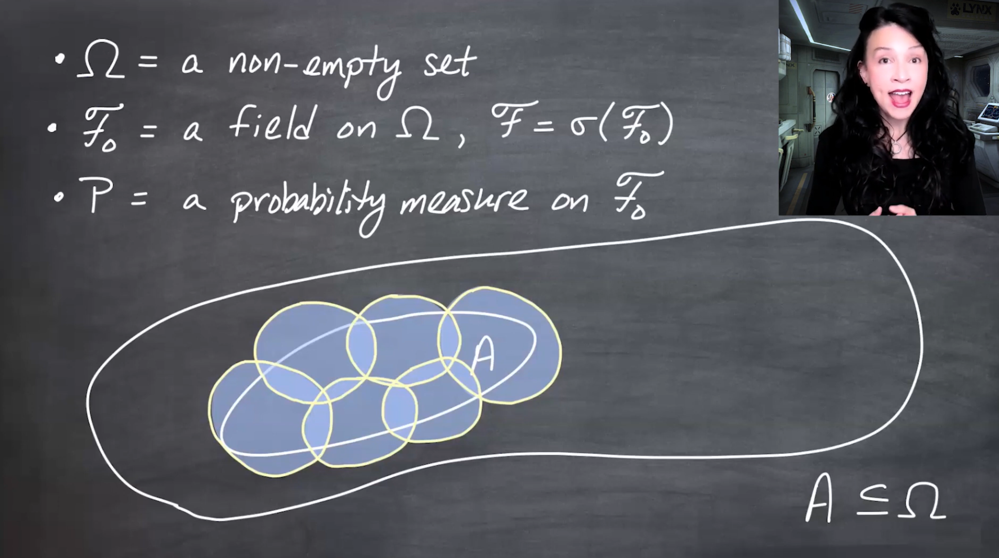{fig-alt="A diagram shows a subset A inside Omega covered by several overlapping sets from the field F naught. The picture motivates estimating the probability of A using probabilities of larger covering sets." group="slides"}

The set $A$ may not itself be in $\mathcal{F}_0$, so $P(A)$ may not be defined. The workaround is to cover $A$ using sets $A_n\in\mathcal{F}_0$ and use the known values $P(A_n)$.
:::

:::{.column-margin #fig-l05-slide-02} 
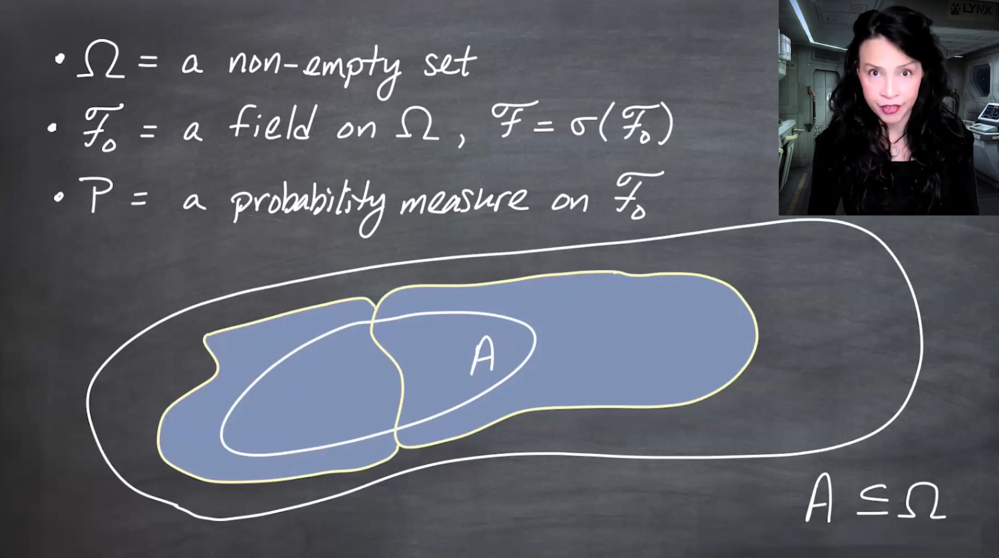{fig-alt="A diagram shows a subset A covered by two large disjoint sets. The cover avoids overlap but contains a lot of extra area outside A." group="slides"}

Requiring covering sets to be disjoint is not necessarily better. A disjoint cover can include much more material outside $A$, so the construction considers all countable covers and lets the infimum choose the best upper estimate.
:::

The previous lesson started with:

$$
\Omega\neq\emptyset, 
\qquad
\mathcal{F}_0 \text{ a field on } \Omega,
\qquad
\mathcal{F}=\sigma(\mathcal{F}_0),
$$

and a probability measure

$$
P:\mathcal{F}_0\to[0,1].
$$

The goal is to extend $P$ to the larger $\sigma$-field $\mathcal{F}$.

For an arbitrary subset $A\subseteq\Omega$, the idea was to cover $A$ by countably many sets from $\mathcal{F}_0$, because those are the sets whose probabilities are already known.

The cover may include extra regions outside $A$, and the covering sets may overlap. So the sum of their probabilities is usually an overestimate.

## Outer measure $P^*$

::: {#def-outer-measure-pstar}
## Outer measure associated with $P$

For every subset $A\subseteq\Omega$, define

$$
P^*(A)
=
\inf\left\{
\sum_{n=1}^{\infty}P(A_n)
:
A_n\in\mathcal{F}_0
\text{ and }
A\subseteq\bigcup_{n=1}^{\infty}A_n
\right\}.
$$
:::

This is called an **outer measure** because it approaches $A$ from outside: cover $A$ by measurable pieces from $\mathcal{F}_0$, sum their probabilities, and take the best possible upper bound.

:::{.column-margin #fig-l05-slide-03}
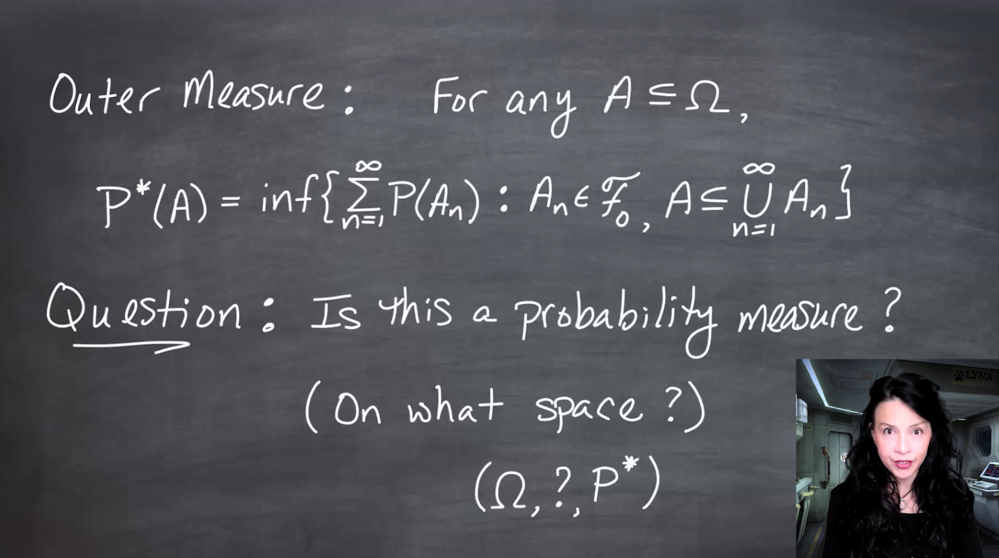{fig-alt="The slide defines P star of A as the infimum of sums of P of A n, where the A n are in F naught and cover A." group="slides"}

The formula for $P^*$ is defined for every $A\subseteq\Omega$, even if $A$ is not in $\mathcal{F}_0$ or in $\mathcal{F}=\sigma(\mathcal{F}_0)$.
:::

At this point, the terminology is slightly optimistic. We have called $P^*$ an outer measure, but we have not yet proved that it behaves like a probability measure on the $\sigma$-field we care about.

## What extension should mean

An extension must do two things:

1. assign values to more sets;
2. preserve the old values.

So for every $A\in\mathcal{F}_0$, we want

$$
P^*(A)=P(A).
$$

So far, the previous lesson only proved one direction:

$$
P^*(A)\leq P(A)
\qquad
(A\in\mathcal{F}_0).
$$

:::{.column-margin #fig-l05-slide-04} 
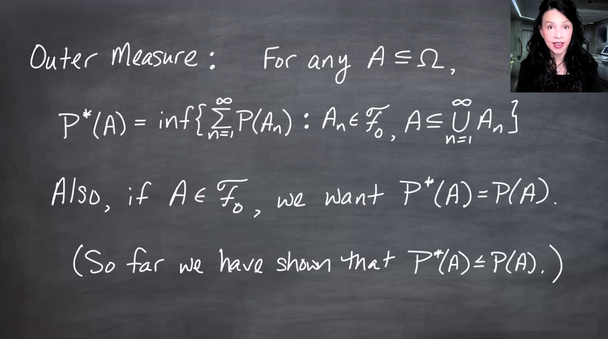{fig-alt="The slide states that extending the probability measure means P star of A should equal P of A for all A in F naught." group="slides"}

Calling $P^*$ an extension means it should not disturb the probabilities already assigned by $P$ on the field $\mathcal{F}_0$.
:::

## Four known properties of $P^*$

From Lesson 4, we know:

1. $P^*(\emptyset)=0$.
2. If $A\subseteq B$, then $P^*(A)\leq P^*(B)$.
3. If $A\in\mathcal{F}_0$, then $P^*(A)\leq P(A)$.
4. $P^*$ is countably subadditive:

$$
P^*\left(\bigcup_{n=1}^{\infty}A_n\right)
\leq
\sum_{n=1}^{\infty}P^*(A_n).
$$

:::{.column-margin #fig-l05-slide-05}
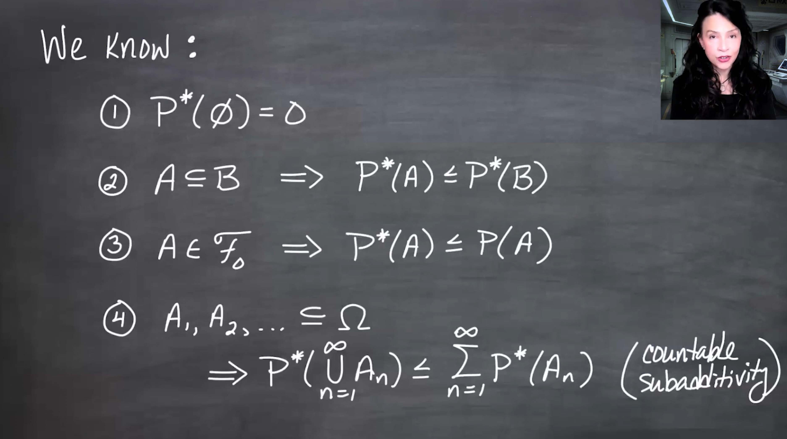{fig-alt="The slide lists known properties of P star: P star of the empty set is zero, monotonicity under subset inclusion, and P star of A is at most P of A for A in F naught." group="slides"}

These are measure-like properties, but they do not yet prove that $P^*$ is a probability measure.
:::

:::{.column-margin #fig-l05-slide-06} 
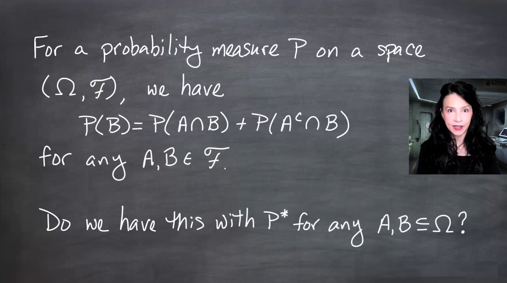{fig-alt="The slide states countable subadditivity: P star of the countable union of A n is less than or equal to the sum of P star of A n." group="slides"}

Countable subadditivity is weaker than countable additivity. A probability measure needs equality for countable unions of disjoint measurable sets.
:::

The missing pieces are:

- countable additivity on the right class of sets;
- $P^*(\Omega)=1$;
- equality $P^*(A)=P(A)$ for $A\in\mathcal{F}_0$;
- identifying the $\sigma$-field on which $P^*$ is a probability measure.

## Splitting a set by $A$ and $A^c$

For an actual probability measure, every measurable set $B$ can be split into the part inside $A$ and the part outside $A$:

$$
B = (A\cap B)\cup(A^c\cap B),
$$

where the two pieces are disjoint. Therefore,

$$
P(B)
=
P(A\cap B)+P(A^c\cap B).
$$

:::{.column-margin #fig-l05-slide-07} 
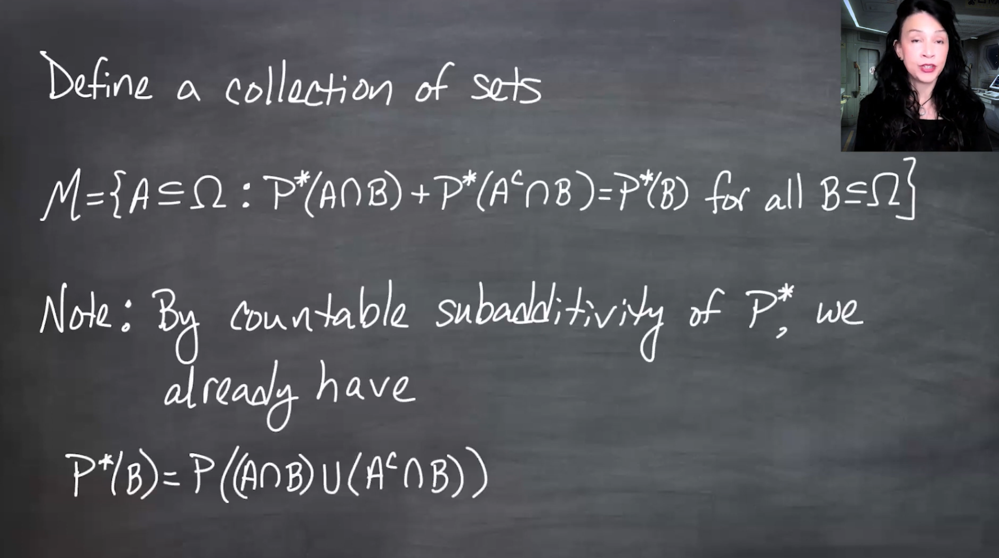{fig-alt="The slide writes P of B equals P of A intersect B plus P of A complement intersect B, explaining that B is decomposed into two disjoint pieces." group="slides"}

For a genuine measure, cutting $B$ by $A$ should not create or destroy mass: the measure of $B$ equals the sum of the measures of the two disjoint pieces.
:::

This motivates defining the sets for which $P^*$ has this splitting property.

## The collection $\mathcal{M}$

::: {#def-carath-measurable-sets}
## The collection $\mathcal{M}$

Define $\mathcal{M}$ to be the collection of all subsets $A\subseteq\Omega$ such that, for every $B\subseteq\Omega$,

$$
P^*(B)
=
P^*(A\cap B)+P^*(A^c\cap B).
$$
:::

These are the sets that split every test set $B$ correctly under $P^*$.

:::{.column-margin #fig-l05-slide-08}
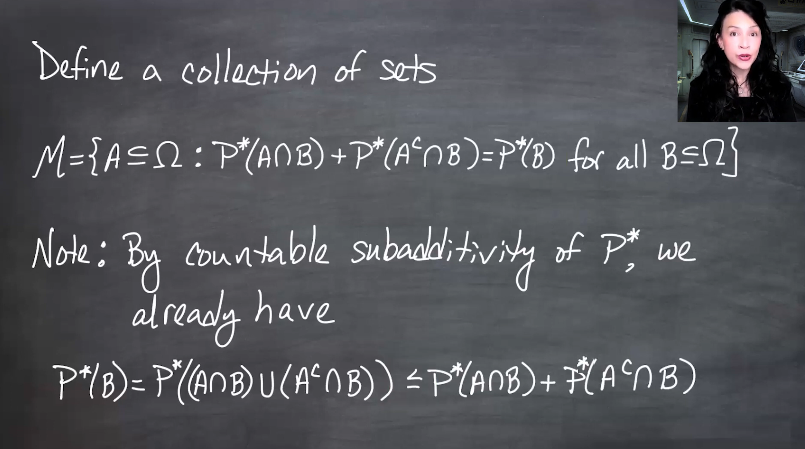{fig-alt="The slide defines script M as the collection of subsets A of Omega such that P star of A intersect B plus P star of A complement intersect B equals P star of B for all subsets B of Omega." group="slides"}

The class $\mathcal{M}$ collects the sets that are compatible with $P^*$ in the sense that they divide every $B$ into two additive pieces.
:::

This is the Carathéodory-style measurability condition, although the lesson introduces it operationally rather than as a named theorem.

### Equivalent one-sided condition

By countable subadditivity,

$$
P^*(B)
\leq
P^*(A\cap B)+P^*(A^c\cap B)
$$

always holds, because $B=(A\cap B)\cup(A^c\cap B)$.

Therefore, to show equality it is enough to prove the reverse inequality:

$$
P^*(A\cap B)+P^*(A^c\cap B)
\leq
P^*(B).
$$

:::{.column-margin #fig-l05-slide-09} 
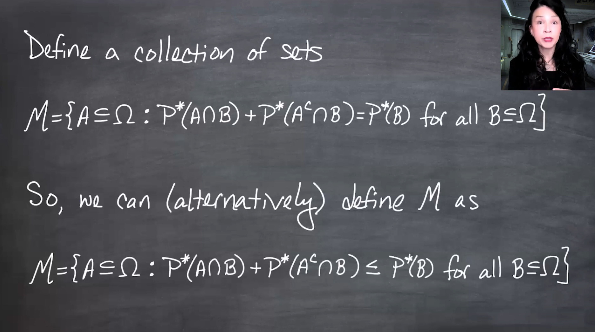{fig-alt="The slide uses countable subadditivity to show that P star of B is always less than or equal to P star of A intersect B plus P star of A complement intersect B, so M can be equivalently defined by the reverse inequality." group="slides"}

The equality definition and the one-sided inequality definition of $\mathcal{M}$ are equivalent because subadditivity already supplies the other inequality.
:::

## Roadmap: six lemmas

The proof that $P^*$ extends $P$ is long, so the lesson organizes it into six lemmas.

:::{.column-margin #fig-l05-slide-10}
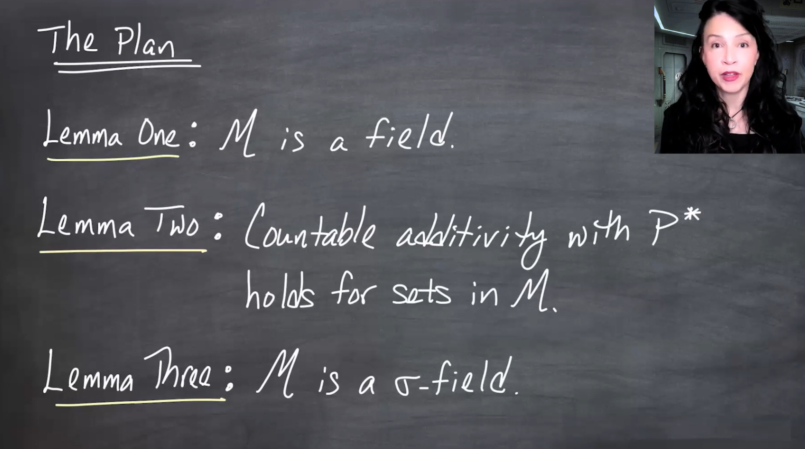{fig-alt="The slide lists the first lemmas: M is a field; countable additivity holds for P star on sets in M; and these results help prove that M is a sigma-field." group="slides"}

The first three lemmas build the measurable world for $P^*$: show that $\mathcal{M}$ is first a field, then closed under countable unions, hence a $\sigma$-field.
:::

### Lemma 1

$$
\mathcal{M} \text{ is a field.}
$$

This means:

1. $\Omega\in\mathcal{M}$;
2. if $A\in\mathcal{M}$, then $A^c\in\mathcal{M}$;
3. if $A,C\in\mathcal{M}$, then $A\cup C\in\mathcal{M}$.

### Lemma 2

$P^*$ is countably additive on disjoint sets in $\mathcal{M}$:

$$
P^*\left(\bigcup_{n=1}^{\infty}A_n\right)
=
\sum_{n=1}^{\infty}P^*(A_n),
$$

whenever $A_1,A_2,\ldots\in\mathcal{M}$ are disjoint.

### Lemma 3

$$
\mathcal{M} \text{ is a } \sigma\text{-field.}
$$

Lemma 2 helps upgrade finite-union closure to countable-union closure.

:::{.column-margin #fig-l05-slide-11}
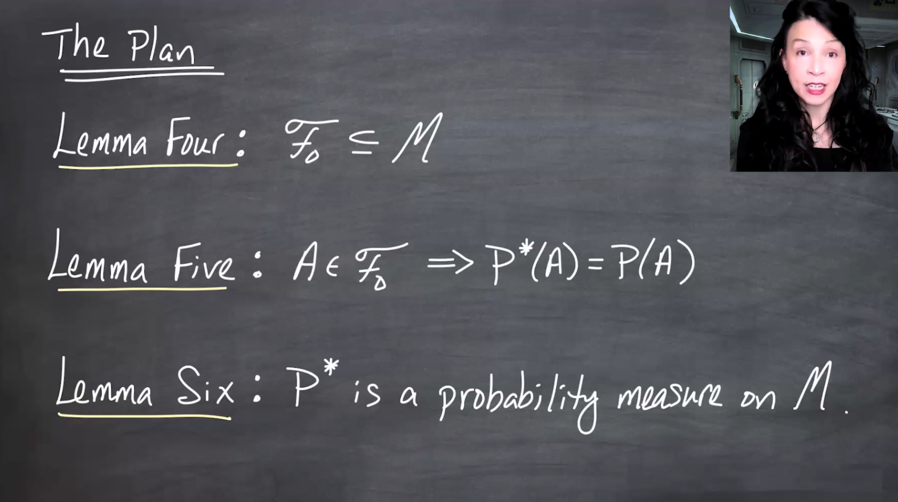{fig-alt="The slide lists later lemmas: F naught is contained in M, P star equals P on F naught, and P star is a probability measure on M." group="slides"}

The next three lemmas connect the new class $\mathcal{M}$ back to the original field $\mathcal{F}_0$ and prove that $P^*$ really extends $P$.
:::

### Lemma 4

$$
\mathcal{F}_0\subseteq\mathcal{M}.
$$

Every original field set satisfies the splitting condition.

### Lemma 5

For every $A\in\mathcal{F}_0$,

$$
P^*(A)=P(A).
$$

This completes the equality that Lesson 4 only proved in one direction.

### Lemma 6

$P^*$ is a probability measure on $\mathcal{M}$.

That is:

1. $P^*(\emptyset)=0$;
2. $P^*$ is countably additive on $\mathcal{M}$;
3. $P^*(\Omega)=1$.

## How the lemmas prove the extension theorem

Once the six lemmas are known, the extension theorem follows quickly.

Since Lemma 3 says $\mathcal{M}$ is a $\sigma$-field, and Lemma 4 says $\mathcal{F}_0\subseteq\mathcal{M}$, the generated $\sigma$-field must satisfy

$$
\mathcal{F}
=
\sigma(\mathcal{F}_0)
\subseteq
\mathcal{M}.
$$

This is the same minimality argument used earlier: $\sigma(\mathcal{F}_0)$ is the smallest $\sigma$-field containing $\mathcal{F}_0$, so it must be contained in any $\sigma$-field that contains $\mathcal{F}_0$.

:::{.column-margin #fig-l05-slide-12} 
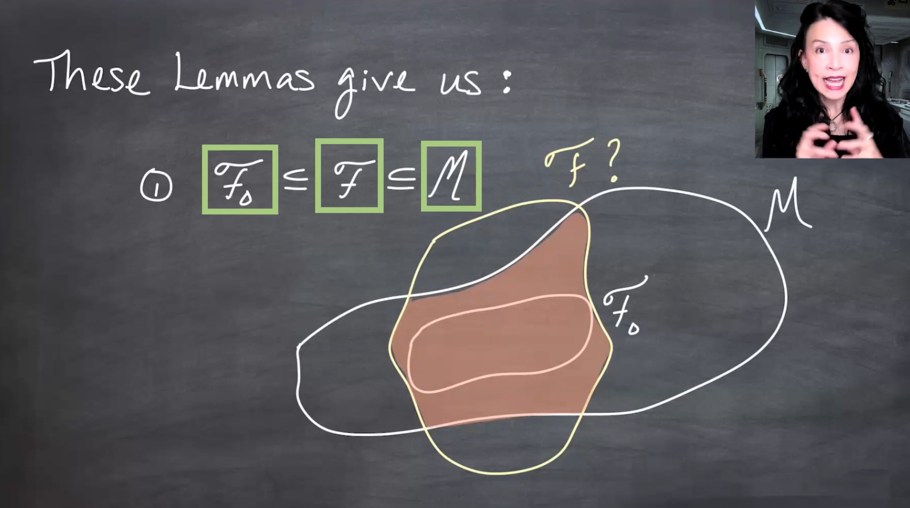{fig-alt="The slide shows a diagram in which F naught is contained in the generated sigma-field F, and F is contained in M. The argument uses the fact that M is a sigma-field containing F naught." group="slides"}

The key containment is $\mathcal{F}_0\subseteq\mathcal{F}\subseteq\mathcal{M}$. This puts the target $\sigma$-field inside the class where $P^*$ is already known to be a probability measure.
:::

Since $P^*$ is a probability measure on $\mathcal{M}$, it is also a probability measure when restricted to the smaller $\sigma$-field $\mathcal{F}$.

And since Lemma 5 says $P^*=P$ on $\mathcal{F}_0$, this restriction is an extension of the original probability measure.

:::{.column-margin #fig-l05-slide-13} 
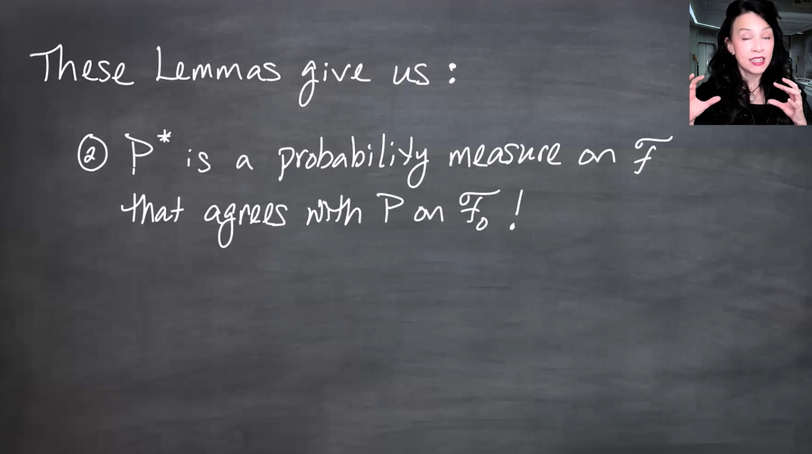{fig-alt="The slide states that P star is a probability measure on F and agrees with P on F naught. It explains that this follows because F is contained in M and P star is a probability measure on M." group="slides"}

The conclusion is the desired extension: $P^*$ is a probability measure on $\mathcal{F}=\sigma(\mathcal{F}_0)$ and agrees with $P$ on the original field $\mathcal{F}_0$.
:::

## Uniqueness of the extension

The lesson also proves a uniqueness result.

Suppose $Q$ is another probability measure on $\mathcal{F}$ and $Q$ agrees with $P$ on $\mathcal{F}_0$:

$$
Q(A)=P(A)
\qquad
\text{for all } A\in\mathcal{F}_0.
$$

Then

$$
Q(A)=P^*(A)
\qquad
\text{for all } A\in\mathcal{F}.
$$

:::{.column-margin #fig-l05-slide-14}
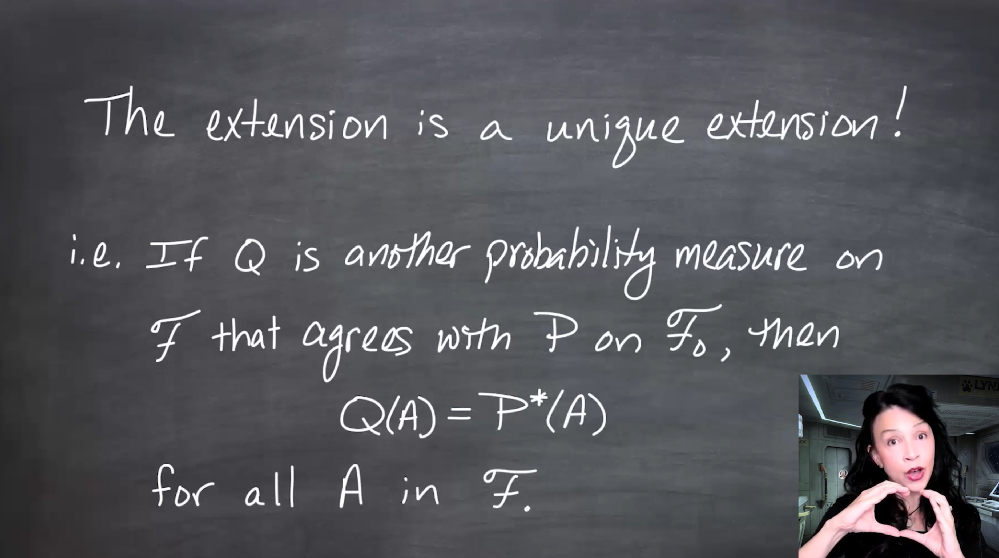{fig-alt="The slide states that if Q is another probability measure on F that agrees with P on F naught, then Q agrees with P star on all sets A in F." group="slides"}

The extension is unique among probability measures on $\mathcal{F}$ that agree with the original $P$ on $\mathcal{F}_0$.
:::

### First inequality

Take $A\in\mathcal{F}$. By definition,

$$
P^*(A)
=
\inf
\left\{
\sum_{n=1}^{\infty}P(A_n)
:
A_n\in\mathcal{F}_0,\;
A\subseteq\bigcup_n A_n
\right\}.
$$

Since $Q=P$ on $\mathcal{F}_0$,

$$
P^*(A)
=
\inf
\left\{
\sum_{n=1}^{\infty}Q(A_n)
:
A_n\in\mathcal{F}_0,\;
A\subseteq\bigcup_n A_n
\right\}.
$$

By countable subadditivity of $Q$,

$$
Q\left(\bigcup_n A_n\right)
\leq
\sum_n Q(A_n).
$$

And since $A\subseteq\bigcup_n A_n$, monotonicity gives

$$
Q(A)
\leq
Q\left(\bigcup_n A_n\right).
$$

Therefore every admissible cover-sum is at least $Q(A)$, so

$$
P^*(A)\geq Q(A).
$$

:::{.column-margin #fig-l05-slide-15} 
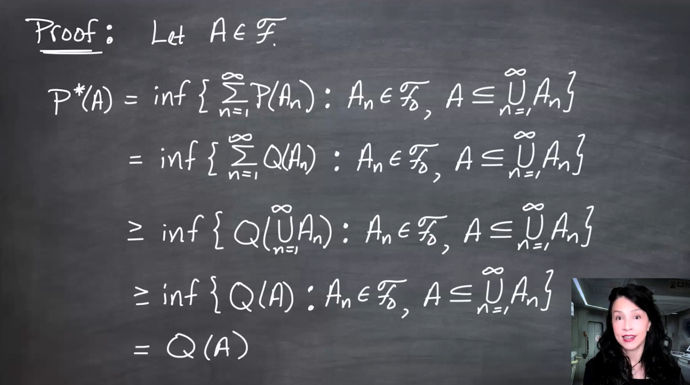{fig-alt="The slide proves one inequality in the uniqueness result. It rewrites P star of A using Q because Q agrees with P on F naught, then uses countable subadditivity and monotonicity to show P star of A is greater than or equal to Q of A." group="slides"}

The cover-sums defining $P^*(A)$ are all at least $Q(A)$, so their infimum is also at least $Q(A)$.
:::

### Reverse inequality

Since $A\in\mathcal{F}$, also $A^c\in\mathcal{F}$. Applying the previous inequality to $A^c$ gives

$$
P^*(A^c)\geq Q(A^c).
$$

Both $P^*$ and $Q$ are probability measures on $\mathcal{F}$, so

$$
P^*(A^c)=1-P^*(A),
\qquad
Q(A^c)=1-Q(A).
$$

Thus,

$$
1-P^*(A)\geq 1-Q(A),
$$

which implies

$$
P^*(A)\leq Q(A).
$$

Combining both inequalities,

$$
P^*(A)=Q(A).
$$

:::{.column-margin #fig-l05-slide-16}
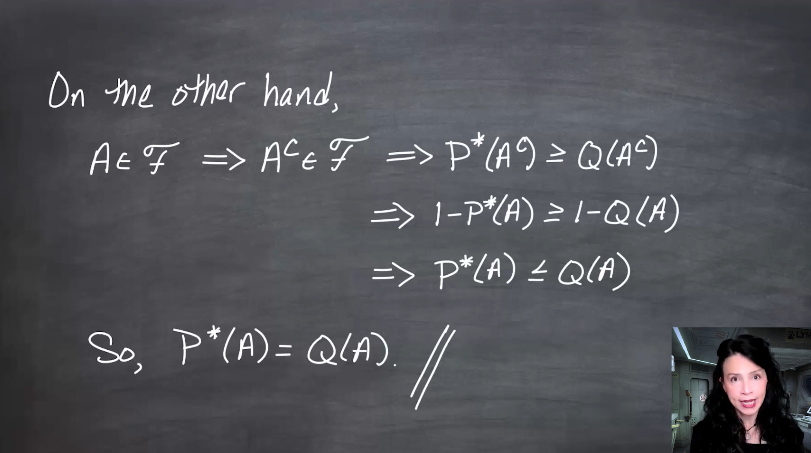{fig-alt="The slide applies the first inequality to A complement, then rewrites both sides using the complement rule for probability measures to obtain P star of A less than or equal to Q of A." group="slides"}

The complement trick turns the first inequality around. Together, the two inequalities force $P^*(A)=Q(A)$.
:::

## Stronger uniqueness theorem

The lesson ends by noting a stronger result:

If $P_1$ and $P_2$ are probability measures on $\mathcal{F}=\sigma(\mathcal{F}_0)$ and

$$
P_1(A)=P_2(A)
\qquad
\text{for all } A\in\mathcal{F}_0,
$$

then

$$
P_1(A)=P_2(A)
\qquad
\text{for all } A\in\mathcal{F}.
$$

This stronger theorem does not depend on the outer-measure definition of $P^*$.

:::{.column-margin #fig-l05-slide-17} 
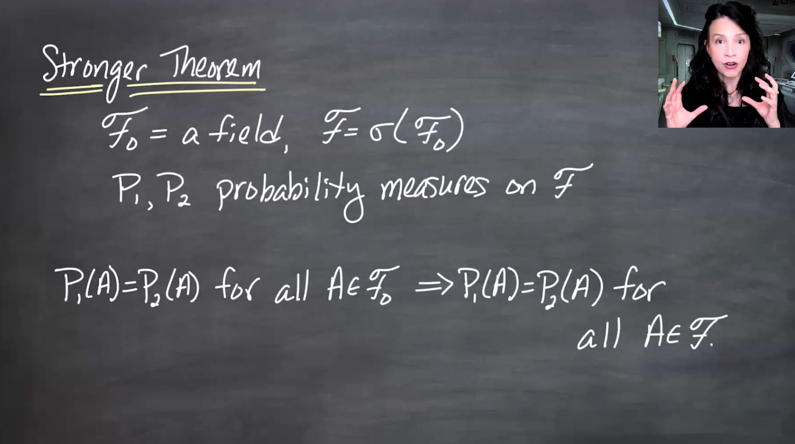{fig-alt="The slide states that if P1 and P2 are probability measures on F and agree on F naught, then they agree on all of F." group="slides"}

Agreement on the generating field determines the probability measure on the generated $\sigma$-field.
:::

Jen notes that this stronger result is often proved using a weaker structure than a field, called a **$\pi$-system**, which will appear later.

:::{.column-margin #fig-l05-slide-18} 
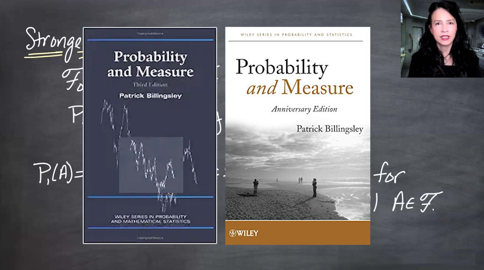{fig-alt="The slide mentions that the stronger uniqueness result appears in Billingsley's Probability and Measure and is often stated for pi-systems, a weaker structure than a field." group="slides"}

A $\pi$-system is closed under finite intersections and is weaker than a field. It is enough for many uniqueness theorems for probability measures.
:::

## Takeaway

The outer measure $P^*$ is a “wannabe probability measure.” It is defined on all subsets of $\Omega$, but it becomes a genuine probability measure only on the right class of measurable sets.

The proof strategy is:

$$
P
\text{ on }
\mathcal{F}_0
\quad\longrightarrow\quad
P^*
\text{ on all subsets of }
\Omega
\quad\longrightarrow\quad
\mathcal{M}
\text{ where } P^* \text{ behaves additively}
\quad\longrightarrow\quad
P^*
\text{ on }
\sigma(\mathcal{F}_0).
$$

The six lemmas are the scaffolding that turns the outer-measure construction into a true extension theorem.
