::: {#vid-C99-L06 .column-margin}


Lesson 6: Proof of Lemmas 1–3 for the outer-measure extension construction.
:::

## Lesson map

This lesson proves the first three lemmas from the extension roadmap.

- 0:12 — Recap: extending $P$ from a field $\mathcal{F}_0$ to $\mathcal{F}=\sigma(\mathcal{F}_0)$.
- 2:50 — Recall the outer measure $P^*$.
- 4:18 — Important warning: do **not** use that $P^*$ is a probability measure yet.
- 4:36 — Recall the definition of $\mathcal{M}$.
- 6:31 — Lemma 1: $\mathcal{M}$ is a field.
- 17:54 — Lemma 2: $P^*$ is countably additive on disjoint sets in $\mathcal{M}$.
- 26:41 — Lemma 3: $\mathcal{M}$ is a $\sigma$-field.

## Recap: the extension problem

We start with a non-empty set $\Omega$, a field $\mathcal{F}_0$ on $\Omega$, and a probability measure

$$
P:\mathcal{F}_0\to[0,1].
$$

Let

$$
\mathcal{F}=\sigma(\mathcal{F}_0)
$$

be the $\sigma$-field generated by $\mathcal{F}_0$.

The goal is to extend $P$ to a probability measure on $\mathcal{F}$, while preserving the old values:

$$
P^*(A)=P(A)
\qquad
\text{for all } A\in\mathcal{F}_0.
$$

:::{.column-margin #fig-l06-slide-01} 
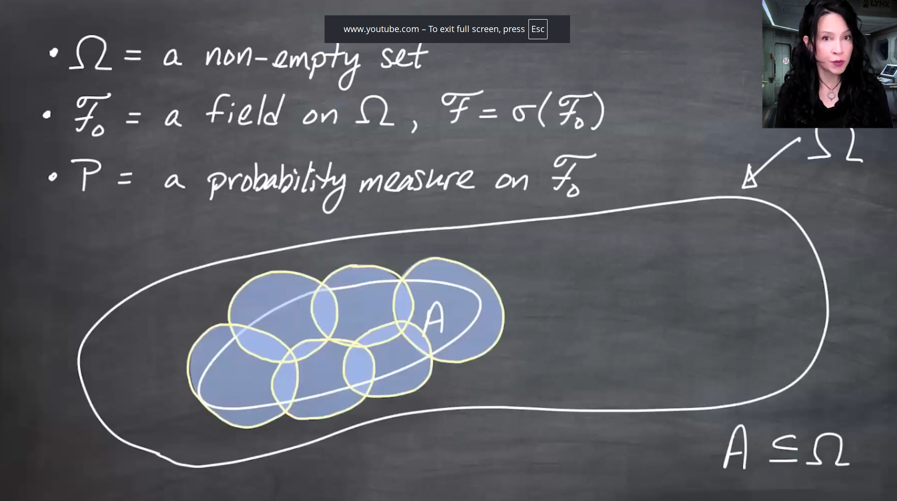{fig-alt="The slide recalls the setting: a field F naught has a probability measure P, and F is the sigma-field generated by F naught. The goal is to define a probability measure on F that agrees with P on F naught." group="slides"}

The extension problem starts from $P$ on the smaller field $\mathcal{F}_0$ and aims to define a probability measure on the larger $\sigma$-field $\mathcal{F}=\sigma(\mathcal{F}_0)$.
:::

The previous lesson gave the roadmap using six lemmas. This lesson proves Lemmas 1–3.

:::{.column-margin #fig-l06-slide-02} 
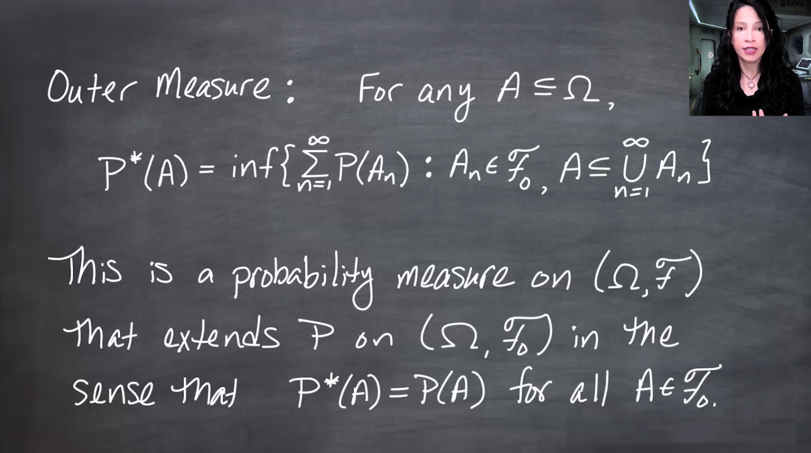{fig-alt="The slide says that earlier videos used several lemmas to prove that P star is a probability measure on the generated sigma-field, and that this lesson proves the first three of them." group="slides"}

The proof is optional in the sense that the previous lesson already showed how the lemmas imply the extension theorem. This lesson supplies the missing proof details.
:::

## Recall the outer measure $P^*$

For every subset $A\subseteq\Omega$, define

$$
P^*(A)
=
\inf
\left\{
\sum_{n=1}^{\infty}P(A_n)
:
A_n\in\mathcal{F}_0
\text{ and }
A\subseteq\bigcup_{n=1}^{\infty}A_n
\right\}.
$$

This measures $A$ from the outside by covering it with countably many sets from $\mathcal{F}_0$.

:::{.column-margin #fig-l06-slide-03}
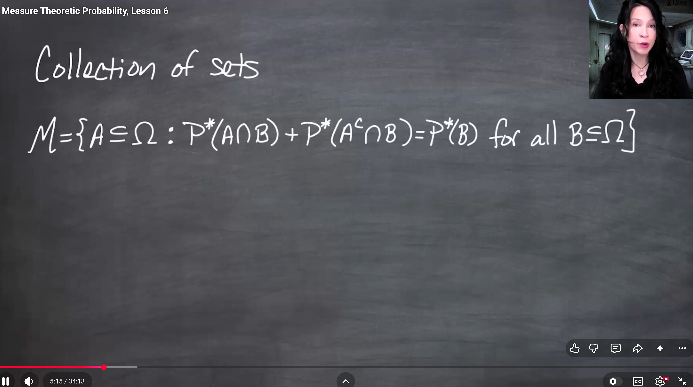{fig-alt="The slide recalls the definition of P star of A as the infimum of sums of P of A n, where the A n are in F naught and cover A." group="slides"}

The sets $A_n$ come from $\mathcal{F}_0$, where $P$ is already defined. The infimum searches over all such covers and chooses the best upper estimate.
:::

:::{.column-margin #fig-l06-slide-04} 
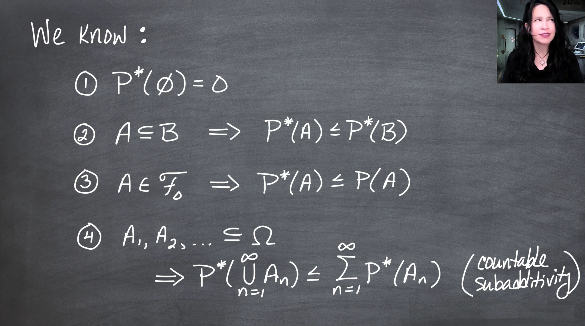{fig-alt="The slide warns that in proving the lemmas, one cannot use the fact that P star is a probability measure, because that is exactly what the lemmas are needed to prove." group="slides"}

During these proofs, we may use the already-proved basic properties of $P^*$, such as $P^*(\emptyset)=0$, monotonicity, and countable subadditivity. We may **not** use countable additivity of $P^*$ as if it were already a probability measure.
:::

## Recall the class $\mathcal{M}$

Define $\mathcal{M}$ as the class of subsets $A\subseteq\Omega$ that split every subset $B\subseteq\Omega$ additively:

$$
\mathcal{M}
=
\left\{
A\subseteq\Omega:
P^*(A\cap B)+P^*(A^c\cap B)=P^*(B)
\text{ for all } B\subseteq\Omega
\right\}.
$$

:::{.column-margin #fig-l06-slide-05}
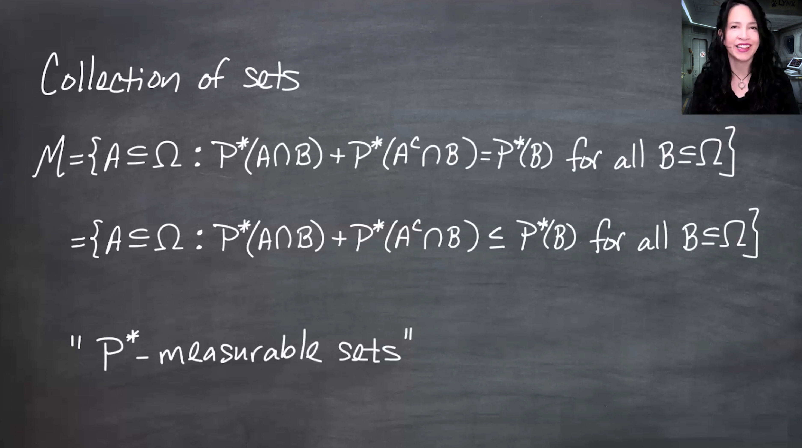{fig-alt="The slide defines script M as the collection of subsets A of Omega such that P star of A intersect B plus P star of A complement intersect B equals P star of B for every subset B of Omega." group="slides"}

The sets in $\mathcal{M}$ are the sets that behave measurably with respect to the outer measure $P^*$: they cut every $B$ into two pieces without losing or gaining $P^*$-mass.
:::

Because $P^*$ is countably subadditive, we always have

$$
P^*(B)
\leq
P^*(A\cap B)+P^*(A^c\cap B).
$$

So to show $A\in\mathcal{M}$, it is enough to prove the reverse inequality:

$$
P^*(A\cap B)+P^*(A^c\cap B)
\leq
P^*(B)
\qquad
\text{for all } B\subseteq\Omega.
$$

:::{.column-margin #fig-l06-slide-06} 
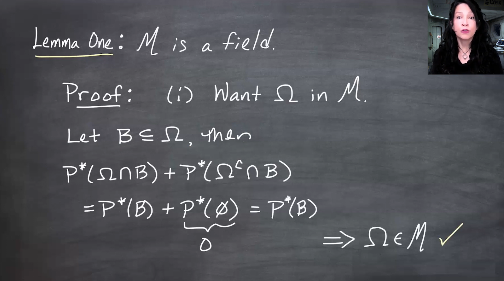{fig-alt="The slide notes that countable subadditivity already gives one inequality, so membership in M can be characterized by proving the opposite inequality." group="slides"}

The equality definition and the one-sided inequality criterion are equivalent because subadditivity already gives the other direction.
:::

The sets in $\mathcal{M}$ are sometimes called $P^*$-measurable sets.

:::{.column-margin #fig-l06-slide-07} 
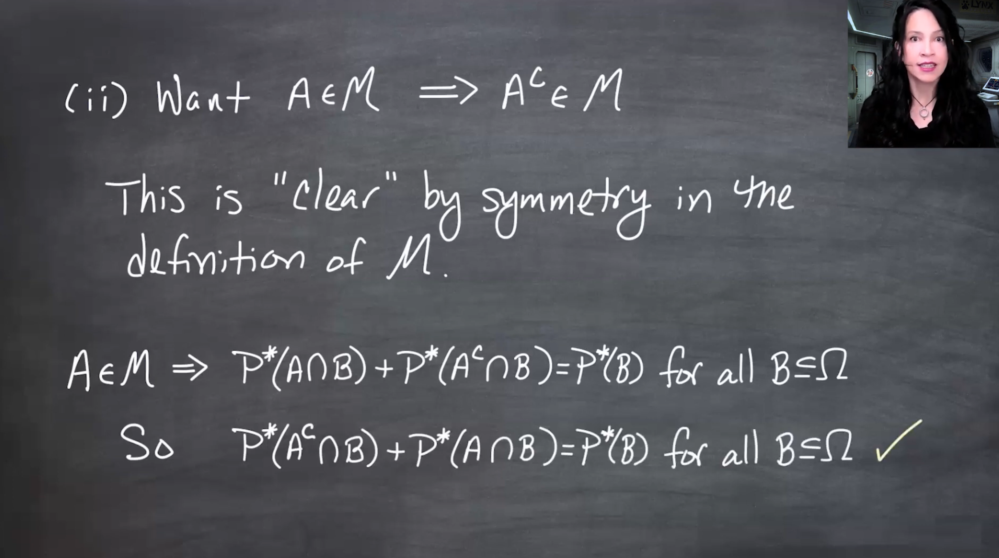{fig-alt="The slide notes that the collection M consists of P star measurable sets, although that terminology is not needed for the proof." group="slides"}

The terminology “$P^*$-measurable” reflects the role of $\mathcal{M}$: it is the class on which $P^*$ will become a genuine probability measure.
:::

## Lemma 1: $\mathcal{M}$ is a field

::: {#lem-m-field}
## Lemma 1

The collection $\mathcal{M}$ is a field.
:::

To prove this, show:

1. $\Omega\in\mathcal{M}$;
2. if $A\in\mathcal{M}$, then $A^c\in\mathcal{M}$;
3. if $A_1,A_2\in\mathcal{M}$, then $A_1\cup A_2\in\mathcal{M}$.

Finite unions then follow by induction.

:::{.column-margin #fig-l06-slide-08}
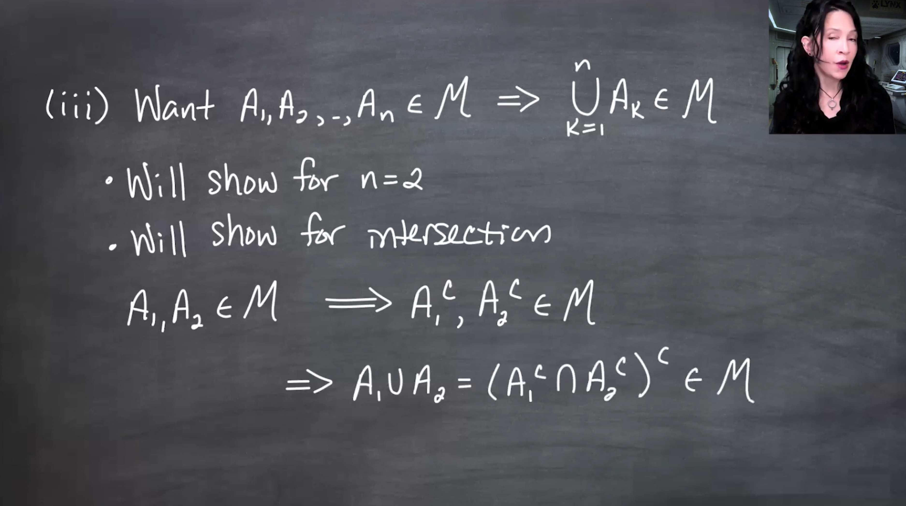{fig-alt="The slide states Lemma 1: M is a field, and begins the proof by listing the field properties to verify." group="slides"}

A field requires the full space, closure under complements, and closure under finite unions.
:::

### Step 1: $\Omega\in\mathcal{M}$

For any $B\subseteq\Omega$,

$$
P^*(\Omega\cap B)+P^*(\Omega^c\cap B)
=
P^*(B)+P^*(\emptyset)
=
P^*(B).
$$

Since $P^*(\emptyset)=0$, this proves $\Omega\in\mathcal{M}$.

:::{.column-margin #fig-l06-slide-09} 
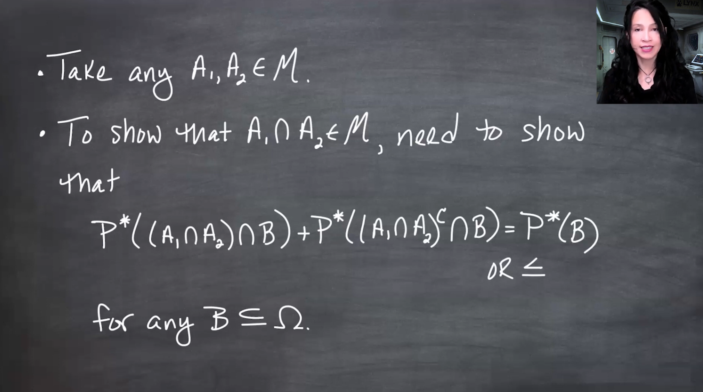{fig-alt="The slide proves Omega is in M by computing P star of Omega intersect B plus P star of Omega complement intersect B, which becomes P star of B plus P star of the empty set." group="slides"}

The full space splits any $B$ into $B$ and $\emptyset$, so the defining equality for $\mathcal{M}$ holds.
:::

### Step 2: closure under complements

If $A\in\mathcal{M}$, then for every $B\subseteq\Omega$,

$$
P^*(A\cap B)+P^*(A^c\cap B)
=
P^*(B).
$$

But the two summands can be swapped:

$$
P^*(A^c\cap B)+P^*((A^c)^c\cap B)
=
P^*(B).
$$

Thus $A^c\in\mathcal{M}$.

:::{.column-margin #fig-l06-slide-10}
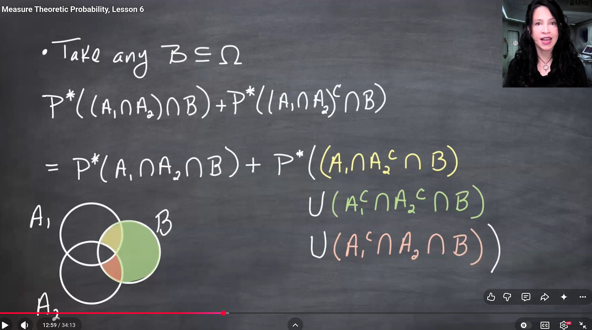{fig-alt="The slide shows that if A is in M, then A complement is also in M, because the defining equality is symmetric in A and A complement." group="slides"}

The definition of $\mathcal{M}$ is symmetric in $A$ and $A^c$, so complements are immediate.
:::

### Step 3: closure under finite unions

It is easier to prove closure under finite intersections first. Then De Morgan’s law gives closure under finite unions.

If $A_1,A_2\in\mathcal{M}$, we will prove

$$
A_1\cap A_2\in\mathcal{M}.
$$

Then

$$
A_1\cup A_2
=
(A_1^c\cap A_2^c)^c
$$

belongs to $\mathcal{M}$ because $\mathcal{M}$ is closed under complements and finite intersections.

:::{.column-margin #fig-l06-slide-11}
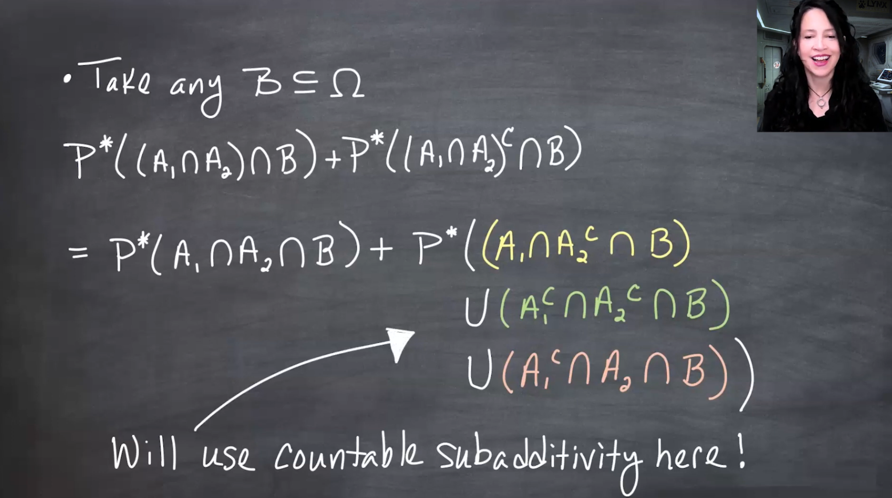{fig-alt="The slide explains that finite union closure can be obtained from complement closure and intersection closure using De Morgan's law." group="slides"}

The proof uses the identity $A_1\cup A_2=(A_1^c\cap A_2^c)^c$. So it is enough to prove closure under intersections.
:::

To show $A_1\cap A_2\in\mathcal{M}$, take any $B\subseteq\Omega$. We need to show

$$
P^*((A_1\cap A_2)\cap B)
+
P^*((A_1\cap A_2)^c\cap B)
\leq
P^*(B).
$$

The second set is the part of $B$ outside $A_1\cap A_2$.

:::{.column-margin #fig-l06-slide-12} 
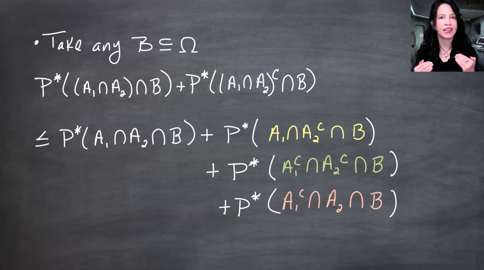{fig-alt="The slide sets up the proof that A1 intersect A2 is in M. It writes the one-sided inequality criterion involving P star of A1 intersect A2 intersect B and P star of the complement of A1 intersect A2 intersect B." group="slides"}

The proof uses the one-sided criterion for membership in $\mathcal{M}$, because the reverse inequality is already supplied by subadditivity.
:::

The set outside $A_1\cap A_2$ but inside $B$ can be decomposed into three regions:

$$
(A_1\cap A_2)^c\cap B
=
(A_1\cap A_2^c\cap B)
\cup
(A_1^c\cap A_2^c\cap B)
\cup
(A_1^c\cap A_2\cap B).
$$

:::{.column-margin #fig-l06-slide-13} 
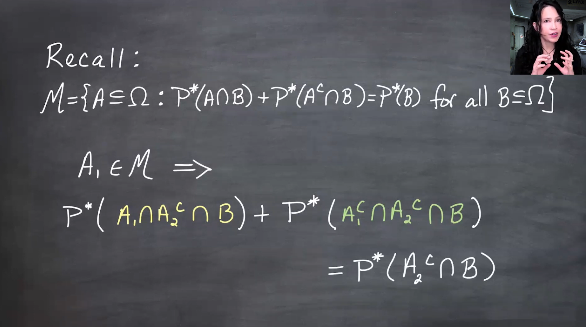{fig-alt="The slide uses a Venn diagram to decompose the part of B outside A1 intersect A2 into three pieces: A1 intersect A2 complement intersect B, A1 complement intersect A2 complement intersect B, and A1 complement intersect A2 intersect B." group="slides"}

The Venn diagram splits $B\setminus(A_1\cap A_2)$ into the pieces where only $A_1$ holds, neither holds, or only $A_2$ holds.
:::

By countable subadditivity of $P^*$, the $P^*$ of this union is bounded above by the sum of the three $P^*$ values.

:::{.column-margin #fig-l06-slide-14}
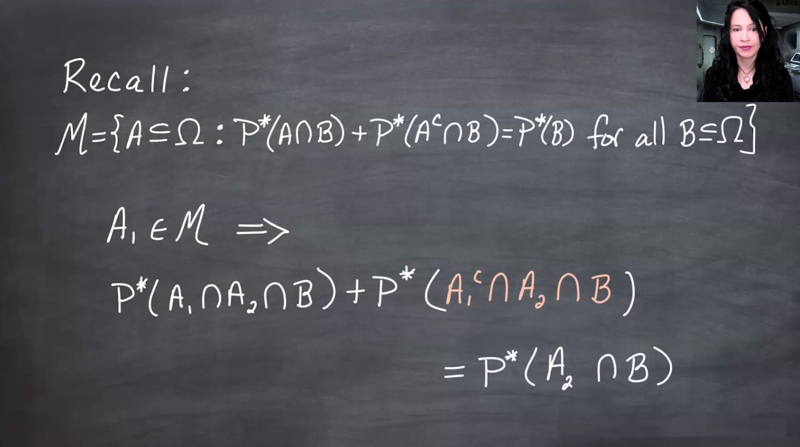{fig-alt="The slide replaces P star of the three-piece union with a less-than-or-equal-to sum of the P star values of the individual pieces." group="slides"}

This is one of the places where the proof must use **subadditivity**, not additivity, because $P^*$ has not yet been proved to be a measure.
:::

Now group the terms using the defining property of $A_1\in\mathcal{M}$.

For example,

$$
P^*(A_1\cap A_2^c\cap B)
+
P^*(A_1^c\cap A_2^c\cap B)
=
P^*(A_2^c\cap B),
$$

because this is the $\mathcal{M}$ splitting property for $A_1$ applied to the test set $A_2^c\cap B$.

:::{.column-margin #fig-l06-slide-15} 
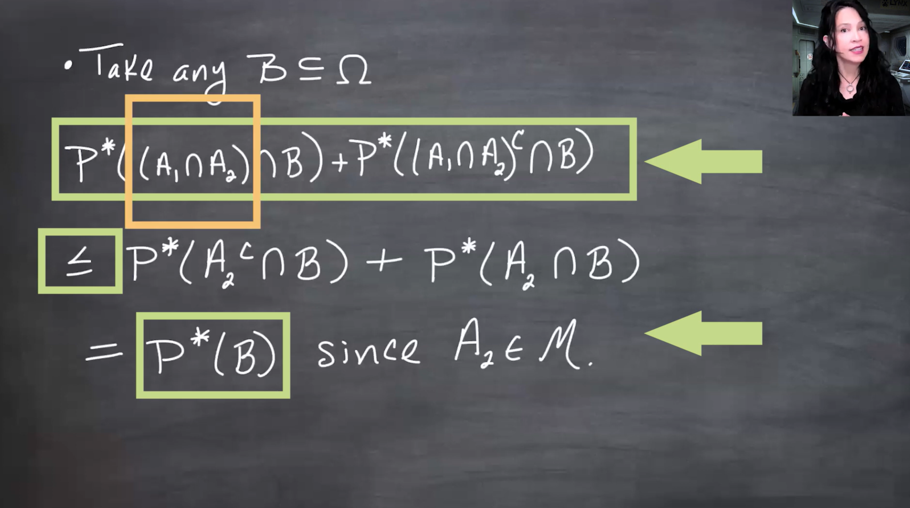{fig-alt="The slide groups color-coded terms and uses the fact that A1 belongs to M to combine pairs of P star terms into single P star terms." group="slides"}

The definition of $\mathcal{M}$ lets us combine terms of the form $P^*(A_1\cap C)+P^*(A_1^c\cap C)$ into $P^*(C)$.
:::

After grouping, the expression becomes

$$
P^*(A_2\cap B)+P^*(A_2^c\cap B).
$$

Since $A_2\in\mathcal{M}$, this equals $P^*(B)$.

:::{.column-margin #fig-l06-slide-16}
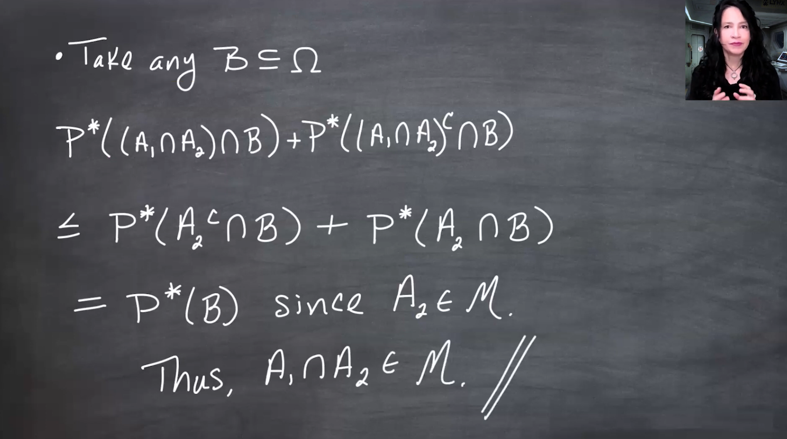{fig-alt="The slide plugs the grouped terms back into the inequality and uses the fact that A2 belongs to M to conclude the expression is bounded by P star of B." group="slides"}

The final step uses $A_2\in\mathcal{M}$. This proves $A_1\cap A_2\in\mathcal{M}$, and hence finite union closure follows by complements and De Morgan’s law.
:::

Finite union closure for more than two sets follows by induction: once the union of two $\mathcal{M}$-sets is in $\mathcal{M}$, repeatedly union one more set.

:::{.column-margin #fig-l06-slide-17} 
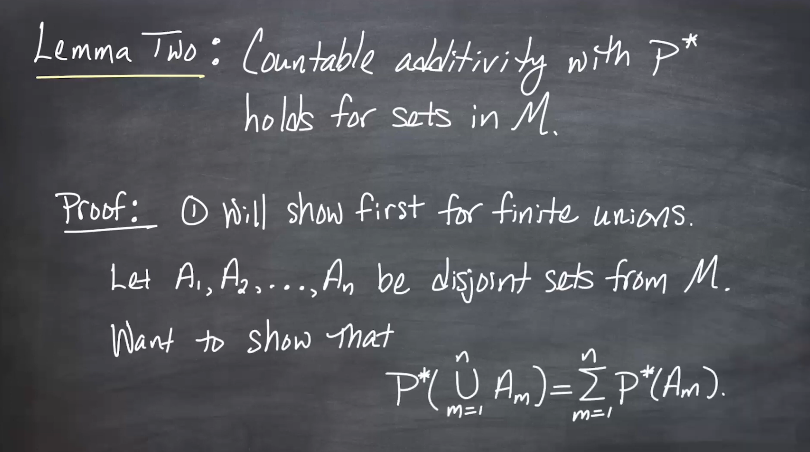{fig-alt="The slide explains that proving closure under unions for two sets extends to finite unions by induction." group="slides"}

The proof for two sets is the essential case. The general finite case is repeated application of the two-set result.
:::

Thus Lemma 1 is proved: $\mathcal{M}$ is a field.

## Lemma 2: countable additivity on $\mathcal{M}$

::: {#lem-pstar-countably-additive-on-m}
## Lemma 2

If $A_1,A_2,\ldots\in\mathcal{M}$ are disjoint, then

$$
P^*\left(\bigcup_{n=1}^{\infty}A_n\right)
=
\sum_{n=1}^{\infty}P^*(A_n).
$$
:::

The proof first establishes a stronger finite version involving an arbitrary test set $B\subseteq\Omega$:

$$
P^*\left(B\cap\bigcup_{i=1}^{n}A_i\right)
=
\sum_{i=1}^{n}P^*(B\cap A_i),
$$

for disjoint $A_1,\ldots,A_n\in\mathcal{M}$.

:::{.column-margin #fig-l06-slide-18} 
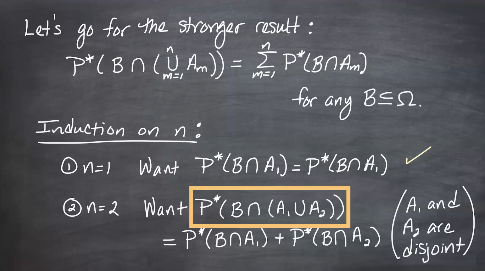{fig-alt="The slide states Lemma 2: countable additivity holds for P star on sets in M. It begins by proving a stronger finite result involving B intersect the finite union of A i." group="slides"}

The stronger result includes a free subset $B$. Taking $B=\Omega$ later recovers finite additivity for the $A_i$ themselves.
:::

### Finite case

For $n=1$, the identity is trivial.

For $n=2$, take disjoint $A_1,A_2\in\mathcal{M}$. Then

$$
B\cap(A_1\cup A_2)
$$

splits into the part inside $A_1$ and the part inside $A_2$.

:::{.column-margin #fig-l06-slide-19}
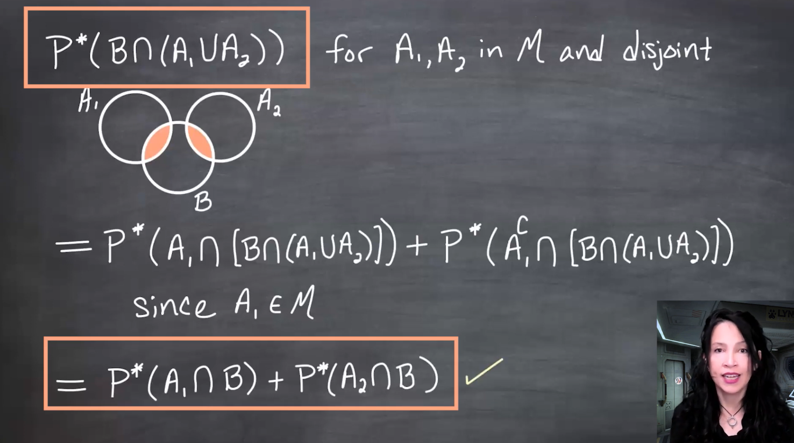{fig-alt="The slide illustrates B intersect (A1 union A2) when A1 and A2 are disjoint. The shaded region consists of B intersect A1 and B intersect A2." group="slides"}

The diagram shows that $B\cap(A_1\cup A_2)$ consists of two separated pieces: $B\cap A_1$ and $B\cap A_2$.
:::

Using the defining property of $A_1\in\mathcal{M}$, applied to the test set $B\cap(A_1\cup A_2)$,

$$
P^*(B\cap(A_1\cup A_2))
=
P^*(B\cap A_1)+P^*(B\cap A_2).
$$

:::{.column-margin #fig-l06-slide-20} 
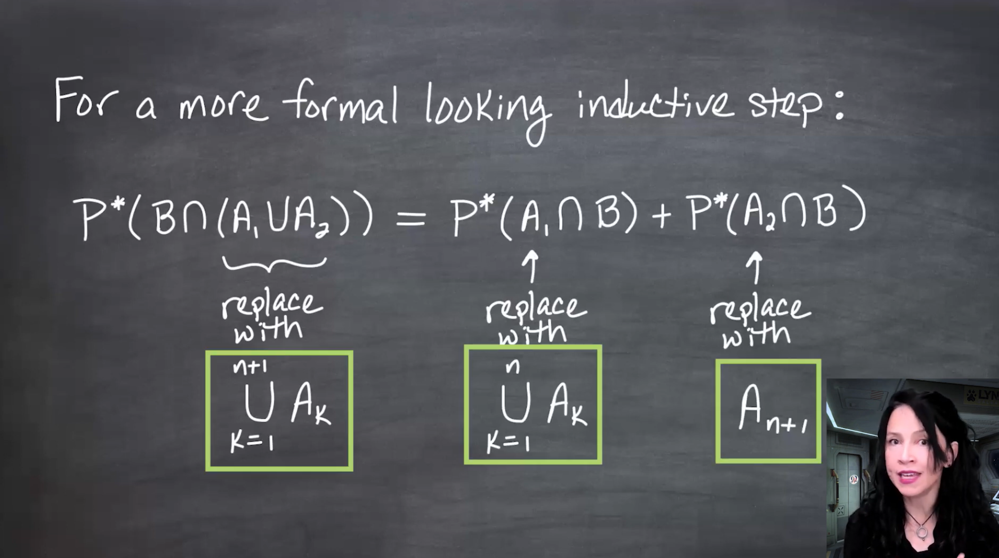{fig-alt="The slide stresses that the equality in the n equals two case comes from the definition of A1 being in M, not from countable additivity of P star." group="slides"}

This equality is **not** using countable additivity of $P^*$. It comes from the definition of membership in $\mathcal{M}$.
:::

The finite case for general $n$ follows by induction.

:::{.column-margin #fig-l06-slide-21}
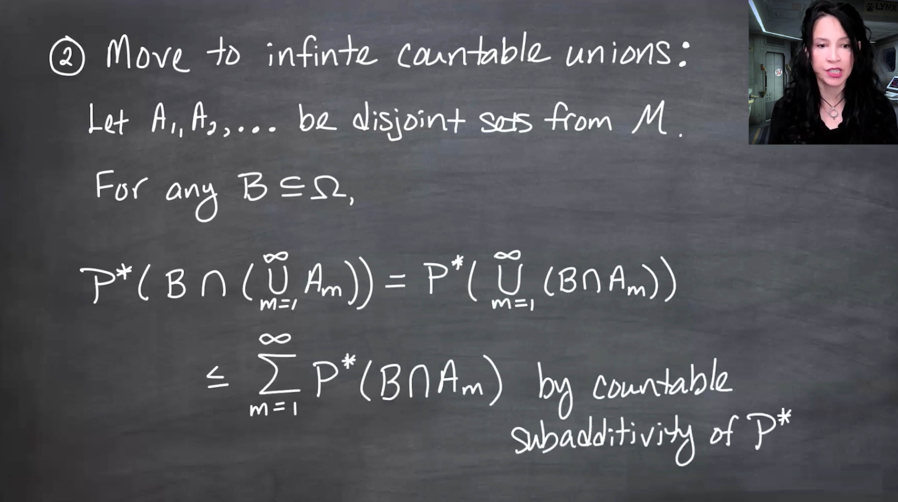{fig-alt="The slide explains that the finite result for two sets extends to n sets by replacing A1 with a finite union and A2 with the next set." group="slides"}

To pass from $n$ to $n+1$, treat $\bigcup_{i=1}^n A_i$ as one $\mathcal{M}$-set and $A_{n+1}$ as the second set.
:::

### Countable case

Now let $A_1,A_2,\ldots\in\mathcal{M}$ be disjoint. We want

$$
P^*\left(B\cap\bigcup_{n=1}^{\infty}A_n\right)
=
\sum_{n=1}^{\infty}P^*(B\cap A_n).
$$

The $\leq$ direction follows from countable subadditivity of $P^*$:

$$
P^*\left(\bigcup_{n=1}^{\infty}(B\cap A_n)\right)
\leq
\sum_{n=1}^{\infty}P^*(B\cap A_n).
$$

:::{.column-margin #fig-l06-slide-22}
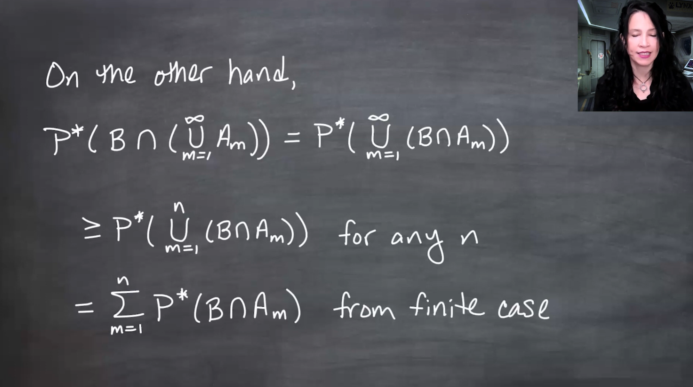{fig-alt="The slide shows that P star of B intersect the countable union of A n is at most the sum of P star of B intersect A n, by countable subadditivity." group="slides"}

This direction uses only the general subadditivity property of $P^*$, which was proved before the lemma roadmap.
:::

For the $\geq$ direction, use monotonicity. For every finite $m$,

$$
\bigcup_{n=1}^{m}(B\cap A_n)
\subseteq
\bigcup_{n=1}^{\infty}(B\cap A_n).
$$

Therefore,

$$
P^*\left(B\cap\bigcup_{n=1}^{\infty}A_n\right)
\geq
P^*\left(B\cap\bigcup_{n=1}^{m}A_n\right).
$$

By the finite case,

$$
P^*\left(B\cap\bigcup_{n=1}^{m}A_n\right)
=
\sum_{n=1}^{m}P^*(B\cap A_n).
$$

:::{.column-margin #fig-l06-slide-23} 
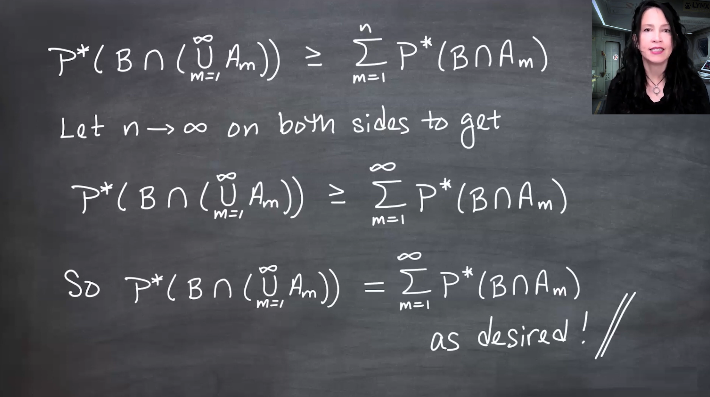{fig-alt="The slide bounds the countable union below by finite partial unions, then uses finite additivity for those partial unions." group="slides"}

Every finite partial union is contained in the countable union. Monotonicity gives the inequality, and the finite case rewrites the right-hand side as a partial sum.
:::

Letting $m\to\infty$ gives

$$
P^*\left(B\cap\bigcup_{n=1}^{\infty}A_n\right)
\geq
\sum_{n=1}^{\infty}P^*(B\cap A_n).
$$

Together with the $\leq$ direction, this proves equality.

:::{.column-margin #fig-l06-slide-24}
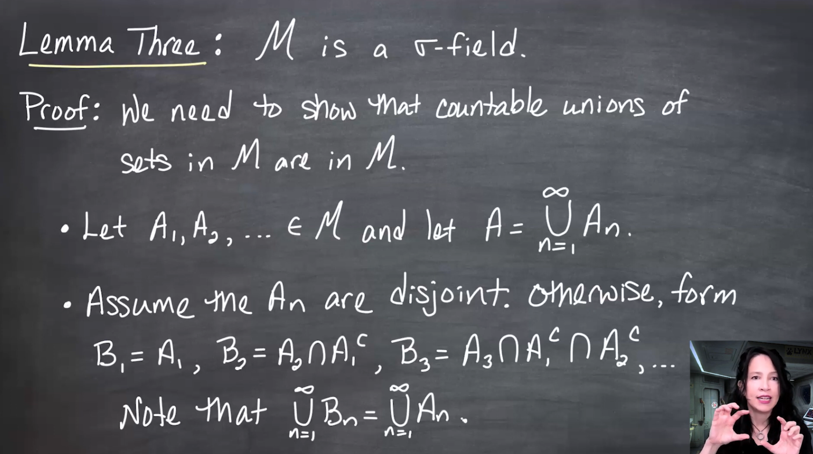{fig-alt="The slide lets m go to infinity in the finite partial-sum inequality, turning the finite sum into an infinite sum and completing the equality." group="slides"}

The infinite sum is defined as the limit of its finite partial sums. This upgrades finite additivity on $\mathcal{M}$ to countable additivity on disjoint sequences in $\mathcal{M}$.
:::

Taking $B=\Omega$ gives Lemma 2 exactly.

## Lemma 3: $\mathcal{M}$ is a sigma-field

::: {#lem-m-sigma-field}
## Lemma 3

The collection $\mathcal{M}$ is a $\sigma$-field.
:::

Lemma 1 already shows that $\mathcal{M}$ is a field. Therefore, the only missing property is closure under countable unions.

Let

$$
A=\bigcup_{n=1}^{\infty}A_n,
\qquad
A_n\in\mathcal{M}.
$$

We must show $A\in\mathcal{M}$.

:::{.column-margin #fig-l06-slide-25} 
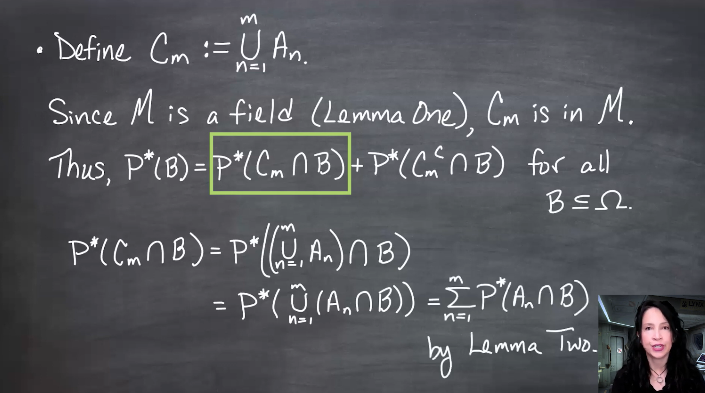{fig-alt="The slide states Lemma 3: M is a sigma-field. Since Lemma 1 already proves M is a field, it remains to show closure under countable unions." group="slides"}

A field already has $\Omega$, complements, and finite unions. A $\sigma$-field additionally requires closure under countable unions.
:::

The $A_n$ need not be disjoint. But we can replace them by disjoint pieces:

$$
B_1=A_1,
$$

$$
B_2=A_2\setminus A_1,
$$

$$
B_3=A_3\setminus(A_1\cup A_2),
$$

and so on. These $B_n$ are disjoint and have the same union as the original $A_n$.

:::{.column-margin #fig-l06-slide-26}
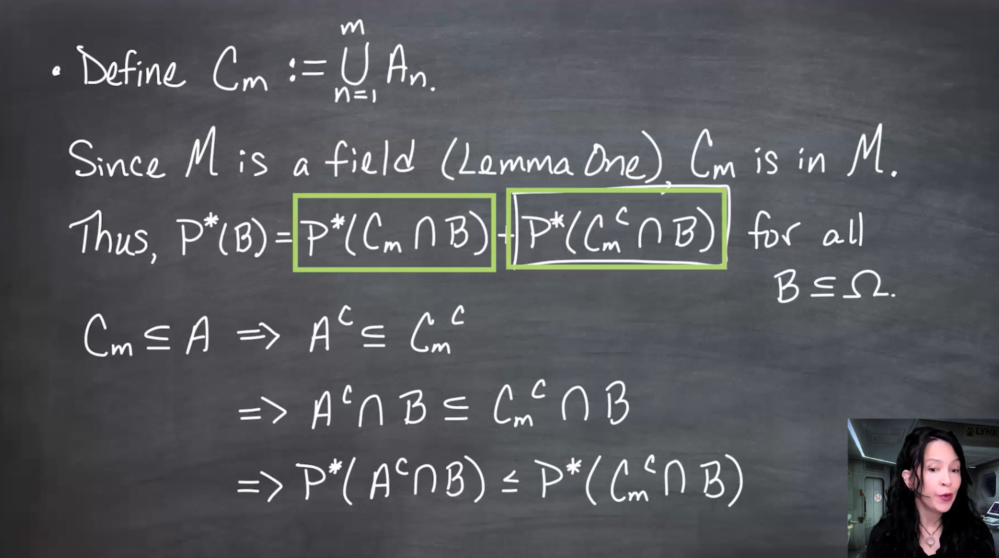{fig-alt="The slide explains that if the A n are not disjoint, they can be replaced by disjoint pieces B1, B2, B3 and so on, where each B n is the new part of A n not already covered by earlier sets." group="slides"}

The disjointization trick keeps the same total union while making Lemma 2 applicable.
:::

So assume the $A_n$ are disjoint. Define the finite partial union

$$
C_m=\bigcup_{n=1}^{m}A_n.
$$

Since $\mathcal{M}$ is a field, $C_m\in\mathcal{M}$.

For any $B\subseteq\Omega$, because $C_m\in\mathcal{M}$,

$$
P^*(B)
=
P^*(C_m\cap B)+P^*(C_m^c\cap B).
$$

Now

$$
C_m\cap B
=
\bigcup_{n=1}^{m}(A_n\cap B),
$$

and by Lemma 2,

$$
P^*(C_m\cap B)
=
\sum_{n=1}^{m}P^*(A_n\cap B).
$$

Also, since $C_m\subseteq A$, we have $A^c\subseteq C_m^c$, hence

$$
A^c\cap B\subseteq C_m^c\cap B.
$$

By monotonicity,

$$
P^*(A^c\cap B)\leq P^*(C_m^c\cap B).
$$

:::{.column-margin #fig-l06-slide-27} 
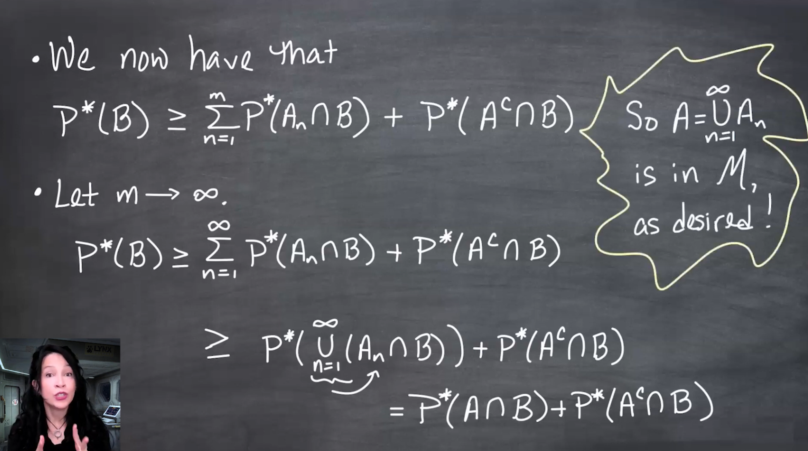{fig-alt="The slide defines C m as the finite union of A1 through A m, uses C m in M to split B, rewrites the first term with Lemma 2, bounds the second term using A complement subset C m complement, and then lets m go to infinity." group="slides"}

The proof compares the full countable union $A$ with finite partial unions $C_m$. Lemma 2 handles the finite additive part, and monotonicity handles the complement term.
:::

Putting these together,

$$
P^*(B)
\geq
\sum_{n=1}^{m}P^*(A_n\cap B)+P^*(A^c\cap B).
$$

Letting $m\to\infty$,

$$
P^*(B)
\geq
\sum_{n=1}^{\infty}P^*(A_n\cap B)+P^*(A^c\cap B).
$$

By countable subadditivity,

$$
\sum_{n=1}^{\infty}P^*(A_n\cap B)
\geq
P^*\left(\bigcup_{n=1}^{\infty}(A_n\cap B)\right)
=
P^*(A\cap B).
$$

Therefore,

$$
P^*(B)
\geq
P^*(A\cap B)+P^*(A^c\cap B).
$$

This is the one-sided criterion for $A\in\mathcal{M}$. Hence $\mathcal{M}$ is closed under countable unions.

Together with Lemma 1, this proves that $\mathcal{M}$ is a $\sigma$-field.

## Takeaway

This lesson proves the structural part of the extension theorem:

$$
\mathcal{M}
\text{ is a field}
\quad\Longrightarrow\quad
P^* \text{ is countably additive on } \mathcal{M}
\quad\Longrightarrow\quad
\mathcal{M}
\text{ is a } \sigma\text{-field}.
$$

The key proof pattern is:

1. define $\mathcal{M}$ by a splitting identity;
2. use subadditivity of $P^*$ to get one inequality for free;
3. prove the reverse inequality where needed;
4. use finite approximations and limits to move from finite to countable unions.

The next lesson proves Lemmas 4–6, which connect $\mathcal{M}$ back to the original field $\mathcal{F}_0$ and complete the extension argument.
