::: {#vid-C99-L07 .column-margin}


Lesson 7: Proof of Lemmas 4–6 for the outer-measure extension construction.
:::

## Lesson map

This lesson proves the next three lemmas from the extension roadmap.

-  Recap: extending $P$ from a field $\mathcal{F}_0$ to $\mathcal{F}=\sigma(\mathcal{F}_0)$.
- Recall the outer measure $P^*$.
- Important warning: do **not** use that $P^*$ is a probability measure yet.
- Recall the definition of $\mathcal{M}$.
- Lemma 4:
- Lemma 5:
- Lemma 6:

:::{.column-margin #fig-l07-slide-01} 
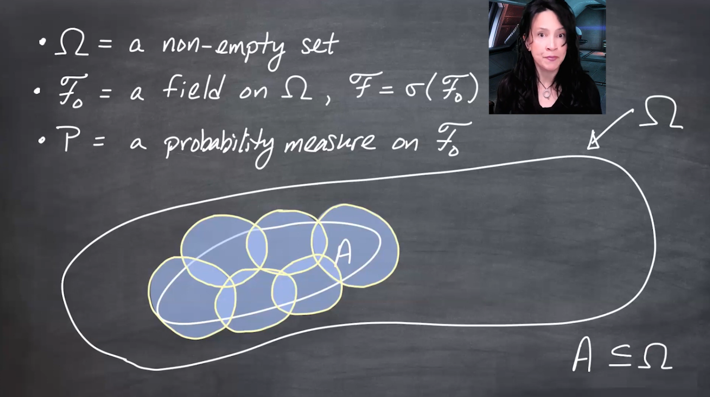{fig-alt="me with alternative without math."}

And me with a longer caption that is more descriptive of the image, and can replace the image if it doesn't load.
:::

:::{.column-margin #fig-l07-slide-02} 
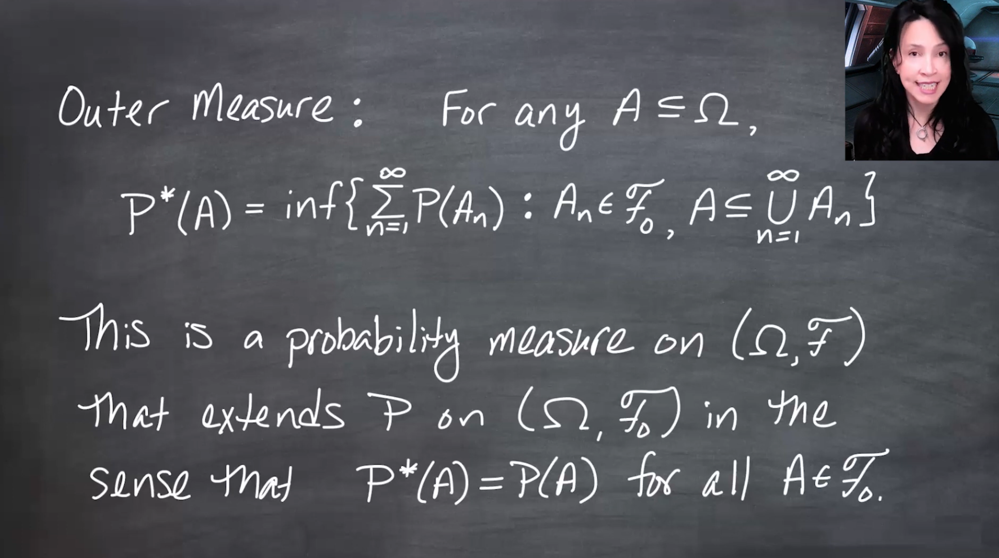{fig-alt="me with alternative without math."}

And me with a longer caption that is more descriptive of the image, and can replace the image if it doesn't load.
:::

:::{.column-margin #fig-l07-slide-03}
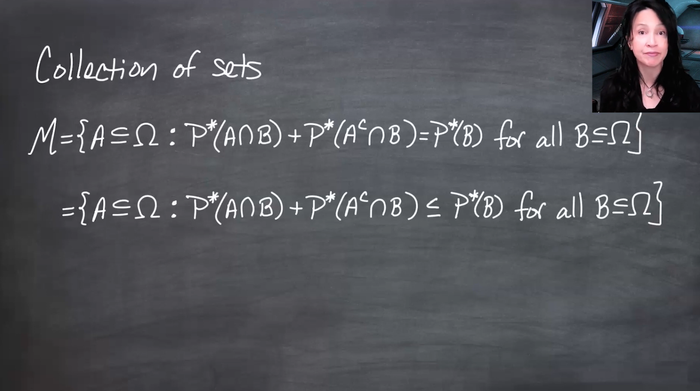{fig-alt="me with alternative without math."}
And me with a longer caption that is more descriptive of the image, and can replace the image if it doesn't load.
:::

:::{.column-margin #fig-l07-slide-04} 
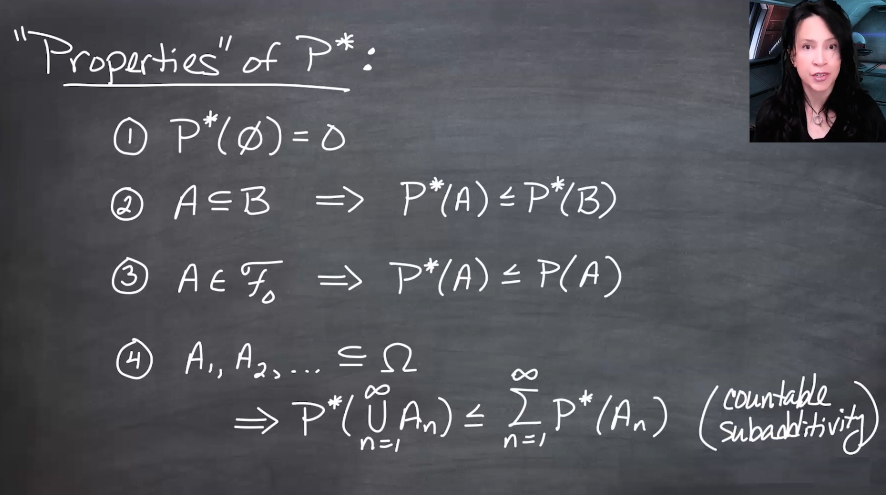{fig-alt="me with alternative without math."}

And me with a longer caption that is more descriptive of the image, and can replace the image if it doesn't load.
:::

:::{.column-margin #fig-l07-slide-05}
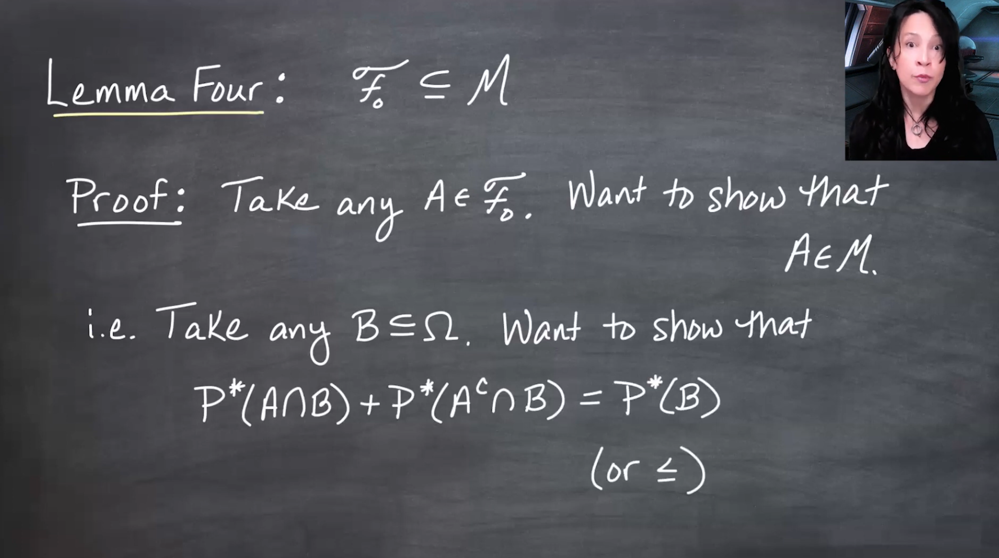{fig-alt="me with alternative without math."}
And me with a longer caption that is more descriptive of the image, and can replace the image if it doesn't load.
:::

:::{.column-margin #fig-l07-slide-06} 
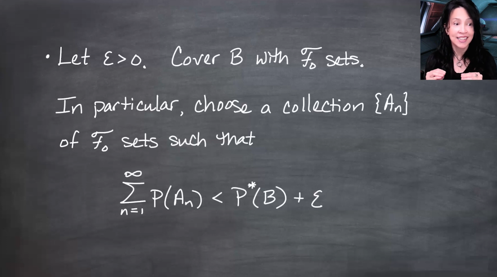{fig-alt="me with alternative without math."}

And me with a longer caption that is more descriptive of the image, and can replace the image if it doesn't load.
:::

:::{.column-margin #fig-l07-slide-07} 
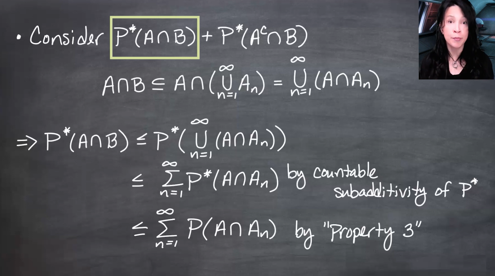{fig-alt="me with alternative without math."}

And me with a longer caption that is more descriptive of the image, and can replace the image if it doesn't load.
:::

:::{.column-margin #fig-l07-slide-08}
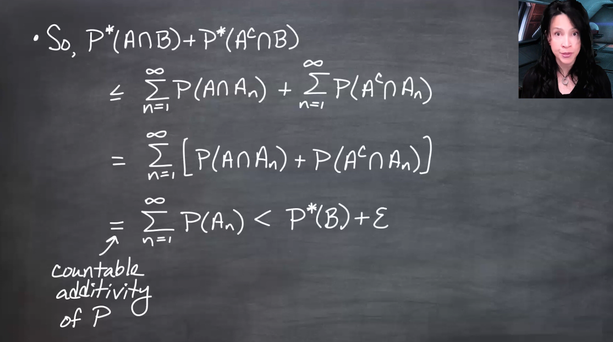{fig-alt="me with alternative without math."}

And me with a longer caption that is more descriptive of the image, and can replace the image if it doesn't load.
:::

:::{.column-margin #fig-l07-slide-09} 
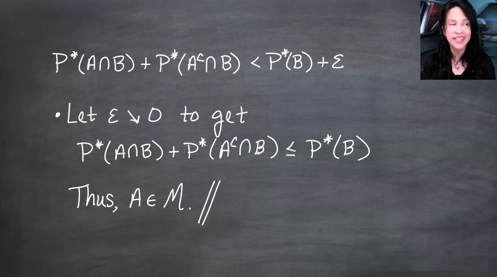{fig-alt="me with alternative without math."}

And me with a longer caption that is more descriptive of the image, and can replace the image if it doesn't load.
:::

:::{.column-margin #fig-l07-slide-10}
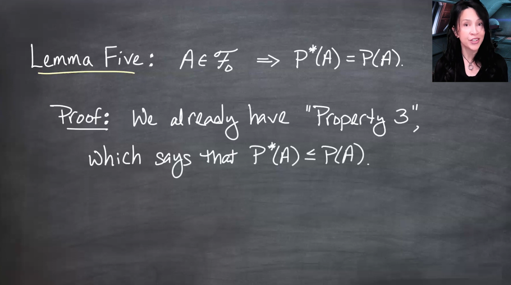{fig-alt="me with alternative without math."}

And me with a longer caption that is more descriptive of the image, and can replace the image if it doesn't load.
:::

:::{.column-margin #fig-l07-slide-11}
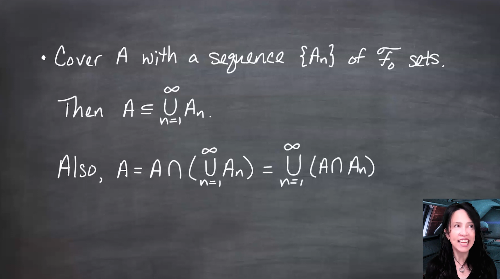{fig-alt="me with alternative without math."}

And me with a longer caption that is more descriptive of the image, and can replace the image if it doesn't load.
:::

:::{.column-margin #fig-l07-slide-12} 
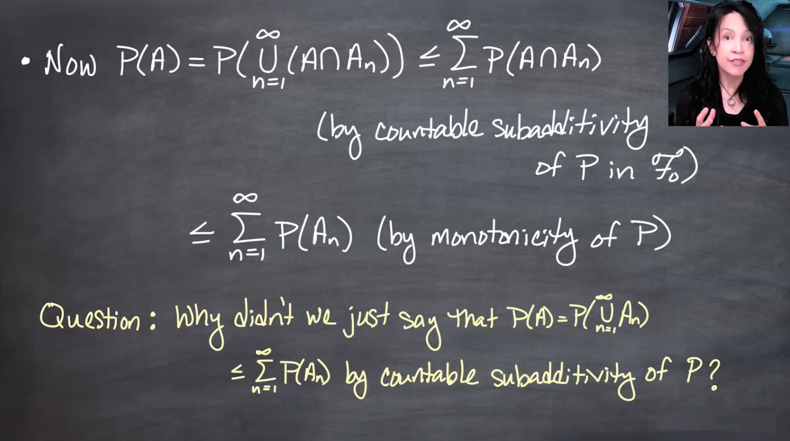{fig-alt="me with alternative without math."}

And me with a longer caption that is more descriptive of the image, and can replace the image if it doesn't load.
:::

:::{.column-margin #fig-l07-slide-13} 
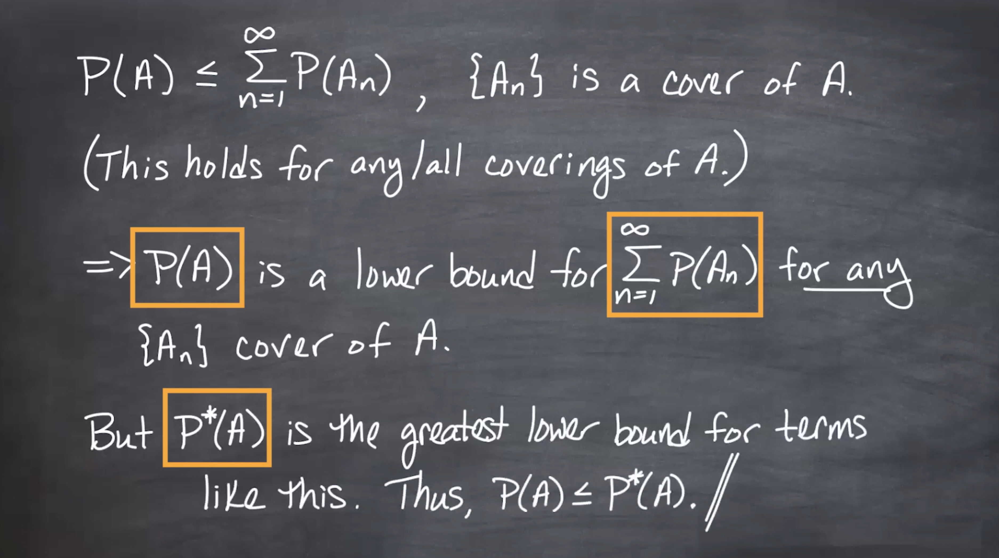{fig-alt="me with alternative without math."}

And me with a longer caption that is more descriptive of the image, and can replace the image if it doesn't load.
:::

:::{.column-margin #fig-l07-slide-14}
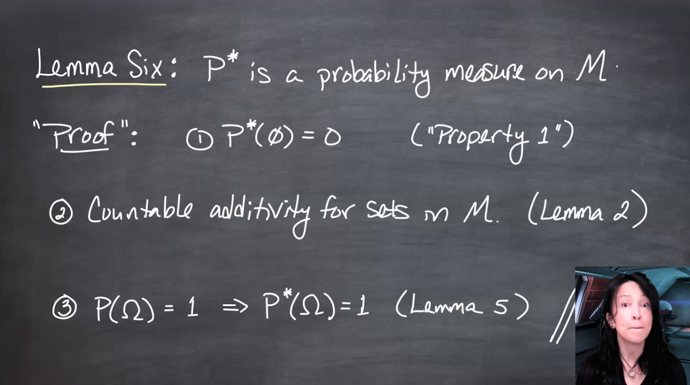{fig-alt="me with alternative without math."}
And me with a longer caption that is more descriptive of the image, and can replace the image if it doesn't load.
:::