::: {#vid-C99-l08 .column-margin}


Lesson 8: limits of sequences of sets.
:::

## Lesson map

This lesson introduces limits of sequences of sets.

- 0:12 — What should $\lim_n A_n$ mean for sets?
- 2:03 — First intuitive example: increasing intervals approaching $[0,1)$.
- 3:24 — Review: $\limsup$ and $\liminf$ for sequences of real numbers.
- 10:29 — Decreasing sequences of sets: $A_n\downarrow A$.
- 12:06 — Increasing sequences of sets: $A_n\uparrow A$.
- 13:39 — General sequences: define $\limsup A_n$ and $\liminf A_n$.
- 17:09 — Prove $\liminf A_n\subseteq\limsup A_n$.
- 19:35 — Define the limit of sets when $\liminf A_n=\limsup A_n$.
- 20:00 — Check decreasing sequences.
- 23:39 — Check increasing sequences.
- 24:18 — Revisit the interval example.
- 27:22 — Alternating-set example.
- 30:09 — Complements of $\limsup$ and $\liminf$.
- 31:46 — Event interpretation: infinitely often and eventually.
- 34:09 — Measurability of $\limsup A_n$, $\liminf A_n$, and $\lim A_n$.
- 35:36 — Preview: continuity of probabilities.

## Why limits of sets?

So far, collections like $A_1,A_2,A_3,\ldots$ were mostly just indexed families. The order did not matter much when taking unions or intersections.

Now the order matters. A sequence of sets is meant to evolve:

$$
A_1,\ A_2,\ A_3,\ \ldots
$$

The question is whether this sequence has a limiting set.

:::{.column-margin #fig-l08-slide-01} 
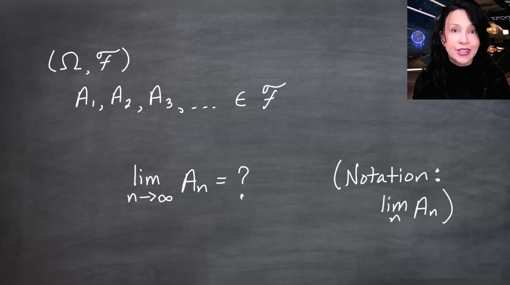{fig-alt="The slide introduces the question of defining the limit of a sequence of sets A n. It shows a sequence of circular sets moving or shrinking toward a possible limiting object."}

The intuitive picture of sets “approaching” a limit works well in metric spaces, where distance is meaningful. But measure theory also needs a definition for abstract sets, where geometric distance may not exist.
:::

## First example: nested intervals

Let

$$
\Omega=\mathbb{R},
\qquad
A_n=\left[0,1-\frac{1}{n+1}\right].
$$

Then

$$
A_1=\left[0,\frac12\right],
\qquad
A_2=\left[0,\frac23\right],
\qquad
A_3=\left[0,\frac34\right],
\quad \ldots
$$

The sets are increasing:

$$
A_1\subseteq A_2\subseteq A_3\subseteq\cdots.
$$

Intuitively, they approach

$$
[0,1).
$$

:::{.column-margin #fig-l08-slide-02} 
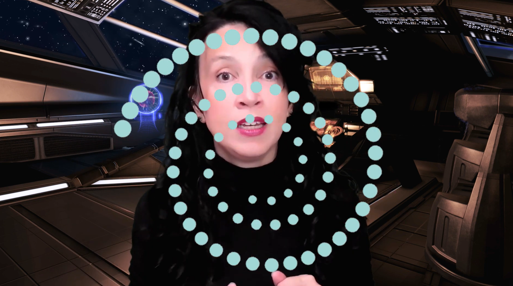{fig-alt="The slide defines A n as the closed interval from 0 to 1 minus 1 over n plus 1. It lists A1 as [0,1/2], A2 as [0,2/3], A3 as [0,3/4], and suggests the sets approach [0,1)."}

The right endpoints move toward $1$ but never reach it. This suggests that the limiting set should include $0$ but exclude $1$.
:::

This example is geometrically clear, but we need a definition that also works for arbitrary measurable sets.

## Warm-up: $\limsup$ and $\liminf$ of real sequences

Before defining limits of sets, recall the analogous ideas for a real sequence

$$
a_1,a_2,a_3,\ldots.
$$

The **limit superior** or **limit supremum** tracks the eventual upper envelope of the sequence.

:::{.column-margin #fig-l08-slide-03}
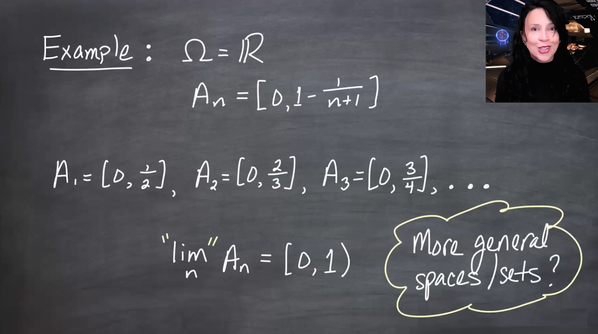{fig-alt="The slide shows a plotted real sequence with points A1, A2, A3 and so on, visually clustered between an upper and lower curve."}

The curves are only visual aids. The point is that a sequence may not settle immediately, but it may have an eventual upper and lower boundary.
:::

For each $n$, look at the tail

$$
\{a_m:m\geq n\}.
$$

Take the supremum of that tail:

$$
\sup_{m\geq n} a_m.
$$

As $n$ increases, we discard more initial terms, so these tail suprema form a non-increasing sequence. The limit of these tail suprema is the $\limsup$:

$$
\limsup_{n\to\infty} a_n
=
\lim_{n\to\infty}
\sup_{m\geq n} a_m.
$$

Equivalently,

$$
\limsup_{n\to\infty} a_n
=
\inf_{n\geq 1}\sup_{m\geq n}a_m.
$$

:::{.column-margin #fig-l08-slide-04} 
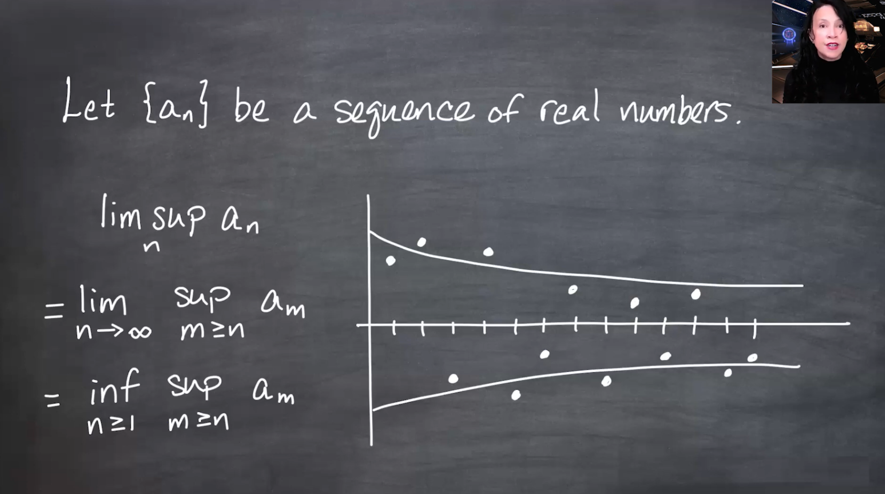{fig-alt="The slide explains limsup for a sequence of real numbers by removing initial terms and recomputing the supremum of the remaining tail. The resulting tail suprema form a non-increasing sequence."}

The $\limsup$ is what remains of the sequence’s upper behavior after every finite prefix has been ignored.
:::

Similarly, the **limit inferior** or **limit infimum** tracks the eventual lower envelope:

$$
\liminf_{n\to\infty} a_n
=
\lim_{n\to\infty}
\inf_{m\geq n}a_m
=
\sup_{n\geq 1}\inf_{m\geq n}a_m.
$$

:::{.column-margin #fig-l08-slide-05}
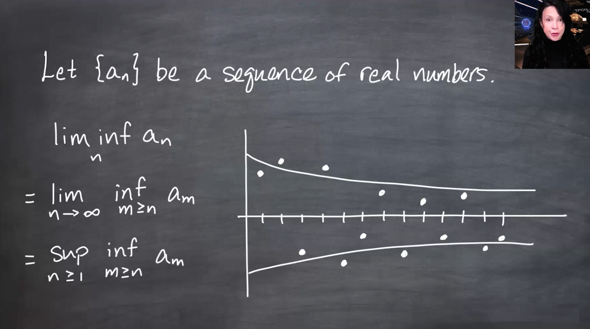{fig-alt="The slide explains liminf by removing initial terms and recomputing the infimum of the remaining tail. The resulting tail infima form a non-decreasing sequence."}

The $\liminf$ is what remains of the sequence’s lower behavior after every finite prefix has been ignored.
:::

If the two envelopes meet, the sequence has a limit:

$$
\limsup_{n\to\infty} a_n
=
\liminf_{n\to\infty} a_n
=
L.
$$

Then

$$
\lim_{n\to\infty} a_n=L.
$$

:::{.column-margin #fig-l08-slide-06} 
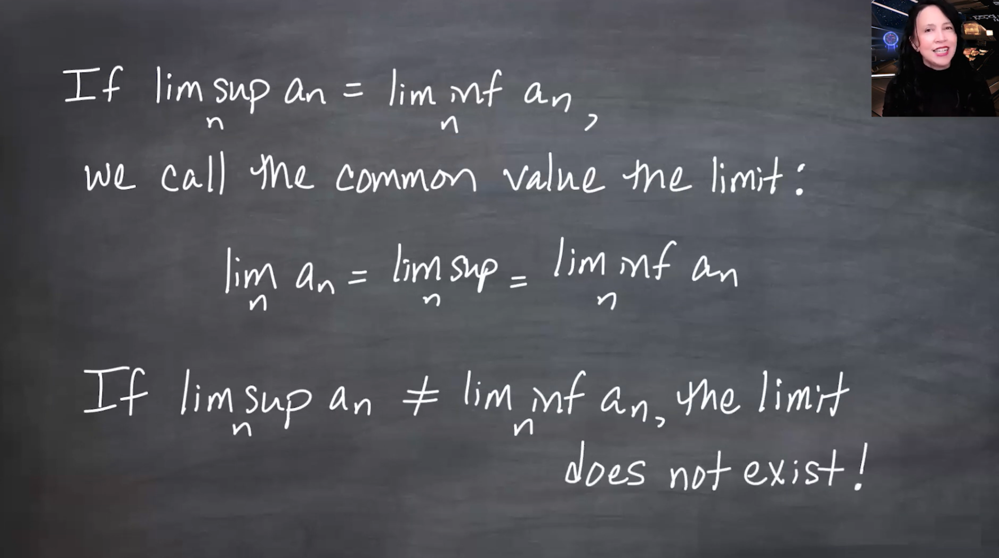{fig-alt="The slide states that if the limsup and liminf of a real sequence are equal, their common value is the limit of the sequence."}

For numbers, the limit exists exactly when the eventual upper and lower envelopes collapse to the same value.
:::

The set version will imitate this idea, but with unions and intersections replacing suprema and infima.

## Monotone sequences of sets

### Decreasing sets

Suppose

$$
A_1\supseteq A_2\supseteq A_3\supseteq\cdots.
$$

Then the sets are decreasing. The natural limiting set is the part that remains forever:

$$
A=\bigcap_{n=1}^{\infty}A_n.
$$

We write

$$
A_n\downarrow A.
$$

:::{.column-margin #fig-l08-slide-07} 
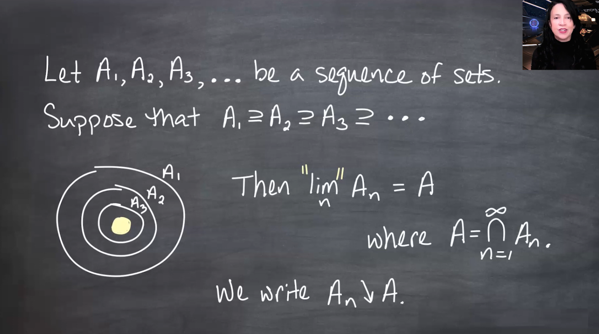{fig-alt="The slide shows nested sets A1 containing A2 containing A3 and so on. It suggests that the limiting set is the intersection of all A n."}

For decreasing sets, the limit is the common core that survives every stage: $\bigcap_n A_n$.
:::

### Increasing sets

Suppose

$$
A_1\subseteq A_2\subseteq A_3\subseteq\cdots.
$$

Then the sets are increasing. The natural limiting set is everything that eventually appears:

$$
A=\bigcup_{n=1}^{\infty}A_n.
$$

We write

$$
A_n\uparrow A.
$$

:::{.column-margin #fig-l08-slide-08}
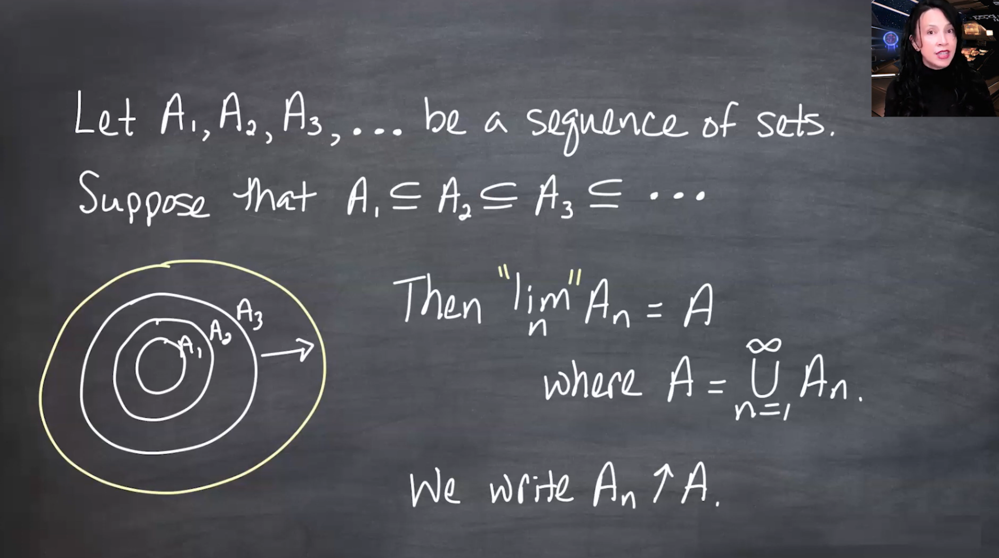{fig-alt="The slide shows nested sets A1 inside A2 inside A3 and so on. It suggests that the limiting set is the union of all A n."}

For increasing sets, the limit is the accumulated set of everything that appears at some finite stage: $\bigcup_n A_n$.
:::

These two cases motivate the general definitions.

## General sequences of sets

Now let

$$
A_1,A_2,A_3,\ldots
$$

be any sequence of sets. They need not be increasing, decreasing, disjoint, or nested.

To define the set-theoretic $\limsup$ and $\liminf$, use tails of the sequence.

### Tail unions

For each $n$, define the tail union

$$
\bigcup_{m=n}^{\infty}A_m.
$$

As $n$ increases, we remove more initial sets, so the tail unions decrease:

$$
\bigcup_{m=1}^{\infty}A_m
\supseteq
\bigcup_{m=2}^{\infty}A_m
\supseteq
\bigcup_{m=3}^{\infty}A_m
\supseteq
\cdots.
$$

The limit of this decreasing sequence is its intersection.

:::{.column-margin #fig-l08-slide-09} 
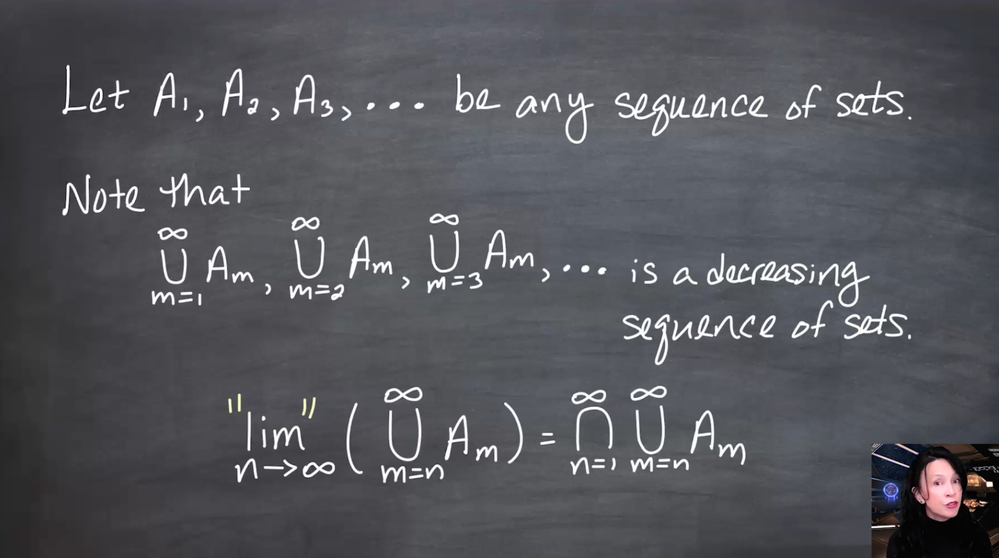{fig-alt="The slide forms the tail unions of a general sequence of sets: the union of all A m from m equals 1 onward, then from m equals 2 onward, then from m equals 3 onward. These tail unions form a decreasing sequence."}

Even if the original $A_n$ are not monotone, the tail unions are monotone decreasing.
:::

### Tail intersections

For each $n$, define the tail intersection

$$
\bigcap_{m=n}^{\infty}A_m.
$$

As $n$ increases, we remove more initial constraints, so the tail intersections increase:

$$
\bigcap_{m=1}^{\infty}A_m
\subseteq
\bigcap_{m=2}^{\infty}A_m
\subseteq
\bigcap_{m=3}^{\infty}A_m
\subseteq
\cdots.
$$

The limit of this increasing sequence is its union.

:::{.column-margin #fig-l08-slide-10}
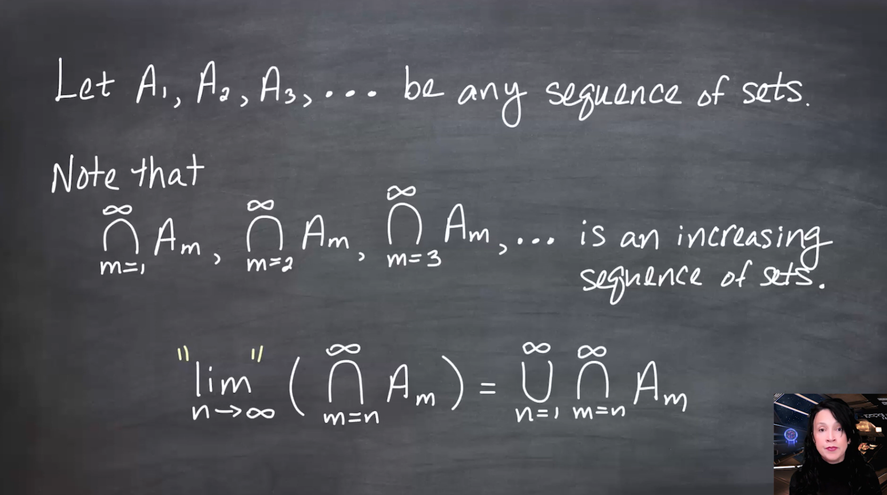{fig-alt="The slide forms the tail intersections of a general sequence of sets: the intersection of all A m from m equals 1 onward, then from m equals 2 onward, then from m equals 3 onward. These tail intersections form an increasing sequence."}

The tail intersections are monotone increasing because fewer sets are being intersected as the starting index moves forward.
:::

## Definitions: $\limsup$ and $\liminf$ of sets

::: {#def-limsup-sets}
## Limit superior of sets

For a sequence of sets $A_1,A_2,\ldots$, define

$$
\limsup_{n\to\infty} A_n
=
\bigcap_{n=1}^{\infty}
\bigcup_{m=n}^{\infty}A_m.
$$
:::

::: {#def-liminf-sets}
## Limit inferior of sets

For a sequence of sets $A_1,A_2,\ldots$, define

$$
\liminf_{n\to\infty} A_n
=
\bigcup_{n=1}^{\infty}
\bigcap_{m=n}^{\infty}A_m.
$$
:::

:::{.column-margin #fig-l08-slide-11}
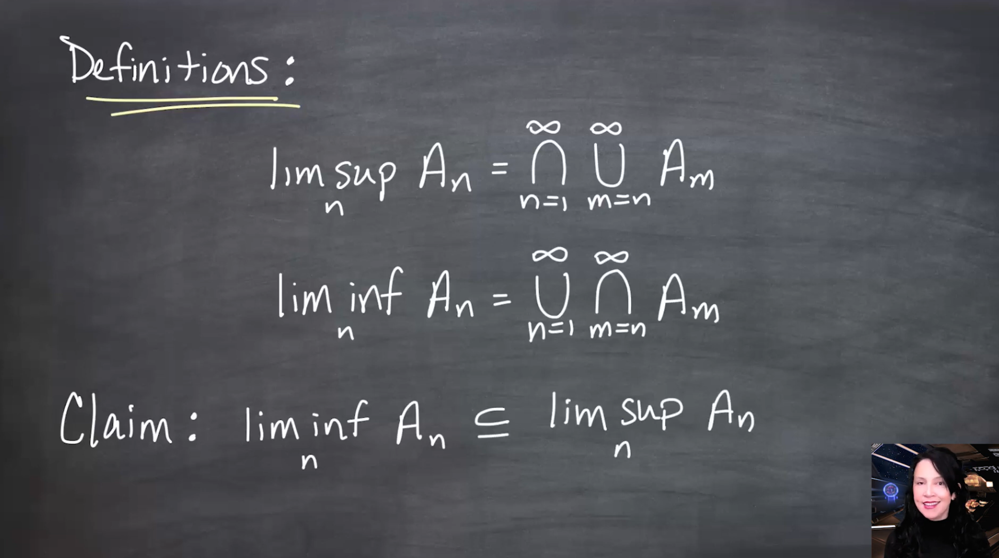{fig-alt="The slide defines limsup A n as the intersection over n of the union over m at least n of A m, and liminf A n as the union over n of the intersection over m at least n of A m."}

The $\limsup$ is built from decreasing tail unions. The $\liminf$ is built from increasing tail intersections.
:::

Both are sets. They are made entirely from countable unions and intersections.

## Basic containment

For every sequence of sets,

$$
\liminf_{n\to\infty}A_n
\subseteq
\limsup_{n\to\infty}A_n.
$$

:::{.column-margin #fig-l08-slide-12} 
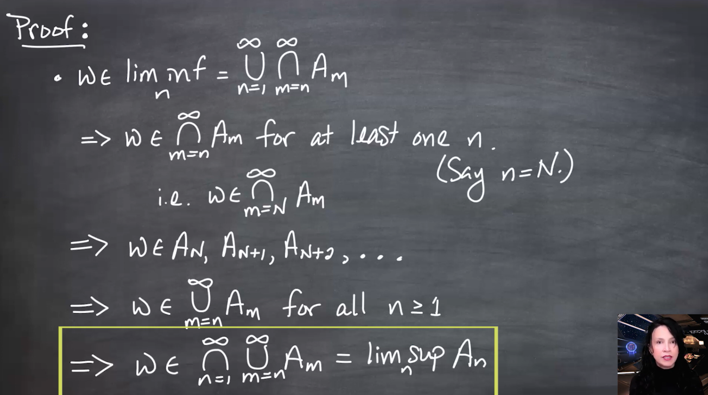{fig-alt="The slide states that the liminf of a sequence of sets is contained in the limsup of the sequence, and begins a proof by taking an element omega in the liminf."}

The lower limiting set is always contained in the upper limiting set, just as $\liminf a_n\leq\limsup a_n$ for real sequences.
:::

Proof sketch:

Take

$$
\omega\in\liminf A_n
=
\bigcup_{n=1}^{\infty}\bigcap_{m=n}^{\infty}A_m.
$$

Then for some fixed $N$,

$$
\omega\in\bigcap_{m=N}^{\infty}A_m.
$$

So $\omega\in A_m$ for every $m\geq N$. Therefore, for every $n$, $\omega$ belongs to the tail union

$$
\bigcup_{m=n}^{\infty}A_m.
$$

Hence

$$
\omega\in
\bigcap_{n=1}^{\infty}
\bigcup_{m=n}^{\infty}A_m
=
\limsup A_n.
$$

:::{.column-margin #fig-l08-slide-13} 
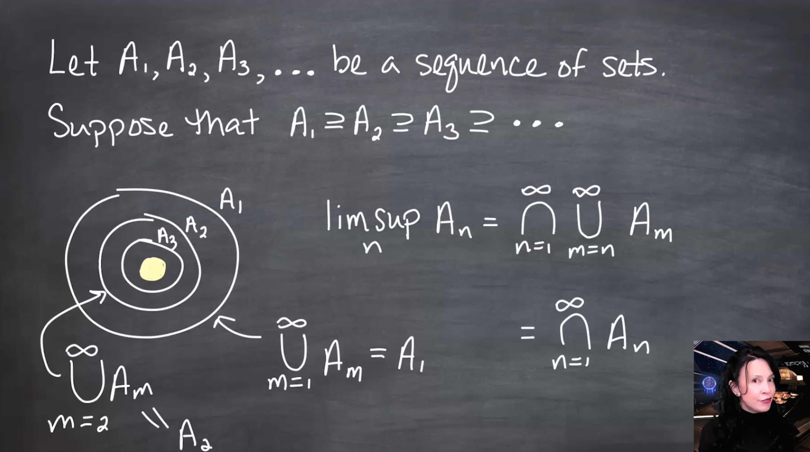{fig-alt="The slide completes the proof that if omega is in the liminf, then omega is in all sufficiently late A m, hence belongs to every tail union and therefore to the limsup."}

If $\omega$ is eventually in all the $A_n$, then it is certainly in infinitely many of them. This proves $\liminf A_n\subseteq\limsup A_n$.
:::

## Definition of the limit of sets

::: {#def-limit-of-sets}
## Limit of a sequence of sets

If

$$
\liminf_{n\to\infty}A_n
=
\limsup_{n\to\infty}A_n,
$$

then the common set is called the **limit** of the sequence, and we write

$$
\lim_{n\to\infty}A_n
=
\liminf_{n\to\infty}A_n
=
\limsup_{n\to\infty}A_n.
$$
:::

If the two sets are not equal, then the sequence of sets does not have a limit.

:::{.column-margin #fig-l08-slide-14}
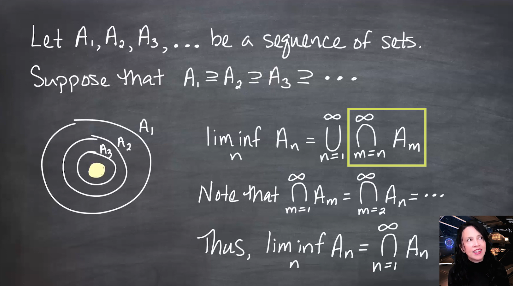{fig-alt="The slide defines the limit of a sequence of sets as the common value when the liminf and limsup are equal."}

The set limit exists exactly when the eventual lower and upper set behavior agree.
:::

## Checking the monotone cases

### Decreasing case

Suppose

$$
A_1\supseteq A_2\supseteq A_3\supseteq\cdots.
$$

Then

$$
\limsup A_n
=
\bigcap_{n=1}^{\infty}A_n,
$$

because each tail union is simply its first set:

$$
\bigcup_{m=n}^{\infty}A_m=A_n.
$$

:::{.column-margin #fig-l08-slide-15} 
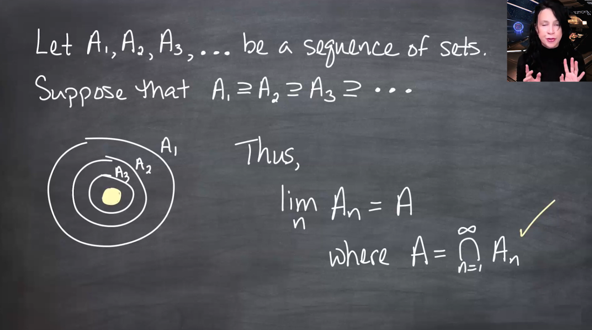{fig-alt="The slide computes limsup for a decreasing sequence of sets and shows that each tail union equals A n, so the limsup becomes the intersection of all A n."}

In a decreasing sequence, the largest set in each tail is the first one, so the tail union from $n$ onward is just $A_n$.
:::

Similarly,

$$
\liminf A_n
=
\bigcap_{n=1}^{\infty}A_n.
$$

Thus,

$$
A_n\downarrow A
\quad\Rightarrow\quad
\lim_n A_n=A=\bigcap_{n=1}^{\infty}A_n.
$$

:::{.column-margin #fig-l08-slide-16}
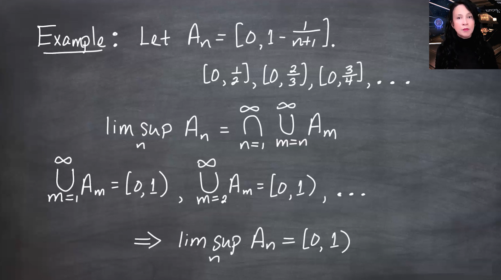{fig-alt="The slide computes liminf for a decreasing sequence and shows it also equals the intersection of all A n. Therefore the limit exists and equals the intersection."}

For decreasing sequences, $\liminf$ and $\limsup$ agree, so the limit exists and equals the intersection.
:::

### Increasing case

If

$$
A_1\subseteq A_2\subseteq A_3\subseteq\cdots,
$$

then the analogous result is

$$
A_n\uparrow A
\quad\Rightarrow\quad
\lim_n A_n=A=\bigcup_{n=1}^{\infty}A_n.
$$

:::{.column-margin #fig-l08-slide-17} 
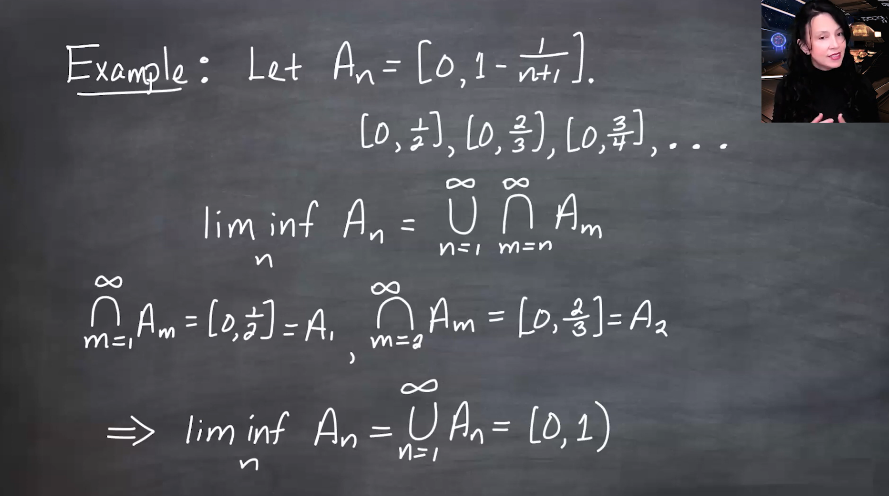{fig-alt="The slide asks the viewer to verify the increasing case: if A n increases, then limsup and liminf both equal the union of all A n."}

The increasing case is left as an exercise in the video: tail intersections become $A_n$, and tail unions all give the accumulated union.
:::

## Revisit the interval example

Recall

$$
A_n=\left[0,1-\frac{1}{n+1}\right].
$$

This is an increasing sequence, so the limit is the union:

$$
\lim_{n\to\infty}A_n
=
\bigcup_{n=1}^{\infty}
\left[0,1-\frac{1}{n+1}\right]
=
[0,1).
$$

:::{.column-margin #fig-l08-slide-18} 
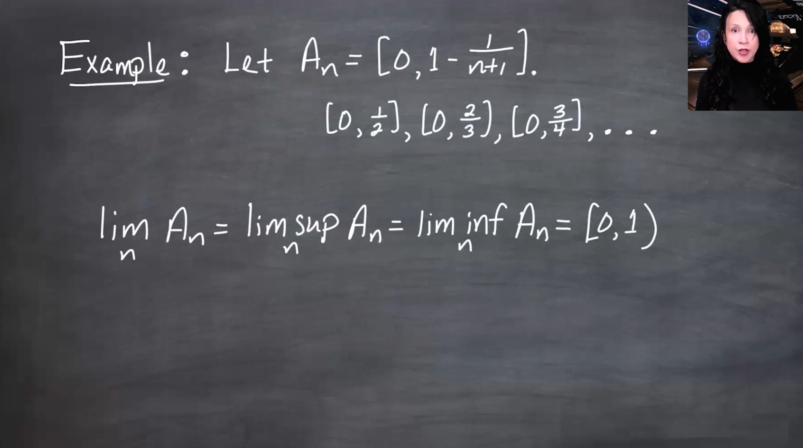{fig-alt="The slide revisits A n equals [0, 1 minus 1 over n plus 1] and computes limsup and liminf directly, both giving the half-open interval [0,1)."}

The endpoint $1$ is approached but never included by any $A_n$, so it is not in the limiting set.
:::

## Alternating sets

Consider a sequence alternating between two sets:

$$
A_n=
\begin{cases}
B, & n \text{ odd},\\
C, & n \text{ even}.
\end{cases}
$$

Then every tail union contains both $B$ and $C$, so

$$
\limsup A_n = B\cup C.
$$

Every tail intersection contains only what is common to both, so

$$
\liminf A_n = B\cap C.
$$

Therefore the limit exists only if

$$
B\cup C = B\cap C,
$$

which happens when $B=C$.

:::{.column-margin #fig-l08-slide-19}
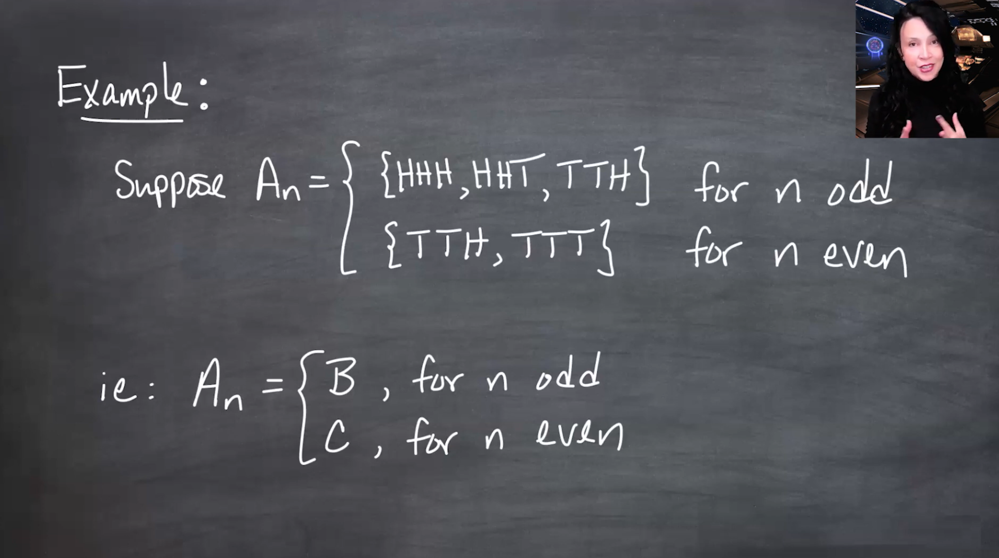{fig-alt="The slide gives a coin-flipping-inspired example where A n alternates between two sets B and C. It computes limsup as B union C and liminf as B intersect C."}

Alternation usually prevents convergence. The upper limit sees points that appear repeatedly in either set, while the lower limit sees only points present in both.
:::

## Complements

The complement of a $\limsup$ is a $\liminf$ of complements:

$$
\left(\limsup_{n\to\infty}A_n\right)^c
=
\liminf_{n\to\infty}A_n^c.
$$

Using the definition,

$$
\left(
\bigcap_{n=1}^{\infty}
\bigcup_{m=n}^{\infty}A_m
\right)^c
=
\bigcup_{n=1}^{\infty}
\bigcap_{m=n}^{\infty}A_m^c.
$$

This is just De Morgan’s law applied to countable intersections and unions.

Likewise,

$$
\left(\liminf_{n\to\infty}A_n\right)^c
=
\limsup_{n\to\infty}A_n^c.
$$

:::{.column-margin #fig-l08-slide-20} 
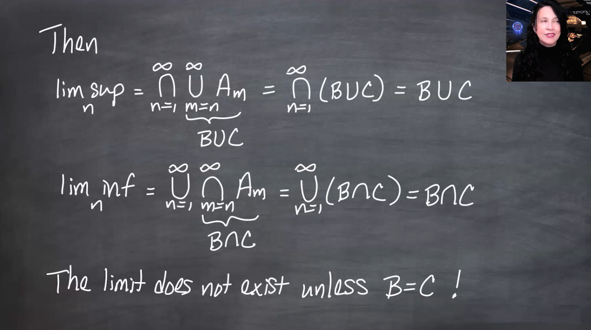{fig-alt="The slide applies De Morgan's laws to show that the complement of limsup A n equals liminf of A n complement, and vice versa."}

Complements reverse the order of unions and intersections, so they swap $\limsup$ and $\liminf$.
:::

## Event language

The $\limsup$ has a useful event interpretation.

A point $\omega$ is in

$$
\limsup A_n
=
\bigcap_{n=1}^{\infty}\bigcup_{m=n}^{\infty}A_m
$$

exactly when, no matter how far out in the sequence we go, $\omega$ appears in some later $A_m$.

So $\omega$ is in infinitely many of the $A_n$.

This is often written

$$
\limsup A_n
=
[A_n\ \text{i.o.}],
$$

where `i.o.` means **infinitely often**.

:::{.column-margin #fig-l08-slide-21}
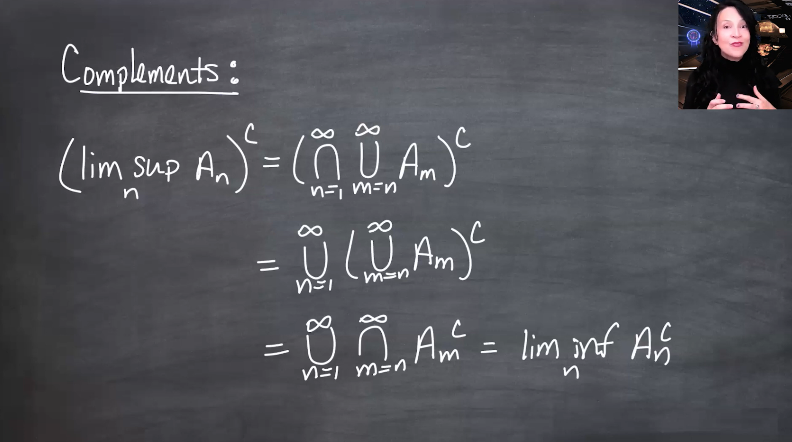{fig-alt="The slide explains that omega in limsup A n means omega belongs to infinitely many of the A n. It introduces the notation A n i.o., meaning infinitely often."}

In probability language, $\limsup A_n$ is the event that the events $A_n$ occur infinitely often.
:::

The $\liminf$ means eventual membership:

$$
\liminf A_n
=
\bigcup_{n=1}^{\infty}\bigcap_{m=n}^{\infty}A_m.
$$

A point $\omega$ is in $\liminf A_n$ when there is some finite time $N$ after which

$$
\omega\in A_m
\qquad
\text{for all } m\geq N.
$$

That is, $\omega$ belongs to all but finitely many of the $A_n$.

:::{.column-margin #fig-l08-slide-22}
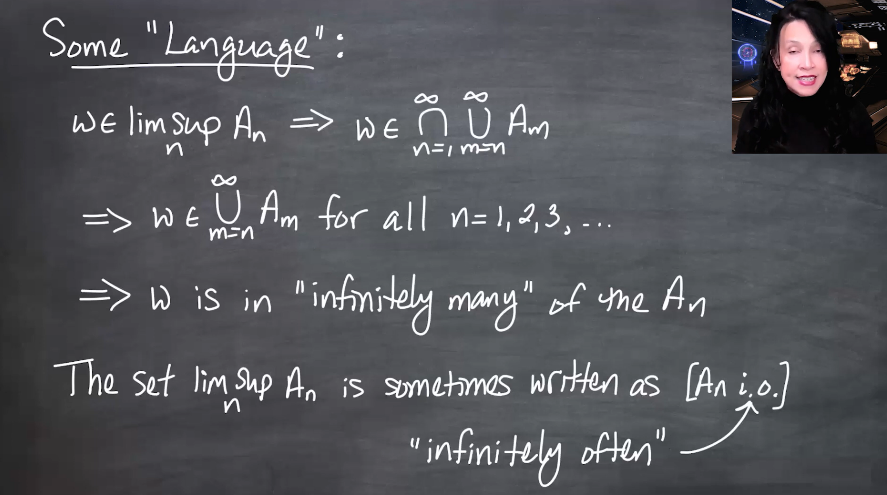{fig-alt="The slide explains that omega in liminf A n means omega is in all but finitely many of the A n. It mentions the notation A n eventually."}

The $\liminf$ event is stronger than the $\limsup$ event: eventually always implies infinitely often.
:::

## Measurability of set limits

Suppose $(\Omega,\mathcal{F},P)$ is a probability space and

$$
A_n\in\mathcal{F}
\qquad
\text{for all } n.
$$

Because $\mathcal{F}$ is a $\sigma$-field, it is closed under countable unions and intersections. Therefore,

$$
\limsup A_n
=
\bigcap_{n=1}^{\infty}
\bigcup_{m=n}^{\infty}A_m
\in\mathcal{F},
$$

and

$$
\liminf A_n
=
\bigcup_{n=1}^{\infty}
\bigcap_{m=n}^{\infty}A_m
\in\mathcal{F}.
$$

So it makes sense to discuss

$$
P(\limsup A_n),
\qquad
P(\liminf A_n).
$$

:::{.column-margin #fig-l08-slide-23} 
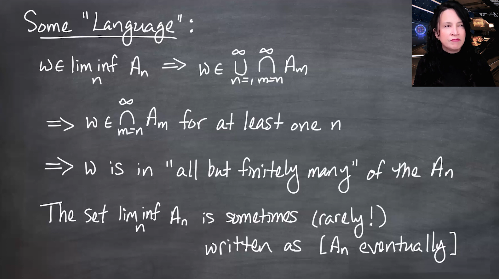{fig-alt="The slide states that if A n are in a sigma-field F, then limsup A n and liminf A n are also in F because they are built using countable unions and intersections."}

If each $A_n$ is measurable, then both limiting sets are measurable. This is exactly why $\sigma$-fields require countable closure.
:::

If the limit exists, then

$$
\lim_n A_n\in\mathcal{F},
$$

so

$$
P\left(\lim_{n\to\infty}A_n\right)
$$

is also well-defined.

:::{.column-margin #fig-l08-slide-24}
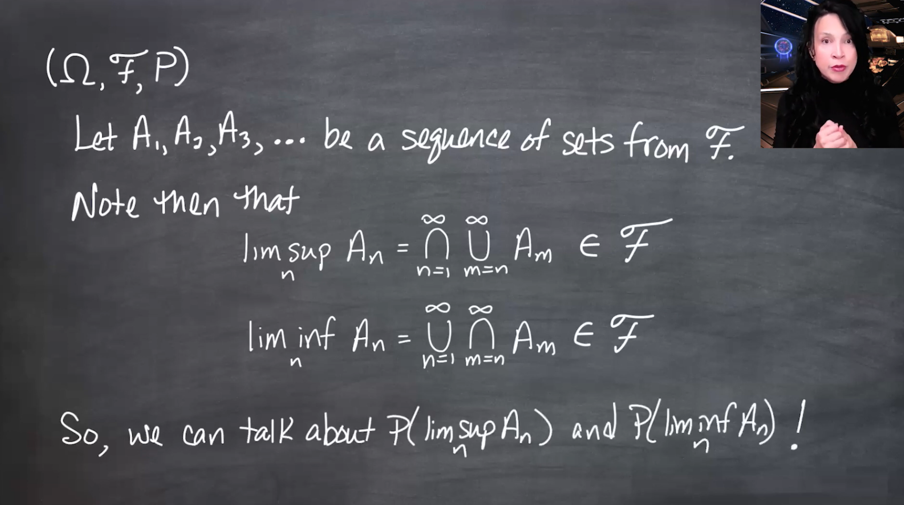{fig-alt="The slide says that if liminf and limsup agree, then the limit set belongs to the sigma-field, so the probability of the limit set is defined."}

The limit of measurable sets, when it exists, is another measurable set.
:::

## Preview: continuity of probabilities

The final question is whether probability commutes with limits of sets.

Compare

$$
P\left(\lim_{n\to\infty}A_n\right)
$$

with

$$
\lim_{n\to\infty}P(A_n).
$$

These are different-looking operations:

- first take a set limit, then measure it;
- first measure each set, then take a numerical limit.

The next lesson studies when these agree. This is called **continuity of probabilities**.

:::{.column-margin #fig-l08-slide-25} 
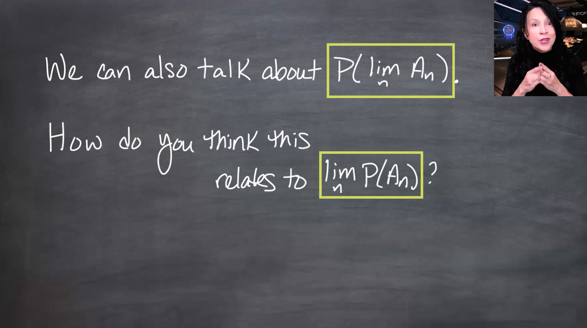{fig-alt="The slide asks how P of the limit of A n relates to the limit of P of A n, previewing continuity of probabilities and the Borel-Cantelli lemmas."}

The next topic asks whether $P(\lim A_n)$ equals $\lim P(A_n)$. This connects set limits to ordinary limits of real numbers.
:::

## Takeaway

The key definitions are:

$$
\limsup_{n\to\infty}A_n
=
\bigcap_{n=1}^{\infty}\bigcup_{m=n}^{\infty}A_m,
$$

$$
\liminf_{n\to\infty}A_n
=
\bigcup_{n=1}^{\infty}\bigcap_{m=n}^{\infty}A_m.
$$

The interpretation is:

$$
\limsup A_n
=
\{\omega:\omega\in A_n \text{ infinitely often}\},
$$

$$
\liminf A_n
=
\{\omega:\omega\in A_n \text{ eventually}\}.
$$

The limit exists when these two sets are equal.
