::: {#vid-C99-l09 .column-margin}


Lesson 9: Continuity of probabilities, limits of set sequences, and a first look at independence.
:::

## Lesson map

- 0:12 — Recap: limits of sequences of sets.
- 0:41 — Compare $P(\lim A_n)$ with $\lim P(A_n)$.
- 3:06 — Continuity of probabilities theorem.
- 4:35 — Proof for increasing sequences.
- 7:53 — Proof for decreasing sequences using complements.
- 9:58 — General theorem using $\liminf$ and $\limsup$.
- 11:28 — Proof of the lower inequality.
- 14:23 — Why $\liminf x_n\leq\limsup x_n$ for numbers.
- 16:05 — Proof of the upper inequality.
- 18:36 — If $A_n\to A$, then $P(A_n)\to P(A)$.
- 20:29 — Example where the inequalities are strict.
- 24:03 — First definition of independence.
- 26:52 — Independence of arbitrary collections.
- 27:25 — Pairwise independence does not imply mutual independence.
- 30:09 — Preview: independence and generated $\sigma$-fields.

## The question

In the previous lesson, we defined limits of sequences of sets using

$$
\liminf_{n\to\infty} A_n
=
\bigcup_{n=1}^{\infty}\bigcap_{m=n}^{\infty} A_m
$$

and

$$
\limsup_{n\to\infty} A_n
=
\bigcap_{n=1}^{\infty}\bigcup_{m=n}^{\infty} A_m.
$$

If these two sets are equal, their common value is called

$$
\lim_{n\to\infty}A_n.
$$

Now suppose $(\Omega,\mathcal{F},P)$ is a probability space and $A_1,A_2,\ldots\in\mathcal{F}$. Since $\mathcal{F}$ is closed under countable unions and intersections, the sets $\liminf A_n$, $\limsup A_n$, and $\lim A_n$ when it exists are all measurable.

So the natural question is:

$$
P\left(\lim_{n\to\infty}A_n\right)
\quad\text{versus}\quad
\lim_{n\to\infty}P(A_n).
$$

Can we move the limit inside or outside the probability measure?

:::{.column-margin #fig-l09-slide-01}
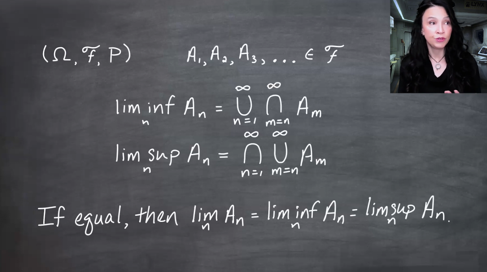{fig-alt="The slide recalls the definitions of liminf and limsup of a sequence of sets and asks how the probability of a set limit relates to the limit of the probabilities of the sets."}

The key object is no longer just a set limit or a numerical limit, but the relation between the two: $P(\lim A_n)$ and $\lim P(A_n)$.
:::

## Continuity of probabilities

The name is by analogy with continuous functions. For a continuous function $f$,

$$
f\left(\lim_{n\to\infty}x_n\right)
=
\lim_{n\to\infty}f(x_n),
$$

when the relevant limit exists.

For probability measures, a similar result holds for monotone sequences of sets.

::: {#thm-continuity-of-probabilities}
## Continuity of probabilities

Let $(\Omega,\mathcal{F},P)$ be a probability space.

1. If

$$
A_1\subseteq A_2\subseteq A_3\subseteq\cdots
$$

and

$$
A=\bigcup_{n=1}^{\infty}A_n,
$$

then

$$
\lim_{n\to\infty}P(A_n)=P(A).
$$

This is called **continuity from below**.

2. If

$$
A_1\supseteq A_2\supseteq A_3\supseteq\cdots
$$

and

$$
A=\bigcap_{n=1}^{\infty}A_n,
$$

then

$$
\lim_{n\to\infty}P(A_n)=P(A).
$$

This is called **continuity from above**.
:::

:::{.column-margin #fig-l09-slide-02}
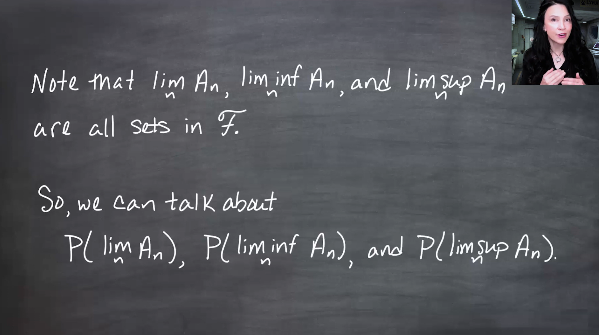{fig-alt="The slide states the continuity of probabilities theorem. For increasing sets A n increasing to A, the limit of P(A n) equals P(A). For decreasing sets A n decreasing to A, the same equality holds."}

Continuity from below handles increasing sequences; continuity from above handles decreasing sequences. In both cases, the limit of probabilities equals the probability of the limiting set.
:::

## Proof: increasing sets

Assume

$$
A_1\subseteq A_2\subseteq A_3\subseteq\cdots
$$

and

$$
A=\bigcup_{n=1}^{\infty}A_n.
$$

The standard trick is to rewrite the increasing union as a disjoint union of increments.

Define

$$
B_1=A_1,
$$

and for $n\geq 2$,

$$
B_n=A_n\setminus A_{n-1}.
$$

Then the $B_n$ are disjoint and

$$
A=\bigcup_{n=1}^{\infty}B_n.
$$

Also, for each $m$,

$$
A_m=\bigcup_{n=1}^{m}B_n.
$$

:::{.column-margin #fig-l09-slide-03}
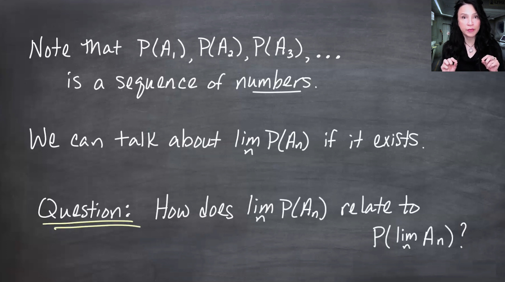{fig-alt="The slide shows nested sets A1 inside A2 inside A3 and defines disjoint pieces B1, B2, B3, where B1 is A1 and each later B is the new ring added at that stage."}

The increasing sets are not disjoint, but their successive increments are. This prepares the proof for countable additivity.
:::

Now compute:

$$
P(A)
=
P\left(\bigcup_{n=1}^{\infty}B_n\right)
=
\sum_{n=1}^{\infty}P(B_n).
$$

The infinite sum is the limit of partial sums:

$$
\sum_{n=1}^{\infty}P(B_n)
=
\lim_{m\to\infty}\sum_{n=1}^{m}P(B_n).
$$

Since the $B_n$ are disjoint,

$$
\sum_{n=1}^{m}P(B_n)
=
P\left(\bigcup_{n=1}^{m}B_n\right)
=
P(A_m).
$$

Therefore,

$$
P(A)
=
\lim_{m\to\infty}P(A_m).
$$

:::{.column-margin #fig-l09-slide-04}
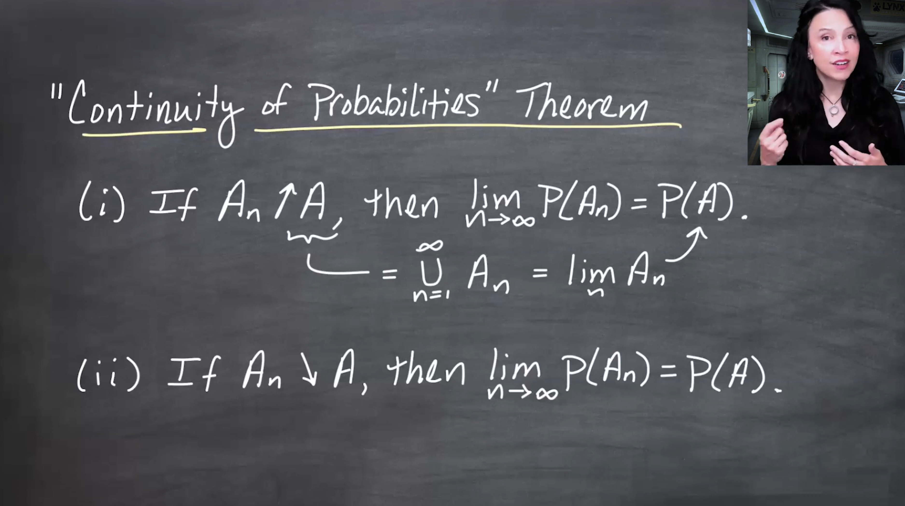{fig-alt="The slide proves continuity from below by writing P(A) as the probability of the union of disjoint B n, using countable additivity, then identifying finite partial sums with P(A m)."}

The proof converts nested sets into disjoint increments, applies countable additivity, and then identifies the finite partial unions with the original $A_m$.
:::

## Proof: decreasing sets

Now assume

$$
A_1\supseteq A_2\supseteq A_3\supseteq\cdots
$$

and

$$
A=\bigcap_{n=1}^{\infty}A_n.
$$

Instead of reproving everything directly, take complements. The complements form an increasing sequence:

$$
A_1^c\subseteq A_2^c\subseteq A_3^c\subseteq\cdots.
$$

By De Morgan’s law,

$$
A^c
=
\left(\bigcap_{n=1}^{\infty}A_n\right)^c
=
\bigcup_{n=1}^{\infty}A_n^c.
$$

So

$$
A_n^c \uparrow A^c.
$$

By continuity from below,

$$
\lim_{n\to\infty}P(A_n^c)=P(A^c).
$$

Since $P(A_n^c)=1-P(A_n)$ and $P(A^c)=1-P(A)$, rearranging gives

$$
\lim_{n\to\infty}P(A_n)=P(A).
$$

:::{.column-margin #fig-l09-slide-05}
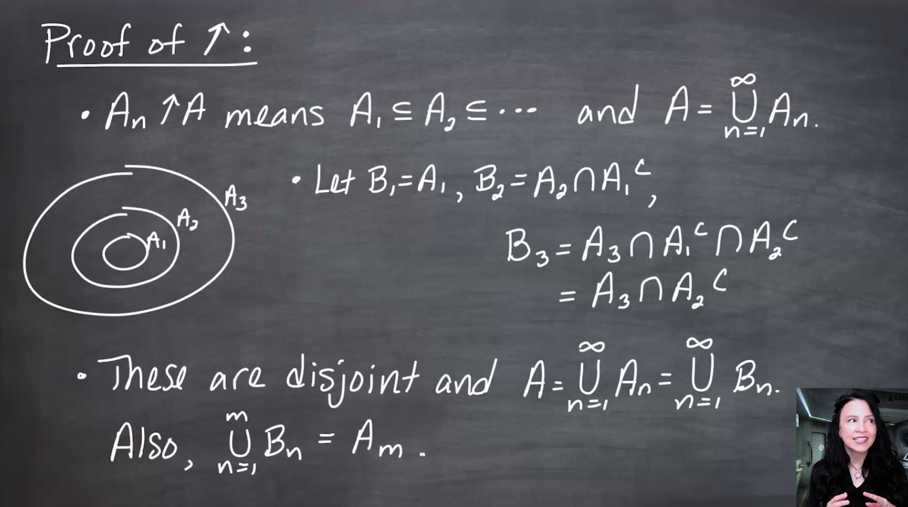{fig-alt="The slide proves the decreasing case by taking complements. If A n decreases to A, then A n complement increases to A complement. Applying the increasing case and rewriting complements gives the result."}

The decreasing case is the increasing case in disguise. Complements reverse containment, and probability complements convert the result back.
:::

## General set sequences

Not every sequence is increasing or decreasing. The next theorem gives bounds for arbitrary sequences in terms of $\liminf$ and $\limsup$.

::: {#thm-liminf-limsup-probability}
## Probability bounds for arbitrary set sequences

Let $(\Omega,\mathcal{F},P)$ be a probability space and let $A_1,A_2,\ldots\in\mathcal{F}$. Then

$$
P(\liminf A_n)
\leq
\liminf P(A_n)
\leq
\limsup P(A_n)
\leq
P(\limsup A_n).
$$
:::

:::{.column-margin #fig-l09-slide-06}
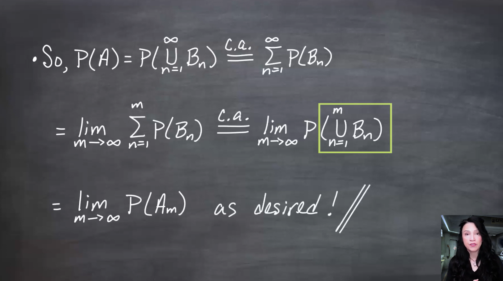{fig-alt="The slide states that for any sequence of sets A n, P(liminf A n) is at most liminf P(A n), which is at most limsup P(A n), which is at most P(limsup A n)."}

This theorem sandwiches the lower and upper limiting behavior of the numerical probabilities between the probabilities of the lower and upper limiting sets.
:::

### Lower inequality

Start with

$$
P(\liminf A_n)
=
P\left(
\bigcup_{n=1}^{\infty}
\bigcap_{m=n}^{\infty}A_m
\right).
$$

Define

$$
B_n=\bigcap_{m=n}^{\infty}A_m.
$$

Then $B_n$ is increasing in $n$, and

$$
\liminf A_n=\bigcup_{n=1}^{\infty}B_n.
$$

By continuity from below,

$$
P(\liminf A_n)
=
\lim_{n\to\infty}P(B_n).
$$

Since a genuine limit equals its own $\liminf$,

$$
\lim_{n\to\infty}P(B_n)
=
\liminf_{n\to\infty}P(B_n).
$$

But

$$
B_n=\bigcap_{m=n}^{\infty}A_m\subseteq A_n.
$$

By monotonicity,

$$
P(B_n)\leq P(A_n).
$$

Therefore,

$$
P(\liminf A_n)
\leq
\liminf P(A_n).
$$

:::{.column-margin #fig-l09-slide-07}
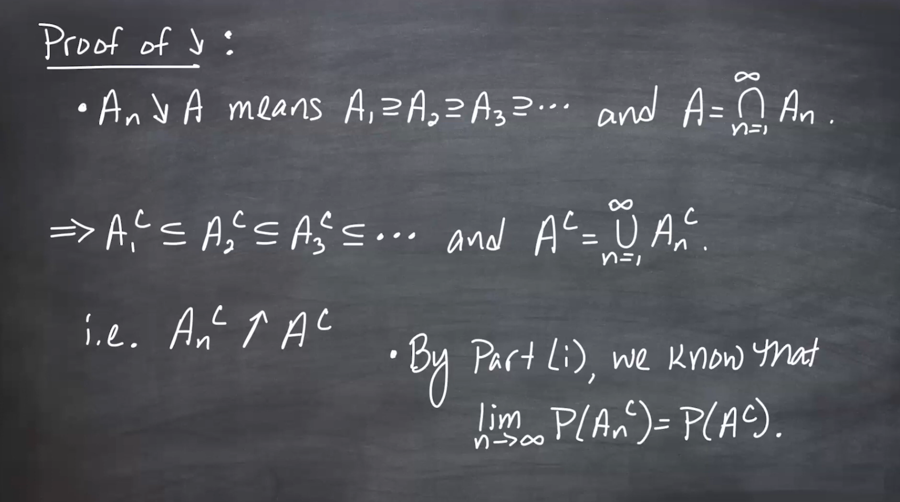{fig-alt="The slide proves P(liminf A n) is less than or equal to liminf P(A n) by defining B n as the tail intersection from m equals n to infinity and using continuity from below and monotonicity."}

Tail intersections $B_n=\bigcap_{m=n}^{\infty}A_m$ increase to $\liminf A_n$. Since each $B_n\subseteq A_n$, their probabilities are bounded by $P(A_n)$.
:::

### Middle inequality

For any real sequence $x_n$,

$$
\liminf x_n\leq \limsup x_n.
$$

Applying this to

$$
x_n=P(A_n)
$$

gives

$$
\liminf P(A_n)\leq \limsup P(A_n).
$$

:::{.column-margin #fig-l09-slide-08}
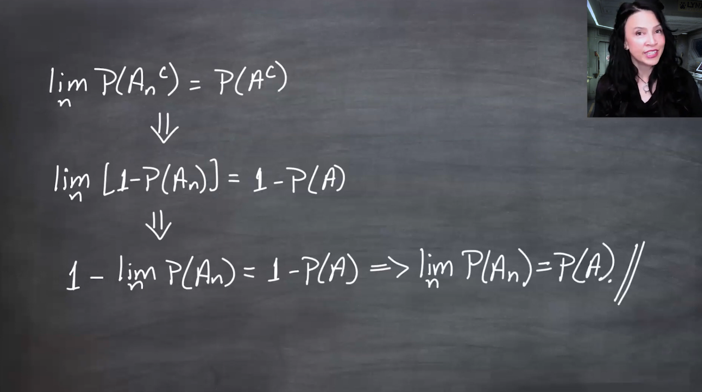{fig-alt="The slide explains that liminf of a numerical sequence is always less than or equal to limsup of that sequence, so the same holds for the numerical sequence P(A n)."}

No probability argument is needed for the middle inequality. It is a basic fact about real sequences.
:::

### Upper inequality

Start with

$$
P(\limsup A_n)
=
P\left(
\bigcap_{n=1}^{\infty}
\bigcup_{m=n}^{\infty}A_m
\right).
$$

Define

$$
B_n=\bigcup_{m=n}^{\infty}A_m.
$$

Then $B_n$ is decreasing in $n$, and

$$
\limsup A_n=\bigcap_{n=1}^{\infty}B_n.
$$

By continuity from above,

$$
P(\limsup A_n)
=
\lim_{n\to\infty}P(B_n).
$$

Since a genuine limit equals its own $\limsup$,

$$
\lim_{n\to\infty}P(B_n)
=
\limsup_{n\to\infty}P(B_n).
$$

But

$$
A_n\subseteq B_n.
$$

By monotonicity,

$$
P(A_n)\leq P(B_n).
$$

Therefore,

$$
\limsup P(A_n)
\leq
P(\limsup A_n).
$$

:::{.column-margin #fig-l09-slide-09}
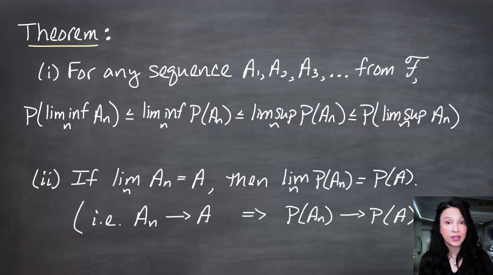{fig-alt="The slide proves limsup P(A n) is less than or equal to P(limsup A n) by defining B n as the tail union from m equals n to infinity and using continuity from above and monotonicity."}

Tail unions $B_n=\bigcup_{m=n}^{\infty}A_m$ decrease to $\limsup A_n$. Since $A_n\subseteq B_n$, the numerical limsup of $P(A_n)$ is bounded above by $P(\limsup A_n)$.
:::

## Corollary: convergence of sets implies convergence of probabilities

If

$$
A_n\to A,
$$

then

$$
\liminf A_n=\limsup A_n=A.
$$

Plugging this into the previous theorem gives

$$
P(A)
\leq
\liminf P(A_n)
\leq
\limsup P(A_n)
\leq
P(A).
$$

Everything is squeezed to the same value, so

$$
\lim_{n\to\infty}P(A_n)=P(A).
$$

::: {#cor-set-convergence-implies-probability-convergence}
## Set convergence implies probability convergence

If $A_n\to A$, then

$$
P(A_n)\to P(A).
$$
:::

:::{.column-margin #fig-l09-slide-10}
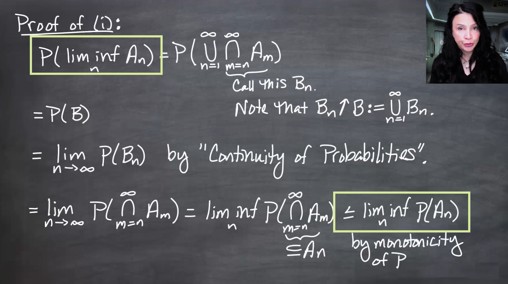{fig-alt="The slide proves that if the set limit A n to A exists, then the limit of P(A n) equals P(A), using the liminf-limsup probability inequality and a squeeze argument."}

Once $\liminf A_n$ and $\limsup A_n$ agree, the probability bounds collapse to equality. This is the general continuity-of-probabilities result.
:::

## Strict inequalities can happen

The inequalities in the theorem are not automatically equalities. Consider two disjoint events $A$ and $B$ with

$$
0<P(A)<P(B)<1.
$$

Let

$$
A_n=
\begin{cases}
A, & n \text{ odd},\\
B, & n \text{ even}.
\end{cases}
$$

Then the numerical sequence $P(A_n)$ alternates between

$$
p=P(A)
\quad\text{and}\quad
q=P(B),
$$

with $0<p<q<1$.

So

$$
\liminf P(A_n)=p,
\qquad
\limsup P(A_n)=q.
$$

But since $A$ and $B$ are disjoint,

$$
\liminf A_n=\emptyset
$$

and hence

$$
P(\liminf A_n)=0.
$$

Thus

$$
P(\liminf A_n)<\liminf P(A_n).
$$

:::{.column-margin #fig-l09-slide-11}
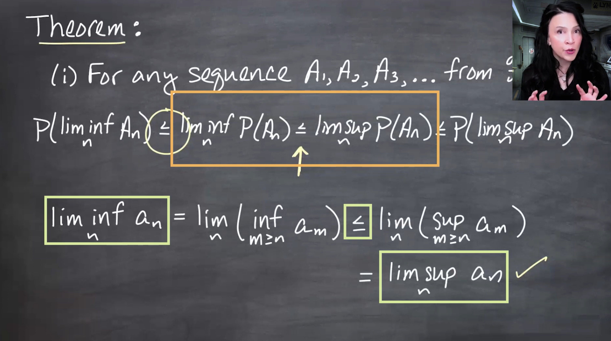{fig-alt="The slide sets up an example with two disjoint sets A and B of positive probabilities p and q, with p less than q. It defines A n to alternate between A and B."}

Alternating between two disjoint positive-probability sets creates oscillation: the numerical probabilities bounce between $p$ and $q$, while the set $\liminf$ is empty.
:::

:::{.column-margin #fig-l09-slide-12}
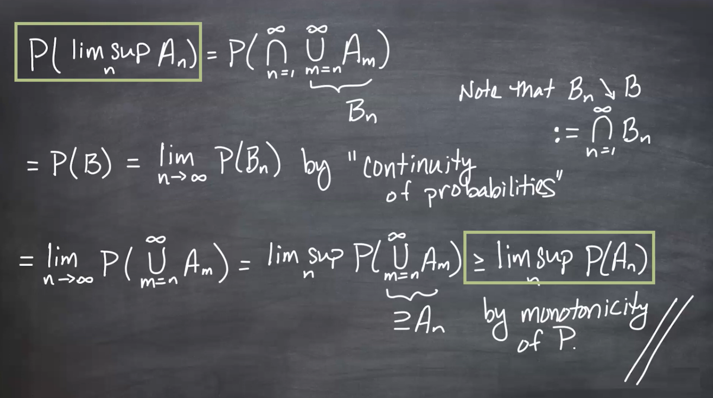{fig-alt="The slide computes liminf P(A n) as p, while liminf A n is the empty set, so P(liminf A n) equals zero, which is strictly less than p."}

This example shows the first inequality can be strict. With the same alternating construction, the other inequalities can also be examined.
:::

## Independence

The lesson then pivots toward the Borel-Cantelli lemmas, which require independence.

For two events $A,B\in\mathcal{F}$, the usual definition is

$$
P(A\cap B)=P(A)P(B).
$$

This is equivalent to the conditional-probability intuition

$$
P(A\mid B)=P(A),
$$

provided $P(B)>0$.

:::{.column-margin #fig-l09-slide-13}
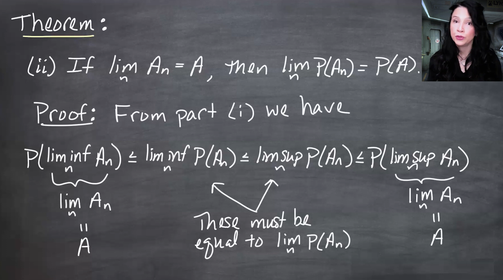{fig-alt="The slide recalls that two events A and B are independent when P(A intersect B) equals P(A) times P(B), and relates this to the conditional probability statement P(A given B) equals P(A)."}

Independence means learning that $B$ happened does not change the probability of $A$. The measure-theoretic definition avoids conditional probability and uses intersections directly.
:::

## Mutual independence of finitely many events

Let $A_1,\ldots,A_n\in\mathcal{F}$.

They are **mutually independent** if for every finite subcollection

$$
A_{k_1},\ldots,A_{k_j},
\qquad
2\leq j\leq n,
$$

we have

$$
P\left(\bigcap_{i=1}^{j}A_{k_i}\right)
=
\prod_{i=1}^{j}P(A_{k_i}).
$$

This condition must hold for all pairs, all triples, all quadruples, and so on.

:::{.column-margin #fig-l09-slide-14}
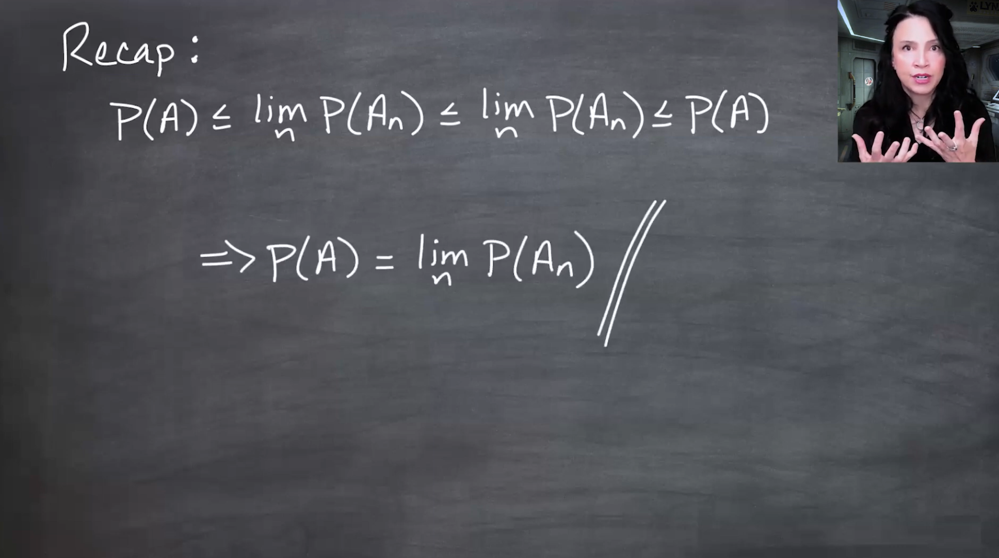{fig-alt="The slide defines mutual independence of A1 through An by requiring the probability of every finite intersection to equal the product of the individual probabilities for every subcollection of size at least two."}

Mutual independence is stronger than pairwise independence. It requires the product rule for every finite subcollection, not just pairs.
:::

## Independence of arbitrary collections

An arbitrary collection of events

$$
\{A_i:i\in I\}
$$

is independent if every finite subcollection is mutually independent.

:::{.column-margin #fig-l09-slide-15}
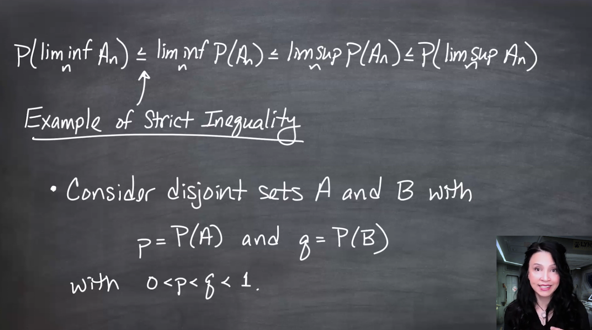{fig-alt="The slide defines independence of an arbitrary countable or uncountable collection of sets by requiring every finite subcollection to be mutually independent."}

For infinite collections, independence is defined through finite tests: every finite subcollection must satisfy the mutual-independence product rule.
:::

## Pairwise independence is not mutual independence

Pairwise independence only checks pairs. Mutual independence also checks triples and larger subcollections.

Consider two fair coin flips:

$$
\Omega=\{HH,HT,TH,TT\}.
$$

Define

$$
A=\{HH,HT\}
$$

as “heads on the first toss,”

$$
B=\{HH,TH\}
$$

as “heads on the second toss,” and

$$
C=\{HH,TT\}
$$

as “the two tosses match.”

Each event has probability

$$
P(A)=P(B)=P(C)=\frac12.
$$

Pairwise intersections are

$$
A\cap B=\{HH\},
$$

$$
A\cap C=\{HH\},
$$

$$
B\cap C=\{HH\}.
$$

So each pairwise intersection has probability

$$
\frac14
=
\frac12\cdot\frac12.
$$

Thus $A,B,C$ are pairwise independent.

But

$$
A\cap B\cap C=\{HH\},
$$

so

$$
P(A\cap B\cap C)=\frac14,
$$

while

$$
P(A)P(B)P(C)=\frac18.
$$

Therefore $A,B,C$ are not mutually independent.

:::{.column-margin #fig-l09-slide-16}
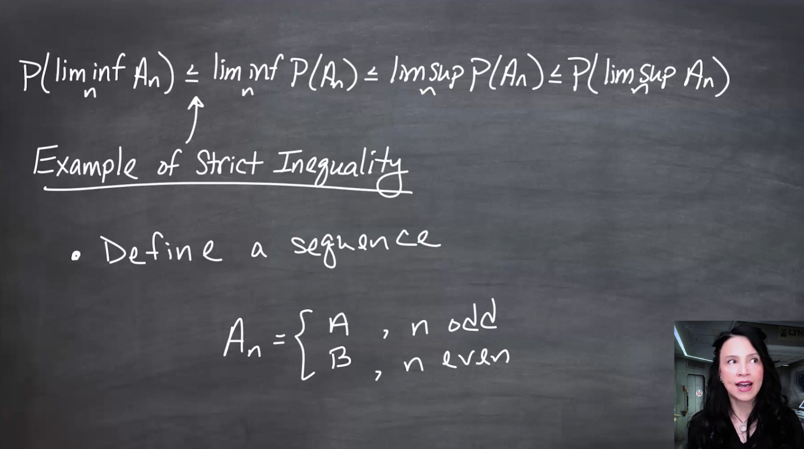{fig-alt="The slide gives the sample space for two coin flips and defines A, B, and C as events involving first toss heads, second toss heads, and matching tosses."}

The two-coin-flip example is the standard warning: all pairs can be independent while the triple fails the product rule.
:::

:::{.column-margin #fig-l09-slide-17}
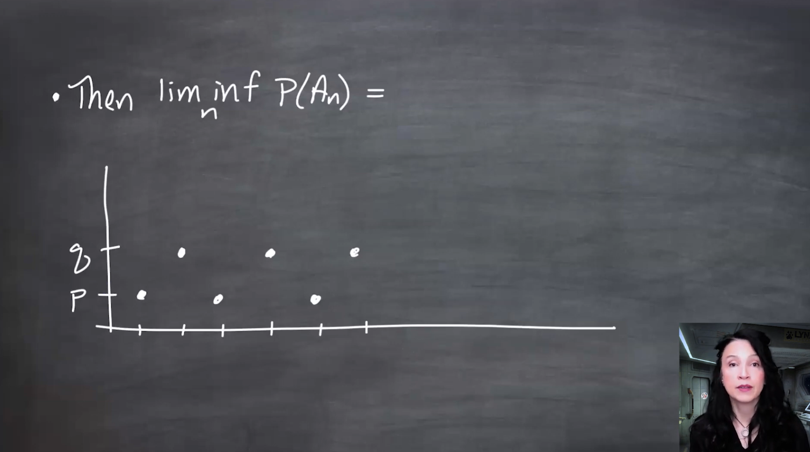{fig-alt="The slide computes P(A), P(B), and P(C), each equal to one half."}

Each event contains two of the four equally likely outcomes, so each has probability $1/2$.
:::

:::{.column-margin #fig-l09-slide-18}
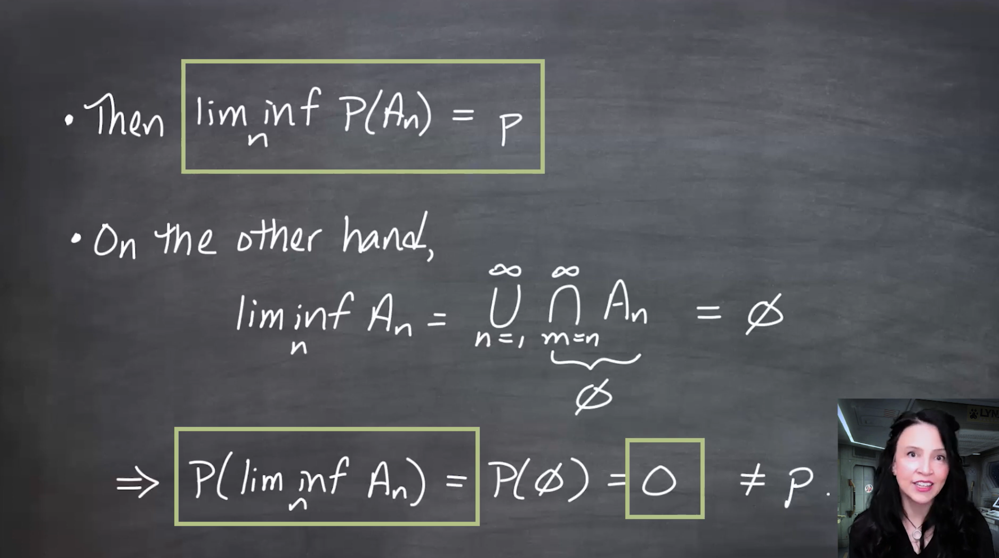{fig-alt="The slide shows that each pairwise intersection among A, B, and C is the singleton HH, whose probability is one fourth."}

Every pairwise intersection has probability $1/4$, matching the product $(1/2)(1/2)$.
:::

:::{.column-margin #fig-l09-slide-19}
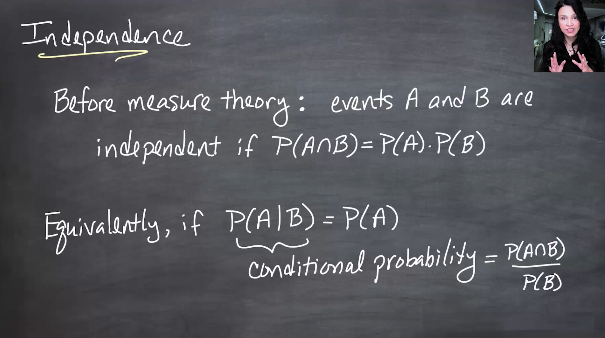{fig-alt="The slide computes the triple intersection A intersect B intersect C as HH with probability one fourth, which is not equal to one eighth, the product of the three individual probabilities."}

The triple intersection has probability $1/4$, but mutual independence would require $1/8$. So pairwise independence is not enough.
:::

## Preview: independence and generated sigma-fields

The next lesson asks a stronger structural question.

Suppose we start with an independent collection of sets and then generate a $\sigma$-field from that collection. Are all sets in the generated $\sigma$-field still independent in the appropriate sense?

:::{.column-margin #fig-l09-slide-20}
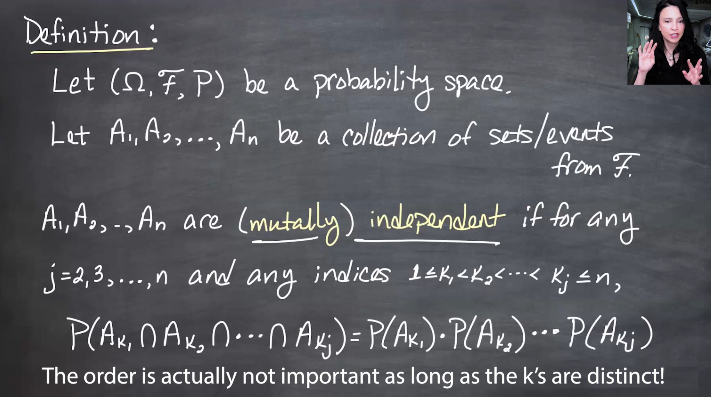{fig-alt="The slide previews the next question: if a collection of sets is independent, what happens after generating sigma-fields from that collection?"}

The upcoming topic moves from independence of events to independence of larger generated collections of events.
:::

:::{.column-margin #fig-l09-slide-21}
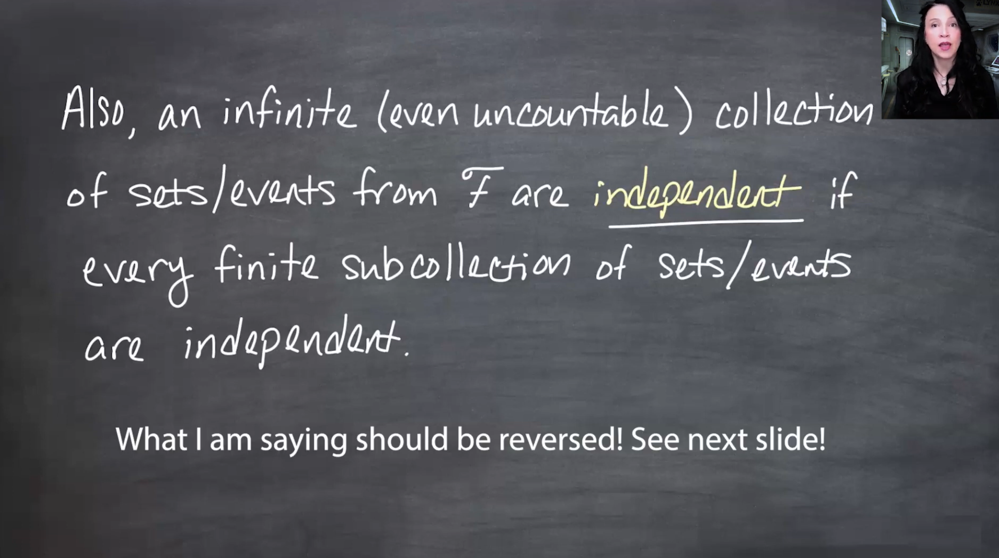{fig-alt="The slide summarizes the main continuity result: under appropriate convergence of sets, probabilities converge to the probability of the limiting set."}

The main theorem of the lesson is continuity of probabilities: set convergence implies convergence of probabilities.
:::

:::{.column-margin #fig-l09-slide-22}
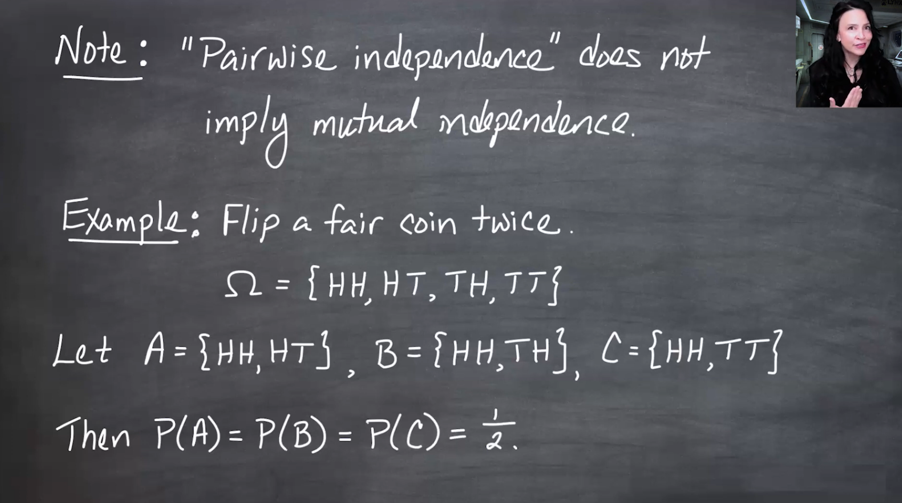{fig-alt="The slide motivates the coming Borel-Cantelli lemmas, which connect infinitely often events with summability and independence."}

The Borel-Cantelli lemmas will use the language of $\limsup A_n$, often read as “$A_n$ occurs infinitely often.”
:::

:::{.column-margin #fig-l09-slide-23}
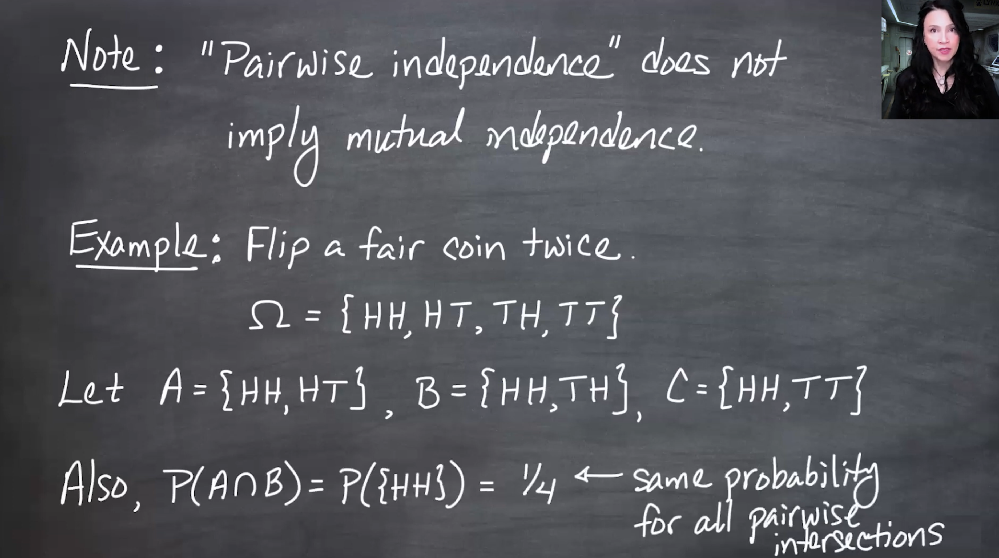{fig-alt="The slide notes that the second Borel-Cantelli lemma requires independence, motivating the independence definitions introduced here."}

The first Borel-Cantelli lemma needs subadditivity. The second needs independence, so the lesson prepares that concept first.
:::

:::{.column-margin #fig-l09-slide-24}
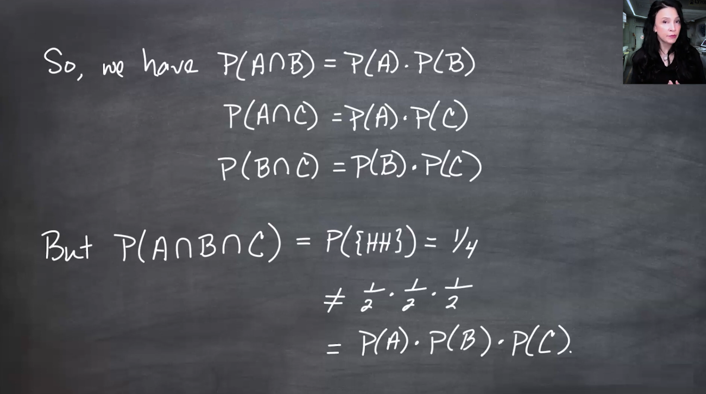{fig-alt="The slide previews the next lesson: starting with independent sets and asking whether the sigma-fields generated by them remain independent."}

The next lesson studies independence at the level of generated $\sigma$-fields rather than only individual events.
:::

## Takeaway

The continuity of probabilities theorem says that probability behaves continuously along monotone set limits:

$$
A_n\uparrow A \quad\Rightarrow\quad P(A_n)\to P(A),
$$

and

$$
A_n\downarrow A \quad\Rightarrow\quad P(A_n)\to P(A).
$$

For arbitrary set sequences,

$$
P(\liminf A_n) \leq  \liminf P(A_n) \leq \limsup P(A_n) \leq P(\limsup A_n).
$$

So if $A_n\to A$, the bounds squeeze to

$$
P(A_n)\to P(A).
$$

The independence section prepares for the Borel-Cantelli lemmas: pairwise independence is not enough; mutual independence requires the product rule for every finite subcollection.
