::: {#vid-C99-l10 .column-margin}


Lesson 10: Dynkin's $\pi$-$\lambda$ theorem and its use in proving independence of generated $\sigma$-fields.
:::

In this lesson we will present and then prove [Dynkin's $\pi$-$\lambda$ theorem](#sec-dynkin-theorem), which gives a powerful criterion for showing that a $\lambda$-system contains the $\sigma$-field generated by a $\pi$-system. We then apply this result to show that independent $\pi$-systems generate independent $\sigma$-fields.

## Lesson map {#sec-lesson-map}

- [Recap: independence of events and independence of classes of events](#sec-independent-classes)
- [Definition of independent classes using $\Omega$ to encode lower-order intersections](#sec-independent-classes).
- [Counterexample: independent classes need not generate independent $\sigma$-fields](#sec-independent-classes).
- [Definition of a $\pi$-system](#sec-pi-systems).
- [Definition of a $\lambda$-system](#sec-lambda-systems).
- [Equivalent proper-difference condition for $\lambda$-systems](#sec-lambda-systems).
- [A class that is both a $\pi$-system and a $\lambda$-system is a $\sigma$-field](#sec-pi-lambda-systems).
- [Intersections of $\lambda$-systems](#sec-lambda-systems).
- [The auxiliary class $\mathcal{L}_A=\{B:A\cap B\in\mathcal{L}\}$](#sec-lambda-systems).
- [Dynkin's $\pi$-$\lambda$ theorem](#sec-dynkin-theorem).
- [Independent $\pi$-systems generate independent $\sigma$-fields](#sec-independent-pi-systems).
- [Extension to infinite families by checking finite subfamilies](#sec-infinite-families).

## Recap: independence for classes of events {#sec-independent-classes}

::: {#def-independent-classes}
## Independence for classes of events
Let $(\Omega,\mathcal{F},P),$  be a probability space, with collections (classes) of sets (events) $\mathcal{A}_1,\mathcal{A}_2,\ldots,\mathcal{A}_n \subseteq \mathcal{F}$

The classes are independent if any choice of events $A_i\in\mathcal{A}_i$ gives independent events $A_1,A_2,\ldots,A_n$.
:::

For a pair of events, **independence** means $P(A\cap B)=P(A)P(B).$
For a finite family of classes, the clean version of the definition is:

::: {#def-independent-classes-alt}
## Alternative definition of independence for classes of events
Let $(\Omega,\mathcal{F},P),$  be a probability space, with collections (classes) of sets (events) from $\mathcal{A}_1,\mathcal{A}_2,\ldots,\mathcal{A}_n \subseteq \mathcal{F}$ are independent if

$$
P(A_1\cap A_2\cap\cdots\cap A_n)  = \prod_{i=1}^n P(A_i), \forall A_i \in \mathcal{A}_i. \text{ or } A_i=\Omega.
$$
:::

where each $A_i$ is either chosen from $\mathcal{A}_i$ or is allowed to be $\Omega$.

[Allowing $A_i=\Omega$ folds all lower-order intersections into the same $n$-fold formula.]{.mark}

For example, with three classes, the pairwise condition for $A_1$ and $A_3$ appears by setting $A_2=\Omega$:

$$
P(A_1\cap \Omega\cap A_3) = P(A_1)P(\Omega)P(A_3) = P(A_1)P(A_3).
$$

## Todays motivating question: Does independence survive generating $\sigma$-fields? {#sec-motivating-question}

Our main question today is [does independence survive the operation of generating $\sigma$-fields:]{.mark}

$$
\mathcal{A}_1,\mathcal{A}_2 \text{ independent}
\quad \stackrel{???}{\Longrightarrow}\quad
\sigma(\mathcal{A}_1),\sigma(\mathcal{A}_2) \text{ independent}.
$$

Hint: The answer is **not in general**. 

It becomes true after adding the key structural assumption: [each starting class should be a $\pi$-system.]{.mark}

## Why the naive theorem fails {#sec-naive-failure}

::: {.callout-warning}
## events, classes and $\sigma$-fields
Keeping track of the different levels of structure: events, classes of events, and $\sigma$-fields is confusing.

The main point jem reiterates is that the sigma-field generation operates on the classes, not on the events!

The key is to remember that a $\sigma$-field is a special kind of class of events, so we can talk about independence for classes and then ask if it survives when we generate $\sigma$-fields from those classes.

Since the notation isn't stellar the example @exm-counterexample-independent-classes helps to sort the three out 
:::

::: {#exm-counterexample-independent-classes}
## Counterexample: independent coin flips classes yield dependent $\sigma$-fields
The space for two fair coin coins: $\Omega=\{HH,HT,TH,TT\},\quad  \mathbb{P}(\{\omega\})=\frac14.$ Let define events 
$$A=\{HH,HT\}, B=\{HH,TT\}, C=\{HT,TT\}
$$
and classes 
$$\mathcal{A}_1=\{A,B\}, \quad \mathcal{A}_2=\{C\}
$$

The classes $\mathcal{A}_1$ and $\mathcal{A}_2$ are independent. e.g. $A\cap C = \{HT\}$, so $P(A\cap C)=\frac14 = \frac12\cdot\frac12 =P(A)P(C).$

[The original classes pass the independence check.]{.mark}

Note that $C = (A\cup B)\setminus(A\cap B) = (A\cup B)\cap (A\cap B)^c \implies   C \in \sigma(\mathcal{A}_1)$.
Also $C\in\mathcal{A}_2 \implies C\in\sigma(\mathcal{A}_2).$
[The generated $\sigma$-fields overlap too much: they both contain $C$.]{.mark}

$C$ isn't independent of itself! as $\mathbb{P}(C\cap C)=\mathbb{P}(C)\neq\mathbb{P}(C)^2.$ 

$\sigma(\mathcal{A}_1) \text{ and } \sigma(\mathcal{A}_2)$ are not independent. $\blacksquare$
:::

[The counterexample works because generating a $\sigma$-field can create a shared nontrivial event.]{.mark}

## $\pi$-systems and $\lambda$-systems {#sec-pi-lambda-systems}

::: {#def-pi-system}
## $\pi$-system
Is a class of sets closed under finite intersections:

$$
A,B\in\mathcal{P} \quad \Longrightarrow \quad A\cap B\in\mathcal{P}.
$$
:::

Every field and every $\sigma$-field is a $\pi$-system. However a $\pi$-system 

- need not contain $\Omega$,
- need not be closed under complements, and 
- need not be closed under unions. 

This is exactly why it is a *weak but useful hypothesis*. 
Billingsley introduces $\pi$-systems in the uniqueness part of the extension theorem [@billingsley2012probability p.43].

[A $\pi$-system remembers only intersection structure.]{.mark}

## Defining $\lambda$-systems {#sec-lambda-systems}

::: {#def-lambda-system}
## $\lambda$-system
is a class $\mathcal{L}$ of subsets of $\Omega$ satisfying:

1. $\Omega\in\mathcal{L}$
2. if $A\in\mathcal{L}$, then $A^c\in\mathcal{L}$
3. if $A_1,A_2,\ldots \in \mathcal{L}$ are pairwise disjoint, then
$$
\bigcup_{n=1}^{\infty}A_n\in\mathcal{L}
$$
:::

A $\sigma$-field is a $\lambda$-system, but a $\lambda$-system is weaker because countable unions are required only for **disjoint** sequences [@billingsley2012probability p.43].

### Alternative difference axiom  for $\lambda$-systems 

::: {#def-lambda-system-alt}
## $\lambda$-system
is a class $\mathcal{L}$ of subsets of $\Omega$ satisfying:

1. $\Omega\in\mathcal{L}$
2. if $A,B\in\mathcal{L},\ A\subseteq B \quad\Longrightarrow\quad B\setminus A\in\mathcal{L}.$
3. if $A_1,A_2,\ldots \in \mathcal{L}$ are pairwise disjoint, then
$$
\bigcup_{n=1}^{\infty}A_n\in\mathcal{L}
$$
:::

::: {#thm-equivalent-of-lambda-definitions}
## equivalence of $\lambda$-system definitions

The two definitions of $\lambda$-systems @def-lambda-system and  @def-lambda-system-alt are equivalent.
:::

[The second axioms in the definitions are equivalent by themselves. However they are equivalent in the presence of the other $\lambda$-system axioms.]{.mark}

::: {.proof}
1. @def-lambda-system-alt (1.) and (2.) $\Longrightarrow$ @def-lambda-system (2.) since we can take $B=\Omega$ in the proper-difference condition to get $A^c\in\mathcal{L}$.
2. @def-lambda-system (2.) and (3.) $\Longrightarrow$ @def-lambda-system-alt (2.) because if $A\subseteq B$, then $A$ is disjoint from $B\setminus A$, so $B\setminus A\in\mathcal{L}$ by the $\lambda$-system property.

Conversely, suppose $\mathcal{L}$ is closed under complements and disjoint countable unions. If $A,B\in\mathcal{L}$ and $A\subseteq B$, then $B^c\in\mathcal{L}$ and $A$ is disjoint from $B^c$. Therefore $A\cup B^c\in\mathcal{L}.$

Taking complements, $(A\cup B^c)^c = A^c\cap B = B\setminus A \in\mathcal{L}.$
:::

[Proper differences are often the more convenient closure rule. e.g. using proper differences to avoid reproving complement closure in every auxiliary $\lambda$-system.]{.mark}

### A class that is both a $\pi$-system and a $\lambda$-system is a $\sigma$-field

::: {#thm-pi-lambda-systems-are-sigma-fields}
## A class that is both a $\pi$-system and a $\lambda$-system is a $\sigma$-field
If $\mathcal{A}$ is both a $\pi$-system and a $\lambda$-system. Then $\mathcal{A}$ is a $\sigma$-field  c.f. [@billingsley2012probability p.43].
:::

The $\pi$-system supplies the finite intersections; the $\lambda$-system supplies the disjoint countable union.

::: {.proof}
The first two $\sigma$-field properties are immediate:

$\Omega\in\mathcal{A}$ because $\mathcal{A}$ is a $\lambda$-system, and

$A\in\mathcal{A} \quad\Longrightarrow\quad A^c\in\mathcal{A}$ again by the $\lambda$-system property.

[We will be disjointizing a countable union to prove $\sigma$-field closure.]{.mark}

Now take any sequence $A_1,A_2,\ldots\in\mathcal{A}$. These sets need not be disjoint, so define disjoint pieces:

$B_1=A_1 \quad B_2=A_2\cap A_1^c \quad B_3=A_3\cap A_2^c\cap A_1^c$,

and in general $B_k = A_k\cap\bigcap_{j<k}A_j^c.$

The complements $A_j^c$ are in $\mathcal{A}$ because $\mathcal{A}$ is a $\lambda$-system. The finite intersections are in $\mathcal{A}$ because $\mathcal{A}$ is a $\pi$-system. Thus each $B_k\in\mathcal{A}$. The $B_k$ are disjoint, so the $\lambda$-system property gives $\bigcup_{k=1}^{\infty}B_k\in\mathcal{A}.$

But $\bigcup_{k=1}^{\infty}B_k = \bigcup_{k=1}^{\infty}A_k.$ 

Therefore $\mathcal{A}$ is closed under countable unions, and hence is a $\sigma$-field.
:::

[Turn arbitrary countable unions into disjoint unions by peeling off the earlier sets.]{.mark}

## Two auxiliary $\lambda$-system lemmas {#sec-aux-lambda-lemmas}

### Intersections of $\lambda$-systems

If $\mathcal{L}_1$ and $\mathcal{L}_2$ are $\lambda$-systems on the same underlying set $\Omega$, then

$$
\mathcal{L}_1\cap\mathcal{L}_2
$$

is also a $\lambda$-system.

Here the intersection is an intersection of **classes of sets**. A set belongs to $\mathcal{L}_1\cap\mathcal{L}_2$ when the entire set belongs to both classes. We are not taking a set from $\mathcal{L}_1$ and intersecting it with a set from $\mathcal{L}_2$.

The proof mirrors the analogous fact for $\sigma$-fields:

- $\Omega$ lies in both $\mathcal{L}_1$ and $\mathcal{L}_2$.
- If $A$ lies in both, then $A^c$ lies in both.
- If $A_1,A_2,\ldots$ are disjoint and each lies in both, then $\bigcup_n A_n$ lies in both.

This also justifies defining the **smallest $\lambda$-system containing a class** as the intersection of all $\lambda$-systems containing it, exactly as generated $\sigma$-fields are defined by intersections of $\sigma$-fields [@billingsley2012probability p.21].

:::{.column-margin #fig-l10-slide-10}
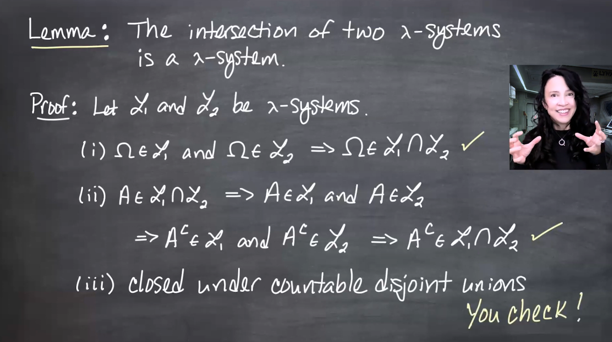{fig-alt="Blackboard slide proving that the intersection of two lambda-systems L_1 and L_2 is again a lambda-system. It checks Omega and complement closure, and leaves closure under countable disjoint unions to the viewer." group="slides"}

Intersections let us speak of the smallest $\lambda$-system containing a given class.
:::

### The section lemma: $\mathcal{L}_A$

Let $\mathcal{L}$ be a $\lambda$-system and fix $A\subseteq\Omega$. Define

$$
\mathcal{L}_A
=
\{B\subseteq\Omega: A\cap B\in\mathcal{L}\}.
$$

If $A\in\mathcal{L}$, then $\mathcal{L}_A$ is a $\lambda$-system.

First,

$$
A\cap\Omega=A\in\mathcal{L},
$$

so

$$
\Omega\in\mathcal{L}_A.
$$

:::{.column-margin #fig-l10-slide-11}
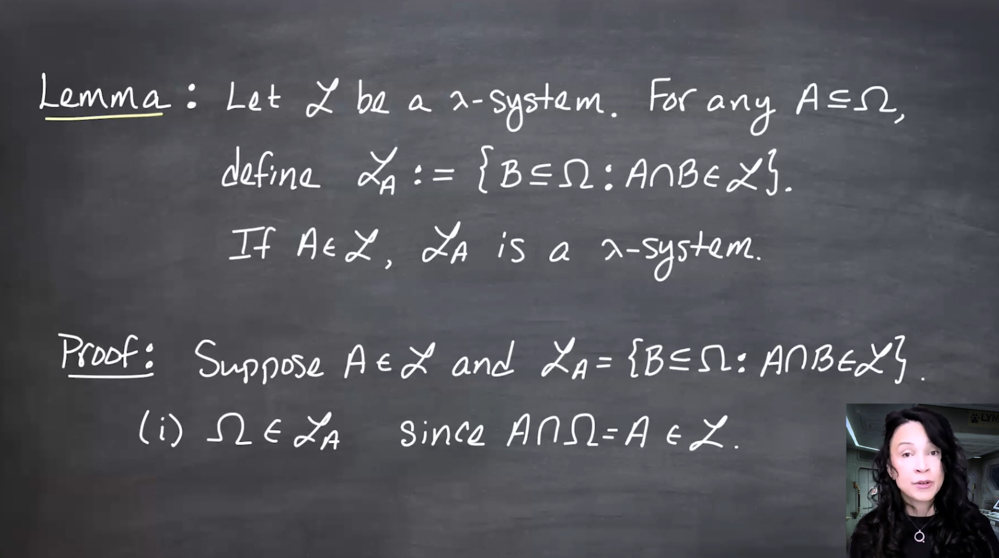{fig-alt="Blackboard slide defining L_A as the class of subsets B of Omega such that A intersection B belongs to L. It states that if A belongs to the lambda-system L, then L_A is itself a lambda-system. The first check is Omega, since A intersection Omega equals A." group="slides"}

The class $\mathcal{L}_A$ collects all sets that keep us inside $\mathcal{L}$ after intersecting with $A$.
:::

For complements, suppose $B\in\mathcal{L}_A$. Then

$$
A\cap B\in\mathcal{L},
\qquad
A\cap B\subseteq A,
\qquad
A\in\mathcal{L}.
$$

By the proper-difference version of the $\lambda$-system axiom,

$$
A\setminus(A\cap B)
\in\mathcal{L}.
$$

But

$$
A\setminus(A\cap B)
=
A\cap(A\cap B)^c
=
A\cap(A^c\cup B^c)
=
A\cap B^c.
$$

Therefore $A\cap B^c\in\mathcal{L}$, which means

$$
B^c\in\mathcal{L}_A.
$$

:::{.column-margin #fig-l10-slide-12}
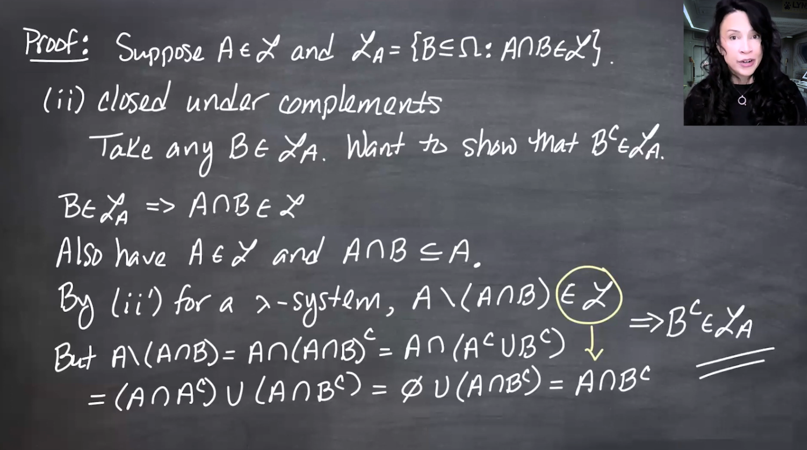{fig-alt="Blackboard slide proving that L_A is closed under complements. From B in L_A, it gets A intersection B in L. Since A intersection B is contained in A, the proper difference A minus A intersection B is in L. The algebra simplifies this set to A intersection B complement, so B complement is in L_A." group="slides"}

The proper-difference trick is exactly why the alternative axiom was useful.
:::

Finally, let $B_1,B_2,\ldots$ be disjoint sets in $\mathcal{L}_A$. Then

$$
A\cap B_1,
A\cap B_2,
\ldots
$$

are disjoint sets in $\mathcal{L}$. Since $\mathcal{L}$ is a $\lambda$-system,

$$
\bigcup_{n=1}^{\infty}(A\cap B_n)
\in\mathcal{L}.
$$

Distributing intersection over union gives

$$
\bigcup_{n=1}^{\infty}(A\cap B_n)
=
A\cap\left(\bigcup_{n=1}^{\infty}B_n\right).
$$

So

$$
\bigcup_{n=1}^{\infty}B_n
\in\mathcal{L}_A.
$$

:::{.column-margin #fig-l10-slide-13}
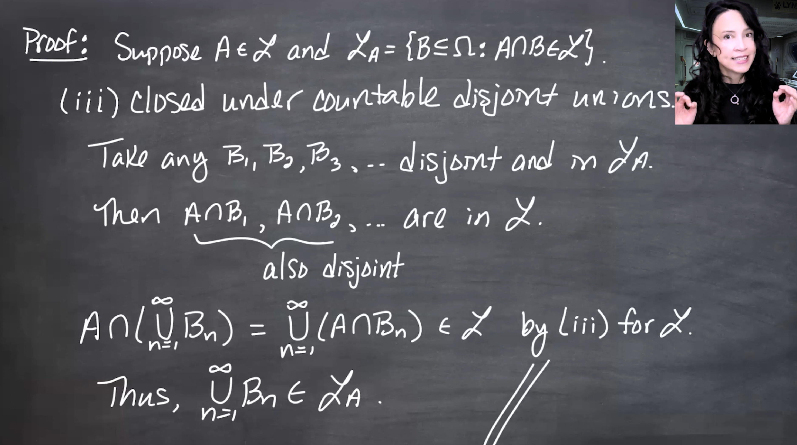{fig-alt="Blackboard slide proving that L_A is closed under countable disjoint unions. If B_1, B_2, and so on are disjoint sets in L_A, then A intersection B_i are disjoint sets in L. Their union equals A intersection the union of the B_i, so the union of the B_i belongs to L_A." group="slides"}

Intersecting a disjoint union with $A$ preserves disjointness.
:::

## Dynkin's $\pi$-$\lambda$ theorem {#sec-dynkin-theorem}

::: {#thm-dynkin-pi-lambda}
## Dynkin's $\pi$-$\lambda$ theorem

Let $\mathcal{P}$ be a $\pi$-system and let $\mathcal{L}$ be a $\lambda$-system. If

$$
\mathcal{P}\subseteq\mathcal{L},
$$

then

$$
\sigma(\mathcal{P})\subseteq\mathcal{L}.
$$
:::

Billingsley states this as Theorem 3.2 and uses it immediately for uniqueness of probability measures on generated $\sigma$-fields [@billingsley2012probability pp.43-45].

[Dynkin's theorem is a bootstrap: prove a $\lambda$-system contains a $\pi$-system, then get the generated $\sigma$-field for free.]{.mark}

:::{.column-margin #fig-l10-slide-14}
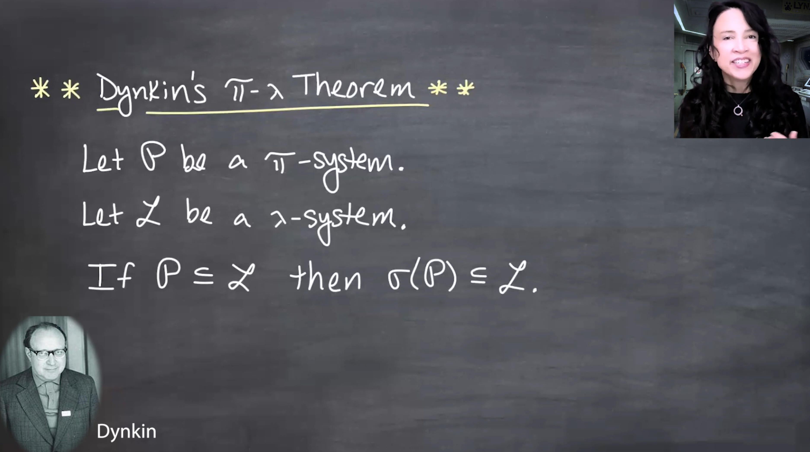{fig-alt="Slide with a portrait of Eugene Dynkin and the statement of Dynkin's pi-lambda theorem: if P is a pi-system, L is a lambda-system, and P is contained in L, then sigma of P is contained in L." group="slides"}

This theorem is the main engine of the lesson.
:::

### Proof idea

Let $\mathcal{L}_0$ be the smallest $\lambda$-system containing $\mathcal{P}$. Since $\mathcal{L}$ is a $\lambda$-system containing $\mathcal{P}$,

$$
\mathcal{P}
\subseteq
\mathcal{L}_0
\subseteq
\mathcal{L}.
$$

If we can prove that $\mathcal{L}_0$ is also a $\pi$-system, then $\mathcal{L}_0$ is both a $\pi$-system and a $\lambda$-system, hence a $\sigma$-field. Then minimality of $\sigma(\mathcal{P})$ gives

$$
\sigma(\mathcal{P})
\subseteq
\mathcal{L}_0
\subseteq
\mathcal{L}.
$$

So the whole proof reduces to showing:

$$
A,B\in\mathcal{L}_0
\quad\Longrightarrow\quad
A\cap B\in\mathcal{L}_0.
$$

:::{.column-margin #fig-l10-slide-15}
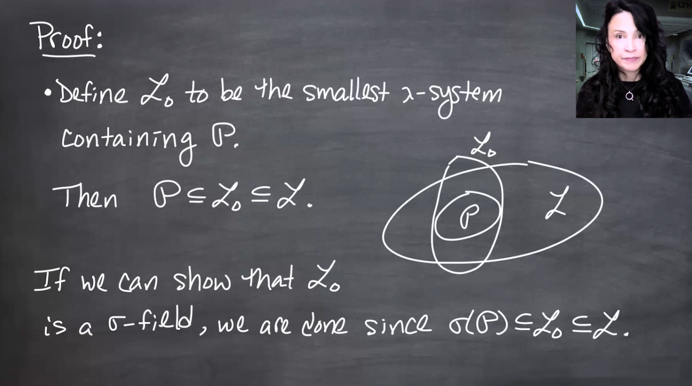{fig-alt="Blackboard slide defining L_0 as the smallest lambda-system containing P. It shows P contained in L_0 contained in L. The slide explains that if L_0 is a sigma-field, then sigma of P is contained in L_0 and hence in L." group="slides"}

The proof narrows the goal to showing $\mathcal{L}_0$ is closed under finite intersections.
:::

:::{.column-margin #fig-l10-slide-16}
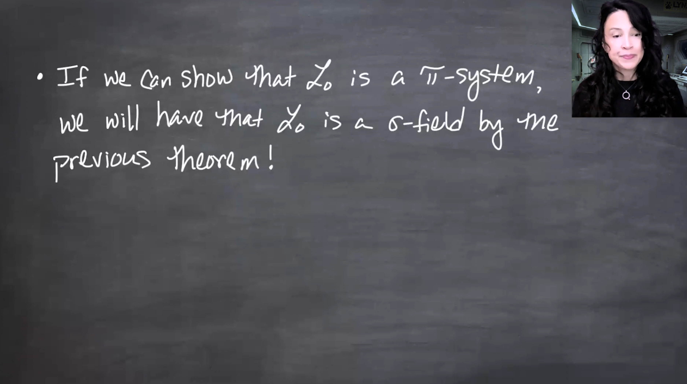{fig-alt="Blackboard slide saying that since L_0 is already a lambda-system, it is enough to show L_0 is a pi-system. The target is: if A and B are in L_0, then A intersection B is in L_0." group="slides"}

Once $\mathcal{L}_0$ is a $\pi$-system, the earlier theorem turns it into a $\sigma$-field.
:::

### Claim 1: intersections with sets in $\mathcal{P}$ preserve $\mathcal{P}$

Take $C\in\mathcal{P}$. Since $\mathcal{P}\subseteq\mathcal{L}_0$, we also have $C\in\mathcal{L}_0$. Define

$$
\mathcal{L}_C
=
\{D\subseteq\Omega:C\cap D\in\mathcal{L}_0\}.
$$

By the section lemma, $\mathcal{L}_C$ is a $\lambda$-system.

If $D\in\mathcal{P}$, then because $\mathcal{P}$ is a $\pi$-system,

$$
C\cap D\in\mathcal{P}
\subseteq
\mathcal{L}_0.
$$

Therefore $D\in\mathcal{L}_C$, and hence

$$
\mathcal{P}\subseteq\mathcal{L}_C.
$$

:::{.column-margin #fig-l10-slide-17}
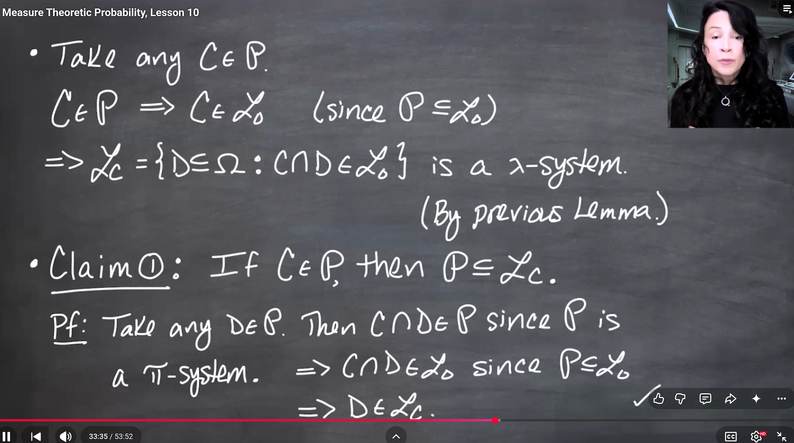{fig-alt="Blackboard slide for Claim 1. For C in P, it defines L_C as all D such that C intersection D is in L_0. Since C is in L_0, L_C is a lambda-system. If D is in P, then C intersection D is in P because P is a pi-system, so D belongs to L_C. Thus P is contained in L_C." group="slides"}

The first claim uses only the $\pi$-system closure of $\mathcal{P}$.
:::

### Claim 2: one set from $\mathcal{P}$ and one from $\mathcal{L}_0$

For $C\in\mathcal{P}$, Claim 1 gives $\mathcal{P}\subseteq\mathcal{L}_C$. Since $\mathcal{L}_C$ is a $\lambda$-system containing $\mathcal{P}$, minimality of $\mathcal{L}_0$ gives

$$
\mathcal{L}_0\subseteq\mathcal{L}_C.
$$

Thus if $D\in\mathcal{L}_0$, then $D\in\mathcal{L}_C$, which means

$$
C\cap D\in\mathcal{L}_0.
$$

So

$$
C\in\mathcal{P},\ D\in\mathcal{L}_0
\quad\Longrightarrow\quad
C\cap D\in\mathcal{L}_0.
$$

:::{.column-margin #fig-l10-slide-18}
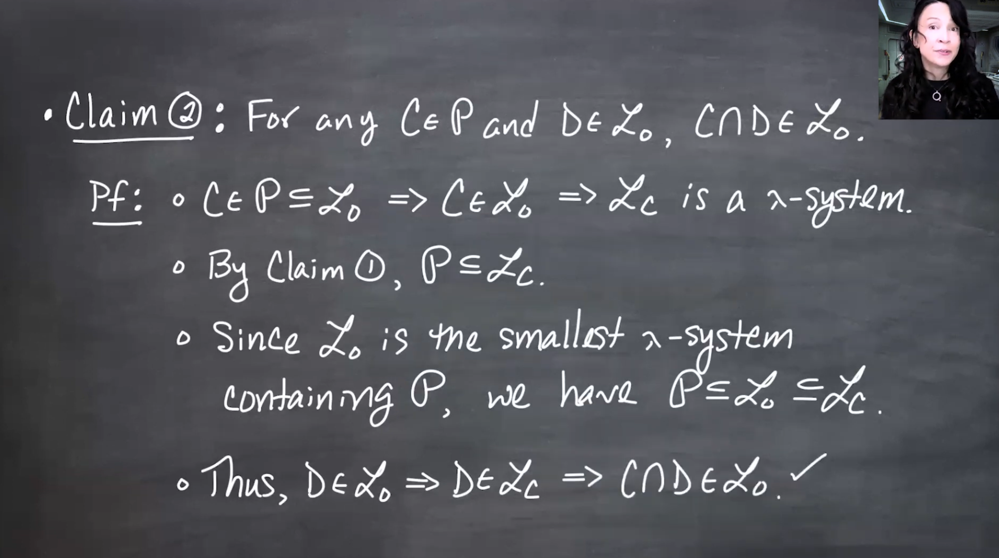{fig-alt="Blackboard slide for Claim 2. If C is in P and D is in L_0, then C intersection D is in L_0. The proof uses that L_C is a lambda-system containing P, so by minimality L_0 is contained in L_C." group="slides"}

Minimality of $\mathcal{L}_0$ upgrades $\mathcal{P}\subseteq\mathcal{L}_C$ to $\mathcal{L}_0\subseteq\mathcal{L}_C$.
:::

### Claim 3: reverse the roles

Now take $C\in\mathcal{L}_0$. We want to show

$$
\mathcal{P}\subseteq\mathcal{L}_C.
$$

Let $D\in\mathcal{P}$. By Claim 2, with the $\mathcal{P}$-set $D$ and the $\mathcal{L}_0$-set $C$,

$$
D\cap C
\in
\mathcal{L}_0.
$$

Since $D\cap C=C\cap D$, this means $D\in\mathcal{L}_C$. Hence

$$
\mathcal{P}\subseteq\mathcal{L}_C.
$$

:::{.column-margin #fig-l10-slide-19}
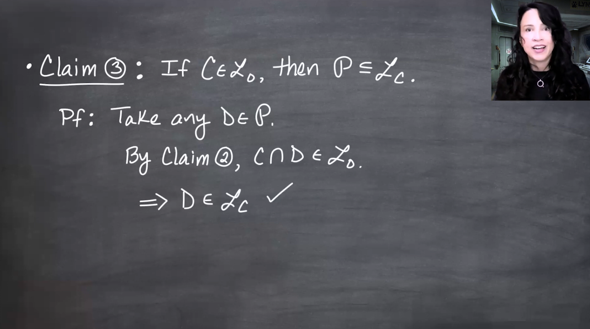{fig-alt="Blackboard slide for Claim 3. If C is in L_0, then P is contained in L_C. For D in P, Claim 2 gives C intersection D in L_0, so D is in L_C." group="slides"}

The symmetry $C\cap D=D\cap C$ lets Claim 2 be reused.
:::

### Claim 4: two arbitrary sets from $\mathcal{L}_0$

Finally take $A\in\mathcal{L}_0$. By the section lemma, $\mathcal{L}_A$ is a $\lambda$-system. Claim 3 gives

$$
\mathcal{P}\subseteq\mathcal{L}_A.
$$

Therefore, by minimality,

$$
\mathcal{L}_0\subseteq\mathcal{L}_A.
$$

If $B\in\mathcal{L}_0$, then $B\in\mathcal{L}_A$, so

$$
A\cap B\in\mathcal{L}_0.
$$

Thus $\mathcal{L}_0$ is a $\pi$-system. Since it is already a $\lambda$-system, it is a $\sigma$-field. This proves Dynkin's $\pi$-$\lambda$ theorem.

:::{.column-margin #fig-l10-slide-20}
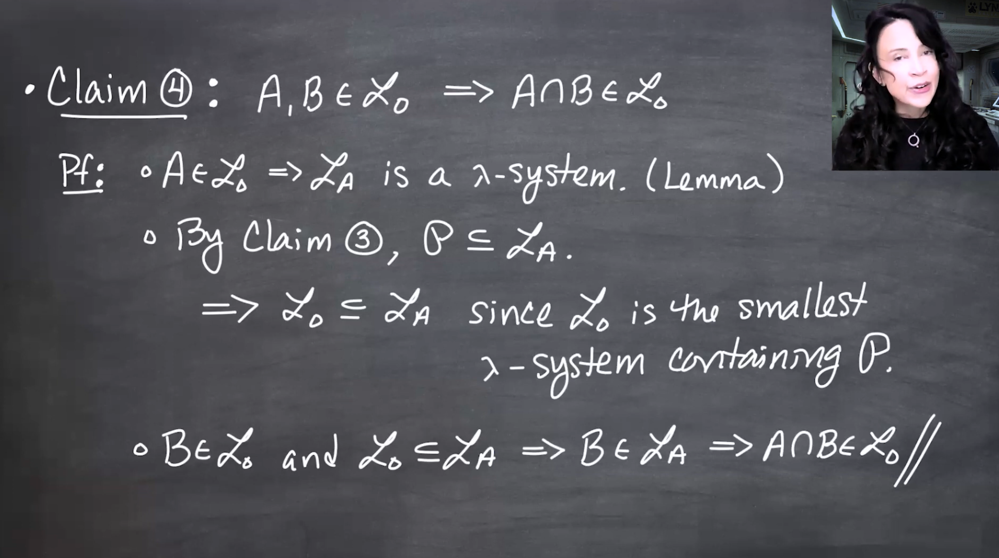{fig-alt="Blackboard slide for Claim 4. If A and B are in L_0, then A intersection B is in L_0. The proof defines L_A, uses Claim 3 to get P contained in L_A, uses minimality to get L_0 contained in L_A, and concludes B in L_A." group="slides"}

Claim 4 proves the missing finite-intersection closure.
:::

## Independent $\pi$-systems generate independent $\sigma$-fields {#sec-independent-pi-systems}

Now return to the motivation of the lesson.

::: {#thm-independent-generated-sigma-fields}
## Independence theorem for generated $\sigma$-fields

Let

$$
\mathcal{A}_1,\ldots,\mathcal{A}_n
$$

be independent $\pi$-systems in a probability space $(\Omega,\mathcal{F},P)$. Then

$$
\sigma(\mathcal{A}_1),\ldots,\sigma(\mathcal{A}_n)
$$

are independent.
:::

This is the promised corrected form of the false naive theorem. The extra $\pi$-system assumption prevents the counterexample pathology.

Define

$$
\mathcal{B}_i
=
\mathcal{A}_i\cup\{\Omega\}.
$$

Adding $\Omega$ does not break the $\pi$-system property, because intersecting with $\Omega$ changes nothing. Also,

$$
\sigma(\mathcal{B}_i)=\sigma(\mathcal{A}_i),
$$

since $\Omega$ belongs to every $\sigma$-field anyway.

:::{.column-margin #fig-l10-slide-21}
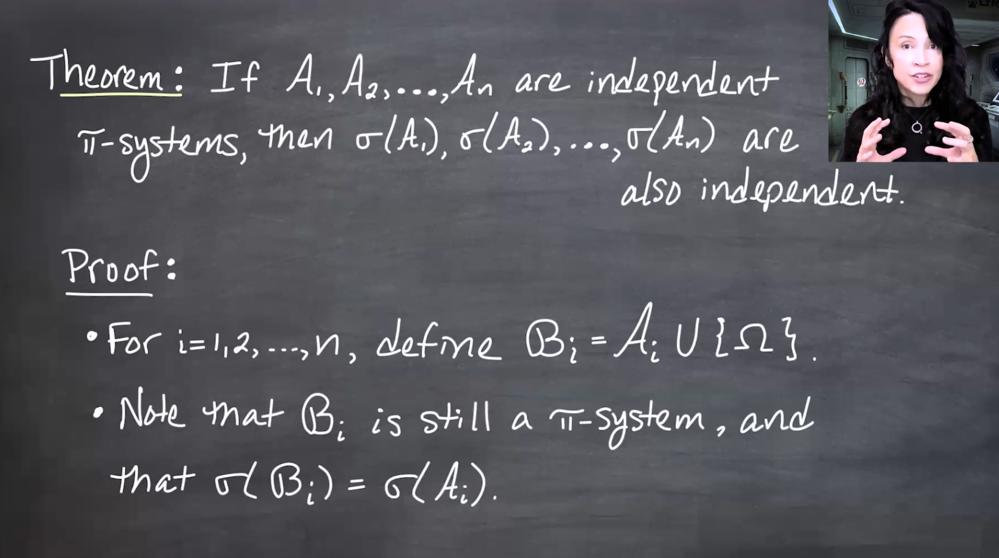{fig-alt="Blackboard slide stating that if A_1 through A_n are independent pi-systems, then the generated sigma-fields sigma of A_1 through sigma of A_n are mutually independent. It begins the proof by defining B_i as A_i union {Omega}, noting that B_i is still a pi-system and generates the same sigma-field as A_i." group="slides"}

Adding $\Omega$ makes the independence formula uniform across all subfamilies.
:::

The independence of the original classes is equivalent to saying that for all $B_i\in\mathcal{B}_i$,

$$
P(B_1\cap\cdots\cap B_n)
=
\prod_{i=1}^nP(B_i).
$$

Fix arbitrary sets

$$
B_2\in\mathcal{B}_2,
\ldots,
B_n\in\mathcal{B}_n.
$$

Define

$$
\mathcal{L}
=
\left\{
A\in\mathcal{F}:
P(A\cap B_2\cap\cdots\cap B_n)
=
P(A)\prod_{i=2}^nP(B_i)
\right\}.
$$

The goal is to show that $\mathcal{L}$ is a $\lambda$-system containing $\mathcal{B}_1$. Then Dynkin's theorem gives

$$
\sigma(\mathcal{B}_1)
\subseteq
\mathcal{L},
$$

which is the first step in replacing $\mathcal{B}_1$ by $\sigma(\mathcal{A}_1)$.

[To put a $\sigma$ on one coordinate, freeze every other coordinate and make the unfrozen coordinate a $\lambda$-system.]{.mark}

:::{.column-margin #fig-l10-slide-22}
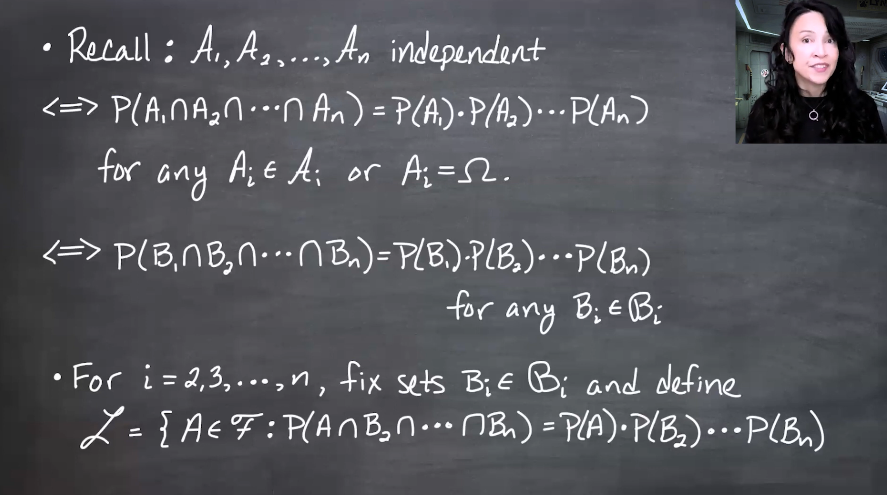{fig-alt="Blackboard slide recalling the independence formula for the B_i classes and then fixing B_2 through B_n. It defines L as the class of A in F such that P(A intersection B_2 intersection through B_n) factors as P(A) times the probabilities of B_2 through B_n." group="slides"}

The constructed $\mathcal{L}$ is tailored to the one factorization we want.
:::

### Showing $\mathcal{L}$ is a $\lambda$-system

First, $\Omega\in\mathcal{L}$ because

$$
P(\Omega\cap B_2\cap\cdots\cap B_n)
=
P(B_2\cap\cdots\cap B_n)
=
\prod_{i=2}^nP(B_i)
=
P(\Omega)\prod_{i=2}^nP(B_i).
$$

:::{.column-margin #fig-l10-slide-23}
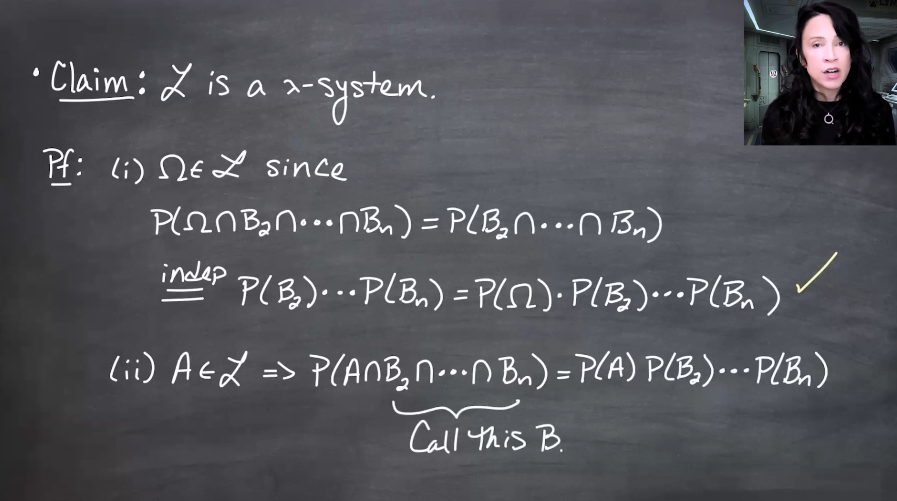{fig-alt="Blackboard slide showing that Omega belongs to the constructed class L. Plugging Omega into the definition reduces the left side to the probability of B_2 intersection through B_n, which factors by independence and equals P(Omega) times the product of the B_i probabilities." group="slides"}

The $\Omega$ case uses independence of $\mathcal{B}_2,\ldots,\mathcal{B}_n$.
:::

For complements, let $A\in\mathcal{L}$ and abbreviate

$$
B=B_2\cap\cdots\cap B_n.
$$

Then

$$
B=(A\cap B)\cup(A^c\cap B),
$$

and the two pieces are disjoint. By finite additivity,

$$
P(B)=P(A\cap B)+P(A^c\cap B).
$$

Because $A\in\mathcal{L}$,

$$
P(A\cap B)
=
P(A)\prod_{i=2}^nP(B_i).
$$

Also, by independence of $B_2,\ldots,B_n$,

$$
P(B)=\prod_{i=2}^nP(B_i).
$$

Therefore

$$
P(A^c\cap B)
=
\left(1-P(A)\right)\prod_{i=2}^nP(B_i)
=
P(A^c)\prod_{i=2}^nP(B_i).
$$

Thus $A^c\in\mathcal{L}$.

:::{.column-margin #fig-l10-slide-24}
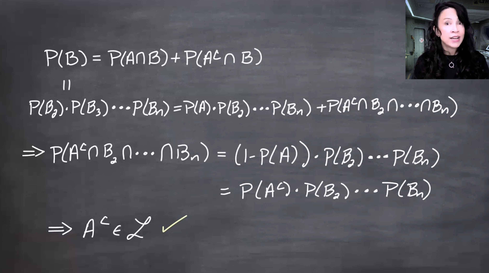{fig-alt="Blackboard slide proving complement closure for the constructed class L. It writes B as B_2 intersection through B_n, decomposes B into A intersection B and A complement intersection B, uses finite additivity, and solves for the probability of A complement intersection B to show it factors correctly." group="slides"}

Complement closure comes from decomposing the frozen intersection $B$ into the $A$ and $A^c$ parts.
:::

For countable disjoint unions, let $A_1,A_2,\ldots\in\mathcal{L}$ be disjoint. Then the sets

$$
A_m\cap B_2\cap\cdots\cap B_n
$$

are also disjoint. Countable additivity gives

$$
\begin{aligned}
P\left(\left(\bigcup_{m=1}^{\infty}A_m\right)\cap B_2\cap\cdots\cap B_n\right)
&=
P\left(\bigcup_{m=1}^{\infty}(A_m\cap B_2\cap\cdots\cap B_n)\right)\\
&=
\sum_{m=1}^{\infty}P(A_m\cap B_2\cap\cdots\cap B_n)\\
&=
\sum_{m=1}^{\infty}P(A_m)\prod_{i=2}^nP(B_i)\\
&=
\left(\sum_{m=1}^{\infty}P(A_m)\right)\prod_{i=2}^nP(B_i)\\
&=
P\left(\bigcup_{m=1}^{\infty}A_m\right)\prod_{i=2}^nP(B_i).
\end{aligned}
$$

So

$$
\bigcup_{m=1}^{\infty}A_m\in\mathcal{L}.
$$

:::{.column-margin #fig-l10-slide-25}
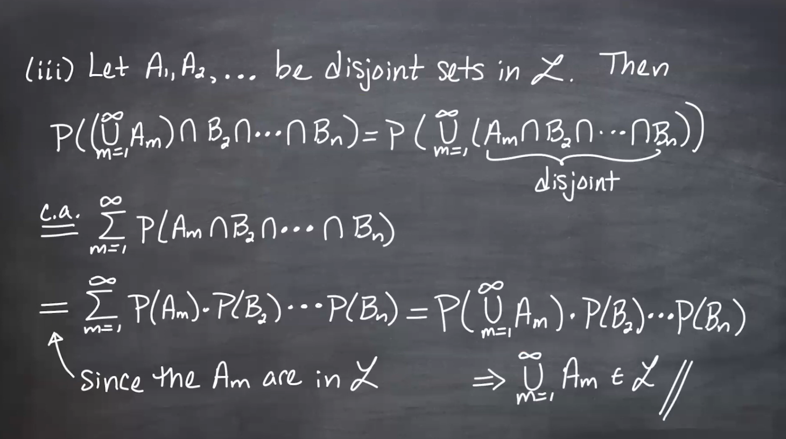{fig-alt="Blackboard slide proving countable disjoint union closure for L. It expands the probability of the union of A_m intersected with B_2 through B_n, uses countable additivity, uses the defining factorization for each A_m, factors out the constant product of probabilities of the B_i, and then recombines the sum as the probability of the union of the A_m." group="slides"}

Countable additivity is exactly why a $\lambda$-system, not an arbitrary class, appears here.
:::

### Apply Dynkin's theorem once

Because the original classes are independent, every $B_1\in\mathcal{B}_1$ satisfies the defining factorization for $\mathcal{L}$. Hence

$$
\mathcal{B}_1\subseteq\mathcal{L}.
$$

Since $\mathcal{B}_1$ is a $\pi$-system and $\mathcal{L}$ is a $\lambda$-system, Dynkin's theorem gives

$$
\sigma(\mathcal{B}_1)
\subseteq\mathcal{L}.
$$

But $\sigma(\mathcal{B}_1)=\sigma(\mathcal{A}_1)$, so for any

$$
A_1\in\sigma(\mathcal{A}_1),
$$

and any fixed $B_2\in\mathcal{B}_2,\ldots,B_n\in\mathcal{B}_n$,

$$
P(A_1\cap B_2\cap\cdots\cap B_n)
=
P(A_1)\prod_{i=2}^nP(B_i).
$$

Thus

$$
\sigma(\mathcal{A}_1),\mathcal{B}_2,\ldots,\mathcal{B}_n
$$

are independent.

:::{.column-margin #fig-l10-slide-26}
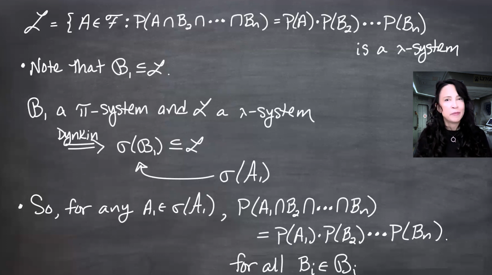{fig-alt="Blackboard slide concluding the first upgrade step. Since L is a lambda-system and B_1 is a pi-system contained in L, Dynkin's theorem gives sigma of B_1 contained in L. Since sigma of B_1 equals sigma of A_1, any A_1 from sigma of A_1 satisfies the desired factorization with B_2 through B_n." group="slides"}

One application of Dynkin's theorem replaces one $\pi$-system by its generated $\sigma$-field.
:::

### Iterate the argument

Now fix

$$
A_1\in\sigma(\mathcal{A}_1),
\qquad
B_3\in\mathcal{B}_3,
\ldots,
B_n\in\mathcal{B}_n,
$$

and define a new class

$$
\mathcal{L}
=
\left\{
A\in\mathcal{F}:
P(A_1\cap A\cap B_3\cap\cdots\cap B_n)
=
P(A_1)P(A)\prod_{i=3}^nP(B_i)
\right\}.
$$

The same proof shows that this new $\mathcal{L}$ is a $\lambda$-system containing $\mathcal{B}_2$. Dynkin's theorem gives

$$
\sigma(\mathcal{B}_2)
\subseteq
\mathcal{L},
$$

so $\mathcal{B}_2$ can be upgraded to $\sigma(\mathcal{A}_2)$.

Repeating the argument for $\mathcal{A}_3,\ldots,\mathcal{A}_n$ yields

$$
\sigma(\mathcal{A}_1),
\sigma(\mathcal{A}_2),
\ldots,
\sigma(\mathcal{A}_n)
$$

mutually independent.

:::{.column-margin #fig-l10-slide-27}
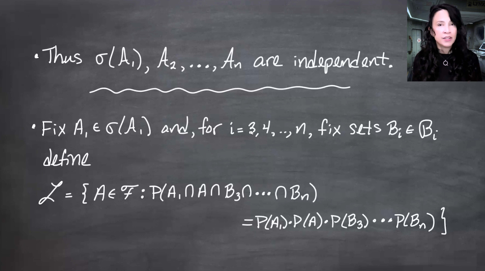{fig-alt="Blackboard slide explaining the iteration step. After upgrading A_1 to sigma of A_1, fix A_1 from that generated sigma-field and fix B_3 through B_n. Define a new lambda-system in the second coordinate and apply Dynkin's theorem to upgrade B_2 to sigma of A_2. Continue until all classes have been upgraded." group="slides"}

The same $\lambda$-system construction is recycled one coordinate at a time.
:::

For an infinite collection of independent $\pi$-systems, the result follows by applying the finite theorem to every finite subcollection. This works because independence of an infinite family is defined by independence of all finite subfamilies.

[The infinite-family version follows because independence is checked on finite subfamilies.]{.mark}

## Takeaway {#sec-takeaway}

Dynkin's $\pi$-$\lambda$ theorem is a minimality machine. It says that once a $\lambda$-system contains a $\pi$-system, it must contain everything generated from that $\pi$-system as a $\sigma$-field.

The lesson uses that machine twice:

1. **Abstractly**, to prove the theorem itself by showing the minimal $\lambda$-system over a $\pi$-system is also a $\pi$-system.
2. **Probabilistically**, to prove that independent $\pi$-systems remain independent after generating $\sigma$-fields.

This is also why $\lambda$-systems are tuned to probability: their closure condition is countable additivity over disjoint unions, which is the central operation for probability measures [@billingsley2012probability p.45].

