::: {#vid-C99-l13 .column-margin}


Lesson 13: Tail sigma-fields and Kolmogorov's 0-1 Law
:::

## Lesson map

This lesson proves the next three lemmas from the extension roadmap.

- Recap:
- Tail sigma-fields
- Kolmogorov's 0-1 Law

:::{.column-margin #fig-l13-slide-01} 
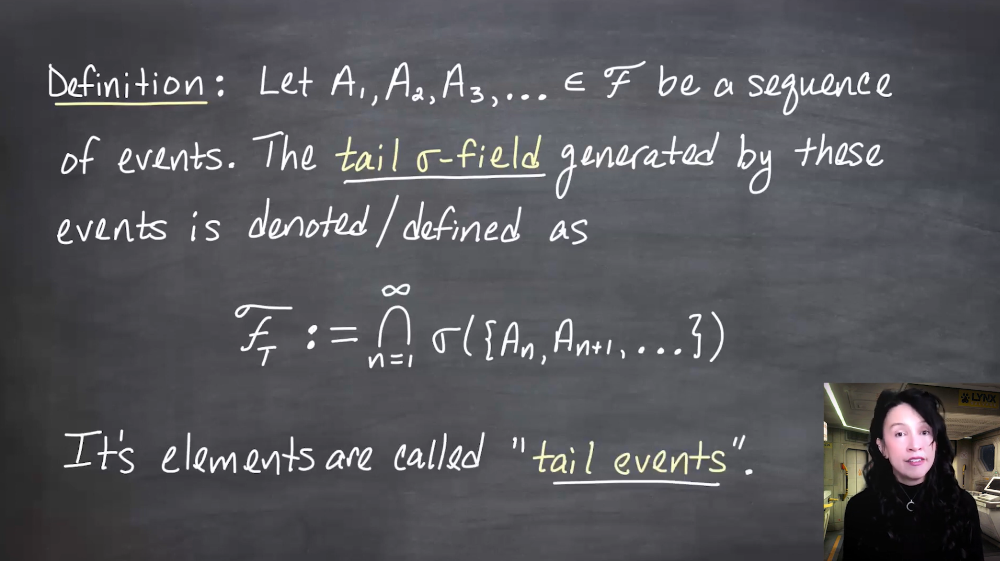{fig-alt="me with alternative without math."}

And me with a longer caption that is more descriptive of the image, and can replace the image if it doesn't load.
:::

:::{.column-margin #fig-l13-slide-02} 
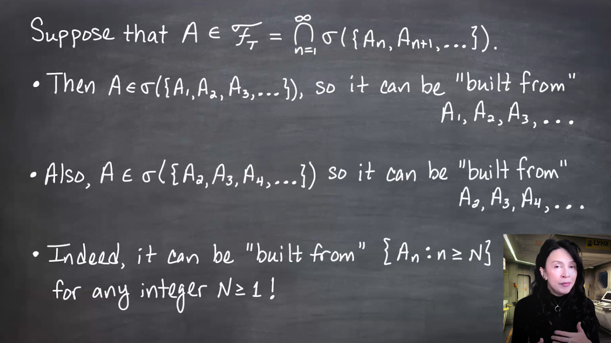{fig-alt="me with alternative without math."}

And me with a longer caption that is more descriptive of the image, and can replace the image if it doesn't load.
:::

:::{.column-margin #fig-l13-slide-03}
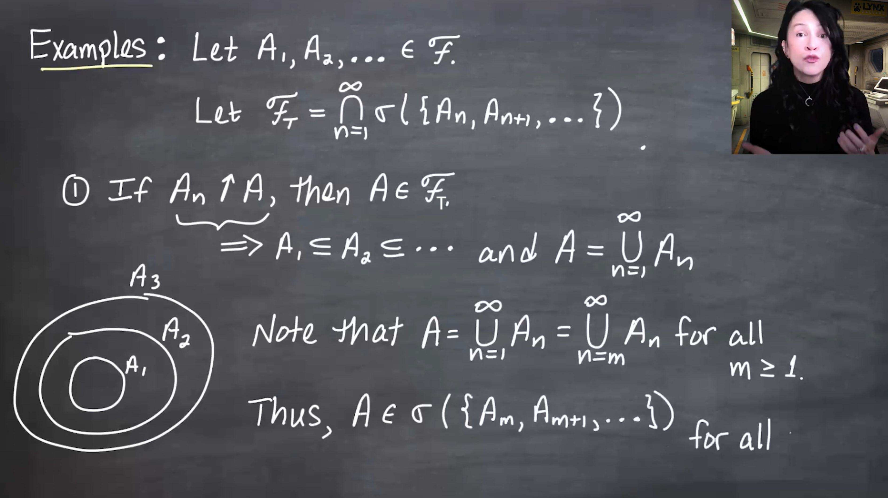{fig-alt="me with alternative without math."}
And me with a longer caption that is more descriptive of the image, and can replace the image if it doesn't load.
:::

:::{.column-margin #fig-l13-slide-04} 
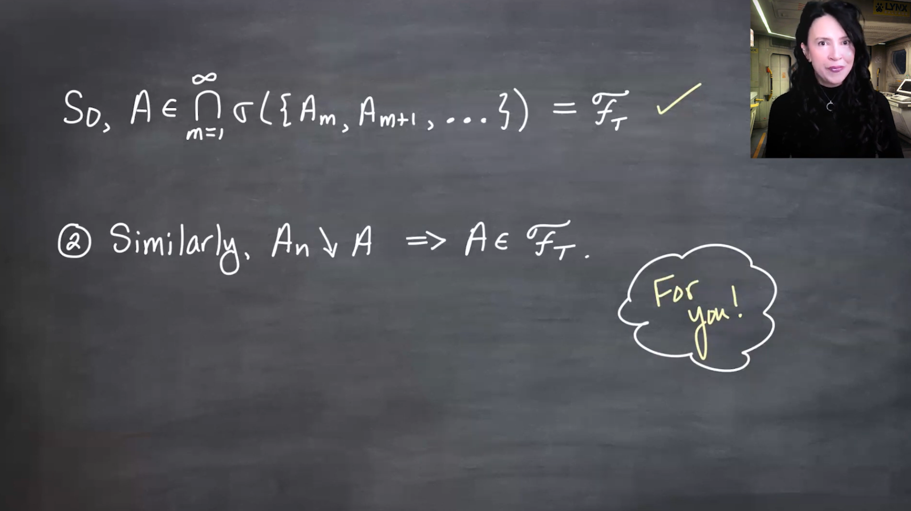{fig-alt="me with alternative without math."}

And me with a longer caption that is more descriptive of the image, and can replace the image if it doesn't load.
:::

:::{.column-margin #fig-l13-slide-05}
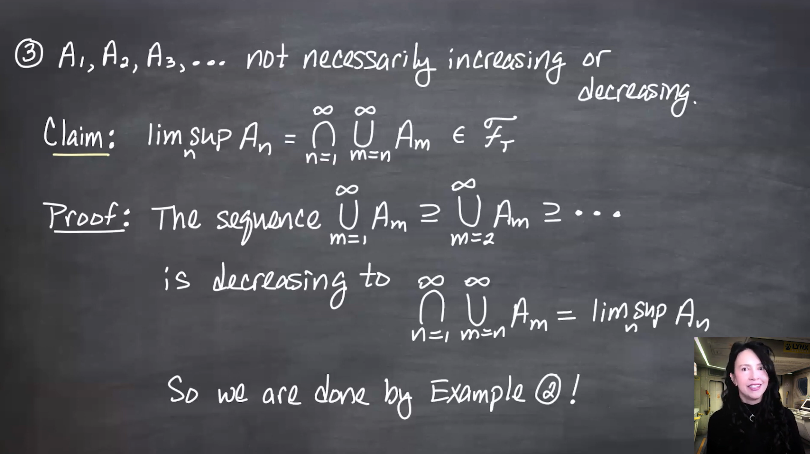{fig-alt="me with alternative without math."}
And me with a longer caption that is more descriptive of the image, and can replace the image if it doesn't load.
:::

:::{.column-margin #fig-l13-slide-06} 
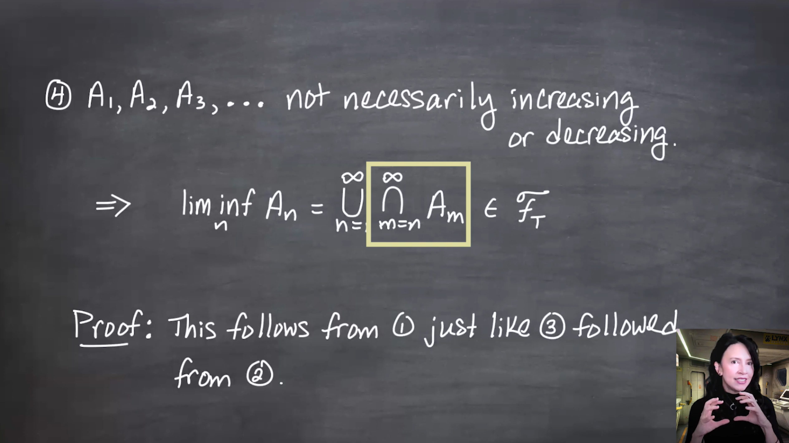{fig-alt="me with alternative without math."}

And me with a longer caption that is more descriptive of the image, and can replace the image if it doesn't load.
:::

:::{.column-margin #fig-l13-slide-07} 
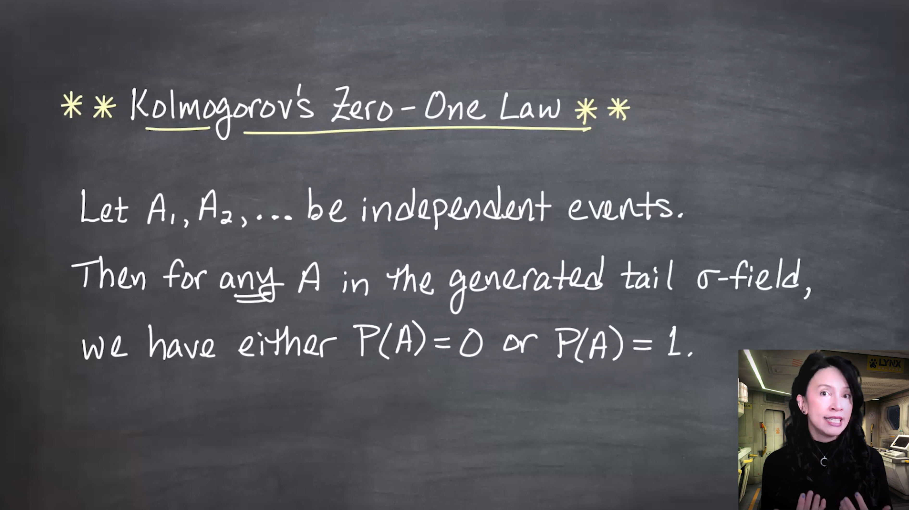{fig-alt="me with alternative without math."}

And me with a longer caption that is more descriptive of the image, and can replace the image if it doesn't load.
:::

:::{.column-margin #fig-l13-slide-08}
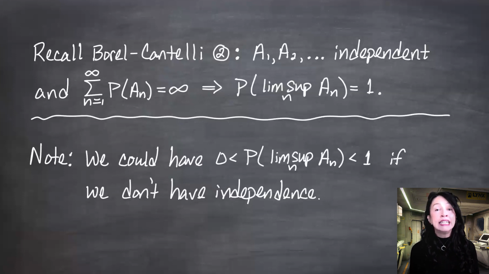{fig-alt="me with alternative without math."}
And me with a longer caption that is more descriptive of the image, and can replace the image if it doesn't load.
:::

:::{.column-margin #fig-l13-slide-09} 
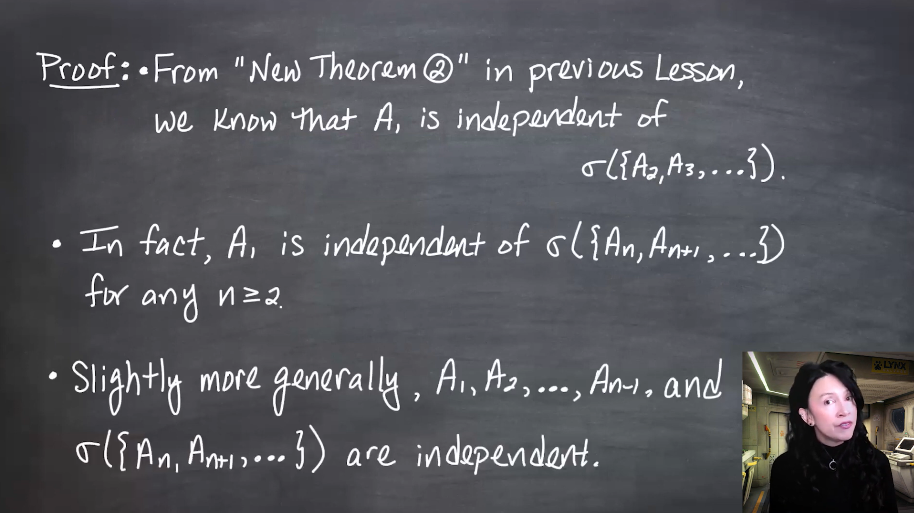{fig-alt="me with alternative without math."}

And me with a longer caption that is more descriptive of the image, and can replace the image if it doesn't load.
:::

:::{.column-margin #fig-l13-slide-10}
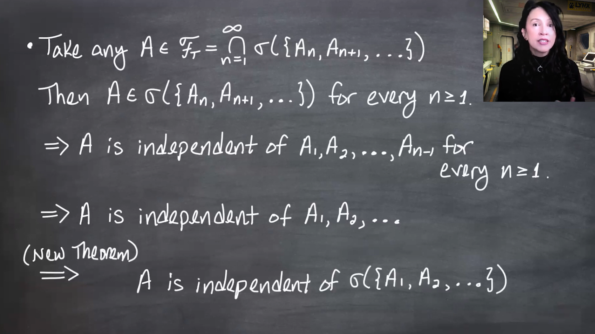{fig-alt="me with alternative without math."}
And me with a longer caption that is more descriptive of the image, and can replace the image if it doesn't load.
:::

:::{.column-margin #fig-l13-slide-11}
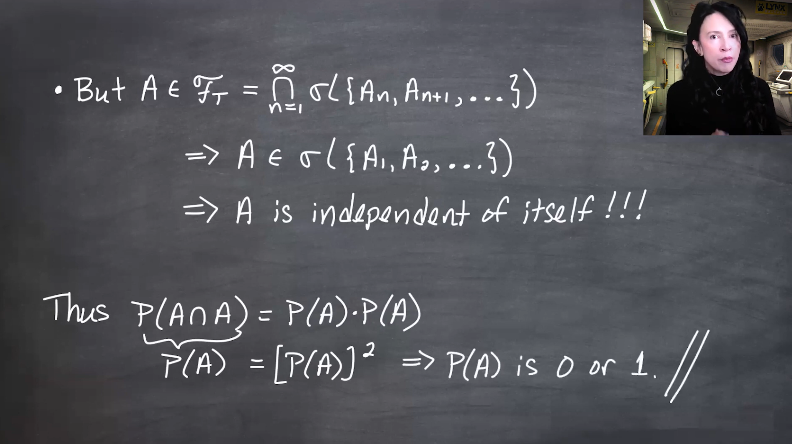{fig-alt="me with alternative without math."}
And me with a longer caption that is more descriptive of the image, and can replace the image if it doesn't load.
:::

