::: {#vid-C99-l14 .column-margin}


Lesson 14: Simple random variables
:::

## Lesson map

This lesson proves the next three lemmas from the extension roadmap.

- Recap:
- Simple random variables

:::{.column-margin #fig-l14-slide-01} 
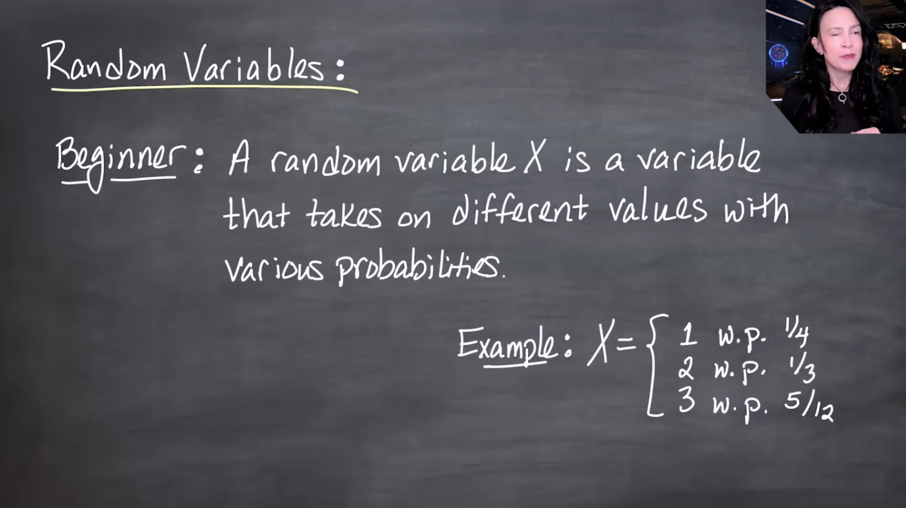{fig-alt="me with alternative without math."}

And me with a longer caption that is more descriptive of the image, and can replace the image if it doesn't load.
:::

:::{.column-margin #fig-l14-slide-02} 
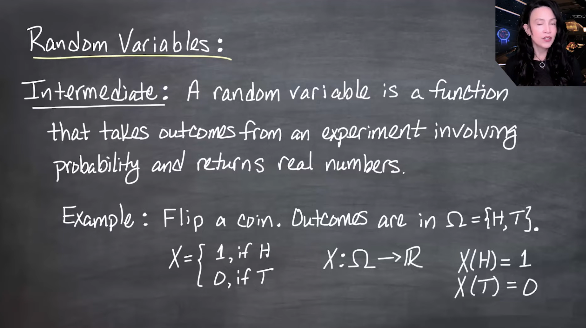{fig-alt="me with alternative without math."}

And me with a longer caption that is more descriptive of the image, and can replace the image if it doesn't load.
:::

:::{.column-margin #fig-l14-slide-03}
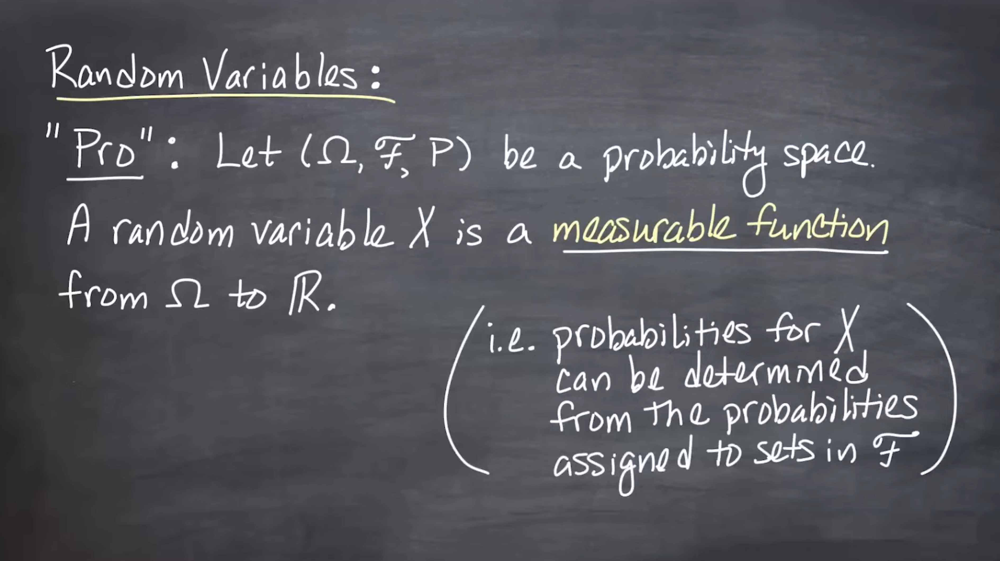{fig-alt="me with alternative without math."}
And me with a longer caption that is more descriptive of the image, and can replace the image if it doesn't load.
:::

:::{.column-margin #fig-l14-slide-04} 
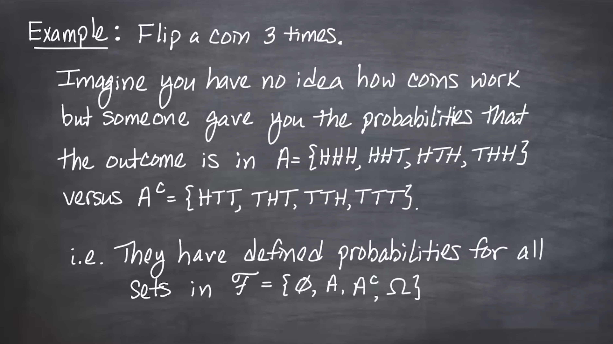{fig-alt="me with alternative without math."}

And me with a longer caption that is more descriptive of the image, and can replace the image if it doesn't load.
:::

:::{.column-margin #fig-l14-slide-05}
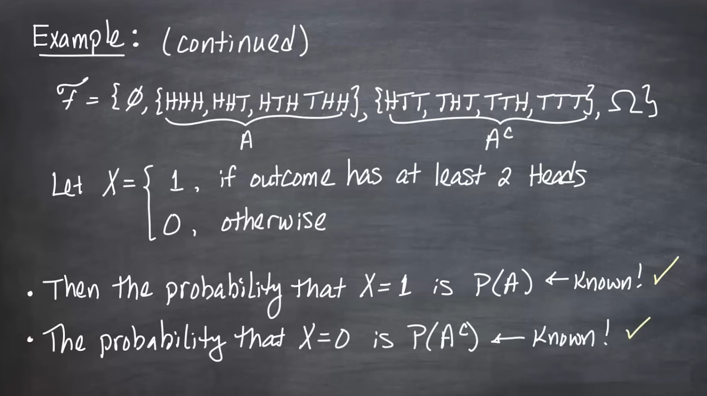{fig-alt="me with alternative without math."}
And me with a longer caption that is more descriptive of the image, and can replace the image if it doesn't load.
:::

:::{.column-margin #fig-l14-slide-06} 
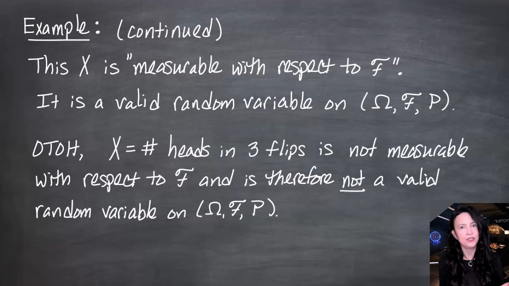{fig-alt="me with alternative without math."}

And me with a longer caption that is more descriptive of the image, and can replace the image if it doesn't load.
:::

:::{.column-margin #fig-l14-slide-07} 
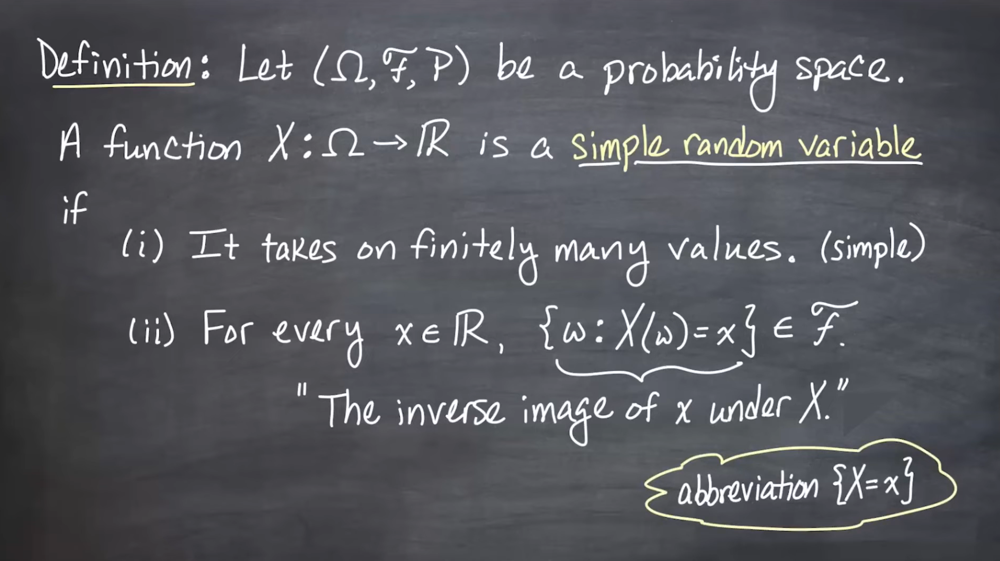{fig-alt="me with alternative without math."}

And me with a longer caption that is more descriptive of the image, and can replace the image if it doesn't load.
:::

:::{.column-margin #fig-l14-slide-08}
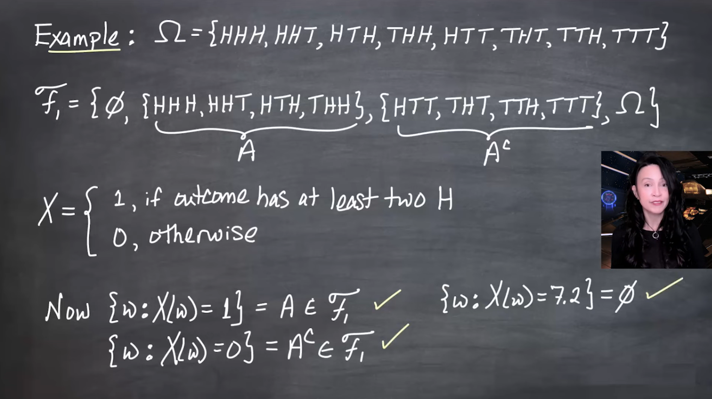{fig-alt="me with alternative without math."}
And me with a longer caption that is more descriptive of the image, and can replace the image if it doesn't load.
:::

:::{.column-margin #fig-l14-slide-09} 
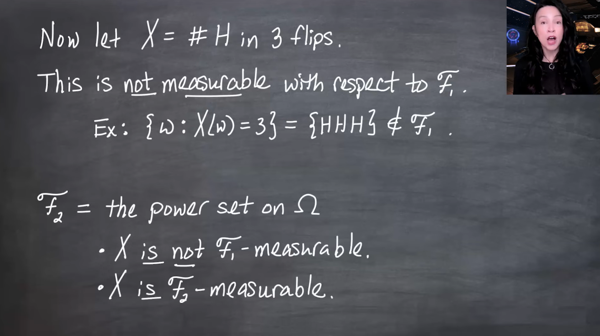{fig-alt="me with alternative without math."}

And me with a longer caption that is more descriptive of the image, and can replace the image if it doesn't load.
:::

:::{.column-margin #fig-l14-slide-10}
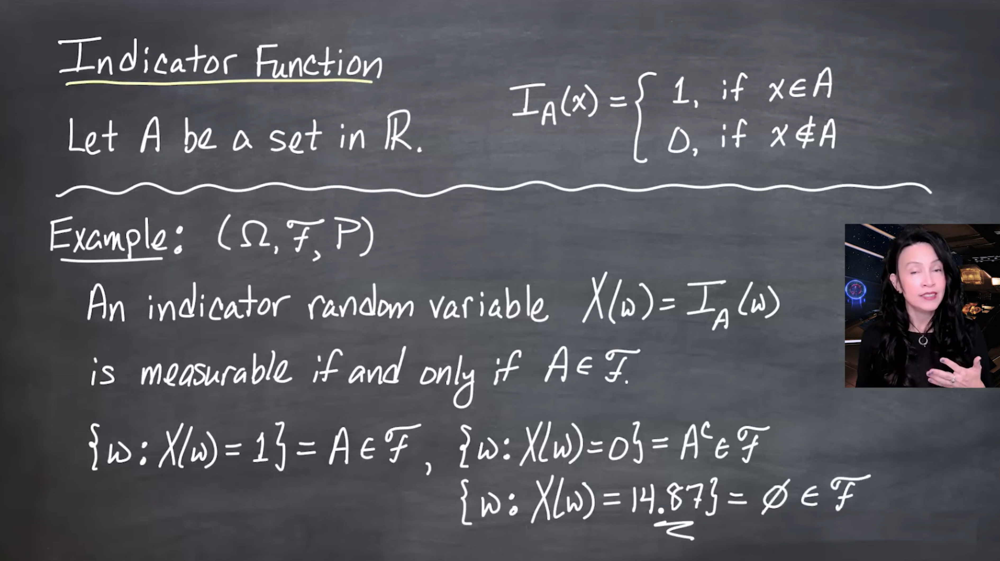{fig-alt="me with alternative without math."}
And me with a longer caption that is more descriptive of the image, and can replace the image if it doesn't load.
:::

:::{.column-margin #fig-l14-slide-11}
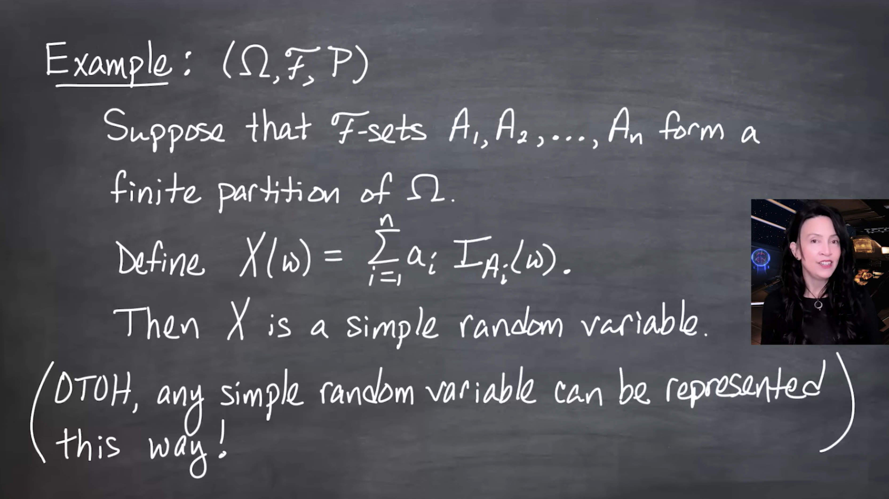{fig-alt="me with alternative without math."}
And me with a longer caption that is more descriptive of the image, and can replace the image if it doesn't load.
:::

:::{.column-margin #fig-l14-slide-12} 
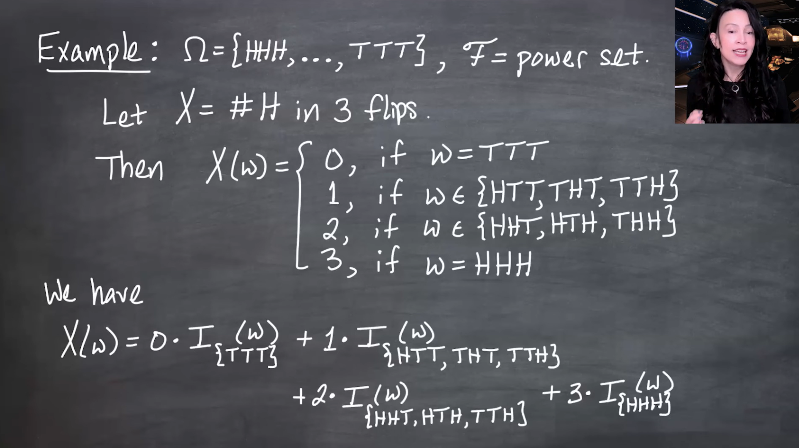{fig-alt="me with alternative without math."}

And me with a longer caption that is more descriptive of the image, and can replace the image if it doesn't load.
:::

:::{.column-margin #fig-l14-slide-13} 
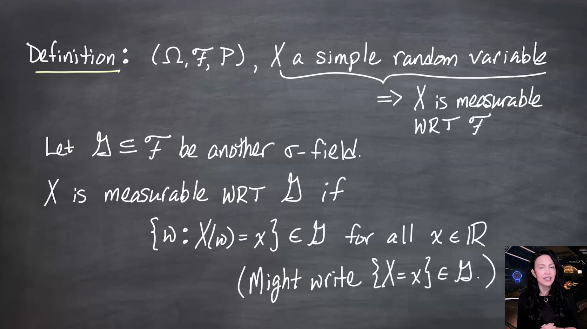{fig-alt="me with alternative without math."}

And me with a longer caption that is more descriptive of the image, and can replace the image if it doesn't load.
:::

:::{.column-margin #fig-l14-slide-14}
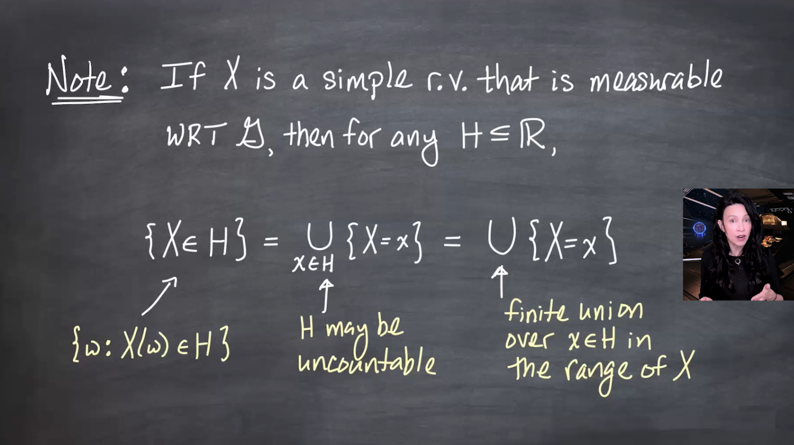{fig-alt="me with alternative without math."}
And me with a longer caption that is more descriptive of the image, and can replace the image if it doesn't load.
:::

:::{.column-margin #fig-l14-slide-15} 
{fig-alt="me with alternative without math."}

And me with a longer caption that is more descriptive of the image, and can replace the image if it doesn't load.
:::
