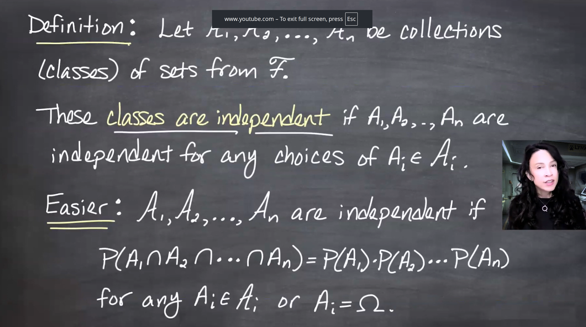
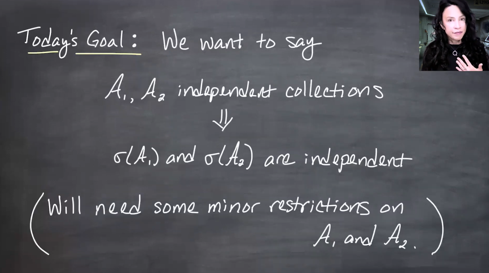
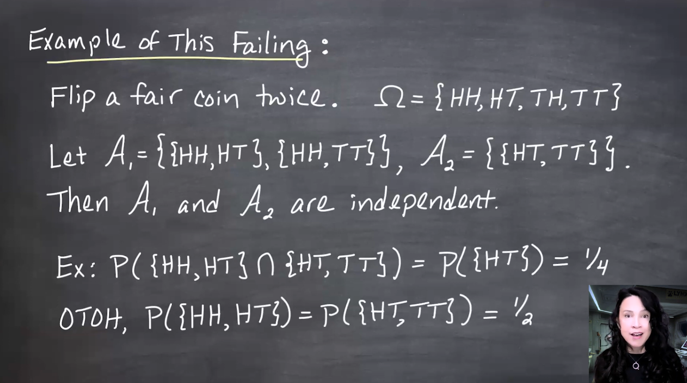
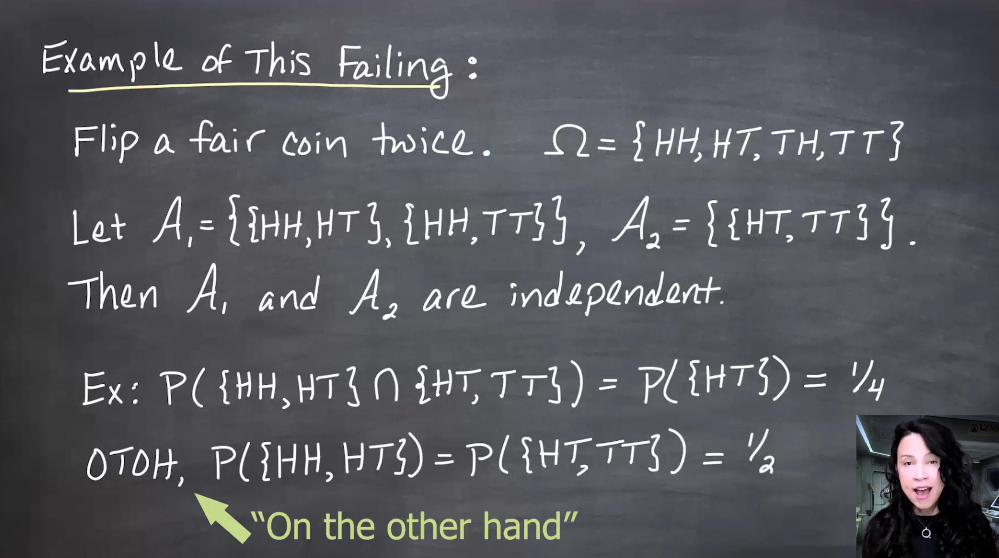
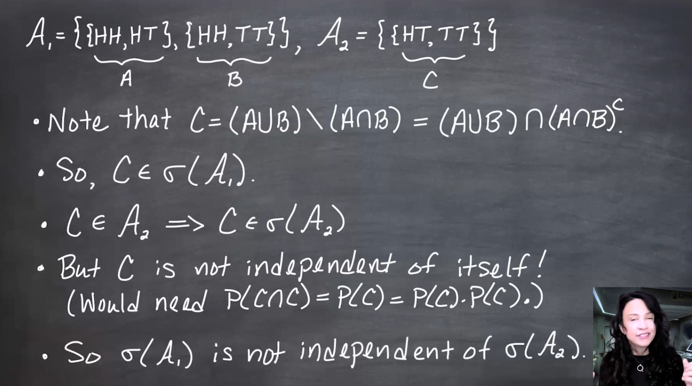
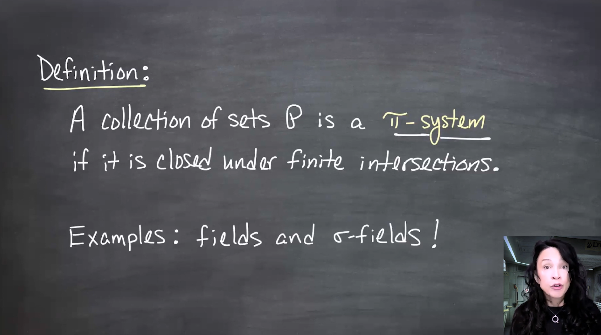
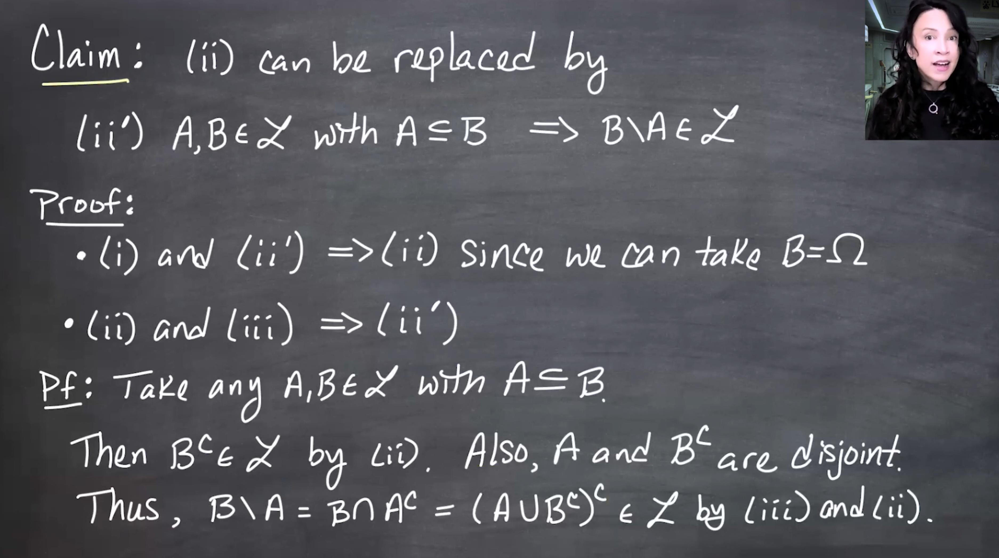
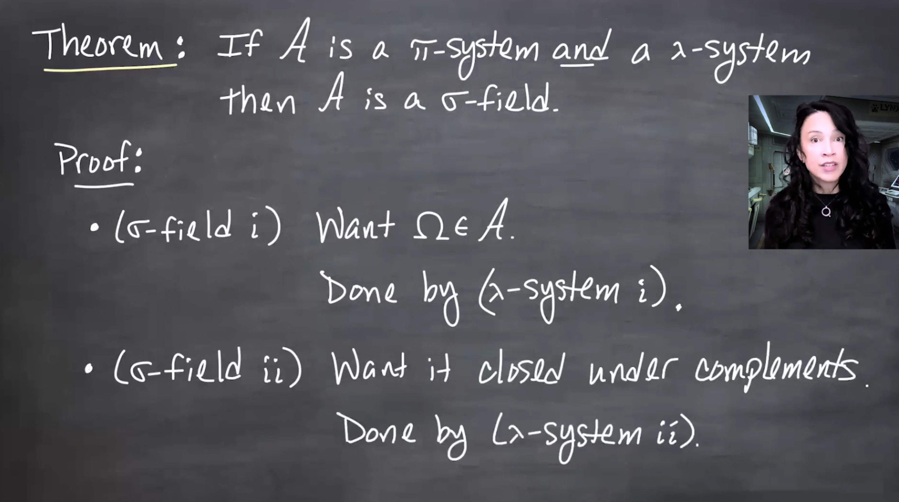
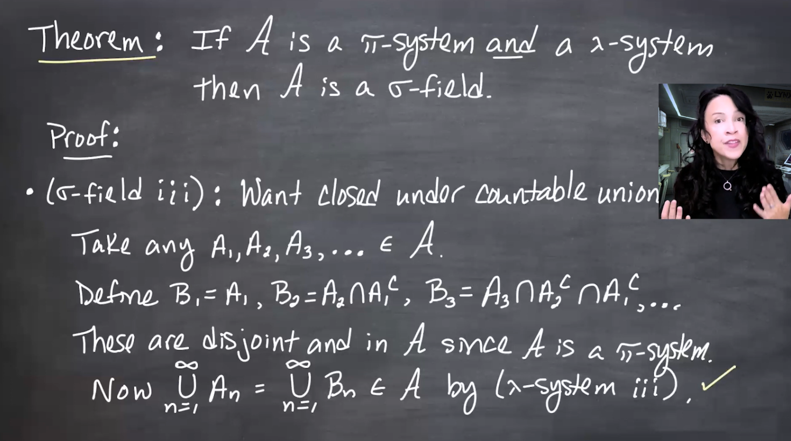

::: {#vid-C99-l10 .column-margin}


Lesson 10: Dynkin's π-λ Theorem
:::

## Lesson map

This lesson proves the next three lemmas from the extension roadmap.

- Recap:
- Dynkin's π-λ Theorem

:::{.column-margin #fig-l10-slide-01} 
{fig-alt="me with alternative without math." group="slides"}

And me with a longer caption that is more descriptive of the image, and can replace the image if it doesn't load.
:::

:::{.column-margin #fig-l10-slide-02} 
{fig-alt="me with alternative without math." group="slides"}

And me with a longer caption that is more descriptive of the image, and can replace the image if it doesn't load.
:::

:::{.column-margin #fig-l10-slide-03}
{fig-alt="me with alternative without math." group="slides"}
And me with a longer caption that is more descriptive of the image, and can replace the image if it doesn't load.
:::

:::{.column-margin #fig-l10-slide-04} 
{fig-alt="me with alternative without math." group="slides"}

And me with a longer caption that is more descriptive of the image, and can replace the image if it doesn't load.
:::

:::{.column-margin #fig-l10-slide-05}
{fig-alt="me with alternative without math." group="slides"}
And me with a longer caption that is more descriptive of the image, and can replace the image if it doesn't load.
:::

:::{.column-margin #fig-l10-slide-06} 
{fig-alt="me with alternative without math." group="slides"}

And me with a longer caption that is more descriptive of the image, and can replace the image if it doesn't load.
:::

:::{.column-margin #fig-l10-slide-07} 
{fig-alt="me with alternative without math." group="slides"}

And me with a longer caption that is more descriptive of the image, and can replace the image if it doesn't load.
:::

:::{.column-margin #fig-l10-slide-08}
{fig-alt="me with alternative without math." group="slides"}
And me with a longer caption that is more descriptive of the image, and can replace the image if it doesn't load.
:::

:::{.column-margin #fig-l10-slide-09} 
{fig-alt="me with alternative without math." group="slides"}

And me with a longer caption that is more descriptive of the image, and can replace the image if it doesn't load.
:::

:::{.column-margin #fig-l10-slide-10}
{fig-alt="me with alternative without math." group="slides"}
And me with a longer caption that is more descriptive of the image, and can replace the image if it doesn't load.
:::

:::{.column-margin #fig-l10-slide-11}
{fig-alt="me with alternative without math." group="slides"}
And me with a longer caption that is more descriptive of the image, and can replace the image if it doesn't load.
:::

:::{.column-margin #fig-l10-slide-12} 
{fig-alt="me with alternative without math." group="slides"}

And me with a longer caption that is more descriptive of the image, and can replace the image if it doesn't load.
:::

:::{.column-margin #fig-l10-slide-13} 
{fig-alt="me with alternative without math." group="slides"}

And me with a longer caption that is more descriptive of the image, and can replace the image if it doesn't load.
:::

:::{.column-margin #fig-l10-slide-14}
{fig-alt="me with alternative without math." group="slides"}
And me with a longer caption that is more descriptive of the image, and can replace the image if it doesn't load.
:::

:::{.column-margin #fig-l10-slide-15} 
{fig-alt="me with alternative without math." group="slides"}

And me with a longer caption that is more descriptive of the image, and can replace the image if it doesn't load.
:::

:::{.column-margin #fig-l10-slide-16}
{fig-alt="me with alternative without math." group="slides"}
And me with a longer caption that is more descriptive of the image, and can replace the image if it doesn't load.
:::

:::{.column-margin #fig-l10-slide-17} 
{fig-alt="me with alternative without math." group="slides"}

And me with a longer caption that is more descriptive of the image, and can replace the image if it doesn't load.
:::

:::{.column-margin #fig-l10-slide-18} 
{fig-alt="me with alternative without math." group="slides"}

And me with a longer caption that is more descriptive of the image, and can replace the image if it doesn't load.
:::

:::{.column-margin #fig-l10-slide-19}
{fig-alt="me with alternative without math." group="slides"}
And me with a longer caption that is more descriptive of the image, and can replace the image if it doesn't load.
:::

:::{.column-margin #fig-l10-slide-20} 
{fig-alt="me with alternative without math." group="slides"}

And me with a longer caption that is more descriptive of the image, and can replace the image if it doesn't load.
:::

:::{.column-margin #fig-l10-slide-21}
{fig-alt="me with alternative without math." group="slides"}
And me with a longer caption that is more descriptive of the image, and can replace the image if it doesn't load.
:::

:::{.column-margin #fig-l10-slide-22}
{fig-alt="me with alternative without math." group="slides"}
And me with a longer caption that is more descriptive of the image, and can replace the image if it doesn't load.
:::

:::{.column-margin #fig-l10-slide-23} 
{fig-alt="me with alternative without math." group="slides"}

And me with a longer caption that is more descriptive of the image, and can replace the image if it doesn't load.
:::

:::{.column-margin #fig-l10-slide-24}
{fig-alt="me with alternative without math." group="slides"}
And me with a longer caption that is more descriptive of the image, and can replace the image if it doesn't load.
:::

:::{.column-margin #fig-l10-slide-25} 
{fig-alt="me with alternative without math." group="slides"}

And me with a longer caption that is more descriptive of the image, and can replace the image if it doesn't load.
:::

:::{.column-margin #fig-l10-slide-26}
{fig-alt="me with alternative without math." group="slides"}
And me with a longer caption that is more descriptive of the image, and can replace the image if it doesn't load.
:::

:::{.column-margin #fig-l10-slide-27} 
{fig-alt="me with alternative without math." group="slides"}

And me with a longer caption that is more descriptive of the image, and can replace the image if it doesn't load.
:::

