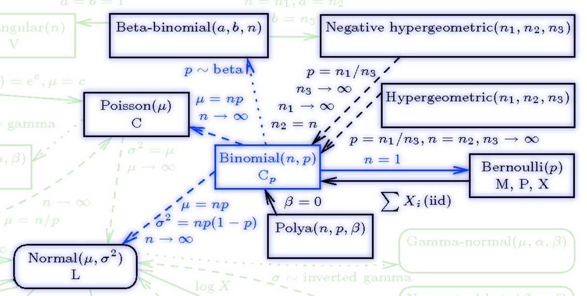

## Binomial distribution {#sec-binomial-distribution}

The Bernoulli distribution is built on a trial of a coin toss (possibly biased).

-   We use the Bernoulli distribution to model a random variable for the probability of such a coin toss trial.
-   We use the Binomial distribution to model a random variable for the probability of getting k heads in N independent trails.


## Stories

::: { .callout-note}
## Binomial dist distribution
$$
\overbrace{\underbrace{\fbox{0}\ \ldots \fbox{0}}_{N_0}\ \underbrace{\fbox{1}\ \ldots \fbox{1}}_{N_1}}^N 
$$ {#eq-binomial-experiment}

The Binomial distribution arises when we conduct multiple independent Bernoulli trials and wish to model $X$ the number of successes in $Y_i\mid \theta$ identically distributed Bernoulli trials with the same probability of success $\theta$. 
\index{Bernoulli trial}
If $n$ independent *Bernoulli trials* are performed, each with the same success probability $p$. 
The distribution of $X$ is called the Binomial distribution with parameters $n$ and $p$. 
We write $X \sim \text{Bin}(n, p)$ to mean that X has the Binomial distribution with parameters n and p, where n is a positive integer and $0 < p < 1$.
:::

### Parameters

-   $\theta$ - the probability of success in the Bernoulli trials
-   $N$ - the total number of trials being conducted

### Conditions

::: {.callout-tip}
## Binomial RV conditions
-   Discrete data
-   Two possible outcomes for each trial
-   Each trial is independent and
-   The probability of success/failure is the same in each trial
-   The outcome is the aggregate number of successes
:::

### Examples

-   to model the aggregate outcome of clinical drug trials,
-   to estimate the proportion of the population voting for each political party using exit poll data (where there are only two political parties).

$$
X \sim Bin[n,p]
$$ {#eq-binomial-rv}

$$
f(X=x \mid \theta) = {n \choose x} \theta^x(1-\theta)^{n-x}
$$ {#eq-binomial-pmf}

$$
L(\theta)=\prod_{i=1}^{n} {n\choose x_i}  \theta ^ {x_i} (1− \theta) ^ {(n−x_i)}
$$ {#eq-binomial-likelihood}

$$
\begin{aligned}
\ell( \theta) &= \log \mathcal{L}( \theta) \\
              &= \sum_{i=1}^n \left[\log {n\choose x_i} + x_i \log  \theta + (n-x_i)\log (1- \theta) \right]
\end{aligned}
$$ {#eq-binomial-log-likelihood}

$$
\mathbb{E}[X]= N \times  \theta 
$$ {#eq-binomial-expectation}

$$
\mathbb{V}ar[X]=N \cdot \theta \cdot (1-\theta)
$$ {#eq-binomial-variance}

$$
\mathbb{H}(X) = \frac{1}{2}\log_2 \left (2\pi n \theta(1 - \theta)\right) + O(\frac{1}{n})
$$ {#eq-binomial-entropy}

$$
\mathcal{I}(\theta)=\frac{n}{ \theta \cdot (1- \theta)}
$$ {#eq-binomial-information}

### Usage

| Package | Syntax                        |
|---------|:------------------------------|
| NumPy   | `rg.binomial(N, theta)`       |
| SciPy   | `scipy.stats.binom(N, theta)` |
| Stan    | `binomial(N, theta)`          |

: Usage of Binomial {#tbl-binomial-api}

### Relationships



\index{distribution!multinomial}
The Binomial Distribution is related to

-   The **Binomial** is a *special case* of the **Multinomial distribution**  with K =2 (two categories).
-   the **Poisson distribution** distribution. If $X \sim Binomial(n, p)$ rv and $Y \sim Poisson(np)$ distribution then $\mathbb{P}r(X = n) ≈ \mathbb{P}r(Y = n)$ for large $n$ and small $np$.
-   The **Bernoulli distribution** is a *special case* of the the **Binomial distribution** 
    $$
    \begin{aligned}
    X & \sim \mathrm{Binomial}(n=1, p) \\
    \implies X &\sim \mathrm{Bernoulli}(p)
    \end{aligned}
    $$
-   the **Normal distribution** If $X \sim \mathrm{Binomial}(n, p)$ RV and $Y \sim \mathcal{N}(\mu=np,\sigma=n\mathbb{P}r(1-p))$ then for integers j and k, $\mathbb{P}r(j ≤ X ≤ k) ≈ \mathbb{P}r(j – 1/2 ≤ Y ≤ k + 1/2)$. The approximation is better when $p ≈ 0.5$ and when n is large. For more information, see normal approximation to the Binomial
-   The **Binomial** is a *limit* of the **Hypergeometric**. The difference between a binomial distribution and a hypergeometric distribution is the difference between sampling with replacement and sampling without replacement. As the population size increases relative to the sample size, the difference becomes negligible. So If $X \sim \mathrm{Binomial}(n, p)$ RV and $Y \sim \mathrm{HyperGeometric}(N,a,b)$ then

$$\lim_{n\to \infty} X = Y 
$$

### Plots

```{python}
#| label: A02-3
import numpy as np
from scipy.stats import binom
import matplotlib.pyplot as plt
fig, ax = plt.subplots(1, 1)
n, p = 5, 0.4
mean, var, skew, kurt = binom.stats(n, p, moments='mvsk')
print(f'{mean=:1.2f}, {var=:1.2f}, {skew=:1.2f}, {kurt=:1.2f}')

x = np.arange(binom.ppf(0.01, n, p),
              binom.ppf(0.99, n, p))
ax.plot(x, binom.pmf(x, n, p), 'bo', ms=8, label='binom pmf')
ax.vlines(x, 0, binom.pmf(x, n, p), colors='b', lw=5, alpha=0.5)
rv = binom(n, p)
ax.vlines(x, 0, rv.pmf(x), colors='k', linestyles='-', lw=1,
        label='frozen pmf')
ax.legend(loc='best', frameon=False)
plt.show()

## generate random numbers
r = binom.rvs(n, p, size=10)
r
```

   
```python
#| label: fig-binomial-interactive
from __future__ import print_function
from ipywidgets import interact, interactive, fixed, interact_manual
import ipywidgets as widgets
import numpy as np
import scipy
from scipy.special import gamma, factorial, comb
import plotly.express as px
import plotly.offline as pyo
import plotly.graph_objs as go
#pyo.init_notebook_mode()
INTERACT_FLAG=False
def binomial_vector_over_y(theta, n):
    total_events = n
    y =  np.linspace(0, total_events , total_events + 1)
    p_y = [comb(int(total_events), int(yelem)) * theta** yelem * (1 - theta)**(total_events - yelem) for yelem in y]

    fig = px.line(x=y, y=p_y, color_discrete_sequence=["steelblue"], 
                  height=600, width=800, title=" Binomial distribution for theta = %lf, n = %d" %(theta, n))
    fig.data[0].line['width'] = 4
    fig.layout.xaxis.title.text = "y"
    fig.layout.yaxis.title.text = "P(y)"
    fig.show()
    
if(INTERACT_FLAG):    
    interact(binomial_vector_over_y, theta=0.5, n=15)
else:
    binomial_vector_over_y(theta=0.5, n=10)
```

::: {#vid-binom-distribution .column-margin .content-hidden when-format="pdf"}


Binomial Distribution
:::

