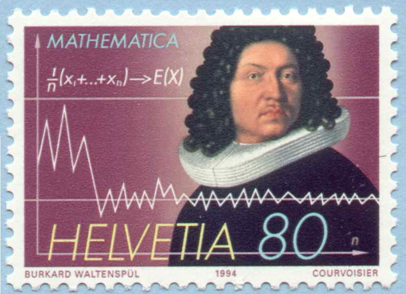

{.column-margin alt="A Swiss stamp issueed in 1994 depicting Mathematician Jakob Bernouilli and the formula and diagram of the law of large numbers" width="53mm"}

::: {.callout-tip}
### Biographical note on Jacob Bernoulli

> It seems that to make a correct conjecture about any event whatever, it is necessary to calculate exactly the number of possible cases and then to determine how much more likely it is that one case will occur than another. [@bernoulli1713ars]

The Bernoulli distribution as well as The Binomial distribution are due to Jacob Bernoulli (1655-1705) who was a prominent mathematician in the Bernoulli family. He discovered the fundamental mathematical constant e. With his brother Johann, he was among the first to develop Leibniz's calculus, introducing the word integral and applying it to polar coordinates and the study of curves such as the catenary, the logarithmic spiral and the cycloid

His most important contribution was in the field of probability, where he derived the first version of the law of large numbers (LLN). The LLN is a theorem that describes the result of performing the same experiment a large number of times. According to the law, the average of the results obtained from a large number of trials should be close to the expected value and will tend to become closer to the expected value as more trials are performed. A special form of the LLN (for a binary random variable) was first proved by Jacob Bernoulli. It took him over 20 years to develop sufficiently rigorous mathematical proof.

<!-- TODO: convert to a bibliography item and reference with a citation -->

For a more extensive biography visit the following [link](https://mathshistory.st-andrews.ac.uk/Biographies/Bernoulli_Jacob/)
:::